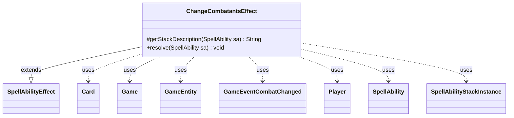

---
aliases:
  - ChangeCombatantsEffect
tags:
  - java/class
  - module/forge-game
  - pkg/forge/game/ability/effects
fqn: forge.game.ability.effects.ChangeCombatantsEffect
package: forge.game.ability.effects
module: forge-game
kind: Class
---

# ChangeCombatantsEffect

**Package:** `forge.game.ability.effects` &nbsp; **Module:** `forge-game` &nbsp; **Kind:** Class



## Relationships
**Extends:**
- [[forge.game.ability.SpellAbilityEffect|SpellAbilityEffect]]
**Uses:**
- [[forge.game.Game|Game]]
- [[forge.game.GameEntity|GameEntity]]
- [[forge.game.card.Card|Card]]
- [[forge.game.event.GameEventCombatChanged|GameEventCombatChanged]]
- [[forge.game.player.Player|Player]]
- [[forge.game.spellability.SpellAbility|SpellAbility]]
- [[forge.game.spellability.SpellAbilityStackInstance|SpellAbilityStackInstance]]


## Design Description

ChangeCombatantsEffect implements spell/ability resolution that lets an attacking creature's defender be reselected mid-combat, backing cards like Portal Mage that redirect attackers. As a concrete subclass of `SpellAbilityEffect`, it overrides `getStackDescription` to phrase the reselection for the stack and `resolve` to perform it: for each target `Card`—optionally gated behind a player confirmation prompt—it captures the original defender, calls the inherited `addToCombat` to reassign the attacker, then scans the `Game` stack to retarget any pending triggers sourced from that card, stamping their `OriginalDefender` and `DefendingPlayer` keys against the new `GameEntity` defender.

Once combat is altered it refreshes the combat view and fires a `GameEventCombatChanged` so observers stay in sync. The class collaborates narrowly with the combat, stack, and event subsystems rather than holding state, and TODO comments flag intended expansion toward defined-blocker reselection effects (False Orders, Sorrow's Path, and similar).

## Source
`forge-game/src/main/java/forge/game/ability/effects/ChangeCombatantsEffect.java`

```java
package forge.game.ability.effects;

import forge.game.Game;
import forge.game.GameEntity;
import forge.game.ability.AbilityKey;
import forge.game.ability.SpellAbilityEffect;
import forge.game.card.Card;
import forge.game.event.GameEventCombatChanged;
import forge.game.player.Player;
import forge.game.spellability.SpellAbility;
import forge.game.spellability.SpellAbilityStackInstance;
import forge.util.Lang;
import forge.util.Localizer;

public class ChangeCombatantsEffect extends SpellAbilityEffect {

    @Override
    protected String getStackDescription(SpellAbility sa) {
        final StringBuilder sb = new StringBuilder();

        // should update when adding effects for defined blocker
        sb.append("Reselect the defender of ");
        sb.append(Lang.joinHomogenous(getTargetCards(sa)));

        return sb.toString();
    }

    @Override
    public void resolve(SpellAbility sa) {
        boolean isCombatChanged = false;
        final boolean isOptional = sa.hasParam("Optional");
        final Player activator = sa.getActivatingPlayer();
        final Game game = activator.getGame();

        // TODO: may expand this effect for defined blocker (False Orders, General Jarkeld, Sorrow's Path, Ydwen Efreet)
        for (final Card c : getTargetCards(sa)) {
            String cardString = c.getTranslatedName() + " (" + c.getId() + ")";
            if (isOptional && !activator.getController().confirmAction(sa, null,
                    Localizer.getInstance().getMessage("lblChangeCombatantOption", cardString), null)) {
                continue;
            }

            final GameEntity originalDefender = game.getCombat().getDefenderByAttacker(c);

            if (addToCombat(c, sa, "Attacking", "Blocking")) {
                isCombatChanged = true;
                GameEntity defender = game.getCombat().getDefenderByAttacker(c);

                // retarget triggers to the new defender (e.g. Ulamog, Ceaseless Hunger + Portal Mage)
                for (SpellAbilityStackInstance si : game.getStack()) {
                    if (si.isTrigger() && c.equals(si.getSourceCard())
                            && si.getTriggeringObject(AbilityKey.Attacker) != null) {
                        si.addTriggeringObject(AbilityKey.OriginalDefender, originalDefender);
                        if (defender instanceof Player) {
                            si.updateTriggeringObject(AbilityKey.DefendingPlayer, defender);
                        } else if (defender instanceof Card) {
                            si.updateTriggeringObject(AbilityKey.DefendingPlayer, ((Card)defender).getController());
                        }
                    }
                }
            }
        }

        if (isCombatChanged) {
            game.updateCombatForView();
            game.fireEvent(new GameEventCombatChanged());
        }
    }
}
```
