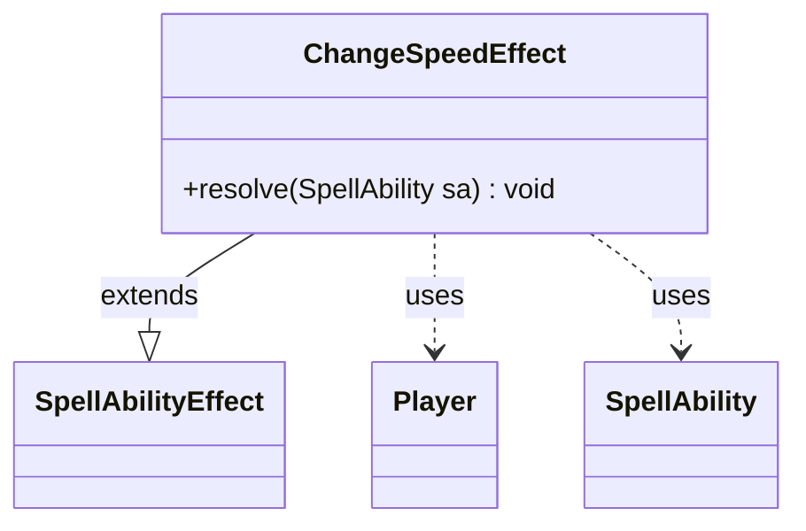

---
aliases:
  - ChangeSpeedEffect
tags:
  - java/class
  - module/forge-game
  - pkg/forge/game/ability/effects
fqn: forge.game.ability.effects.ChangeSpeedEffect
package: forge.game.ability.effects
module: forge-game
kind: Class
---

# ChangeSpeedEffect

**Package:** `forge.game.ability.effects` &nbsp; **Module:** `forge-game` &nbsp; **Kind:** Class



## Relationships
**Extends:**
- [[forge.game.ability.SpellAbilityEffect|SpellAbilityEffect]]
**Uses:**
- [[forge.game.player.Player|Player]]
- [[forge.game.spellability.SpellAbility|SpellAbility]]

## Design Description

ChangeSpeedEffect implements the resolution logic for a spell or ability that modifies a player's "speed" attribute, a game-state counter used by certain Magic: The Gathering mechanics. As a concrete subclass of SpellAbilityEffect, it overrides `resolve` to plug into Forge's ability-resolution framework, where each effect type supplies its own behavior. Driven by the SpellAbility's "Mode" parameter (defaulting to "Increase"), it iterates over the targeted Players and calls `increaseSpeed` or `decreaseSpeed` on each one still in the game.

The design follows Forge's data-driven effect pattern: behavior is parameterized through the SpellAbility rather than subclass proliferation, the in-game check guards against acting on eliminated players, and the actual speed bookkeeping is delegated to Player, keeping the effect a thin dispatcher between card script parameters and player state.

## Source
`forge-game/src/main/java/forge/game/ability/effects/ChangeSpeedEffect.java`

```java
package forge.game.ability.effects;

import forge.game.ability.SpellAbilityEffect;
import forge.game.player.Player;
import forge.game.spellability.SpellAbility;

public class ChangeSpeedEffect extends SpellAbilityEffect {
    @Override
    public void resolve(SpellAbility sa) {
        String mode = sa.getParamOrDefault("Mode", "Increase");

        for (Player p : getTargetPlayers(sa)) {
            if (p.isInGame()) {
                if (mode.equals("Increase")) p.increaseSpeed();
                else if (mode.equals("Decrease")) p.decreaseSpeed();
            }
        }
    }
}
```
