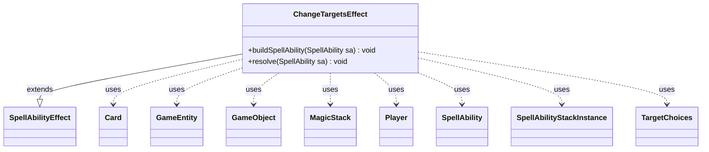

---
aliases:
  - ChangeTargetsEffect
tags:
  - java/class
  - module/forge-game
  - pkg/forge/game/ability/effects
fqn: forge.game.ability.effects.ChangeTargetsEffect
package: forge.game.ability.effects
module: forge-game
kind: Class
---

# ChangeTargetsEffect

**Package:** `forge.game.ability.effects`   **Module:** `forge-game`   **Kind:** Class



## Relationships
**Extends:**
- [[forge.game.ability.SpellAbilityEffect|SpellAbilityEffect]]
**Uses:**
- [[forge.game.GameEntity|GameEntity]]
- [[forge.game.GameObject|GameObject]]
- [[forge.game.card.Card|Card]]
- [[forge.game.player.Player|Player]]
- [[forge.game.spellability.SpellAbility|SpellAbility]]
- [[forge.game.spellability.SpellAbilityStackInstance|SpellAbilityStackInstance]]
- [[forge.game.spellability.TargetChoices|TargetChoices]]
- [[forge.game.zone.MagicStack|MagicStack]]

## Design Description

ChangeTargetsEffect is a concrete spell-ability effect that implements the Magic rules for redirecting or re-choosing the targets of spells and abilities already on the stack. Extending SpellAbilityEffect, it overrides buildSpellAbility to constrain targeting to the Stack zone, and resolve to perform the actual retargeting against the MagicStack. For each affected SpellAbility it walks the chain of SpellAbilityStackInstance sub-instances, mutating their TargetChoices to apply new GameObject/GameEntity targets.

The class encodes several distinct retargeting modes driven by script parameters—optional confirmation, ChangeSingleTarget selection, RandomTarget, DefinedMagnet redirection, and player-chosen new targets—while honoring comprehensive-rules constraints (e.g., no duplicate targets, preserving original targets when no legal change exists) and faithfully carrying over divided-damage allocations. It collaborates with the activating or designated Player's controller for choices and delegates legality checks to each SpellAbility, keeping rules-correct retargeting centralized in one reusable effect.

## Source
`forge-game/src/main/java/forge/game/ability/effects/ChangeTargetsEffect.java`

```java
package forge.game.ability.effects;

import java.util.ArrayList;
import java.util.List;
import java.util.function.Predicate;

import com.google.common.collect.Iterables;
import org.apache.commons.lang3.tuple.ImmutablePair;
import org.apache.commons.lang3.tuple.Pair;

import forge.game.GameEntity;
import forge.game.GameObject;
import forge.game.GameObjectPredicates;
import forge.game.ability.SpellAbilityEffect;
import forge.game.card.Card;
import forge.game.player.Player;
import forge.game.spellability.SpellAbility;
import forge.game.spellability.SpellAbilityStackInstance;
import forge.game.spellability.TargetChoices;
import forge.game.zone.MagicStack;
import forge.game.zone.ZoneType;
import forge.util.Aggregates;
import forge.util.Localizer;

/**
 * TODO: Write javadoc for this type.
 *
 */
public class ChangeTargetsEffect extends SpellAbilityEffect {

    @Override
    public void buildSpellAbility(SpellAbility sa) {
        super.buildSpellAbility(sa);
        if (sa.usesTargeting()) {
            sa.getTargetRestrictions().setZone(ZoneType.Stack);
        }
    }

    /* (non-Javadoc)
     * @see forge.card.ability.SpellAbilityEffect#resolve(forge.card.spellability.SpellAbility)
     */
    @Override
    public void resolve(SpellAbility sa) {
        final List<SpellAbility> sas = getTargetSpells(sa);
        final Player activator = sa.getActivatingPlayer();
        final Player chooser = sa.hasParam("Chooser") ? getDefinedPlayersOrTargeted(sa, "Chooser").get(0) : activator;

        final MagicStack stack = activator.getGame().getStack();

        for (final SpellAbility tgtSA : sas) {
            SpellAbilityStackInstance si = stack.getInstanceMatchingSpellAbilityID(tgtSA);
            if (si == null) {
                // If there isn't a Stack Instance, there isn't really a target
                continue;
            }

            SpellAbilityStackInstance changingTgtSI = si;

            // Redirect rules read 'you MAY choose new targets' ... okay!
            // TODO: Don't even ask to change targets, if the SA and subs don't actually have targets
            boolean isOptional = sa.hasParam("Optional");
            if (isOptional && !chooser.getController().confirmAction(sa, null, Localizer.getInstance().getMessage("lblDoYouWantChangeAbilityTargets", tgtSA.getHostCard().toString()), null)) {
                continue;
            }
            if (sa.hasParam("ChangeSingleTarget")) {
                // 1. choose a target of target spell
                List<Pair<SpellAbilityStackInstance, GameObject>> allTargets = new ArrayList<>();
                while (changingTgtSI != null) {
                    SpellAbility changedSa = changingTgtSI.getSpellAbility();
                    if (changedSa.usesTargeting()) {
                        for (GameObject it : changedSa.getTargets())
                            allTargets.add(ImmutablePair.of(changingTgtSI, it));
                    }
                    changingTgtSI = changingTgtSI.getSubInstance();
                }
                if (allTargets.isEmpty()) {
                    return;
                }

                Pair<SpellAbilityStackInstance, GameObject> chosenTarget = chooser.getController().chooseTarget(sa, allTargets);
                // 2. prepare new target choices
                SpellAbilityStackInstance replaceIn = chosenTarget.getKey();
                GameObject oldTarget = chosenTarget.getValue();
                TargetChoices newTargetBlock = replaceIn.getTargetChoices();
                TargetChoices oldTargetBlock = newTargetBlock.clone();
                // gets the divided value from old target
                Integer div = oldTargetBlock.getDividedValue(oldTarget);
                // 3. test if updated choices would be correct.
                GameObject newTarget = Iterables.getFirst(getDefinedCardsOrTargeted(sa, "DefinedMagnet"), null);

                // CR 115.3. The same target can't be chosen multiple times for
                // any one instance of the word “target” on a spell or ability.
                if (!oldTargetBlock.contains(newTarget) && replaceIn.getSpellAbility().canTarget(newTarget)) {
                    newTargetBlock.remove(oldTarget);
                    newTargetBlock.add(newTarget);
                    if (div != null) {
                        newTargetBlock.addDividedAllocation(newTarget, div);
                    }
                    replaceIn.updateTarget(oldTargetBlock, sa.getHostCard());
                }
            } else {
                while (changingTgtSI != null) {
                    SpellAbility changingTgtSA = changingTgtSI.getSpellAbility();
                    if (changingTgtSA.usesTargeting()) {
                        // random target and DefinedMagnet works on single targets
                        if (sa.hasParam("RandomTarget")) {
                            int div = changingTgtSA.getTotalDividedValue();
                            List<GameEntity> candidates = changingTgtSA.getTargetRestrictions().getAllCandidates(changingTgtSA, true);
                            if (sa.hasParam("RandomTargetRestriction")) {
                                candidates.removeIf(c -> !c.isValid(sa.getParam("RandomTargetRestriction").split(","), activator, sa.getHostCard(), sa));
                            }
                            // CR 115.7a If a target can't be changed to another legal target, the original target is unchanged
                            if (candidates.isEmpty()) {
                                return;
                            }
                            GameEntity choice = Aggregates.random(candidates);
                            TargetChoices oldTarget = changingTgtSA.getTargets();
                            changingTgtSA.resetTargets();
                            changingTgtSA.getTargets().add(choice);
                            if (changingTgtSA.isDividedAsYouChoose()) {
                                changingTgtSA.addDividedAllocation(choice, div);
                            }
                            changingTgtSI.updateTarget(oldTarget, sa.getHostCard());
                        }
                        else if (sa.hasParam("DefinedMagnet")) {
                            GameObject newTarget = Iterables.getFirst(getDefinedCardsOrTargeted(sa, "DefinedMagnet"), null);
                            if (newTarget != null && changingTgtSA.canTarget(newTarget)) {
                                int div = changingTgtSA.getTotalDividedValue();
                                TargetChoices oldTarget = changingTgtSA.getTargets();
                                changingTgtSA.resetTargets();
                                changingTgtSA.getTargets().add(newTarget);
                                if (changingTgtSA.isDividedAsYouChoose()) {
                                    changingTgtSA.addDividedAllocation(newTarget, div);
                                }
                                changingTgtSI.updateTarget(oldTarget, sa.getHostCard());
                            }
                        } else {
                            // Update targets, with a potential new target
                            Card source = sa.getHostCard();
                            if (changingTgtSA.getTargetCard() != null) {
                                // try to use old target so "Other" restriction of Meddle works
                                source = changingTgtSA.getTargetCard();
                            }
                            Predicate<GameObject> filter = sa.hasParam("TargetRestriction") ? GameObjectPredicates.restriction(sa.getParam("TargetRestriction").split(","), activator, source, sa) : null;
                            TargetChoices oldTarget = changingTgtSA.getTargets();
                            chooser.getController().chooseNewTargetsFor(changingTgtSA, filter, false);
                            changingTgtSI.updateTarget(oldTarget, sa.getHostCard());
                        }
                    }
                    changingTgtSI = changingTgtSI.getSubInstance();
                }
            }
        }
    }
}
```

## Python
`forge/game/ability/effects/ChangeTargetsEffect.py`

```python
from forge.game.GameEntity import GameEntity
from forge.game.GameObject import GameObject
from forge.game.GameObjectPredicates import GameObjectPredicates
from forge.game.ability.SpellAbilityEffect import SpellAbilityEffect
from forge.game.card.Card import Card
from forge.game.player.Player import Player
from forge.game.spellability.SpellAbility import SpellAbility
from forge.game.spellability.SpellAbilityStackInstance import SpellAbilityStackInstance
from forge.game.spellability.TargetChoices import TargetChoices
from forge.game.zone.MagicStack import MagicStack
from forge.game.zone.ZoneType import ZoneType
from forge.util.Aggregates import Aggregates
from forge.util.Localizer import Localizer


# TODO: Write javadoc for this type.
#
class ChangeTargetsEffect(SpellAbilityEffect):

    def buildSpellAbility(self, sa):
        super().buildSpellAbility(sa)
        if sa.usesTargeting():
            sa.getTargetRestrictions().setZone(ZoneType.Stack)

    # (non-Javadoc)
    # @see forge.card.ability.SpellAbilityEffect#resolve(forge.card.spellability.SpellAbility)
    def resolve(self, sa):
        sas = self.getTargetSpells(sa)
        activator = sa.getActivatingPlayer()
        chooser = self.getDefinedPlayersOrTargeted(sa, "Chooser")[0] if sa.hasParam("Chooser") else activator

        stack = activator.getGame().getStack()

        for tgtSA in sas:
            si = stack.getInstanceMatchingSpellAbilityID(tgtSA)
            if si is None:
                # If there isn't a Stack Instance, there isn't really a target
                continue

            changingTgtSI = si

            # Redirect rules read 'you MAY choose new targets' ... okay!
            # TODO: Don't even ask to change targets, if the SA and subs don't actually have targets
            isOptional = sa.hasParam("Optional")
            if isOptional and not chooser.getController().confirmAction(sa, None, Localizer.getInstance().getMessage("lblDoYouWantChangeAbilityTargets", tgtSA.getHostCard().toString()), None):
                continue
            if sa.hasParam("ChangeSingleTarget"):
                # 1. choose a target of target spell
                allTargets = []
                while changingTgtSI is not None:
                    changedSa = changingTgtSI.getSpellAbility()
                    if changedSa.usesTargeting():
                        for it in changedSa.getTargets():
                            allTargets.append((changingTgtSI, it))
                    changingTgtSI = changingTgtSI.getSubInstance()
                if not allTargets:
                    return

                chosenTarget = chooser.getController().chooseTarget(sa, allTargets)
                # 2. prepare new target choices
                replaceIn = chosenTarget[0]
                oldTarget = chosenTarget[1]
                newTargetBlock = replaceIn.getTargetChoices()
                oldTargetBlock = newTargetBlock.clone()
                # gets the divided value from old target
                div = oldTargetBlock.getDividedValue(oldTarget)
                # 3. test if updated choices would be correct.
                newTarget = next(iter(self.getDefinedCardsOrTargeted(sa, "DefinedMagnet")), None)

                # CR 115.3. The same target can't be chosen multiple times for
                # any one instance of the word "target" on a spell or ability.
                if not oldTargetBlock.contains(newTarget) and replaceIn.getSpellAbility().canTarget(newTarget):
                    newTargetBlock.remove(oldTarget)
                    newTargetBlock.add(newTarget)
                    if div is not None:
                        newTargetBlock.addDividedAllocation(newTarget, div)
                    replaceIn.updateTarget(oldTargetBlock, sa.getHostCard())
            else:
                while changingTgtSI is not None:
                    changingTgtSA = changingTgtSI.getSpellAbility()
                    if changingTgtSA.usesTargeting():
                        # random target and DefinedMagnet works on single targets
                        if sa.hasParam("RandomTarget"):
                            div = changingTgtSA.getTotalDividedValue()
                            candidates = changingTgtSA.getTargetRestrictions().getAllCandidates(changingTgtSA, True)
                            if sa.hasParam("RandomTargetRestriction"):
                                candidates[:] = [c for c in candidates if c.isValid(sa.getParam("RandomTargetRestriction").split(","), activator, sa.getHostCard(), sa)]
                            # CR 115.7a If a target can't be changed to another legal target, the original target is unchanged
                            if not candidates:
                                return
                            choice = Aggregates.random(candidates)
                            oldTarget = changingTgtSA.getTargets()
                            changingTgtSA.resetTargets()
                            changingTgtSA.getTargets().add(choice)
                            if changingTgtSA.isDividedAsYouChoose():
                                changingTgtSA.addDividedAllocation(choice, div)
                            changingTgtSI.updateTarget(oldTarget, sa.getHostCard())
                        elif sa.hasParam("DefinedMagnet"):
                            newTarget = next(iter(self.getDefinedCardsOrTargeted(sa, "DefinedMagnet")), None)
                            if newTarget is not None and changingTgtSA.canTarget(newTarget):
                                div = changingTgtSA.getTotalDividedValue()
                                oldTarget = changingTgtSA.getTargets()
                                changingTgtSA.resetTargets()
                                changingTgtSA.getTargets().add(newTarget)
                                if changingTgtSA.isDividedAsYouChoose():
                                    changingTgtSA.addDividedAllocation(newTarget, div)
                                changingTgtSI.updateTarget(oldTarget, sa.getHostCard())
                        else:
                            # Update targets, with a potential new target
                            source = sa.getHostCard()
                            if changingTgtSA.getTargetCard() is not None:
                                # try to use old target so "Other" restriction of Meddle works
                                source = changingTgtSA.getTargetCard()
                            filter = GameObjectPredicates.restriction(sa.getParam("TargetRestriction").split(","), activator, source, sa) if sa.hasParam("TargetRestriction") else None
                            oldTarget = changingTgtSA.getTargets()
                            chooser.getController().chooseNewTargetsFor(changingTgtSA, filter, False)
                            changingTgtSI.updateTarget(oldTarget, sa.getHostCard())
                    changingTgtSI = changingTgtSI.getSubInstance()
```
