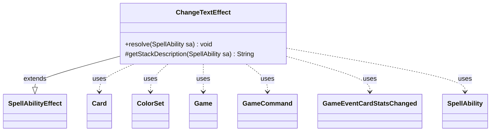

---
aliases:
  - ChangeTextEffect
tags:
  - java/class
  - module/forge-game
  - pkg/forge/game/ability/effects
fqn: forge.game.ability.effects.ChangeTextEffect
package: forge.game.ability.effects
module: forge-game
kind: Class
---

# ChangeTextEffect

**Package:** `forge.game.ability.effects` &nbsp; **Module:** `forge-game` &nbsp; **Kind:** Class



## Relationships
**Extends:**
- [[forge.game.ability.SpellAbilityEffect|SpellAbilityEffect]]
**Uses:**
- [[forge.GameCommand|GameCommand]]
- [[forge.card.ColorSet|ColorSet]]
- [[forge.game.Game|Game]]
- [[forge.game.card.Card|Card]]
- [[forge.game.event.GameEventCardStatsChanged|GameEventCardStatsChanged]]
- [[forge.game.spellability.SpellAbility|SpellAbility]]


## Design Description

Change the text of one or more target cards by replacing color words (white, blue, etc.) and/or type words (basic land or creature types) with replacement words, implementing Magic's text-changing effects such as those on Mind Bend or Magical Hack. As a concrete `SpellAbilityEffect` subclass, it overrides `resolve` to apply the substitutions and `getStackDescription` to render the human-readable rules text.

The class reads `ChangeColorWord` and `ChangeTypeWord` parameters, resolving any `Choose` directives through the activating player's controller, then records each substitution on the target `Card` under a unique game timestamp. When the duration is not `Permanent`, it registers a `GameCommand` with the end-of-turn cleanup to revert the change, then fires a `GameEventCardStatsChanged` and refreshes each card's view state. This timestamp-and-revert pattern lets multiple text modifications layer independently and expire cleanly, reflecting Forge's general approach to temporary, stackable continuous effects.

## Source
`forge-game/src/main/java/forge/game/ability/effects/ChangeTextEffect.java`

```java
package forge.game.ability.effects;

import java.util.List;

import com.google.common.collect.Lists;

import forge.GameCommand;
import forge.card.CardType;
import forge.card.ColorSet;
import forge.card.MagicColor;
import forge.game.Game;
import forge.game.ability.SpellAbilityEffect;
import forge.game.card.Card;
import forge.game.event.GameEventCardStatsChanged;
import forge.game.spellability.SpellAbility;
import forge.util.Localizer;
import forge.util.TextUtil;

public class ChangeTextEffect extends SpellAbilityEffect {

    /* (non-Javadoc)
     * @see forge.card.abilityfactory.SpellEffect#resolve(forge.card.spellability.SpellAbility)
     */
    @Override
    public void resolve(final SpellAbility sa) {
        final Card source = sa.getHostCard();
        final Game game = source.getGame();
        final Long timestamp = game.getNextTimestamp();
        final boolean permanent = "Permanent".equals(sa.getParam("Duration"));

        final String changedColorWordOriginal, changedColorWordNew;
        if (sa.hasParam("ChangeColorWord")) {
            byte originalColor = 0;
            final String[] changedColorWordsArray = sa.getParam("ChangeColorWord").split(" ");
            if (changedColorWordsArray[0].equals("Choose")) {
                originalColor = sa.getActivatingPlayer().getController().chooseColor(
                        Localizer.getInstance().getMessage("lblChooseColorReplace"), sa, ColorSet.WUBRG);
                changedColorWordOriginal = TextUtil.capitalize(MagicColor.toLongString(originalColor));
            } else {
                changedColorWordOriginal = changedColorWordsArray[0];
                originalColor = MagicColor.fromName(changedColorWordOriginal);
            }

            if (changedColorWordsArray[1].equals("Choose")) {
                final ColorSet possibleNewColors;
                if (originalColor == 0) { // no original color (ie. any or absent)
                    possibleNewColors = ColorSet.WUBRG;
                } else { // may choose any except original color
                    possibleNewColors = ColorSet.fromMask(originalColor).inverse();
                }
                final byte newColor = sa.getActivatingPlayer().getController().chooseColor(
                        Localizer.getInstance().getMessage("lblChooseNewColor"), sa, possibleNewColors);
                changedColorWordNew = TextUtil.capitalize(MagicColor.toLongString(newColor));
            } else {
                changedColorWordNew = changedColorWordsArray[1];
            }
        } else {
            changedColorWordOriginal = null;
            changedColorWordNew = null;
        }

        final String changedTypeWordOriginal, changedTypeWordNew;
        if (sa.hasParam("ChangeTypeWord")) {
            String kindOfType = "";
            final List<String> validTypes = Lists.newArrayList();
            final String[] changedTypeWordsArray = sa.getParam("ChangeTypeWord").split(" ");
            if (changedTypeWordsArray[0].equals("ChooseBasicLandType") || changedTypeWordsArray[0].equals("ChooseCreatureType")) {
                if (changedTypeWordsArray[0].equals("ChooseBasicLandType")) {
                    validTypes.addAll(CardType.getBasicTypes());
                    kindOfType = "basic land";
                } else if (changedTypeWordsArray[0].equals("ChooseCreatureType")) {
                    validTypes.addAll(CardType.Constant.CREATURE_TYPES);
                    kindOfType = "Creature";
                }
                changedTypeWordOriginal = sa.getActivatingPlayer().getController().chooseSomeType(kindOfType, sa, validTypes);
            } else {
                changedTypeWordOriginal = changedTypeWordsArray[0];
            }

            validTypes.clear();
            final List<String> forbiddenTypes = sa.hasParam("ForbiddenNewTypes") ? Lists.newArrayList(sa.getParam("ForbiddenNewTypes").split(",")) : Lists.newArrayList();
            forbiddenTypes.add(changedTypeWordOriginal);
            if (changedTypeWordsArray[1].startsWith("Choose")) {
                if (changedTypeWordsArray[1].equals("ChooseBasicLandType")) {
                    validTypes.addAll(CardType.getBasicTypes());
                    kindOfType = "basic land";
                } else if (changedTypeWordsArray[1].equals("ChooseCreatureType")) {
                    validTypes.addAll(CardType.Constant.CREATURE_TYPES);
                    kindOfType = "Creature";
                }
                validTypes.removeAll(forbiddenTypes);
                changedTypeWordNew = sa.getActivatingPlayer().getController().chooseSomeType(kindOfType, sa, validTypes);
            } else {
                changedTypeWordNew = changedTypeWordsArray[1];
            }
        } else {
            changedTypeWordOriginal = null;
            changedTypeWordNew = null;
        }

        final List<Card> tgts = getCardsfromTargets(sa);
        for (final Card c : tgts) {
            if (changedColorWordOriginal != null && changedColorWordNew != null) {
                c.addChangedTextColorWord(changedColorWordOriginal, changedColorWordNew, timestamp, 0);
            }
            if (changedTypeWordOriginal != null && changedTypeWordNew != null) {
                c.addChangedTextTypeWord(changedTypeWordOriginal, changedTypeWordNew, timestamp, 0);
            }

            if (!permanent) {
                final GameCommand revert = new GameCommand() {
                    private static final long serialVersionUID = -7802388880114360593L;
                    @Override
                    public void run() {
                        if (changedColorWordNew != null) {
                            c.removeChangedTextColorWord(timestamp, 0);
                        }
                        if (changedTypeWordNew != null) {
                            c.removeChangedTextTypeWord(timestamp, 0);
                        }
                    }
                };
                game.getEndOfTurn().addUntil(revert);
            }

            game.fireEvent(new GameEventCardStatsChanged(c));
            c.updateStateForView();
            c.updateTypesForView();
        }
    }

    /* (non-Javadoc)
     * @see forge.card.abilityfactory.SpellEffect#getStackDescription(java.util.Map, forge.card.spellability.SpellAbility)
     */
    @Override
    protected String getStackDescription(final SpellAbility sa) {
        final String changedColorWordOriginal, changedColorWordNew;
        if (sa.hasParam("ChangeColorWord")) {
            final String[] changedColorWordsArray = sa.getParam("ChangeColorWord").split(" ");
            changedColorWordOriginal = changedColorWordsArray[0];
            changedColorWordNew = changedColorWordsArray[1];
        } else {
            changedColorWordOriginal = null;
            changedColorWordNew = null;
        }

        final String changedTypeWordOriginal, changedTypeWordNew;
        if (sa.hasParam("ChangeTypeWord")) {
            final String[] changedTypeWordsArray = sa.getParam("ChangeTypeWord").split(" ");
            changedTypeWordOriginal = changedTypeWordsArray[0];
            changedTypeWordNew = changedTypeWordsArray[1];
        } else {
            changedTypeWordOriginal = null;
            changedTypeWordNew = null;
        }

        final boolean permanent = "Permanent".equals(sa.getParam("Duration"));

        final StringBuilder sb = new StringBuilder();
        sb.append("Change the text of ");

        final List<Card> tgts = getCardsfromTargets(sa);
        for (final Card c : tgts) {
            sb.append(c).append(" ");
        }

        if (changedColorWordOriginal != null) {
            sb.append(" by replacing all instances of ");
            if (changedColorWordOriginal.equals("Choose")) {
                sb.append("one color word");
            } else if (changedColorWordOriginal.equals("Any")) {
                sb.append("each color word");
            } else {
                sb.append(changedColorWordOriginal);
            }
            sb.append(" with ");
            if (changedColorWordNew.equals("Choose")) {
                if (changedColorWordOriginal.equals("Choose")) {
                    sb.append("another");
                } else {
                    sb.append("a color word of your choice");
                }
            } else {
                sb.append(changedColorWordNew);
            }
        }

        if (changedTypeWordOriginal != null) {
            sb.append(" by replacing all instances of ");
            if (changedTypeWordOriginal.equals("ChooseBasicLandType")) {
                sb.append("one basic land type");
            } else if (changedTypeWordOriginal.equals("ChooseCreatureType")) {
                sb.append("one creature type");
            } else {
                sb.append(changedTypeWordOriginal);
            }
            sb.append(" with ");
            if (changedTypeWordNew.equals("ChooseBasicLandType")) {
                if (changedTypeWordOriginal.equals("ChooseBasicLandType")) {
                    sb.append("another");
                } else {
                    sb.append("a basic land type of your choice");
                }
            } else if (changedTypeWordNew.equals("ChooseCreatureType")) {
                if (changedTypeWordOriginal.equals("ChooseCreatureType")) {
                    sb.append("another");
                } else {
                    sb.append("a creature type of your choice");
                }
            } else {
                sb.append(changedTypeWordNew);
            }
        }

        if (!permanent) {
            sb.append(" until end of turn");
        }
        sb.append('.');

        if (sa.hasParam("ForbiddenNewTypes")) {
            sb.append(" The new creature type can't be ");
            sb.append(sa.getParam("ForbiddenNewTypes"));
            sb.append('.');
        }

        if (permanent) {
            sb.append(" (This effect lasts indefinitely.)");
        }

        return sb.toString();
    }

}
```

## Python
`forge/game/ability/effects/ChangeTextEffect.py`

```python
from typing import List

from forge.GameCommand import GameCommand
from forge.card.CardType import CardType
from forge.card.ColorSet import ColorSet
from forge.card.MagicColor import MagicColor
from forge.game.Game import Game
from forge.game.ability.SpellAbilityEffect import SpellAbilityEffect
from forge.game.card.Card import Card
from forge.game.event.GameEventCardStatsChanged import GameEventCardStatsChanged
from forge.game.spellability.SpellAbility import SpellAbility
from forge.util.Localizer import Localizer
from forge.util.TextUtil import TextUtil


class ChangeTextEffect(SpellAbilityEffect):

    # (non-Javadoc)
    # @see forge.card.abilityfactory.SpellEffect#resolve(forge.card.spellability.SpellAbility)
    def resolve(self, sa: SpellAbility) -> None:
        source = sa.getHostCard()
        game = source.getGame()
        timestamp = game.getNextTimestamp()
        permanent = "Permanent" == sa.getParam("Duration")

        if sa.hasParam("ChangeColorWord"):
            originalColor = 0
            changedColorWordsArray = sa.getParam("ChangeColorWord").split(" ")
            if changedColorWordsArray[0] == "Choose":
                originalColor = sa.getActivatingPlayer().getController().chooseColor(
                    Localizer.getInstance().getMessage("lblChooseColorReplace"), sa, ColorSet.WUBRG)
                changedColorWordOriginal = TextUtil.capitalize(MagicColor.toLongString(originalColor))
            else:
                changedColorWordOriginal = changedColorWordsArray[0]
                originalColor = MagicColor.fromName(changedColorWordOriginal)

            if changedColorWordsArray[1] == "Choose":
                if originalColor == 0:  # no original color (ie. any or absent)
                    possibleNewColors = ColorSet.WUBRG
                else:  # may choose any except original color
                    possibleNewColors = ColorSet.fromMask(originalColor).inverse()
                newColor = sa.getActivatingPlayer().getController().chooseColor(
                    Localizer.getInstance().getMessage("lblChooseNewColor"), sa, possibleNewColors)
                changedColorWordNew = TextUtil.capitalize(MagicColor.toLongString(newColor))
            else:
                changedColorWordNew = changedColorWordsArray[1]
        else:
            changedColorWordOriginal = None
            changedColorWordNew = None

        if sa.hasParam("ChangeTypeWord"):
            kindOfType = ""
            validTypes: List[str] = []
            changedTypeWordsArray = sa.getParam("ChangeTypeWord").split(" ")
            if changedTypeWordsArray[0] == "ChooseBasicLandType" or changedTypeWordsArray[0] == "ChooseCreatureType":
                if changedTypeWordsArray[0] == "ChooseBasicLandType":
                    validTypes.extend(CardType.getBasicTypes())
                    kindOfType = "basic land"
                elif changedTypeWordsArray[0] == "ChooseCreatureType":
                    validTypes.extend(CardType.Constant.CREATURE_TYPES)
                    kindOfType = "Creature"
                changedTypeWordOriginal = sa.getActivatingPlayer().getController().chooseSomeType(kindOfType, sa, validTypes)
            else:
                changedTypeWordOriginal = changedTypeWordsArray[0]

            validTypes.clear()
            forbiddenTypes = list(sa.getParam("ForbiddenNewTypes").split(",")) if sa.hasParam("ForbiddenNewTypes") else []
            forbiddenTypes.append(changedTypeWordOriginal)
            if changedTypeWordsArray[1].startswith("Choose"):
                if changedTypeWordsArray[1] == "ChooseBasicLandType":
                    validTypes.extend(CardType.getBasicTypes())
                    kindOfType = "basic land"
                elif changedTypeWordsArray[1] == "ChooseCreatureType":
                    validTypes.extend(CardType.Constant.CREATURE_TYPES)
                    kindOfType = "Creature"
                for t in forbiddenTypes:
                    while t in validTypes:
                        validTypes.remove(t)
                changedTypeWordNew = sa.getActivatingPlayer().getController().chooseSomeType(kindOfType, sa, validTypes)
            else:
                changedTypeWordNew = changedTypeWordsArray[1]
        else:
            changedTypeWordOriginal = None
            changedTypeWordNew = None

        tgts = self.getCardsfromTargets(sa)
        for c in tgts:
            if changedColorWordOriginal is not None and changedColorWordNew is not None:
                c.addChangedTextColorWord(changedColorWordOriginal, changedColorWordNew, timestamp, 0)
            if changedTypeWordOriginal is not None and changedTypeWordNew is not None:
                c.addChangedTextTypeWord(changedTypeWordOriginal, changedTypeWordNew, timestamp, 0)

            if not permanent:
                class Revert(GameCommand):
                    serialVersionUID = -7802388880114360593

                    def run(self):
                        if changedColorWordNew is not None:
                            c.removeChangedTextColorWord(timestamp, 0)
                        if changedTypeWordNew is not None:
                            c.removeChangedTextTypeWord(timestamp, 0)

                revert = Revert()
                game.getEndOfTurn().addUntil(revert)

            game.fireEvent(GameEventCardStatsChanged(c))
            c.updateStateForView()
            c.updateTypesForView()

    # (non-Javadoc)
    # @see forge.card.abilityfactory.SpellEffect#getStackDescription(java.util.Map, forge.card.spellability.SpellAbility)
    def getStackDescription(self, sa: SpellAbility) -> str:
        if sa.hasParam("ChangeColorWord"):
            changedColorWordsArray = sa.getParam("ChangeColorWord").split(" ")
            changedColorWordOriginal = changedColorWordsArray[0]
            changedColorWordNew = changedColorWordsArray[1]
        else:
            changedColorWordOriginal = None
            changedColorWordNew = None

        if sa.hasParam("ChangeTypeWord"):
            changedTypeWordsArray = sa.getParam("ChangeTypeWord").split(" ")
            changedTypeWordOriginal = changedTypeWordsArray[0]
            changedTypeWordNew = changedTypeWordsArray[1]
        else:
            changedTypeWordOriginal = None
            changedTypeWordNew = None

        permanent = "Permanent" == sa.getParam("Duration")

        sb = []
        sb.append("Change the text of ")

        tgts = self.getCardsfromTargets(sa)
        for c in tgts:
            sb.append(str(c))
            sb.append(" ")

        if changedColorWordOriginal is not None:
            sb.append(" by replacing all instances of ")
            if changedColorWordOriginal == "Choose":
                sb.append("one color word")
            elif changedColorWordOriginal == "Any":
                sb.append("each color word")
            else:
                sb.append(changedColorWordOriginal)
            sb.append(" with ")
            if changedColorWordNew == "Choose":
                if changedColorWordOriginal == "Choose":
                    sb.append("another")
                else:
                    sb.append("a color word of your choice")
            else:
                sb.append(changedColorWordNew)

        if changedTypeWordOriginal is not None:
            sb.append(" by replacing all instances of ")
            if changedTypeWordOriginal == "ChooseBasicLandType":
                sb.append("one basic land type")
            elif changedTypeWordOriginal == "ChooseCreatureType":
                sb.append("one creature type")
            else:
                sb.append(changedTypeWordOriginal)
            sb.append(" with ")
            if changedTypeWordNew == "ChooseBasicLandType":
                if changedTypeWordOriginal == "ChooseBasicLandType":
                    sb.append("another")
                else:
                    sb.append("a basic land type of your choice")
            elif changedTypeWordNew == "ChooseCreatureType":
                if changedTypeWordOriginal == "ChooseCreatureType":
                    sb.append("another")
                else:
                    sb.append("a creature type of your choice")
            else:
                sb.append(changedTypeWordNew)

        if not permanent:
            sb.append(" until end of turn")
        sb.append('.')

        if sa.hasParam("ForbiddenNewTypes"):
            sb.append(" The new creature type can't be ")
            sb.append(sa.getParam("ForbiddenNewTypes"))
            sb.append('.')

        if permanent:
            sb.append(" (This effect lasts indefinitely.)")

        return "".join(sb)
```
