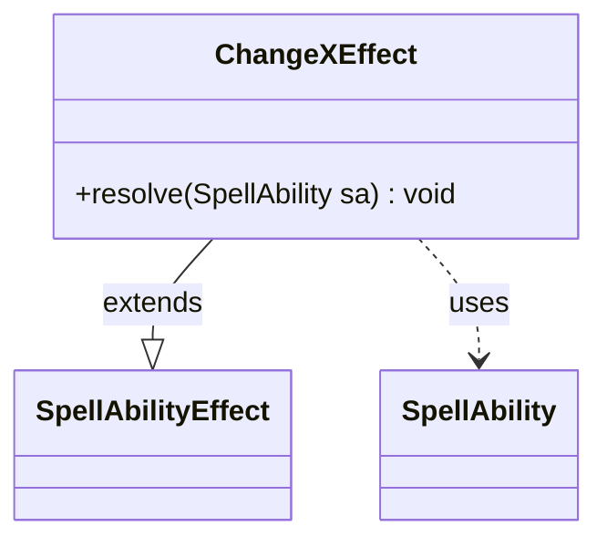

---
aliases:
  - ChangeXEffect
tags:
  - java/class
  - module/forge-game
  - pkg/forge/game/ability/effects
fqn: forge.game.ability.effects.ChangeXEffect
package: forge.game.ability.effects
module: forge-game
kind: Class
---

# ChangeXEffect

**Package:** `forge.game.ability.effects` &nbsp; **Module:** `forge-game` &nbsp; **Kind:** Class



## Relationships
**Extends:**
- [[forge.game.ability.SpellAbilityEffect|SpellAbilityEffect]]
**Uses:**
- [[forge.game.spellability.SpellAbility|SpellAbility]]


## Design Description

ChangeXEffect is a concrete spell-ability effect that doubles the X value a spell or ability was cast with, implementing the resolution behavior for cards such as Unbound Flourishing. Extending the abstract `SpellAbilityEffect` base class, it overrides the single `resolve(SpellAbility)` method and is invoked polymorphically by Forge's ability-resolution machinery alongside its many sibling effects.

In `resolve`, it collaborates with `SpellAbility` objects obtained through the inherited `getTargetSpells` helper, iterating over each target to multiply its paid X mana cost by two. The code deliberately works against the cast spell-ability copy on the host card rather than the stack's `SpellAbilityStackInstance`, since the relevant X value lives there; an inline comment documents this constraint. The class is stateless and behavior-only, reflecting Forge's data-driven design where each scripted effect is a small, focused subclass.

## Source
`forge-game/src/main/java/forge/game/ability/effects/ChangeXEffect.java`

```java
package forge.game.ability.effects;

import java.util.List;

import forge.game.ability.SpellAbilityEffect;
import forge.game.spellability.SpellAbility;

public class ChangeXEffect extends SpellAbilityEffect {

    /* (non-Javadoc)
     * @see forge.card.ability.SpellAbilityEffect#resolve(forge.card.spellability.SpellAbility)
     */
    @Override
    public void resolve(SpellAbility sa) {
        // can't get the SpellAbilityStackInstances directly from the Stack,
        // even if they are in the Triggered Objects
        final List<SpellAbility> sas = getTargetSpells(sa);

        for (final SpellAbility tgtSA : sas) {
            // for Unbound Flourishing, can't go over SpellAbilityStackInstances because the x is in cast SA copy
            SpellAbility castSA = tgtSA.getHostCard().getCastSA();
            if (castSA != null && tgtSA.equals(castSA) && castSA.getXManaCostPaid() != null) {
                castSA.setXManaCostPaid(castSA.getXManaCostPaid() * 2);
            }
            if (tgtSA.getXManaCostPaid() != null) {
                tgtSA.setXManaCostPaid(tgtSA.getXManaCostPaid() * 2);
            }
        }
    }
}
```
