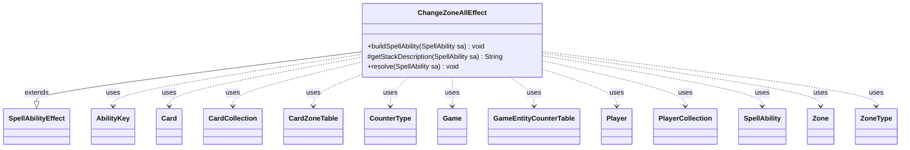

---
aliases:
  - ChangeZoneAllEffect
tags:
  - java/class
  - module/forge-game
  - pkg/forge/game/ability/effects
fqn: forge.game.ability.effects.ChangeZoneAllEffect
package: forge.game.ability.effects
module: forge-game
kind: Class
---

# ChangeZoneAllEffect

**Package:** `forge.game.ability.effects` &nbsp; **Module:** `forge-game` &nbsp; **Kind:** Class



## Relationships
**Extends:**
- [[forge.game.ability.SpellAbilityEffect|SpellAbilityEffect]]
**Uses:**
- [[forge.game.Game|Game]]
- [[forge.game.GameEntityCounterTable|GameEntityCounterTable]]
- [[forge.game.ability.AbilityKey|AbilityKey]]
- [[forge.game.card.Card|Card]]
- [[forge.game.card.CardCollection|CardCollection]]
- [[forge.game.card.CardZoneTable|CardZoneTable]]
- [[forge.game.card.CounterType|CounterType]]
- [[forge.game.player.Player|Player]]
- [[forge.game.player.PlayerCollection|PlayerCollection]]
- [[forge.game.spellability.SpellAbility|SpellAbility]]
- [[forge.game.zone.Zone|Zone]]
- [[forge.game.zone.ZoneType|ZoneType]]

## Design Description

The ChangeZoneAllEffect resolves spell abilities that relocate entire groups of cards between zones simultaneously—board wipes that exile every creature, mass reanimation, or shuffling all graveyards into libraries. As a concrete subclass of SpellAbilityEffect, it overrides buildSpellAbility to adjust change-zone targeting, getStackDescription to derive UI text, and resolve to execute the bulk move.

In resolve it assembles a CardCollection from the configured origin zones—optionally spanning all players via UseAllOriginZones—then filters by ChangeType and TypeLimit, orders or randomizes the cards, and routes each Card through the Game's action interface to the destination. The design exposes broad scripting parameters: gaining control, entering tapped or face-down, applying counters through a GameEntityCounterTable, remembering or imprinting moved cards on the source, and shuffling. A shared CardZoneTable batches every move so simultaneous zone-change triggers fire together, and it collaborates with AbilityKey-keyed move parameters, PlayerCollection, and Zone/ZoneType throughout.

## Source
`forge-game/src/main/java/forge/game/ability/effects/ChangeZoneAllEffect.java`

```java
package forge.game.ability.effects;

import java.util.List;
import java.util.Map;

import com.google.common.collect.Iterables;
import forge.game.Game;
import forge.game.GameActionUtil;
import forge.game.GameEntityCounterTable;
import forge.game.ability.AbilityFactory;
import forge.game.ability.AbilityKey;
import forge.game.ability.AbilityUtils;
import forge.game.ability.SpellAbilityEffect;
import forge.game.card.*;
import forge.game.player.Player;
import forge.game.player.PlayerCollection;
import forge.game.spellability.SpellAbility;
import forge.game.zone.Zone;
import forge.game.zone.ZoneType;
import forge.util.Lang;
import forge.util.Localizer;
import forge.util.TextUtil;

public class ChangeZoneAllEffect extends SpellAbilityEffect {

    @Override
    public void buildSpellAbility(SpellAbility sa) {
        super.buildSpellAbility(sa);
        AbilityFactory.adjustChangeZoneTarget(sa.getMapParams(), sa);
    }

    @Override
    protected String getStackDescription(SpellAbility sa) {
        // TODO build Stack Description will need expansion as more cards are added

        final String[] desc = sa.getDescription().split(":");

        if (desc.length > 1) {
            return desc[1];
        } else {
            return desc[0];
        }
    }

    @Override
    public void resolve(SpellAbility sa) {
        if (!checkValidDuration(sa.getParam("Duration"), sa)) {
            return;
        }

        final Card source = sa.getHostCard();
        final ZoneType destination = ZoneType.smartValueOf(sa.getParam("Destination"));
        final List<ZoneType> origin = ZoneType.listValueOf(sa.getParam("Origin"));

        CardCollection cards;
        PlayerCollection tgtPlayers = getTargetPlayers(sa);
        final Game game = sa.getActivatingPlayer().getGame();

        if ((!sa.usesTargeting() && !sa.hasParam("Defined")) || sa.hasParam("UseAllOriginZones")) {
            cards = new CardCollection(game.getCardsIn(origin));
            tgtPlayers = game.getPlayers();
        } else {
            cards = tgtPlayers.getCardsIn(origin);
        }

        if (sa.hasParam("Optional")) {
            final String targets = Lang.joinHomogenous(cards);
            final String message;
            if (sa.hasParam("OptionQuestion")) {
                message = TextUtil.fastReplace(sa.getParam("OptionQuestion"), "TARGETS", targets);
            } else {
                message = Localizer.getInstance().getMessage("lblMoveTargetFromOriginToDestination", targets, Lang.joinHomogenous(origin, ZoneType::getTranslatedName), destination.getTranslatedName());
            }

            if (!sa.getActivatingPlayer().getController().confirmAction(sa, null, message, null)) {
                return;
            }
        }

        cards = (CardCollection)AbilityUtils.filterListByType(cards, sa.getParam("ChangeType"), sa);

        if (sa.hasParam("TypeLimit")) {
            cards = new CardCollection(Iterables.limit(cards, AbilityUtils.calculateAmount(source, sa.getParam("TypeLimit"), sa)));
        }

        if (sa.hasParam("ForgetOtherRemembered")) {
            source.clearRemembered();
        }

        final String remember = sa.getParam("RememberChanged");
        final String forget = sa.getParam("ForgetChanged");
        final String imprint = sa.getParam("Imprint");
        final boolean random = sa.hasParam("RandomOrder");
        final boolean remLKI = sa.hasParam("RememberLKI");
        final boolean movingToDeck = destination.isDeck();

        final int libraryPos = sa.hasParam("LibraryPosition") ? Integer.parseInt(sa.getParam("LibraryPosition")) : 0;

        if (!random && !sa.hasParam("Shuffle")) {
            if (movingToDeck && cards.size() >= 2) {
                Player p = AbilityUtils.getDefinedPlayers(source, sa.getParam("DefinedPlayer"), sa).get(0);
                cards = (CardCollection) p.getController().orderMoveToZoneList(cards, destination, sa);
            } else {
                cards = (CardCollection) GameActionUtil.orderCardsByTheirOwners(game, cards, destination, sa);
            }
        }

        if (movingToDeck && random) {
            CardLists.shuffle(cards);
        }

        final CardZoneTable triggerList = CardZoneTable.getSimultaneousInstance(sa);

        for (final Card c : cards) {
            final Zone originZone = game.getZoneOf(c);

            // Fizzle spells so that they are removed from stack (e.g. Summary Dismissal)
            if (originZone.is(ZoneType.Stack)) {
                game.getStack().remove(c);
            }

            if (remLKI) {
                source.addRemembered(CardCopyService.getLKICopy(c));
            }

            Map<AbilityKey, Object> moveParams = AbilityKey.newMap();
            AbilityKey.addCardZoneTableParams(moveParams, triggerList);

            if (destination == ZoneType.Battlefield) {
                moveParams.put(AbilityKey.SimultaneousETB, cards);
                if (sa.hasParam("Tapped")) {
                    c.setTapped(true);
                }
                if (sa.hasParam("FaceDown")) {
                    c.turnFaceDown(true);
                    CardFactoryUtil.setFaceDownState(c, sa);
                }
                if (sa.hasParam("WithCountersType")) {
                    CounterType cType = CounterType.getType(sa.getParam("WithCountersType"));
                    int cAmount = AbilityUtils.calculateAmount(c, sa.getParamOrDefault("WithCountersAmount", "1"), sa);
                    GameEntityCounterTable table = new GameEntityCounterTable();
                    table.put(sa.getActivatingPlayer(), c, cType, cAmount);
                    moveParams.put(AbilityKey.CounterTable, table);
                }
            }
            Card movedCard = null;
            if (sa.hasParam("GainControl")) {
                c.setController(sa.getActivatingPlayer(), game.getNextTimestamp());
                movedCard = game.getAction().moveToPlay(c, sa.getActivatingPlayer(), sa, moveParams);
            } else {
                if (destination == ZoneType.Exile && !c.canExiledBy(sa, true)) {
                    continue;
                }
                movedCard = game.getAction().moveTo(destination, c, libraryPos, sa, moveParams);
                if (destination == ZoneType.Exile) {
                    handleExiledWith(movedCard, sa);
                }
                if (sa.hasParam("ExileFaceDown")) {
                    movedCard.turnFaceDown(true);
                }
            }

            if (!movedCard.getZone().equals(originZone)) {
                if (remember != null && (remember.equalsIgnoreCase("True") ||
                        movedCard.isValid(remember, sa.getActivatingPlayer(), source, sa))) {
                    if (!source.isRemembered(movedCard)) {
                        source.addRemembered(movedCard);
                    }
                    if (c.getMeldedWith() != null) {
                        Card meld = game.getCardState(c.getMeldedWith(), null);
                        if (meld != null) {
                            if (!source.isRemembered(meld)) {
                                source.addRemembered(meld);
                            }
                        }
                    }
                    if (c.hasMergedCard()) {
                        for (final Card card : c.getMergedCards()) {
                            if (card == c) continue;
                            if (!source.isRemembered(card)) {
                                source.addRemembered(card);
                            }
                        }
                    }
                }
                if (forget != null) {
                    source.removeRemembered(c);
                }
                if (imprint != null) {
                    source.addImprintedCard(movedCard);
                }
            }
        }

        triggerList.triggerChangesZoneAll(game, sa);

        if (sa.hasParam("AtEOT") && !triggerList.isEmpty()) {
            registerDelayedTrigger(sa, sa.getParam("AtEOT"), triggerList.allCards());
        }

        changeZoneUntilCommand(triggerList, sa);

        // CR 701.20d If an effect would cause a player to shuffle a set of objects into a library,
        // that library is shuffled even if there are no objects in that set. 
        if (sa.hasParam("Shuffle")) {
            //TODO: If destination zone is some other kind of deck like a planar deck, shuffle that instead.
            for (Player p : tgtPlayers) {
                p.shuffle(sa);
            }
        }
    }
}
```
