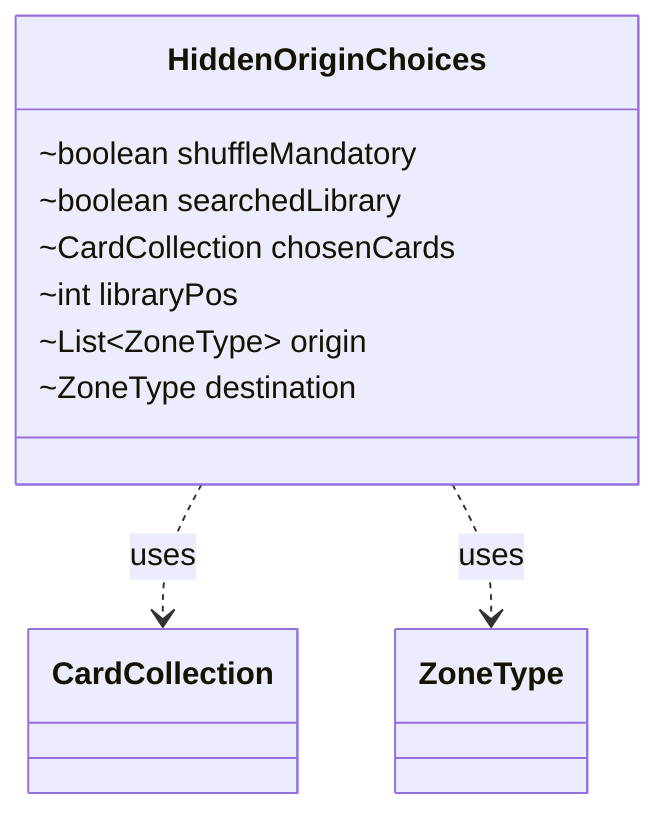

---
aliases:
  - HiddenOriginChoices
tags:
  - java/class
  - module/forge-game
  - pkg/forge/game/ability/effects
fqn: forge.game.ability.effects.ChangeZoneEffect.HiddenOriginChoices
package: forge.game.ability.effects
module: forge-game
kind: Class
---

# HiddenOriginChoices

**Package:** `forge.game.ability.effects`   **Module:** `forge-game`   **Kind:** Class



## Relationships
**Uses:**
- [[forge.game.card.CardCollection|CardCollection]]
- [[forge.game.zone.ZoneType|ZoneType]]

## Design Description

`HiddenOriginChoices` is a private static nested helper within `ChangeZoneEffect`, serving as a plain data holder that bundles the state of a single "hidden origin" zone-change resolution—the variant where cards are moved from concealed zones such as a library or hand and typically involve searching. It aggregates the chosen cards (`CardCollection`), the originating and destination zones (`List<ZoneType>` and `ZoneType`), the library insertion position, and flags tracking whether a library was searched and whether a mandatory shuffle is pending.

By collapsing these related fields into one structure, it lets `ChangeZoneEffect` thread a coherent snapshot of an in-progress move through its resolution logic rather than passing many loose parameters. Its package-private fields and lack of behavior signal intentional use as a lightweight internal struct, tightly coupled to and scoped entirely within its enclosing effect class.

## Source
`forge-game/src/main/java/forge/game/ability/effects/ChangeZoneEffect.java` — declaration excerpt

```java
    private static class HiddenOriginChoices {
        boolean shuffleMandatory;
        boolean searchedLibrary;
        CardCollection chosenCards;
        int libraryPos;
        List<ZoneType> origin;
        ZoneType destination;
    }
```

## Python
`forge/game/ability/effects/ChangeZoneEffect/HiddenOriginChoices.py`

```python
from forge.game.card.CardCollection import CardCollection
from forge.game.zone.ZoneType import ZoneType


class HiddenOriginChoices:
    def __init__(self):
        self.shuffleMandatory: bool = False
        self.searchedLibrary: bool = False
        self.chosenCards: CardCollection = None
        self.libraryPos: int = 0
        self.origin: list[ZoneType] = None
        self.destination: ZoneType = None
```
