---
aliases:
  - ChangeZoneEffect
tags:
  - java/class
  - module/forge-game
  - pkg/forge/game/ability/effects
fqn: forge.game.ability.effects.ChangeZoneEffect
package: forge.game.ability.effects
module: forge-game
kind: Class
---

# ChangeZoneEffect

**Package:** `forge.game.ability.effects`   **Module:** `forge-game`   **Kind:** Class



```mermaid
classDiagram
    class ChangeZoneEffect {
        +buildSpellAbility(SpellAbility sa) void
        #getStackDescription(SpellAbility sa) String
        -changeHiddenOriginStackDescription(SpellAbility sa) String
        -changeKnownOriginStackDescription(SpellAbility sa) String
        +resolve(SpellAbility sa) void
        -changeKnownOriginResolve(SpellAbility sa) void
        -changeHiddenOriginResolve(SpellAbility sa) void
        -handleCastWhileSearching(CardCollection fetchList, Player decider) void
        -allowMultiSelect(Player decider, SpellAbility sa) boolean
        -removeFromStack(SpellAbility tgtSA, SpellAbility srcSA, SpellAbilityStackInstance si, ZoneType destination, int libPos, Game game, CardZoneTable triggerList, GameEntityCounterTable counterTable) void
        -handleAltDest(SpellAbility sa, Card host, ZoneType dest1, int libPos1, Player p) Pair~ZoneType,Integer~
    }
    ChangeZoneEffect --|> SpellAbilityEffect : extends
    ChangeZoneEffect ..> AbilityKey : uses
    ChangeZoneEffect ..> Card : uses
    ChangeZoneEffect ..> CardCollection : uses
    ChangeZoneEffect ..> CardCollectionView : uses
    ChangeZoneEffect ..> CardZoneTable : uses
    ChangeZoneEffect ..> CounterType : uses
    ChangeZoneEffect ..> DelayedReveal : uses
    ChangeZoneEffect ..> FCollectionView : uses
    ChangeZoneEffect ..> Game : uses
    ChangeZoneEffect ..> GameEntity : uses
    ChangeZoneEffect ..> GameEntityCounterTable : uses
    ChangeZoneEffect ..> GameEventAddLog : uses
    ChangeZoneEffect ..> GameEventCombatChanged : uses
    ChangeZoneEffect ..> HiddenOriginChoices : uses
    ChangeZoneEffect ..> Player : uses
    ChangeZoneEffect ..> PlayerCollection : uses
    ChangeZoneEffect ..> ReplacementEffect : uses
    ChangeZoneEffect ..> SpellAbility : uses
    ChangeZoneEffect ..> SpellAbilityStackInstance : uses
    ChangeZoneEffect ..> Zone : uses
    ChangeZoneEffect ..> ZoneType : uses
```

## Relationships
**Extends:**
- [[forge.game.ability.SpellAbilityEffect|SpellAbilityEffect]]
**Uses:**
- [[forge.game.Game|Game]]
- [[forge.game.GameEntity|GameEntity]]
- [[forge.game.GameEntityCounterTable|GameEntityCounterTable]]
- [[forge.game.ability.AbilityKey|AbilityKey]]
- [[forge.game.ability.effects.ChangeZoneEffect.HiddenOriginChoices|HiddenOriginChoices]]
- [[forge.game.card.Card|Card]]
- [[forge.game.card.CardCollection|CardCollection]]
- [[forge.game.card.CardCollectionView|CardCollectionView]]
- [[forge.game.card.CardZoneTable|CardZoneTable]]
- [[forge.game.card.CounterType|CounterType]]
- [[forge.game.event.GameEventAddLog|GameEventAddLog]]
- [[forge.game.event.GameEventCombatChanged|GameEventCombatChanged]]
- [[forge.game.player.DelayedReveal|DelayedReveal]]
- [[forge.game.player.Player|Player]]
- [[forge.game.player.PlayerCollection|PlayerCollection]]
- [[forge.game.replacement.ReplacementEffect|ReplacementEffect]]
- [[forge.game.spellability.SpellAbility|SpellAbility]]
- [[forge.game.spellability.SpellAbilityStackInstance|SpellAbilityStackInstance]]
- [[forge.game.zone.Zone|Zone]]
- [[forge.game.zone.ZoneType|ZoneType]]
- [[forge.util.collect.FCollectionView|FCollectionView]]


## Design Description

ChangeZoneEffect is the resolution logic for Forge's parameterized "change zone" spell abilities, extending `SpellAbilityEffect` by overriding `buildSpellAbility`, `getStackDescription`, and `resolve`. It moves cards (and spells on the stack) between any MTG zones according to script parameters such as Origin, Destination, ChangeType, ChangeNum, and LibraryPosition.

Its defining design decision is the split between *hidden* origins—search-and-fetch effects where a chooser picks from concealed cards, supported by `DelayedReveal` and the nested `HiddenOriginChoices` holder that separates per-player selection from execution—and *known* origins acting on visible targets, each with its own stack-description and resolve method. It collaborates closely with the game model (`Card`/`CardCollection`, `Player`, `Zone`/`ZoneType`, `Game`, `SpellAbility`) and threads a shared `CardZoneTable` and `GameEntityCounterTable` through every move so simultaneous zone-change triggers and counter placements batch correctly. Extensive parameter-driven branching handles special cases like Ninjutsu, Unearth, control changes, and attachments.

## Source
`forge-game/src/main/java/forge/game/ability/effects/ChangeZoneEffect.java`

```java
package forge.game.ability.effects;

import com.google.common.collect.Iterables;
import com.google.common.collect.Lists;
import com.google.common.collect.Maps;
import com.google.common.collect.Sets;
import forge.card.CardStateName;
import forge.game.*;
import forge.game.ability.AbilityFactory;
import forge.game.ability.AbilityKey;
import forge.game.ability.AbilityUtils;
import forge.game.ability.SpellAbilityEffect;
import forge.game.card.*;
import forge.game.event.GameEventAddLog;
import forge.game.event.GameEventCombatChanged;
import forge.game.keyword.Keyword;
import forge.game.player.*;
import forge.game.player.PlayerController.FullControlFlag;
import forge.game.replacement.ReplacementEffect;
import forge.game.replacement.ReplacementType;
import forge.game.spellability.SpellAbility;
import forge.game.spellability.SpellAbilityStackInstance;
import forge.game.trigger.TriggerType;
import forge.game.zone.Zone;
import forge.game.zone.ZoneType;
import forge.util.*;
import forge.util.collect.FCollectionView;
import org.apache.commons.lang3.StringUtils;
import org.apache.commons.lang3.tuple.Pair;

import java.util.Arrays;
import java.util.List;
import java.util.Map;
import java.util.Objects;
import java.util.Set;

public class ChangeZoneEffect extends SpellAbilityEffect {

    @Override
    public void buildSpellAbility(SpellAbility sa) {
        super.buildSpellAbility(sa);
        AbilityFactory.adjustChangeZoneTarget(sa.getMapParams(), sa);
    }

    @Override
    protected String getStackDescription(SpellAbility sa) {
        if (sa.isHidden()) {
            return changeHiddenOriginStackDescription(sa);
        }
        return changeKnownOriginStackDescription(sa);
    }

    /**
     * <p>
     * changeHiddenOriginStackDescription.
     * </p>
     *
     * @param sa
     *            a {@link forge.game.spellability.SpellAbility} object.
     * @return a {@link java.lang.String} object.
     */
    private static String changeHiddenOriginStackDescription(final SpellAbility sa) {
        // TODO build Stack Description will need expansion as more cards are added

        final StringBuilder sb = new StringBuilder();
        final Card host = sa.getHostCard();

        if (sa.hasParam("Optional")) { // TODO make boolean and handle verb reconjugation throughout
            sb.append("(OPTIONAL) ");
        }

        // Player whose cards will change zones
        List<Player> fetchers = null;
        if (sa.hasParam("DefinedPlayer")) {
            fetchers = AbilityUtils.getDefinedPlayers(host, sa.getParam("DefinedPlayer"), sa);
        }
        if (fetchers == null && sa.usesTargeting()) {
            fetchers = Lists.newArrayList(sa.getTargets().getTargetPlayers());
        }
        if (fetchers == null) {
            fetchers = Lists.newArrayList(host.getController());
        }

        final String fetcherNames = Lang.joinHomogenous(fetchers, GameEntity::getName);

        // Player who chooses the cards to move
        List<Player> choosers = Lists.newArrayList();
        if (sa.hasParam("Chooser")) {
            choosers = AbilityUtils.getDefinedPlayers(host, sa.getParam("Chooser"), sa);
        }
        if (choosers.isEmpty()) {
            choosers.add(sa.getActivatingPlayer());
        }

        final boolean oneChooser = choosers.size() == 1;
        final String chooserNames = Lang.joinHomogenous(choosers);

        String fetchPlayer = fetcherNames;
        if (chooserNames.equals(fetcherNames)) {
            fetchPlayer = "their";
        }

        String origin = "";
        if (sa.hasParam("Origin")) {
            origin = sa.getParam("Origin");
        }
        final String destination = sa.getParam("Destination");

        final int num = sa.hasParam("ChangeNum") ? AbilityUtils.calculateAmount(host, sa.getParam("ChangeNum"), sa) : 1;
        String type = "card";
        boolean defined = false;
        if (sa.hasParam("ChangeTypeDesc")) {
            type = sa.getParam("ChangeTypeDesc");
            if (type.contains("{")) {
                final StringBuilder typesb = new StringBuilder();
                SpellAbilityEffect.tokenizeString(sa, typesb, type);
                type = typesb.toString();
            }
        } else if (sa.usesTargeting() || sa.hasParam("Defined")) {
            List<Card> tgts = getDefinedCardsOrTargeted(sa, "Defined");
            type = Lang.joinHomogenous(tgts);
            defined = true;
        } else if (sa.hasParam("ChangeType") && !sa.getParam("ChangeType").equals("Card")) {
            type = Lang.getInstance().buildValidDesc(Arrays.asList(sa.getParam("ChangeType").split(",")), num != 1);
        }
        final String cardTag = type.contains("card") ? "" : " card";

        boolean tapped = sa.hasParam("Tapped");
        boolean attacking = sa.hasParam("Attacking");
        if (sa.isNinjutsu()) {
            tapped = true;
            attacking = true;
        }

        if (origin.equals("Library") && sa.hasParam("Defined")) {
            // for now, just handle the Exile from top of library case, but
            // this can be expanded...
            if (destination.equals("Exile")) {
                sb.append("Exile the top card of your library");
                if (sa.hasParam("ExileFaceDown")) {
                    sb.append(" face down");
                }
                sb.append(".");
            } else if (destination.equals("Ante")) {
                sb.append("Add the top card of your library to the ante.");
            }
        } else if (origin.equals("Library")) {
            final boolean originAlt = sa.hasParam("OriginAlternative");
            sb.append(chooserNames).append(" search").append(!oneChooser ? " " : "es ");
            sb.append(fetchPlayer).append(fetchPlayer.equals(chooserNames) ? "'s " : " ").append("library");
            if (originAlt) {
                sb.append(sa.getParam("OriginAlternative").contains("Hand") ? ", hand, and/or graveyard for " :
                                " and/or graveyard for ");
            } else {
                sb.append(" for ");
            }
            if (num != 1) {
                sb.append(" up to ");
            }
            sb.append(Lang.nounWithNumeralExceptOne(num, type + cardTag)).append(", ");
            if (!sa.hasParam("NoReveal") && ZoneType.smartValueOf(destination) != null && ZoneType.smartValueOf(destination).isHidden()) {
                if (choosers.size() == 1) {
                    sb.append(num > 1 ? "reveals them, " : "reveals it, ");
                } else {
                    sb.append(num > 1 ? "reveal them, " : "reveal it, ");
                }
            }

            if (destination.equals("Exile")) {
                if (num == 1) {
                    sb.append("exiles it");
                } else {
                    sb.append("exiles them");
                }
            } else {
                if (num == 1) {
                    sb.append("puts it ");
                } else {
                    sb.append("puts them ");
                }

                if (destination.equals("Battlefield")) {
                    sb.append("onto the battlefield");
                    if (tapped) {
                        sb.append(" tapped").append(attacking ? " and" : "");
                    }
                    sb.append(attacking ? " attacking" : "");
                    if (sa.hasParam("GainControl")) {
                        sb.append(" under ").append(chooserNames).append("'s control");
                    }
                }
                if (destination.equals("Hand")) {
                    if (num == 1) {
                        sb.append("into their hand");
                    } else {
                        sb.append("into their owner's hand");
                    }
                }
                if (destination.equals("Graveyard")) {
                    if (num == 1) {
                        sb.append("into its owner's graveyard");
                    } else {
                        sb.append("into their owner's graveyard");
                    }
                }
            }
            sb.append(", then shuffles").append(originAlt ? " if they searched their library." : ".");
        } else if (origin.equals("Sideboard")) {
            sb.append(chooserNames);
            //currently Reveal is always True in ChangeZone
            if (sa.hasParam("Reveal")) {
                sb.append(" may reveal ").append(num).append(" ").append(type).append(" from outside the game and put ");
                if (num == 1) {
                    sb.append("it ");
                } else {
                    sb.append("them ");
                }
                sb.append("into their ").append(destination.toLowerCase()).append(".");
            } else {
                if (sa.hasParam("Mandatory")) {
                    sb.append(" put").append(!oneChooser ? " " : "s ");
                } else {
                    sb.append(" may put ");
                }
                sb.append(num).append(" ").append(type).append(" from outside the game into their ");
                sb.append(destination.toLowerCase()).append(".");
            }
        } else if (origin.equals("Hand")) {
            sb.append(chooserNames);
            if (!chooserNames.equals(fetcherNames)) {
                sb.append(" looks at ").append(fetcherNames).append("'s hand and ");
                sb.append(destination.equals("Exile") ? "exiles " : "puts ");
                sb.append(num).append(" of those ").append(type).append(" card(s)");
            } else {
                String verb = destination.equals("Exile") ? " exiles " : " puts ";
                if (!oneChooser) verb = verb.replace("s", "");
                sb.append(verb);
                if (defined) {
                    sb.append(type);
                } else if (StringUtils.containsIgnoreCase(type, "Card")) {
                    sb.append(Lang.nounWithNumeralExceptOne(num, type));
                } else {
                    sb.append(Lang.nounWithNumeralExceptOne(num, type + " card"));
                }
                sb.append(" from ").append(fetchPlayer).append(" hand");
            }

            if (destination.equals("Battlefield")) {
                sb.append(" onto the battlefield");
                if (tapped) {
                    sb.append(" tapped").append(attacking ? " and" : "");
                }
                sb.append(attacking ? " attacking" : "");
                if (sa.hasParam("GainControl")) {
                    sb.append(" under ").append(chooserNames).append("'s control");
                }
            }
            if (destination.equals("Library")) {
                final int libraryPos = sa.hasParam("LibraryPosition") ? AbilityUtils.calculateAmount(host, sa.getParam("LibraryPosition"), sa) : 0;

                if (libraryPos == 0) {
                    sb.append(" on top");
                }
                if (libraryPos == -1) {
                    sb.append(" on the bottom");
                }

                sb.append(" of ").append(fetchPlayer);
                if (!fetchPlayer.equals("their")) {
                    sb.append("'s");
                }
                sb.append(" library");
            }

            sb.append(".");
        } else if (origin.equals("Battlefield")) {
            // TODO Expand on this Description as more cards use it
            // for the non-targeted SAs when you choose what is returned on resolution
            sb.append("Return ").append(num).append(" ").append(type).append(" card(s) ");
            sb.append(" to your ").append(destination).append(".");
        } else if (origin.equals("Graveyard")) {
            // for non-targeted SAs when you choose what is moved on resolution
            // this will need expansion as more cards use it
            final boolean changeNumDesc = sa.hasParam("ChangeNumDesc");
            final boolean mandatory = sa.hasParam("Mandatory");
            String changed;
            if (changeNumDesc) {
                changed = sa.getParam("ChangeNumDesc") + " " + type + cardTag;
            } else if (!mandatory) {
                changed = Lang.nounWithNumeral(num, type + cardTag);
            } else {
                changed = Lang.nounWithNumeralExceptOne(num, type + cardTag);
            }
            final boolean toField = destination.equals("Battlefield");
            final boolean toHand = destination.equals("Hand");
            String verb = destination.equals("Exile") ? " exiles " : " returns ";
            if (!oneChooser) verb = verb.replace("s", "");
            sb.append(chooserNames).append(verb).append(mandatory || changeNumDesc ? "" : "up to ");
            sb.append(changed);
            // so far, it seems non-targeted only lets you return from your own graveyard
            sb.append(" from their graveyard").append(choosers.size() > 1 ? "s" : "");
            if (!destination.equals("Exile")) {
                sb.append(toField ? " to the " : toHand ? " to their " : " into their ");
                sb.append(destination.toLowerCase());
            }
            if (sa.hasParam("WithCountersType")) {
                final CounterType cType = CounterType.getType(sa.getParam("WithCountersType"));
                if (cType != null) {
                    sb.append(" with an additional ").append(cType.getName()).append(" counter on it");
                } else {
                    sb.append(" [ChangeZoneEffect WithCountersType error]");
                }
            }
            sb.append(".");
        } else if (origin.equals("Exile")) {
            // for non-targeted, moved cards are chosen on resolution – will need expansion as more cards use it
            sb.append(chooserNames).append(" puts ").append(Lang.nounWithNumeralExceptOne(num, type + cardTag));
            sb.append(" into their ").append(destination.toLowerCase()).append(".");
        }

        return sb.toString();
    }

    /**
     * <p>
     * changeKnownOriginStackDescription.
     * </p>
     *
     * @param sa
     *            a {@link forge.game.spellability.SpellAbility} object.
     * @return a {@link java.lang.String} object.
     */
    private static String changeKnownOriginStackDescription(final SpellAbility sa) {
        final StringBuilder sb = new StringBuilder();
        final Card host = sa.getHostCard();
        final ZoneType destination = ZoneType.smartValueOf(sa.getParam("Destination"));
        ZoneType origin = null;
        if (sa.hasParam("Origin")) {
            origin = ZoneType.listValueOf(sa.getParam("Origin")).get(0);
        }

        final StringBuilder sbTargets = new StringBuilder();
        Iterable<Card> tgts;
        if (sa.usesTargeting()) {
            tgts = getCardsfromTargets(sa);
        } else { // otherwise add self to list and go from there
            tgts = sa.knownDetermineDefined(sa.getParam("Defined"));
        }

        sbTargets.append(" ").append(sa.getParamOrDefault("DefinedDesc", Lang.joinHomogenous(tgts)));

        final String targetname = sbTargets.toString();

        final String pronoun = Iterables.size(tgts) > 1 ? " their " : " its ";

        final String fromGraveyard = " from the graveyard";

        if (destination.equals(ZoneType.Battlefield)) {
            final boolean attacking = sa.hasParam("Attacking");
            if (ZoneType.Graveyard.equals(origin)) {
                sb.append("Return").append(targetname).append(fromGraveyard).append(" to the battlefield");
            } else {
                sb.append("Put").append(targetname).append(" onto the battlefield");
            }
            if (sa.hasParam("Tapped")) {
                sb.append(" tapped").append(attacking ? " and" : "");
            }
            sb.append(attacking ? " attacking" : "");
            if (sa.hasParam("GainControl")) {
                sb.append(" under your control");
            }
            sb.append(".");
        }

        if (destination.equals(ZoneType.Hand)) {
            if (ZoneType.Graveyard.equals(origin)) {
                sb.append("Return").append(targetname).append(fromGraveyard).append(" to");
            } else if (ZoneType.Battlefield.equals(origin)) {
                sb.append("Return").append(targetname).append(" to");
            } else {
                sb.append("Put").append(targetname).append(" in");
            }
            sb.append(pronoun).append("owner's hand.");
        }

        if (destination.equals(ZoneType.Library)) {
            if (sa.hasParam("Shuffle")) { // for things like Gaea's Blessing
                sb.append("Shuffle").append(targetname);

                sb.append(" into").append(pronoun).append("owner's library.");
            } else {
                sb.append("Put").append(targetname);
                if (ZoneType.Graveyard.equals(origin)) {
                    sb.append(fromGraveyard);
                }

                // this needs to be zero indexed. Top = 0, Third = 2, -1 = Bottom
                final int libraryPosition = sa.hasParam("LibraryPosition") ? AbilityUtils.calculateAmount(host, sa.getParam("LibraryPosition"), sa) : 0;

                if (libraryPosition == -1) {
                    sb.append(" on the bottom of").append(pronoun).append("owner's library.");
                } else if (libraryPosition == 0) {
                    sb.append(" on top of").append(pronoun).append("owner's library.");
                } else {
                    sb.append(" ").append(libraryPosition + 1).append(" from the top of");
                    sb.append(pronoun).append("owner's library.");
                }
            }
        }

        if (destination.equals(ZoneType.Exile)) {
            sb.append("Exile").append(targetname);
            if (ZoneType.Graveyard.equals(origin)) {
                sb.append(fromGraveyard);
            }
            sb.append(".");
        }

        if (destination.equals(ZoneType.Ante)) {
            sb.append("Ante").append(targetname);
            sb.append(".");
        }

        if (destination.equals(ZoneType.Graveyard)) {
            sb.append("Put").append(targetname);
            if (origin != null) {
                sb.append(" from ").append(origin);
            }
            sb.append(" into").append(pronoun).append("owner's graveyard.");
        }

        return sb.toString();
    }

    /**
     * <p>
     * changeZoneResolve.
     * </p>
     * @param sa
     *            a {@link forge.game.spellability.SpellAbility} object.
     */

    @Override
    public void resolve(SpellAbility sa) {
        if (!checkValidDuration(sa.getParam("Duration"), sa)) {
            return;
        }

        if (sa.isHidden() && !sa.isNinjutsu()) {
            changeHiddenOriginResolve(sa);
        } else {
            //else if (isKnown(origin) || sa.containsKey("Ninjutsu")) {
            // Why is this an elseif and not just an else?
            changeKnownOriginResolve(sa);
        }
    }

    /**
     * <p>
     * changeKnownOriginResolve.
     * </p>
     *
     * @param sa
     *            a {@link forge.game.spellability.SpellAbility} object.
     */
    private void changeKnownOriginResolve(final SpellAbility sa) {
        CardCollectionView tgtCards = getTargetCards(sa);
        final Player activator = sa.getActivatingPlayer();
        final Card hostCard = sa.getHostCard();
        final Game game = activator.getGame();
        final CardCollection commandCards = new CardCollection();

        ZoneType destination = ZoneType.smartValueOf(sa.getParam("Destination"));
        final List<ZoneType> origin = Lists.newArrayList();
        if (sa.hasParam("Origin")) {
            origin.addAll(ZoneType.listValueOf(sa.getParam("Origin")));
        }

        int libPos = sa.hasParam("LibraryPosition") ? AbilityUtils.calculateAmount(hostCard, sa.getParam("LibraryPosition"), sa) : 0;
        if (sa.hasParam("DestinationAlternative")) {
            Pair<ZoneType, Integer> pair = handleAltDest(sa, hostCard, destination, libPos, activator);
            destination = pair.getKey();
            libPos = pair.getValue();
        }

        final GameEntityCounterTable counterTable = new GameEntityCounterTable();
        final CardZoneTable triggerList = CardZoneTable.getSimultaneousInstance(sa);
        final CardCollectionView lastStateBattlefield = triggerList.getLastStateBattlefield();

        // changing zones for spells on the stack
        for (final SpellAbility tgtSA : getTargetSpells(sa)) {
            if (!tgtSA.isSpell()) { // Catch any abilities or triggers that slip through somehow
                continue;
            }

            final SpellAbilityStackInstance si = game.getStack().getInstanceMatchingSpellAbilityID(tgtSA);
            if (si == null) {
                continue;
            }

            removeFromStack(tgtSA, sa, si, destination, libPos, game, triggerList, counterTable);
        } // End of change from stack

        final String remember = sa.getParam("RememberChanged");
        final String forget = sa.getParam("ForgetChanged");
        final String imprint = sa.getParam("Imprint");

        if (sa.hasParam("Unimprint")) {
            hostCard.clearImprintedCards();
        }

        if (sa.hasParam("ForgetOtherRemembered")) {
            hostCard.clearRemembered();
        }

        final boolean optional = sa.hasParam("Optional");
        final boolean shuffle = sa.hasParam("Shuffle") && "True".equals(sa.getParam("Shuffle"));
        boolean combatChanged = false;

        if (sa.hasParam("ShuffleNonMandatory") &&
                !activator.getController().confirmAction(sa, null, Localizer.getInstance().getMessage("lblDoyouWantShuffleTheLibrary"), null)) {
            return;
        }

        Player chooser = activator;
        if (sa.hasParam("Chooser")) {
            chooser = AbilityUtils.getDefinedPlayers(hostCard, sa.getParam("Chooser"), sa).get(0);
        }

        // CR 401.4
        if (((destination.isDeck() && tgtCards.size() > 1) || chooser.getController().isFullControl(FullControlFlag.LayerTimestampOrder)) && !shuffle) {
            if (sa.hasParam("RandomOrder")) {
                final CardCollection random = new CardCollection(tgtCards);
                CardLists.shuffle(random);
                tgtCards = random;
            } else if (sa.hasParam("Chooser")) {
                tgtCards = chooser.getController().orderMoveToZoneList(tgtCards, destination, sa);
            } else {
                tgtCards = GameActionUtil.orderCardsByTheirOwners(game, tgtCards, destination, sa);
            }
        }

        for (final Card tgtC : tgtCards) {
            if (sa.hasSVar("StaticEffectUntilCardID") && sa.getSVarInt("StaticEffectUntilCardID") == tgtC.getId()) {
                sa.removeSVar("StaticEffectTimestamp");
            }

            final Card gameCard = game.getCardState(tgtC, null);
            // gameCard is LKI in that case, the card is not in game anymore
            // or the timestamp did change
            // this should check Self too
            if (gameCard == null || !tgtC.equalsWithGameTimestamp(gameCard) || gameCard.isPhasedOut()) {
                continue;
            }

            if (sa.hasParam("RememberLKI")) {
                hostCard.addRemembered(CardCopyService.getLKICopy(gameCard));
            }

            final String prompt = TextUtil.concatWithSpace(Localizer.getInstance().getMessage("lblDoYouWantMoveTargetFromOriToDest", gameCard.getTranslatedName(), Lang.joinHomogenous(origin, ZoneType::getTranslatedName), destination.getTranslatedName()));
            if (optional && !chooser.getController().confirmAction(sa, null, prompt, null)) {
                continue;
            }

            final Zone originZone = game.getZoneOf(gameCard);

            // if Target isn't in the expected Zone, continue
            if (originZone == null || (!origin.isEmpty() && !origin.contains(originZone.getZoneType()))) {
                continue;
            }

            if (originZone.is(ZoneType.Stack)) {
                game.getStack().remove(gameCard);
            }

            Card movedCard;
            Map<AbilityKey, Object> moveParams = AbilityKey.newMap();
            AbilityKey.addCardZoneTableParams(moveParams, triggerList);

            if (destination.equals(ZoneType.Battlefield)) {
                moveParams.put(AbilityKey.SimultaneousETB, tgtCards);
                if (sa.isReplacementAbility()) {
                    ReplacementEffect re = sa.getReplacementEffect();
                    moveParams.put(AbilityKey.ReplacementEffect, re);
                    if (ReplacementType.Moved.equals(re.getMode()) && sa.getReplacingObject(AbilityKey.CardLKI) != null) {
                        moveParams.put(AbilityKey.CardLKI, sa.getReplacingObject(AbilityKey.CardLKI));
                    }
                }

                if (sa.hasParam("Tapped") || sa.isNinjutsu()) {
                    gameCard.setTapped(true);
                }
                if (sa.hasParam("Transformed")) {
                    if (gameCard.isTransformable()) {
                        // need LKI before Animate does apply
                        if (!moveParams.containsKey(AbilityKey.CardLKI)) {
                            moveParams.put(AbilityKey.CardLKI, CardCopyService.getLKICopy(gameCard));
                        }
                        gameCard.changeCardState("Transform", null, sa);
                    } else {
                        // If it can't Transform, don't change zones.
                        continue;
                    }
                }
                if (sa.hasParam("WithCountersType")) {
                    int cAmount = AbilityUtils.calculateAmount(hostCard, sa.getParamOrDefault("WithCountersAmount", "1"), sa);
                    GameEntityCounterTable table = new GameEntityCounterTable();
                    moveParams.put(AbilityKey.CounterTable, table);
                    for (String type : sa.getParam("WithCountersType").split(",")) {
                        CounterType cType = CounterType.getType(type);
                        table.put(activator, gameCard, cType, cAmount);
                    }
                } else if (sa.hasParam("WithNotedCounters")) {
                    CountersNoteEffect.loadCounters(gameCard, hostCard, chooser, sa, moveParams);
                }
                if (sa.hasParam("GainControl")) {
                    final String g = sa.getParam("GainControl");
                    Player newController = g.equals("True") ? activator :
                        AbilityUtils.getDefinedPlayers(hostCard, g, sa).get(0);
                    if (newController != null) {
                        if (newController != gameCard.getController()) {
                            gameCard.runChangeControllerCommands();
                        }
                        gameCard.setController(newController, game.getNextTimestamp());
                    }
                }
                if (sa.hasParam("AttachedTo")) {
                    CardCollection list = AbilityUtils.getDefinedCards(hostCard, sa.getParam("AttachedTo"), sa);
                    if (list.isEmpty()) {
                        list = CardLists.getValidCards(lastStateBattlefield, sa.getParam("AttachedTo"), hostCard.getController(), hostCard, sa);
                    }

                    // only valid choices are when they could be attached
                    // TODO for multiple Auras entering attached this way, need to use LKI info
                    if (!list.isEmpty()) {
                        list = CardLists.filter(list, CardPredicates.canBeAttached(gameCard, sa));
                    }
                    if (!list.isEmpty()) {
                        Map<String, Object> params = Maps.newHashMap();
                        params.put("Attach", gameCard);
                        Card attachedTo = activator.getController().chooseSingleEntityForEffect(list, sa, Localizer.getInstance().getMessage("lblSelectACardAttachSourceTo", gameCard.toString()), params);

                        // TODO can't attach later or moveToPlay would attach indirectly
                        // bypass canBeAttached to skip Protection checks when trying to attach multiple auras that would grant protection
                        gameCard.attachToEntity(game.getCardState(attachedTo), sa, true);
                    } else if (gameCard.isAura()) { // When it should enter the battlefield attached to an illegal permanent it fails
                        continue;
                    }
                }

                if (sa.hasParam("AttachedToPlayer")) {
                    FCollectionView<Player> list = AbilityUtils.getDefinedPlayers(hostCard, sa.getParam("AttachedToPlayer"), sa);
                    if (!list.isEmpty()) {
                        Map<String, Object> params = Maps.newHashMap();
                        params.put("Attach", gameCard);
                        Player attachedTo = activator.getController().chooseSingleEntityForEffect(list, sa, Localizer.getInstance().getMessage("lblSelectAPlayerAttachSourceTo", gameCard.toString()), params);
                        gameCard.attachToEntity(attachedTo, sa);
                    }
                    else { // When it should enter the battlefield attached to an illegal player it fails
                        continue;
                    }
                }

                // need to be facedown before it hits the battlefield in case of Replacement Effects or Trigger
                if (sa.hasParam("FaceDown")) {
                    gameCard.turnFaceDown(true);
                    CardFactoryUtil.setFaceDownState(gameCard, sa);
                }

                movedCard = game.getAction().moveTo(gameCard.getController().getZone(destination), gameCard, sa, moveParams);
                // below stuff only if it changed zones
                if (movedCard.getZone().equals(originZone)) {
                    continue;
                }
                if (sa.isKeyword(Keyword.UNEARTH) && movedCard.isInPlay()) {
                    movedCard.setUnearthed(true);

                    final Card eff = createEffect(sa, sa.getActivatingPlayer(), "Unearth Effect", hostCard.getImageKey());
                    eff.setRenderForUI(false);
                    eff.addRemembered(movedCard);

                    // It gains haste.
                    String s = "Mode$ Continuous | Affected$ Card.IsRemembered | EffectZone$ Command | AddKeyword$ Haste";
                    eff.addStaticAbility(s);

                    // If it would leave the battlefield, exile it instead of putting it anywhere else.
                    addLeaveBattlefieldReplacement(eff, "Exile");
                    movedCard.addLeavesPlayCommand(() -> game.getAction().exileEffect(eff));

                    game.getAction().moveToCommand(eff, sa);

                    // Exile it at the beginning of the next end step.
                    registerDelayedTrigger(sa, "Exile", Lists.newArrayList(movedCard));
                }
                if (sa.hasParam("LeaveBattlefield")) {
                    addLeaveBattlefieldReplacement(movedCard, sa, sa.getParam("LeaveBattlefield"));
                }
                if (addToCombat(movedCard, sa, "Attacking", "Blocking")) {
                    combatChanged = true;
                }
                if (sa.isNinjutsu()) {
                    // Ninjutsu need to get the Defender of the Returned Creature
                    final Card returned = sa.getPaidList("Returned", true).getFirst();
                    final GameEntity defender = game.getCombat().getDefenderByAttacker(returned);
                    game.getCombat().addAttacker(movedCard, defender);
                    game.getCombat().getBandOfAttacker(movedCard).setBlocked(false);
                    combatChanged = true;
                }

                if (sa.hasParam("AttachAfter") && movedCard.isAttachment()) {
                    CardCollection list = AbilityUtils.getDefinedCards(hostCard, sa.getParam("AttachAfter"), sa);
                    if (list.isEmpty()) {
                        list = CardLists.getValidCards(game.getCardsIn(ZoneType.Battlefield), sa.getParam("AttachAfter"), hostCard.getController(), hostCard, sa);
                    }
                    if (!list.isEmpty()) {
                        String title = Localizer.getInstance().getMessage("lblSelectACardAttachSourceTo", gameCard.getTranslatedName());
                        Map<String, Object> params = Maps.newHashMap();
                        params.put("Attach", gameCard);
                        Card attachedTo = chooser.getController().chooseSingleEntityForEffect(list, sa, title, params);
                        movedCard.attachToEntity(attachedTo, sa);
                    }
                }
            } else {
                // might set before card is moved only for nontoken
                if (destination.equals(ZoneType.Exile)) {
                    if (!gameCard.canExiledBy(sa, true)) {
                        continue;
                    }
                    handleExiledWith(gameCard, sa);
                }

                movedCard = game.getAction().moveTo(destination, gameCard, libPos, sa, moveParams);

                if (destination.equals(ZoneType.Exile) && lastStateBattlefield.contains(gameCard) && hostCard.equals(gameCard)) {
                    // support Parallax Wave returning itself
                    handleExiledWith(movedCard, sa, lastStateBattlefield.get(gameCard));
                }

                if (ZoneType.Hand.equals(destination) && ZoneType.Command.equals(originZone.getZoneType())) {
                    StringBuilder sb = new StringBuilder();
                    sb.append(movedCard.getDisplayName()).append(" has moved from Command Zone to ").append(activator).append("'s hand.");
                    game.fireEvent(new GameEventAddLog(GameLogEntryType.ZONE_CHANGE, sb.toString()));
                    commandCards.add(movedCard); //add to list to reveal the commandzone cards
                }

                if (sa.hasParam("WithCountersType")) {
                    CounterType cType = CounterType.getType(sa.getParam("WithCountersType"));
                    int cAmount = AbilityUtils.calculateAmount(hostCard, sa.getParamOrDefault("WithCountersAmount", "1"), sa);
                    movedCard.addCounter(cType, cAmount, activator, counterTable);
                }

                if (sa.hasParam("ExileFaceDown") || sa.hasParam("FaceDown")) {
                    movedCard.turnFaceDown(true);
                }
                if (sa.hasParam("Foretold")) {
                    movedCard.setForetold(true);
                    if (sa.hasParam("ForetoldCost")) {
                        movedCard.setForetoldCostByEffect(true);
                    }
                }
                // look at the exiled card
                if (sa.hasParam("WithMayLook") || sa.hasParam("Foretold")) {
                    movedCard.addMayLookFaceDownExile(activator);
                }

                if (sa.isTrigger() && sa.getTrigger().isKeyword(Keyword.WARP)) {
                    Card eff = createEffect(sa, sa.getHostCard().getOwner(), "Warped " + sa.getHostCard(), sa.getHostCard().getImageKey());
                    StringBuilder sbPlay = new StringBuilder();
                    sbPlay.append("Mode$ Continuous | MayPlay$ True | EffectZone$ Command | Affected$ Card.IsRemembered+nonLand+!ThisTurnEntered");
                    sbPlay.append(" | AffectedZone$ Exile | Description$ You may cast the card.");
                    eff.addStaticAbility(sbPlay.toString());
                    eff.addRemembered(movedCard);
                    addForgetOnMovedTrigger(eff, "Exile");
                    addForgetOnCastTrigger(eff, "Card.IsRemembered");
                    game.getAction().moveToCommand(eff, sa);
                }

                // CR 400.7k
                if (sa.hasParam("TrackDiscarded")) {
                    movedCard.setDiscarded(true);
                }
            }
            if (!movedCard.getZone().equals(originZone)) {
                Card meld = null;
                if (gameCard.getMeldedWith() != null) {
                    meld = game.getCardState(gameCard.getMeldedWith(), null);
                    if (sa.hasParam("WithCountersType")) {
                        CounterType cType = CounterType.getType(sa.getParam("WithCountersType"));
                        int cAmount = AbilityUtils.calculateAmount(hostCard, sa.getParamOrDefault("WithCountersAmount", "1"), sa);
                        meld.addCounter(cType, cAmount, activator, counterTable);
                    }
                }
                if (gameCard.hasMergedCard()) {
                    for (final Card c : gameCard.getMergedCards()) {
                        if (c == gameCard) continue;
                        if (sa.hasParam("WithCountersType")) {
                            CounterType cType = CounterType.getType(sa.getParam("WithCountersType"));
                            int cAmount = AbilityUtils.calculateAmount(hostCard, sa.getParamOrDefault("WithCountersAmount", "1"), sa);
                            c.addCounter(cType, cAmount, activator, counterTable);
                        }
                    }
                }

                if (remember != null) {
                    hostCard.addRemembered(movedCard);
                    // addRememberedFromCardState ?
                    if (meld != null) {
                        hostCard.addRemembered(meld);
                    }
                    if (gameCard.hasMergedCard()) {
                        for (final Card c : gameCard.getMergedCards()) {
                            if (c == gameCard) continue;
                            hostCard.addRemembered(c);
                        }
                    }
                }
                if (forget != null) {
                    hostCard.removeRemembered(movedCard);
                }
                if (imprint != null) {
                    hostCard.addImprintedCard(movedCard);
                    if (gameCard.hasMergedCard()) {
                        for (final Card c : gameCard.getMergedCards()) {
                            if (c == gameCard) continue;
                            hostCard.addImprintedCard(c);
                        }
                        // For Duplicant
                        if (sa.hasParam("ImprintLast")) {
                            Card lastCard = null;
                            for (final Card c : movedCard.getOwner().getCardsIn(destination)) {
                                if (hostCard.hasImprintedCard(c)) {
                                    hostCard.removeImprintedCard(c);
                                    lastCard = c;
                                }
                            }
                            hostCard.addImprintedCard(lastCard);
                        }
                    }
                }
            }
        }

        if (combatChanged) {
            game.updateCombatForView();
            game.fireEvent(new GameEventCombatChanged());
        }

        //reveal command cards that changes zone from command zone to player's hand
        if (!commandCards.isEmpty()) {
            game.getAction().reveal(commandCards, activator, true, "Revealed cards in ");
        }

        triggerList.triggerChangesZoneAll(game, sa);
        counterTable.replaceCounterEffect(game, sa);

        if (sa.hasParam("AtEOT") && !triggerList.isEmpty()) {
            registerDelayedTrigger(sa, sa.getParam("AtEOT"), triggerList.allCards());
        }

        changeZoneUntilCommand(triggerList, sa);

        // might set after card is moved again if something has changed
        if (destination.equals(ZoneType.Exile)) {
            handleExiledWith(triggerList.allCards(), sa);
        }

        // for things like Gaea's Blessing
        if (destination.equals(ZoneType.Library) && shuffle) {
            PlayerCollection pl = new PlayerCollection();
            // use defined controller. it does need to work even without Targets.
            if (sa.hasParam("TargetsWithDefinedController")) {
                pl.addAll(AbilityUtils.getDefinedPlayers(hostCard, sa.getParam("TargetsWithDefinedController"), sa));
            } else {
                for (final Card tgtC : tgtCards) {
                    // FCollection already does use set.
                    pl.add(tgtC.getOwner());
                }
                if (pl.isEmpty()) {
                    pl.add(activator);
                }
            }
            for (final Player p : pl) {
                p.shuffle(sa);
            }
        }
    }

    /**
     * <p>
     * changeHiddenOriginResolve.
     * </p>
     *
     * @param sa
     *            a {@link forge.game.spellability.SpellAbility} object.
     */
    private void changeHiddenOriginResolve(final SpellAbility sa) {
        final Card source = sa.getHostCard();
        final Game game = source.getGame();
        final boolean chooseFromDef = sa.hasParam("ChooseFromDefined");
        final boolean defined = sa.hasParam("Defined") || chooseFromDef;
        final String changeType = sa.getParamOrDefault("ChangeType", "");
        boolean mandatory = sa.hasParam("Mandatory");
        Map<Player, HiddenOriginChoices> hiddenChoices = Maps.newHashMap();

        List<Player> fetchers = AbilityUtils.getDefinedPlayers(sa.getHostCard(), sa.getParam("DefinedPlayer"), sa);
        Player chooser = null;
        if (sa.hasParam("Chooser")) {
            final FCollectionView<Player> choosers = AbilityUtils.getDefinedPlayers(sa.getHostCard(), sa.getParam("Chooser"), sa);
            if (!choosers.isEmpty()) {
                chooser = sa.getActivatingPlayer().getController().chooseSingleEntityForEffect(choosers, null, sa, Localizer.getInstance().getMessage("lblChooser") + ":", false, null, null);
            }
        }

        for (Player player : fetchers) {
            Player decider = chooser;
            if (decider == null) {
                decider = player;
            }

            if (sa.usesTargeting() && !sa.hasParam("DefinedPlayer")) {
                player = sa.getTargets().getFirstTargetedPlayer();
            }

            if (!player.isInGame()) {
                continue;
            }

            List<ZoneType> origin = Lists.newArrayList();
            if (sa.hasParam("Origin")) {
                origin.addAll(ZoneType.listValueOf(sa.getParam("Origin")));
            }
            ZoneType destination = ZoneType.smartValueOf(sa.getParam("Destination"));

            if (sa.hasParam("OriginAlternative")) {
                // Currently only used for Mishra, but may be used by other things
                // Improve how this message reacts for other cards
                final List<ZoneType> alt = ZoneType.listValueOf(sa.getParam("OriginAlternative"));
                CardCollectionView altFetchList = AbilityUtils.filterListByType(player.getCardsIn(alt), sa.getParam("ChangeType"), sa);

                final StringBuilder sb = new StringBuilder();
                sb.append(Localizer.getInstance().getMessage("lblSearchLibrary")).append(" ");
                sb.append(altFetchList.size()).append(" ").append(Localizer.getInstance().getMessage("lblCardMatchSearchingTypeInAlternateZones"));

                if (!decider.getController().confirmAction(sa, PlayerActionConfirmMode.ChangeZoneFromAltSource, sb.toString(), null)) {
                    origin.clear();
                }
                while (!alt.isEmpty() && origin.size() + alt.size() != 1) {
                    ZoneType z = alt.get(0);
                    String prompt = Localizer.getInstance().getMessage("lblSearchPlayerZoneConfirm", "{player's}", z.getTranslatedName().toLowerCase());
                    prompt = MessageUtil.formatMessage(prompt , decider, player);
                    if (decider.getController().confirmAction(sa, PlayerActionConfirmMode.ChangeZoneFromAltSource, prompt, null)) {
                        origin.add(z);
                    }
                    alt.remove(0);
                }
                if (origin.isEmpty()) {
                    origin = alt;
                }
                for (ZoneType z : origin) {
                    // all cards that use this currently only search 1 card, no extra logic needed
                    if (z.isKnown() && altFetchList.anyMatch(CardPredicates.inZone(z))) {
                        mandatory = true;
                    }
                }
            }

            if (sa.hasParam("Optional")) {
                String prompt;
                if (sa.hasParam("OptionalPrompt")) {
                    prompt = sa.getParam("OptionalPrompt");
                } else if (defined) {
                    prompt = Localizer.getInstance().getMessage("lblPutThatCardFromPlayerOriginToDestination", "{player's}", Lang.joinHomogenous(origin, ZoneType::getTranslatedName).toLowerCase(), destination.getTranslatedName().toLowerCase());
                } else {
                    prompt = Localizer.getInstance().getMessage("lblSearchPlayerZoneConfirm", "{player's}", Lang.joinHomogenous(origin, ZoneType::getTranslatedName).toLowerCase());
                }
                String message = MessageUtil.formatMessage(prompt , decider, player);
                if (!decider.getController().confirmAction(sa, PlayerActionConfirmMode.ChangeZoneGeneral, message, null)) {
                    continue;
                }
            }

            // for Wish cards, if the player is controlled by someone else
            // they can't fetch from the outside the game/sideboard
            if (player.isControlled()) {
                origin.remove(ZoneType.Sideboard);
            }

            // this needs to be zero indexed. Top = 0, Third = 2
            int libraryPos = sa.hasParam("LibraryPosition") ? AbilityUtils.calculateAmount(source, sa.getParam("LibraryPosition"), sa) : 0;

            int changeNum = sa.hasParam("ChangeNum") ? AbilityUtils.calculateAmount(source, sa.getParam("ChangeNum"), sa) : 1;

            CardCollection fetchList;
            boolean shuffleMandatory = true;
            boolean searchedLibrary = false;
            if (defined) {
                fetchList = new CardCollection();
                String param = chooseFromDef ? "ChooseFromDefined" : "Defined";
                for (Card c : AbilityUtils.getDefinedCards(source, sa.getParam(param), sa)) {
                    Card gameCard = game.getCardState(c, null);
                    if (gameCard != null && c.equalsWithGameTimestamp(gameCard) && !gameCard.isPhasedOut()) {
                        fetchList.add(gameCard);
                    }
                }
                if (!sa.hasParam("ChangeNum")) {
                    changeNum = fetchList.size();
                }
            }
            else if (!origin.contains(ZoneType.Library) && !origin.contains(ZoneType.Hand)
                    && !sa.hasParam("DefinedPlayer")) {
                fetchList = new CardCollection(game.getCardsIn(origin));
            }
            else {
                fetchList = new CardCollection(player.getCardsIn(origin));
                if (origin.contains(ZoneType.Library) && !sa.hasParam("NoLooking")) {
                    searchedLibrary = true;

                    if (decider.hasKeyword("LimitSearchLibrary")) { // Aven Mindcensor
                        fetchList.removeAll(player.getCardsIn(ZoneType.Library));
                        final int fetchNum = Math.min(player.getCardsIn(ZoneType.Library).size(), 4);
                        if (fetchNum == 0) {
                            searchedLibrary = false;
                        } else {
                            fetchList.addAll(player.getCardsIn(ZoneType.Library, fetchNum));
                        }
                    }
                    if (!decider.canSearchLibraryWith(sa, player)) {
                        fetchList.removeAll(player.getCardsIn(ZoneType.Library));
                        // "if you do/sb does, shuffle" is not mandatory (usually a triggered ability), should has this param.
                        // "then shuffle" is mandatory
                        shuffleMandatory = !sa.hasParam("ShuffleNonMandatory");
                        searchedLibrary = false;
                    }
                }
            }

            //determine list of all cards to reveal to player in addition to those that can be chosen
            DelayedReveal delayedReveal = null;
            if (!defined && !sa.hasParam("AlreadyRevealed")) {
                Set<ZoneType> revealZones = Sets.newHashSet();
                Iterable<Card> toReveal = null;
                if (origin.contains(ZoneType.Library) && searchedLibrary) {
                    final int fetchNum = Math.min(player.getCardsIn(ZoneType.Library).size(), 4);
                    // Look at whole library before moving onto choosing a card
                    toReveal = !decider.hasKeyword("LimitSearchLibrary") ? player.getCardsIn(ZoneType.Library) : player.getCardsIn(ZoneType.Library, fetchNum);
                    revealZones.add(ZoneType.Library);
                }
                if (origin.contains(ZoneType.Hand) && player.isOpponentOf(decider)) {
                    if (toReveal != null) {
                        toReveal = Iterables.concat(toReveal, player.getCardsIn(ZoneType.Hand));
                    } else {
                        toReveal = player.getCardsIn(ZoneType.Hand);
                    }
                    revealZones.add(ZoneType.Hand);
                }
                if (!revealZones.isEmpty()) {
                    delayedReveal = new DelayedReveal(toReveal, revealZones, PlayerView.get(player), source.getTranslatedName() + " - " + Localizer.getInstance().getMessage("lblLookingCardIn") + " ");
                }
            }

            Long controlTimestamp = null;
            if (!searchedLibrary && sa.hasParam("Searched")) {
                searchedLibrary = true;
            }
            if (searchedLibrary) {
                if (decider.equals(player)) {
                    Map.Entry<Long, Player> searchControlPlayer = player.getControlledWhileSearching();
                    if (searchControlPlayer != null) {
                        controlTimestamp = searchControlPlayer.getKey();
                        player.addController(controlTimestamp, searchControlPlayer.getValue());
                    }

                    // should only count the number of searching player's own library
                    decider.incLibrarySearched();

                    handleCastWhileSearching(fetchList, decider);
                }
                if (sa.hasParam("RememberSearched")) {
                    source.addRemembered(player);
                }
                final Map<AbilityKey, Object> runParams = AbilityKey.mapFromPlayer(decider);
                runParams.put(AbilityKey.Target, player);
                game.getTriggerHandler().runTrigger(TriggerType.SearchedLibrary, runParams, false);
            }
            if (searchedLibrary && sa.hasParam("Searched")) {
                searchedLibrary = false;
            }

            if (!defined && !changeType.isEmpty() && !changeType.startsWith("EACH")) {
                fetchList = (CardCollection)AbilityUtils.filterListByType(fetchList, sa.getParam("ChangeType"), sa);
            }
            fetchList.sort();

            if (sa.hasParam("NoShuffle") || "False".equals(sa.getParam("Shuffle"))) {
                shuffleMandatory = false;
            }

            if (sa.hasParam("Unimprint")) {
                source.clearImprintedCards();
            }
            if (sa.hasParam("ForgetOtherRemembered")) {
                source.clearRemembered();
            }

            String selectPrompt = sa.hasParam("SelectPrompt") ? sa.getParam("SelectPrompt") : MessageUtil.formatMessage(Localizer.getInstance().getMessage("lblSelectCardFromPlayerZone", "{player's}", Lang.joinHomogenous(origin, ZoneType::getTranslatedName).toLowerCase()), decider, player);
            final String totalcmc = sa.getParam("WithTotalCMC");
            final String totalpower = sa.getParam("WithTotalPower");
            final String totalCardTypes = sa.getParam("WithTotalCardTypes");
            int totcmc = AbilityUtils.calculateAmount(source, totalcmc, sa);
            int totpower = AbilityUtils.calculateAmount(source, totalpower, sa);
            int totCardTypes = AbilityUtils.calculateAmount(source, totalCardTypes, sa);

            CardCollection chosenCards = new CardCollection();
            if (changeType.startsWith("EACH")) {
                String[] eachTypes = changeType.substring(5).split(" & ");
                for (String thisType : eachTypes) {
                    for (int i = 0; i < changeNum; i++) {
                        CardCollection thisList = (CardCollection) AbilityUtils.filterListByType(fetchList, thisType, sa);
                        if (!chosenCards.isEmpty()) {
                            thisList.removeAll(chosenCards);
                        }
                        Card c = decider.getController().chooseSingleCardForZoneChange(destination, origin, sa,
                                thisList, delayedReveal, selectPrompt, !mandatory, decider);
                        if (c == null) {
                            continue;
                        }
                        chosenCards.add(c);
                    }
                }
            } else if (changeNum > 1 && allowMultiSelect(decider, sa)) {
                // only multi-select if player can select more than one
                List<Card> selectedCards;
                if (!sa.hasParam("SelectPrompt")) {
                    // new default messaging for multi select
                    if (fetchList.size() > changeNum) {
                        //Select up to %changeNum cards from %players %origin
                        selectPrompt = MessageUtil.formatMessage(Localizer.getInstance().getMessage("lblSelectUpToNumCardFromPlayerZone", String.valueOf(changeNum), "{player's}", Lang.joinHomogenous(origin, ZoneType::getTranslatedName).toLowerCase()), decider, player);
                    } else {
                        selectPrompt = MessageUtil.formatMessage(Localizer.getInstance().getMessage("lblSelectCardsFromPlayerZone", "{player's}", Lang.joinHomogenous(origin, ZoneType::getTranslatedName).toLowerCase()), decider, player);
                    }
                }
                // ensure that selection is within maximum allowed changeNum
                final int multiMin = sa.hasParam("Mandatory") ? Math.min(changeNum, fetchList.size()) : 0;
                do {
                    selectedCards = decider.getController().chooseCardsForZoneChange(destination, origin, sa, fetchList, multiMin, changeNum, delayedReveal, selectPrompt, decider);
                } while (selectedCards != null && selectedCards.size() > changeNum);
                if (selectedCards != null) {
                    chosenCards.addAll(selectedCards);
                }
                // maybe prompt the user if they selected fewer than the maximum possible?
            } else {
                // one at a time
                for (int i = 0; i < changeNum; i++) {
                    if (sa.hasParam("DifferentNames")) {
                        for (Card c : chosenCards) {
                            fetchList = CardLists.filter(fetchList, CardPredicates.sharesNameWith(c).negate());
                        }
                    }
                    if (sa.hasParam("DifferentCMC")) {
                        for (Card c : chosenCards) {
                            fetchList = CardLists.filter(fetchList, CardPredicates.sharesCMCWith(c).negate());
                        }
                    }
                    if (sa.hasParam("DifferentPower")) {
                        for (Card c : chosenCards) {
                            int chosenPower = c.getNetPower();
                            fetchList = CardLists.filter(fetchList, x -> x.getNetPower() != chosenPower);
                        }
                    }
                    if (sa.hasParam("ShareLandType")) {
                        // After the first card is chosen, check if the land type is shared
                        for (final Card c : chosenCards) {
                            fetchList = CardLists.filter(fetchList, CardPredicates.sharesLandTypeWith(c));
                        }
                    }
                    if (totalcmc != null) {
                        if (totcmc >= 0) {
                            fetchList = CardLists.getValidCards(fetchList, "Card.cmcLE" + totcmc, source.getController(), source, sa);
                        }
                    }
                    if (totalpower != null) {
                        if (totpower >= 0) {
                            fetchList = CardLists.getValidCards(fetchList, "Card.powerLE" + totpower, source.getController(), source, sa);
                        }
                    }

                    // If we're choosing multiple cards, only need to show the reveal dialog the first time through.
                    boolean shouldReveal = (i == 0);
                    Card c = null;
                    if (sa.hasParam("AtRandom")) {
                        if (shouldReveal && delayedReveal != null) {
                            decider.getController().reveal(delayedReveal);
                        }
                        c = Aggregates.random(fetchList);
                    } else if (defined && !chooseFromDef) {
                        c = Iterables.getFirst(fetchList, null);
                    } else if (totalCardTypes != null) {
                      String title = selectPrompt;
                      title += "\nCard types left: " + Math.max(totCardTypes, 0);
                      c = decider.getController().chooseSingleCardForZoneChange(destination, origin, sa, fetchList, shouldReveal ? delayedReveal : null, title, !mandatory, decider);
                    } else {
                        String title = selectPrompt;
                        if (changeNum > 1) { //indicate progress if multiple cards being chosen
                            title += " (" + (i + 1) + " / " + changeNum + ")";
                        }
                        c = decider.getController().chooseSingleCardForZoneChange(destination, origin, sa, fetchList, shouldReveal ? delayedReveal : null, title, !mandatory, decider);
                    }

                    if (c == null) {
                        final int num = Math.min(fetchList.size(), changeNum - i);
                        String message = Localizer.getInstance().getMessage("lblCancelSearchUpToSelectNumCards", String.valueOf(num));

                        if (fetchList.isEmpty() || sa.hasParam("SkipCancelPrompt") ||
                                decider.getController().confirmAction(sa, PlayerActionConfirmMode.ChangeZoneGeneral, message, null)) {
                            break;
                        }
                        i--;
                        continue;
                    }

                    fetchList.remove(c);
                    if (delayedReveal != null) {
                        delayedReveal.remove(CardView.get(c));
                    }
                    chosenCards.add(c);

                    if (totalcmc != null) {
                        totcmc -= c.getCMC();
                    }
                    if (totalpower != null) {
                        totpower -= c.getCurrentPower();
                    }
                    if (totalCardTypes != null) {
                        totCardTypes -= Iterables.size(c.getType().getCoreTypes());
                    }
                }

                if (totalCardTypes != null && totCardTypes > 0) {
                    chosenCards.clear();
                }
            }

            if (sa.hasParam("ShuffleChangedPile")) {
                CardLists.shuffle(chosenCards);
            }

            if (sa.hasParam("DestinationAlternative")) {
                Pair<ZoneType, Integer> pair = handleAltDest(sa, source, destination, libraryPos, decider);
                destination = pair.getKey();
                libraryPos = pair.getValue();
            }

            // do not shuffle the library once we have placed a fetched card on top.
            if (origin.contains(ZoneType.Library) && destination == ZoneType.Library && shuffleMandatory) {
                player.shuffle(sa);
            }

            if (sa.hasParam("Reorder")) {
                chosenCards = new CardCollection(decider.getController().orderMoveToZoneList(chosenCards, destination, sa));
            }

            // remove Controlled While Searching
            if (controlTimestamp != null) {
                player.removeController(controlTimestamp);
            }

            if (sa.hasParam("Exactly") && chosenCards.size() < changeNum) {
                continue;
            }

            HiddenOriginChoices choices = new HiddenOriginChoices();
            choices.searchedLibrary = searchedLibrary;
            choices.shuffleMandatory = shuffleMandatory;
            choices.chosenCards = chosenCards;
            choices.libraryPos = libraryPos;
            choices.origin = origin;
            choices.destination = destination;
            hiddenChoices.put(player, choices);
        }

        final boolean remember = sa.hasParam("RememberChanged");
        final boolean forget = sa.hasParam("ForgetChanged");
        final boolean champion = sa.hasParam("Champion");
        final boolean imprint = sa.hasParam("Imprint");

        boolean combatChanged = false;
        final CardZoneTable triggerList = CardZoneTable.getSimultaneousInstance(sa);

        for (Player player : hiddenChoices.keySet()) {
            boolean searchedLibrary = hiddenChoices.get(player).searchedLibrary;
            boolean shuffleMandatory = hiddenChoices.get(player).shuffleMandatory;
            CardCollection chosenCards = hiddenChoices.get(player).chosenCards;
            int libraryPos = hiddenChoices.get(player).libraryPos;
            List<ZoneType> origin = hiddenChoices.get(player).origin;
            ZoneType destination = hiddenChoices.get(player).destination;
            CardCollection movedCards = new CardCollection();
            Player decider = Objects.requireNonNullElse(chooser, player);

            for (final Card c : chosenCards) {
                Card movedCard;
                final Zone originZone = game.getZoneOf(c);
                Map<AbilityKey, Object> moveParams = AbilityKey.newMap();
                moveParams.put(AbilityKey.FoundSearchingLibrary, searchedLibrary);
                AbilityKey.addCardZoneTableParams(moveParams, triggerList);

                if (destination == null) {
                    movedCard = c;
                }
                else if (destination.equals(ZoneType.Library)) {
                    movedCard = game.getAction().moveToLibrary(c, libraryPos, sa, moveParams);
                }
                else if (destination.equals(ZoneType.Battlefield)) {
                    moveParams.put(AbilityKey.SimultaneousETB, chosenCards);
                    if (sa.hasParam("Tapped")) {
                        c.setTapped(true);
                    }
                    if (sa.hasParam("GainControl")) {
                        final String g = sa.getParam("GainControl");
                        Player newController = g.equals("True") ? sa.getActivatingPlayer() :
                                AbilityUtils.getDefinedPlayers(source, g, sa).get(0);
                        if (newController != c.getController()) {
                            c.runChangeControllerCommands();
                        }
                        c.setController(newController, game.getNextTimestamp());
                    }

                    if (sa.hasParam("WithCountersType")) {
                        CounterType cType = CounterType.getType(sa.getParam("WithCountersType"));
                        int cAmount = AbilityUtils.calculateAmount(source, sa.getParamOrDefault("WithCountersAmount", "1"), sa);
                        GameEntityCounterTable table = new GameEntityCounterTable();
                        table.put(player, c, cType, cAmount);
                        moveParams.put(AbilityKey.CounterTable, table);
                    }
                    if (sa.hasParam("Transformed")) {
                        if (c.isTransformable()) {
                            // need LKI before Animate does apply
                            if (!moveParams.containsKey(AbilityKey.CardLKI)) {
                                moveParams.put(AbilityKey.CardLKI, CardCopyService.getLKICopy(c));
                            }
                            c.changeCardState("Transform", null, sa);
                        } else {
                            // If it can't Transform, don't change zones.
                            continue;
                        }
                    }

                    if (sa.hasParam("AttachedTo") && c.isAttachment()) {
                        CardCollection list = AbilityUtils.getDefinedCards(source, sa.getParam("AttachedTo"), sa);
                        if (list.isEmpty()) {
                            list = CardLists.getValidCards(triggerList.getLastStateBattlefield(), sa.getParam("AttachedTo"), source.getController(), source, sa);
                        }
                        // only valid choices are when they could be attached
                        // TODO for multiple Auras entering attached this way, need to use LKI info
                        if (!list.isEmpty()) {
                            list = CardLists.filter(list, CardPredicates.canBeAttached(c, sa));
                        }
                        if (!list.isEmpty()) {
                            String title = Localizer.getInstance().getMessage("lblSelectACardAttachSourceTo", c.getTranslatedName());
                            Map<String, Object> params = Maps.newHashMap();
                            params.put("Attach", c);
                            Card attachedTo = decider.getController().chooseSingleEntityForEffect(list, sa, title, params);

                            // TODO can't attach later or moveToPlay would attach indirectly
                            // bypass canBeAttached to skip Protection checks when trying to attach multiple auras that would grant protection
                            c.attachToEntity(game.getCardState(attachedTo), sa, true);
                        }
                        else if (c.isAura()) { // When it should enter the battlefield attached to an illegal permanent it fails
                            continue;
                        }
                    }

                    if (sa.hasParam("AttachedToPlayer")) {
                        FCollectionView<Player> list = AbilityUtils.getDefinedPlayers(source, sa.getParam("AttachedToPlayer"), sa);
                        if (!list.isEmpty()) {
                            String title =  Localizer.getInstance().getMessage("lblSelectACardAttachSourceTo", c.getTranslatedName());
                            Map<String, Object> params = Maps.newHashMap();
                            params.put("Attach", c);
                            Player attachedTo = player.getController().chooseSingleEntityForEffect(list, sa, title, params);
                            c.attachToEntity(attachedTo, sa);
                        }
                        else { // When it should enter the battlefield attached to an illegal permanent it fails
                            continue;
                        }
                    }

                    if (addToCombat(c, sa, "Attacking", "Blocking")) {
                        combatChanged = true;
                    }

                    // need to be facedown before it hits the battlefield in case of Replacement Effects or Trigger
                    if (sa.hasParam("FaceDown")) {
                        c.turnFaceDown(true);
                        CardFactoryUtil.setFaceDownState(c, sa);
                    }
                    movedCard = game.getAction().moveToPlay(c, c.getController(), sa, moveParams);

                    if (sa.hasParam("AttachAfter") && movedCard.isAttachment() && movedCard.isInPlay()) {
                        CardCollection list = AbilityUtils.getDefinedCards(source, sa.getParam("AttachAfter"), sa);
                        if (list.isEmpty()) {
                            list = CardLists.getValidCards(game.getCardsIn(ZoneType.Battlefield), sa.getParam("AttachAfter"), c.getController(), c, sa);
                        }
                        if (!list.isEmpty()) {
                            String title = Localizer.getInstance().getMessage("lblSelectACardAttachSourceTo", c.getTranslatedName());
                            Map<String, Object> params = Maps.newHashMap();
                            params.put("Attach", movedCard);
                            Card attachedTo = decider.getController().chooseSingleEntityForEffect(list, sa, title, params);
                            movedCard.attachToEntity(attachedTo, sa);
                        }
                    }
                }
                else if (destination.equals(ZoneType.Exile)) {
                    if (!c.canExiledBy(sa, true)) {
                        continue;
                    }
                    movedCard = game.getAction().exile(c, sa, moveParams);

                    handleExiledWith(movedCard, sa);

                    if (sa.hasParam("ExileFaceDown")) {
                        movedCard.turnFaceDown(true);
                    }

                    if (sa.hasParam("Foretold")) {
                        movedCard.setForetold(true);
                        if (sa.hasParam("ForetoldCost")) {
                            movedCard.setForetoldCostByEffect(true);
                        }
                    }

                    // look at the exiled card
                    if (sa.hasParam("WithMayLook") || sa.hasParam("Foretold")) {
                        movedCard.addMayLookFaceDownExile(sa.getActivatingPlayer());
                    }
                }
                else {
                    movedCard = game.getAction().moveTo(destination, c, 0, sa, moveParams);
                }

                movedCards.add(movedCard);

                if (originZone != null) {
                    if (c.getMeldedWith() != null) {
                        Card meld = game.getCardState(c.getMeldedWith(), null);
                        if (meld != null) {
                            if (destination.equals(ZoneType.Exile)) {
                                handleExiledWith(meld, sa);
                            }
                        }
                    }
                    if (c.hasMergedCard()) {
                        for (final Card card : c.getMergedCards()) {
                            if (card == c) continue;
                            if (destination.equals(ZoneType.Exile)) {
                                handleExiledWith(c, sa);
                            }
                        }
                    }
                }

                if (champion) {
                    final Map<AbilityKey, Object> runParams = AbilityKey.mapFromCard(source);
                    runParams.put(AbilityKey.Championed, c);
                    game.getTriggerHandler().runTrigger(TriggerType.Championed, runParams, false);
                }

                if (remember) {
                    source.addRemembered(movedCard);
                    // addRememberedFromCardState ?
                    if (c.getMeldedWith() != null) {
                        Card meld = game.getCardState(c.getMeldedWith(), null);
                        if (meld != null) {
                            source.addRemembered(meld);
                        }
                    }
                    if (c.hasMergedCard()) {
                        for (final Card card : c.getMergedCards()) {
                            if (card == c) continue;
                            source.addRemembered(card);
                        }
                    }
                }
                if (sa.hasParam("RememberLKI")) {
                    source.addRemembered(CardCopyService.getLKICopy(c));
                }
                if (forget) {
                    source.removeRemembered(movedCard);
                }
                // for imprinted since this doesn't use Target
                if (imprint) {
                    source.addImprintedCard(movedCard);
                    if (c.hasMergedCard()) {
                        for (final Card card : c.getMergedCards()) {
                            if (card == c) continue;
                            source.addImprintedCard(card);
                        }
                    }
                }
                if (ZoneType.Exile.equals(destination) && sa.hasParam("WithCountersType")) {
                    CounterType cType = CounterType.getType(sa.getParam("WithCountersType"));
                    int cAmount = AbilityUtils.calculateAmount(source, sa.getParamOrDefault("WithCountersAmount", "1"), sa);
                    GameEntityCounterTable table = new GameEntityCounterTable();
                    movedCard.addCounter(cType, cAmount, player, table);
                    table.replaceCounterEffect(game, sa);
                }
            }

            if (((!ZoneType.Battlefield.equals(destination) && !changeType.isEmpty() && !defined && !changeType.equals("Card"))
                    || (sa.hasParam("Reveal") && !movedCards.isEmpty())) && !sa.hasParam("NoReveal")) {
                game.getAction().reveal(movedCards, player);
            }

            if ((origin.contains(ZoneType.Library) && !ZoneType.Library.equals(destination) && !defined && shuffleMandatory)
                    || (sa.hasParam("Shuffle") && "True".equals(sa.getParam("Shuffle")))) {
                player.shuffle(sa);
            }

            if (sa.hasParam("AtEOT") && !movedCards.isEmpty()) {
                registerDelayedTrigger(sa, sa.getParam("AtEOT"), movedCards);
            }

        }
        if (combatChanged) {
            game.updateCombatForView();
            game.fireEvent(new GameEventCombatChanged());
        }
        triggerList.triggerChangesZoneAll(game, sa);

        changeZoneUntilCommand(triggerList, sa);
    }

    private void handleCastWhileSearching(final CardCollection fetchList, final Player decider) {
        // Panglacial Wurm
        CardCollection canCastWhileSearching = CardLists.getKeyword(fetchList,
                "While you're searching your library, you may cast CARDNAME from your library.");
        decider.getController().tempShowCards(canCastWhileSearching);
        for (final Card tgtCard : canCastWhileSearching) {
            List<SpellAbility> sas = AbilityUtils.getSpellsFromPlayEffect(tgtCard, decider, CardStateName.Original, true);
            if (sas.isEmpty()) {
                continue;
            }
            SpellAbility tgtSA = decider.getController().getAbilityToPlay(tgtCard, sas);
            if (!decider.getController().confirmAction(tgtSA, null, Localizer.getInstance().getMessage("lblDoYouWantPlayCard", tgtCard.getTranslatedName()), null)) {
                continue;
            }
            // if played, that card cannot be found
            if (decider.getController().playSaFromPlayEffect(tgtSA)) {
                fetchList.remove(tgtCard);
            }
            //some kind of reset here?
        }
        decider.getController().endTempShowCards();
    }

    private static class HiddenOriginChoices {
        boolean shuffleMandatory;
        boolean searchedLibrary;
        CardCollection chosenCards;
        int libraryPos;
        List<ZoneType> origin;
        ZoneType destination;
    }

    private static boolean allowMultiSelect(Player decider, SpellAbility sa) {
        return !decider.getController().isAI()
                && !sa.hasParam("ShareLandType")
                && !sa.hasParam("DifferentNames")
                && !sa.hasParam("DifferentPower")
                && !sa.hasParam("DifferentCMC")
                && !sa.hasParam("AtRandom")
                && (!sa.hasParam("Defined") || sa.hasParam("ChooseFromDefined"))
                && !sa.hasParam("WithTotalCMC")
                && !sa.hasParam("WithTotalPower")
                && !sa.hasParam("WithTotalCardTypes");
    }

    /**
     * <p>
     * removeFromStack.
     * </p>
     *
     * @param tgtSA
     *            a {@link forge.game.spellability.SpellAbility} object.
     * @param srcSA
     *            a {@link forge.game.spellability.SpellAbility} object.
     * @param si
     *            a {@link forge.game.spellability.SpellAbilityStackInstance}
     *            object.
     * @param game
     */
    private void removeFromStack(final SpellAbility tgtSA, final SpellAbility srcSA, final SpellAbilityStackInstance si, final ZoneType destination, final int libPos,
                                 final Game game, CardZoneTable triggerList, GameEntityCounterTable counterTable) {
        final Card tgtHost = tgtSA.getHostCard();
        game.getStack().remove(si);

        if (destination != null) {
            Map<AbilityKey,Object> params = AbilityKey.newMap();
            params.put(AbilityKey.StackSa, tgtSA);
            AbilityKey.addCardZoneTableParams(params, triggerList);

            Card movedCard = null;
            final boolean remember = srcSA.hasParam("RememberChanged");
            final boolean imprint = srcSA.hasParam("Imprint");
            if (tgtSA.isAbility()) {
                // Shouldn't be able to target Abilities but leaving this in for now
            } else if (destination == ZoneType.Graveyard) {
                movedCard = game.getAction().moveToGraveyard(tgtHost, srcSA, params);
            } else if (destination == ZoneType.Exile) {
                if (!tgtHost.canExiledBy(srcSA, true)) {
                    return;
                }
                movedCard = game.getAction().exile(tgtHost, srcSA, params);
                handleExiledWith(movedCard, srcSA);
            } else if (destination == ZoneType.Hand) {
                movedCard = game.getAction().moveToHand(tgtHost, srcSA, params);
            } else if (destination == ZoneType.Library) {
                movedCard = game.getAction().moveToLibrary(tgtHost, libPos, srcSA, params);
                if (srcSA.hasParam("Shuffle") && "True".equals(srcSA.getParam("Shuffle"))) {
                    tgtHost.getOwner().shuffle(srcSA);
                }
            } else {
                throw new IllegalArgumentException("AbilityFactory_ChangeZone: Invalid Destination argument for card "
                        + srcSA.getHostCard().getName());
            }

            if (srcSA.hasParam("WithCountersType")) {
                Player placer = srcSA.getActivatingPlayer();
                if (srcSA.hasParam("WithCountersPlacer")) {
                    placer = AbilityUtils.getDefinedPlayers(srcSA.getHostCard(), srcSA.getParam("WithCountersPlacer"), srcSA).get(0);
                }
                CounterType cType = CounterType.getType(srcSA.getParam("WithCountersType"));
                int cAmount = AbilityUtils.calculateAmount(srcSA.getHostCard(), srcSA.getParamOrDefault("WithCountersAmount", "1"), srcSA);
                movedCard.addCounter(cType, cAmount, placer, counterTable);
            }

            if (remember) {
                srcSA.getHostCard().addRemembered(tgtHost);
                // TODO or remember moved?
            }
            if (imprint) {
                srcSA.getHostCard().addImprintedCard(tgtHost);
            }

            if (!tgtSA.isAbility()) {
                System.out.println("Moving spell to " + srcSA.getParam("Destination"));
            }
        }
    }

    private Pair<ZoneType, Integer> handleAltDest(final SpellAbility sa, final Card host, final ZoneType dest1,
                                                  final int libPos1, final Player p) {
        boolean allowAltDest = true;
        boolean altDestOpt = true;

        if (sa.hasParam("DestAltSVar")) {
            allowAltDest = false;
            String sVar = sa.getParam("DestAltSVar");
            if (sVar.startsWith("MANDATORY ")) {
                altDestOpt = false;
                sVar = sVar.replace("MANDATORY ", "");
            }
            final String comparator = sa.getParamOrDefault("DestAltSVarCompare", "GE1");
            final String compareTo = comparator.substring(2);
            final int x = AbilityUtils.calculateAmount(host, sVar, sa);
            if (Expressions.compare(x, comparator, AbilityUtils.calculateAmount(host, compareTo, sa))) {
                allowAltDest = true;
            }
        }

        final ZoneType dest2 = ZoneType.smartValueOf(sa.getParam("DestinationAlternative"));
        final Pair<ZoneType, Integer> alt = Pair.of(dest2,
                Integer.parseInt(sa.getParamOrDefault("LibraryPositionAlternative", "0")));

        if (allowAltDest && !altDestOpt) return alt;
        else if (allowAltDest) {
            final boolean topBot = dest1.equals(ZoneType.Library) && dest2.equals(ZoneType.Library);
            final String prompt = Localizer.getInstance().getMessage(topBot ? "lblChooseLibraryPosition" :
                    "lblChooseDestination");
            final List<String> options = topBot ? Arrays.asList(Localizer.getInstance().getMessage("lblTop") +
                            (libPos1 == 0 ? "" : " (" + Lang.getInstance().getOrdinal(libPos1 + 1) + ")"),
                    Localizer.getInstance().getMessage("lblBottom")) :
                    Arrays.asList(StringUtils.capitalize(dest1.getTranslatedName()),
                            StringUtils.capitalize(dest2.getTranslatedName()));
            Player decider = p;
            if (sa.hasParam("AlternativeDecider")) {
                PlayerCollection c = AbilityUtils.getDefinedPlayers(host, sa.getParam("AlternativeDecider"), sa);
                decider = c.isEmpty() ? null : c.get(0);
            }
            if (decider != null && !decider.getController().confirmAction(sa,
                    PlayerActionConfirmMode.ChangeZoneToAltDestination, prompt, options, null, null))
                return alt;
        }
        return Pair.of(dest1, libPos1);
    }
}
```

## Python
`forge/game/ability/effects/ChangeZoneEffect.py`

```python
import itertools

from forge.card.CardStateName import CardStateName
from forge.game.Game import Game
from forge.game.GameEntity import GameEntity
from forge.game.GameEntityCounterTable import GameEntityCounterTable
from forge.game.GameLogEntryType import GameLogEntryType
from forge.game.GameActionUtil import GameActionUtil
from forge.game.ability.AbilityFactory import AbilityFactory
from forge.game.ability.AbilityKey import AbilityKey
from forge.game.ability.AbilityUtils import AbilityUtils
from forge.game.ability.SpellAbilityEffect import SpellAbilityEffect
from forge.game.ability.effects.CountersNoteEffect import CountersNoteEffect
from forge.game.card.Card import Card
from forge.game.card.CardCollection import CardCollection
from forge.game.card.CardCollectionView import CardCollectionView
from forge.game.card.CardZoneTable import CardZoneTable
from forge.game.card.CounterType import CounterType
from forge.game.card.CardLists import CardLists
from forge.game.card.CardPredicates import CardPredicates
from forge.game.card.CardFactoryUtil import CardFactoryUtil
from forge.game.card.CardCopyService import CardCopyService
from forge.game.card.CardView import CardView
from forge.game.event.GameEventAddLog import GameEventAddLog
from forge.game.event.GameEventCombatChanged import GameEventCombatChanged
from forge.game.keyword.Keyword import Keyword
from forge.game.player.DelayedReveal import DelayedReveal
from forge.game.player.Player import Player
from forge.game.player.PlayerCollection import PlayerCollection
from forge.game.player.PlayerController.FullControlFlag import FullControlFlag
from forge.game.player.PlayerActionConfirmMode import PlayerActionConfirmMode
from forge.game.player.PlayerView import PlayerView
from forge.game.replacement.ReplacementEffect import ReplacementEffect
from forge.game.replacement.ReplacementType import ReplacementType
from forge.game.spellability.SpellAbility import SpellAbility
from forge.game.spellability.SpellAbilityStackInstance import SpellAbilityStackInstance
from forge.game.trigger.TriggerType import TriggerType
from forge.game.zone.Zone import Zone
from forge.game.zone.ZoneType import ZoneType
from forge.util.Lang import Lang
from forge.util.Localizer import Localizer
from forge.util.MessageUtil import MessageUtil
from forge.util.TextUtil import TextUtil
from forge.util.Aggregates import Aggregates
from forge.util.Expressions import Expressions
from forge.util.collect.FCollectionView import FCollectionView


class ChangeZoneEffect(SpellAbilityEffect):

    def buildSpellAbility(self, sa):
        super().buildSpellAbility(sa)
        AbilityFactory.adjustChangeZoneTarget(sa.getMapParams(), sa)

    def getStackDescription(self, sa):
        if sa.isHidden():
            return ChangeZoneEffect.changeHiddenOriginStackDescription(sa)
        return ChangeZoneEffect.changeKnownOriginStackDescription(sa)

    @staticmethod
    def changeHiddenOriginStackDescription(sa):
        # TODO build Stack Description will need expansion as more cards are added

        sb = []
        host = sa.getHostCard()

        if sa.hasParam("Optional"):  # TODO make boolean and handle verb reconjugation throughout
            sb.append("(OPTIONAL) ")

        # Player whose cards will change zones
        fetchers = None
        if sa.hasParam("DefinedPlayer"):
            fetchers = list(AbilityUtils.getDefinedPlayers(host, sa.getParam("DefinedPlayer"), sa))
        if fetchers is None and sa.usesTargeting():
            fetchers = list(sa.getTargets().getTargetPlayers())
        if fetchers is None:
            fetchers = [host.getController()]

        fetcherNames = Lang.joinHomogenous(fetchers, GameEntity.getName)

        # Player who chooses the cards to move
        choosers = []
        if sa.hasParam("Chooser"):
            choosers = list(AbilityUtils.getDefinedPlayers(host, sa.getParam("Chooser"), sa))
        if not choosers:
            choosers.append(sa.getActivatingPlayer())

        oneChooser = len(choosers) == 1
        chooserNames = Lang.joinHomogenous(choosers)

        fetchPlayer = fetcherNames
        if chooserNames == fetcherNames:
            fetchPlayer = "their"

        origin = ""
        if sa.hasParam("Origin"):
            origin = sa.getParam("Origin")
        destination = sa.getParam("Destination")

        num = AbilityUtils.calculateAmount(host, sa.getParam("ChangeNum"), sa) if sa.hasParam("ChangeNum") else 1
        type = "card"
        defined = False
        if sa.hasParam("ChangeTypeDesc"):
            type = sa.getParam("ChangeTypeDesc")
            if "{" in type:
                typesb = []
                SpellAbilityEffect.tokenizeString(sa, typesb, type)
                type = "".join(typesb)
        elif sa.usesTargeting() or sa.hasParam("Defined"):
            tgts = SpellAbilityEffect.getDefinedCardsOrTargeted(sa, "Defined")
            type = Lang.joinHomogenous(tgts)
            defined = True
        elif sa.hasParam("ChangeType") and sa.getParam("ChangeType") != "Card":
            type = Lang.getInstance().buildValidDesc(sa.getParam("ChangeType").split(","), num != 1)
        cardTag = "" if "card" in type else " card"

        tapped = sa.hasParam("Tapped")
        attacking = sa.hasParam("Attacking")
        if sa.isNinjutsu():
            tapped = True
            attacking = True

        if origin == "Library" and sa.hasParam("Defined"):
            # for now, just handle the Exile from top of library case, but
            # this can be expanded...
            if destination == "Exile":
                sb.append("Exile the top card of your library")
                if sa.hasParam("ExileFaceDown"):
                    sb.append(" face down")
                sb.append(".")
            elif destination == "Ante":
                sb.append("Add the top card of your library to the ante.")
        elif origin == "Library":
            originAlt = sa.hasParam("OriginAlternative")
            sb.append(chooserNames)
            sb.append(" search")
            sb.append(" " if not oneChooser else "es ")
            sb.append(fetchPlayer)
            sb.append("'s " if fetchPlayer == chooserNames else " ")
            sb.append("library")
            if originAlt:
                sb.append(", hand, and/or graveyard for " if "Hand" in sa.getParam("OriginAlternative") else " and/or graveyard for ")
            else:
                sb.append(" for ")
            if num != 1:
                sb.append(" up to ")
            sb.append(Lang.nounWithNumeralExceptOne(num, type + cardTag))
            sb.append(", ")
            if not sa.hasParam("NoReveal") and ZoneType.smartValueOf(destination) is not None and ZoneType.smartValueOf(destination).isHidden():
                if len(choosers) == 1:
                    sb.append("reveals them, " if num > 1 else "reveals it, ")
                else:
                    sb.append("reveal them, " if num > 1 else "reveal it, ")

            if destination == "Exile":
                if num == 1:
                    sb.append("exiles it")
                else:
                    sb.append("exiles them")
            else:
                if num == 1:
                    sb.append("puts it ")
                else:
                    sb.append("puts them ")

                if destination == "Battlefield":
                    sb.append("onto the battlefield")
                    if tapped:
                        sb.append(" tapped")
                        sb.append(" and" if attacking else "")
                    sb.append(" attacking" if attacking else "")
                    if sa.hasParam("GainControl"):
                        sb.append(" under ")
                        sb.append(chooserNames)
                        sb.append("'s control")
                if destination == "Hand":
                    if num == 1:
                        sb.append("into their hand")
                    else:
                        sb.append("into their owner's hand")
                if destination == "Graveyard":
                    if num == 1:
                        sb.append("into its owner's graveyard")
                    else:
                        sb.append("into their owner's graveyard")
            sb.append(", then shuffles")
            sb.append(" if they searched their library." if originAlt else ".")
        elif origin == "Sideboard":
            sb.append(chooserNames)
            # currently Reveal is always True in ChangeZone
            if sa.hasParam("Reveal"):
                sb.append(" may reveal ")
                sb.append(str(num))
                sb.append(" ")
                sb.append(type)
                sb.append(" from outside the game and put ")
                if num == 1:
                    sb.append("it ")
                else:
                    sb.append("them ")
                sb.append("into their ")
                sb.append(destination.lower())
                sb.append(".")
            else:
                if sa.hasParam("Mandatory"):
                    sb.append(" put")
                    sb.append(" " if not oneChooser else "s ")
                else:
                    sb.append(" may put ")
                sb.append(str(num))
                sb.append(" ")
                sb.append(type)
                sb.append(" from outside the game into their ")
                sb.append(destination.lower())
                sb.append(".")
        elif origin == "Hand":
            sb.append(chooserNames)
            if chooserNames != fetcherNames:
                sb.append(" looks at ")
                sb.append(fetcherNames)
                sb.append("'s hand and ")
                sb.append("exiles " if destination == "Exile" else "puts ")
                sb.append(str(num))
                sb.append(" of those ")
                sb.append(type)
                sb.append(" card(s)")
            else:
                verb = " exiles " if destination == "Exile" else " puts "
                if not oneChooser:
                    verb = verb.replace("s", "")
                sb.append(verb)
                if defined:
                    sb.append(type)
                elif "card" in type.lower():
                    sb.append(Lang.nounWithNumeralExceptOne(num, type))
                else:
                    sb.append(Lang.nounWithNumeralExceptOne(num, type + " card"))
                sb.append(" from ")
                sb.append(fetchPlayer)
                sb.append(" hand")

            if destination == "Battlefield":
                sb.append(" onto the battlefield")
                if tapped:
                    sb.append(" tapped")
                    sb.append(" and" if attacking else "")
                sb.append(" attacking" if attacking else "")
                if sa.hasParam("GainControl"):
                    sb.append(" under ")
                    sb.append(chooserNames)
                    sb.append("'s control")
            if destination == "Library":
                libraryPos = AbilityUtils.calculateAmount(host, sa.getParam("LibraryPosition"), sa) if sa.hasParam("LibraryPosition") else 0

                if libraryPos == 0:
                    sb.append(" on top")
                if libraryPos == -1:
                    sb.append(" on the bottom")

                sb.append(" of ")
                sb.append(fetchPlayer)
                if fetchPlayer != "their":
                    sb.append("'s")
                sb.append(" library")

            sb.append(".")
        elif origin == "Battlefield":
            # TODO Expand on this Description as more cards use it
            # for the non-targeted SAs when you choose what is returned on resolution
            sb.append("Return ")
            sb.append(str(num))
            sb.append(" ")
            sb.append(type)
            sb.append(" card(s) ")
            sb.append(" to your ")
            sb.append(destination)
            sb.append(".")
        elif origin == "Graveyard":
            # for non-targeted SAs when you choose what is moved on resolution
            # this will need expansion as more cards use it
            changeNumDesc = sa.hasParam("ChangeNumDesc")
            mandatory = sa.hasParam("Mandatory")
            if changeNumDesc:
                changed = sa.getParam("ChangeNumDesc") + " " + type + cardTag
            elif not mandatory:
                changed = Lang.nounWithNumeral(num, type + cardTag)
            else:
                changed = Lang.nounWithNumeralExceptOne(num, type + cardTag)
            toField = destination == "Battlefield"
            toHand = destination == "Hand"
            verb = " exiles " if destination == "Exile" else " returns "
            if not oneChooser:
                verb = verb.replace("s", "")
            sb.append(chooserNames)
            sb.append(verb)
            sb.append("" if (mandatory or changeNumDesc) else "up to ")
            sb.append(changed)
            # so far, it seems non-targeted only lets you return from your own graveyard
            sb.append(" from their graveyard")
            sb.append("s" if len(choosers) > 1 else "")
            if destination != "Exile":
                sb.append(" to the " if toField else (" to their " if toHand else " into their "))
                sb.append(destination.lower())
            if sa.hasParam("WithCountersType"):
                cType = CounterType.getType(sa.getParam("WithCountersType"))
                if cType is not None:
                    sb.append(" with an additional ")
                    sb.append(cType.getName())
                    sb.append(" counter on it")
                else:
                    sb.append(" [ChangeZoneEffect WithCountersType error]")
            sb.append(".")
        elif origin == "Exile":
            # for non-targeted, moved cards are chosen on resolution
            sb.append(chooserNames)
            sb.append(" puts ")
            sb.append(Lang.nounWithNumeralExceptOne(num, type + cardTag))
            sb.append(" into their ")
            sb.append(destination.lower())
            sb.append(".")

        return "".join(sb)

    @staticmethod
    def changeKnownOriginStackDescription(sa):
        sb = []
        host = sa.getHostCard()
        destination = ZoneType.smartValueOf(sa.getParam("Destination"))
        origin = None
        if sa.hasParam("Origin"):
            origin = ZoneType.listValueOf(sa.getParam("Origin"))[0]

        sbTargets = []
        if sa.usesTargeting():
            tgts = SpellAbilityEffect.getCardsfromTargets(sa)
        else:  # otherwise add self to list and go from there
            tgts = sa.knownDetermineDefined(sa.getParam("Defined"))

        sbTargets.append(" ")
        sbTargets.append(sa.getParamOrDefault("DefinedDesc", Lang.joinHomogenous(tgts)))

        targetname = "".join(sbTargets)

        pronoun = " their " if len(list(tgts)) > 1 else " its "

        fromGraveyard = " from the graveyard"

        if destination == ZoneType.Battlefield:
            attacking = sa.hasParam("Attacking")
            if origin == ZoneType.Graveyard:
                sb.append("Return")
                sb.append(targetname)
                sb.append(fromGraveyard)
                sb.append(" to the battlefield")
            else:
                sb.append("Put")
                sb.append(targetname)
                sb.append(" onto the battlefield")
            if sa.hasParam("Tapped"):
                sb.append(" tapped")
                sb.append(" and" if attacking else "")
            sb.append(" attacking" if attacking else "")
            if sa.hasParam("GainControl"):
                sb.append(" under your control")
            sb.append(".")

        if destination == ZoneType.Hand:
            if origin == ZoneType.Graveyard:
                sb.append("Return")
                sb.append(targetname)
                sb.append(fromGraveyard)
                sb.append(" to")
            elif origin == ZoneType.Battlefield:
                sb.append("Return")
                sb.append(targetname)
                sb.append(" to")
            else:
                sb.append("Put")
                sb.append(targetname)
                sb.append(" in")
            sb.append(pronoun)
            sb.append("owner's hand.")

        if destination == ZoneType.Library:
            if sa.hasParam("Shuffle"):  # for things like Gaea's Blessing
                sb.append("Shuffle")
                sb.append(targetname)
                sb.append(" into")
                sb.append(pronoun)
                sb.append("owner's library.")
            else:
                sb.append("Put")
                sb.append(targetname)
                if origin == ZoneType.Graveyard:
                    sb.append(fromGraveyard)

                # this needs to be zero indexed. Top = 0, Third = 2, -1 = Bottom
                libraryPosition = AbilityUtils.calculateAmount(host, sa.getParam("LibraryPosition"), sa) if sa.hasParam("LibraryPosition") else 0

                if libraryPosition == -1:
                    sb.append(" on the bottom of")
                    sb.append(pronoun)
                    sb.append("owner's library.")
                elif libraryPosition == 0:
                    sb.append(" on top of")
                    sb.append(pronoun)
                    sb.append("owner's library.")
                else:
                    sb.append(" ")
                    sb.append(str(libraryPosition + 1))
                    sb.append(" from the top of")
                    sb.append(pronoun)
                    sb.append("owner's library.")

        if destination == ZoneType.Exile:
            sb.append("Exile")
            sb.append(targetname)
            if origin == ZoneType.Graveyard:
                sb.append(fromGraveyard)
            sb.append(".")

        if destination == ZoneType.Ante:
            sb.append("Ante")
            sb.append(targetname)
            sb.append(".")

        if destination == ZoneType.Graveyard:
            sb.append("Put")
            sb.append(targetname)
            if origin is not None:
                sb.append(" from ")
                sb.append(str(origin))
            sb.append(" into")
            sb.append(pronoun)
            sb.append("owner's graveyard.")

        return "".join(sb)

    def resolve(self, sa):
        if not self.checkValidDuration(sa.getParam("Duration"), sa):
            return

        if sa.isHidden() and not sa.isNinjutsu():
            self.changeHiddenOriginResolve(sa)
        else:
            # else if (isKnown(origin) || sa.containsKey("Ninjutsu")) {
            # Why is this an elseif and not just an else?
            self.changeKnownOriginResolve(sa)

    def changeKnownOriginResolve(self, sa):
        tgtCards = self.getTargetCards(sa)
        activator = sa.getActivatingPlayer()
        hostCard = sa.getHostCard()
        game = activator.getGame()
        commandCards = CardCollection()

        destination = ZoneType.smartValueOf(sa.getParam("Destination"))
        origin = []
        if sa.hasParam("Origin"):
            origin.extend(ZoneType.listValueOf(sa.getParam("Origin")))

        libPos = AbilityUtils.calculateAmount(hostCard, sa.getParam("LibraryPosition"), sa) if sa.hasParam("LibraryPosition") else 0
        if sa.hasParam("DestinationAlternative"):
            pair = self.handleAltDest(sa, hostCard, destination, libPos, activator)
            destination = pair[0]
            libPos = pair[1]

        counterTable = GameEntityCounterTable()
        triggerList = CardZoneTable.getSimultaneousInstance(sa)
        lastStateBattlefield = triggerList.getLastStateBattlefield()

        # changing zones for spells on the stack
        for tgtSA in self.getTargetSpells(sa):
            if not tgtSA.isSpell():  # Catch any abilities or triggers that slip through somehow
                continue

            si = game.getStack().getInstanceMatchingSpellAbilityID(tgtSA)
            if si is None:
                continue

            self.removeFromStack(tgtSA, sa, si, destination, libPos, game, triggerList, counterTable)
        # End of change from stack

        remember = sa.getParam("RememberChanged")
        forget = sa.getParam("ForgetChanged")
        imprint = sa.getParam("Imprint")

        if sa.hasParam("Unimprint"):
            hostCard.clearImprintedCards()

        if sa.hasParam("ForgetOtherRemembered"):
            hostCard.clearRemembered()

        optional = sa.hasParam("Optional")
        shuffle = sa.hasParam("Shuffle") and "True" == sa.getParam("Shuffle")
        combatChanged = False

        if sa.hasParam("ShuffleNonMandatory") and not activator.getController().confirmAction(sa, None, Localizer.getInstance().getMessage("lblDoyouWantShuffleTheLibrary"), None):
            return

        chooser = activator
        if sa.hasParam("Chooser"):
            chooser = AbilityUtils.getDefinedPlayers(hostCard, sa.getParam("Chooser"), sa)[0]

        # CR 401.4
        if ((destination.isDeck() and tgtCards.size() > 1) or chooser.getController().isFullControl(FullControlFlag.LayerTimestampOrder)) and not shuffle:
            if sa.hasParam("RandomOrder"):
                random = CardCollection(tgtCards)
                CardLists.shuffle(random)
                tgtCards = random
            elif sa.hasParam("Chooser"):
                tgtCards = chooser.getController().orderMoveToZoneList(tgtCards, destination, sa)
            else:
                tgtCards = GameActionUtil.orderCardsByTheirOwners(game, tgtCards, destination, sa)

        for tgtC in tgtCards:
            if sa.hasSVar("StaticEffectUntilCardID") and sa.getSVarInt("StaticEffectUntilCardID") == tgtC.getId():
                sa.removeSVar("StaticEffectTimestamp")

            gameCard = game.getCardState(tgtC, None)
            # gameCard is LKI in that case, the card is not in game anymore
            # or the timestamp did change
            # this should check Self too
            if gameCard is None or not tgtC.equalsWithGameTimestamp(gameCard) or gameCard.isPhasedOut():
                continue

            if sa.hasParam("RememberLKI"):
                hostCard.addRemembered(CardCopyService.getLKICopy(gameCard))

            prompt = TextUtil.concatWithSpace(Localizer.getInstance().getMessage("lblDoYouWantMoveTargetFromOriToDest", gameCard.getTranslatedName(), Lang.joinHomogenous(origin, ZoneType.getTranslatedName), destination.getTranslatedName()))
            if optional and not chooser.getController().confirmAction(sa, None, prompt, None):
                continue

            originZone = game.getZoneOf(gameCard)

            # if Target isn't in the expected Zone, continue
            if originZone is None or (len(origin) > 0 and originZone.getZoneType() not in origin):
                continue

            if getattr(originZone, "is")(ZoneType.Stack):
                game.getStack().remove(gameCard)

            moveParams = AbilityKey.newMap()
            AbilityKey.addCardZoneTableParams(moveParams, triggerList)

            if destination == ZoneType.Battlefield:
                moveParams[AbilityKey.SimultaneousETB] = tgtCards
                if sa.isReplacementAbility():
                    re = sa.getReplacementEffect()
                    moveParams[AbilityKey.ReplacementEffect] = re
                    if ReplacementType.Moved == re.getMode() and sa.getReplacingObject(AbilityKey.CardLKI) is not None:
                        moveParams[AbilityKey.CardLKI] = sa.getReplacingObject(AbilityKey.CardLKI)

                if sa.hasParam("Tapped") or sa.isNinjutsu():
                    gameCard.setTapped(True)
                if sa.hasParam("Transformed"):
                    if gameCard.isTransformable():
                        # need LKI before Animate does apply
                        if AbilityKey.CardLKI not in moveParams:
                            moveParams[AbilityKey.CardLKI] = CardCopyService.getLKICopy(gameCard)
                        gameCard.changeCardState("Transform", None, sa)
                    else:
                        # If it can't Transform, don't change zones.
                        continue
                if sa.hasParam("WithCountersType"):
                    cAmount = AbilityUtils.calculateAmount(hostCard, sa.getParamOrDefault("WithCountersAmount", "1"), sa)
                    table = GameEntityCounterTable()
                    moveParams[AbilityKey.CounterTable] = table
                    for type in sa.getParam("WithCountersType").split(","):
                        cType = CounterType.getType(type)
                        table.put(activator, gameCard, cType, cAmount)
                elif sa.hasParam("WithNotedCounters"):
                    CountersNoteEffect.loadCounters(gameCard, hostCard, chooser, sa, moveParams)
                if sa.hasParam("GainControl"):
                    g = sa.getParam("GainControl")
                    newController = activator if g == "True" else AbilityUtils.getDefinedPlayers(hostCard, g, sa)[0]
                    if newController is not None:
                        if newController is not gameCard.getController():
                            gameCard.runChangeControllerCommands()
                        gameCard.setController(newController, game.getNextTimestamp())
                if sa.hasParam("AttachedTo"):
                    list = AbilityUtils.getDefinedCards(hostCard, sa.getParam("AttachedTo"), sa)
                    if list.isEmpty():
                        list = CardLists.getValidCards(lastStateBattlefield, sa.getParam("AttachedTo"), hostCard.getController(), hostCard, sa)

                    # only valid choices are when they could be attached
                    # TODO for multiple Auras entering attached this way, need to use LKI info
                    if not list.isEmpty():
                        list = CardLists.filter(list, CardPredicates.canBeAttached(gameCard, sa))
                    if not list.isEmpty():
                        params = {}
                        params["Attach"] = gameCard
                        attachedTo = activator.getController().chooseSingleEntityForEffect(list, sa, Localizer.getInstance().getMessage("lblSelectACardAttachSourceTo", gameCard.toString()), params)

                        # TODO can't attach later or moveToPlay would attach indirectly
                        # bypass canBeAttached to skip Protection checks when trying to attach multiple auras that would grant protection
                        gameCard.attachToEntity(game.getCardState(attachedTo), sa, True)
                    elif gameCard.isAura():  # When it should enter the battlefield attached to an illegal permanent it fails
                        continue

                if sa.hasParam("AttachedToPlayer"):
                    list = AbilityUtils.getDefinedPlayers(hostCard, sa.getParam("AttachedToPlayer"), sa)
                    if not list.isEmpty():
                        params = {}
                        params["Attach"] = gameCard
                        attachedTo = activator.getController().chooseSingleEntityForEffect(list, sa, Localizer.getInstance().getMessage("lblSelectAPlayerAttachSourceTo", gameCard.toString()), params)
                        gameCard.attachToEntity(attachedTo, sa)
                    else:  # When it should enter the battlefield attached to an illegal player it fails
                        continue

                # need to be facedown before it hits the battlefield in case of Replacement Effects or Trigger
                if sa.hasParam("FaceDown"):
                    gameCard.turnFaceDown(True)
                    CardFactoryUtil.setFaceDownState(gameCard, sa)

                movedCard = game.getAction().moveTo(gameCard.getController().getZone(destination), gameCard, sa, moveParams)
                # below stuff only if it changed zones
                if movedCard.getZone().equals(originZone):
                    continue
                if sa.isKeyword(Keyword.UNEARTH) and movedCard.isInPlay():
                    movedCard.setUnearthed(True)

                    eff = self.createEffect(sa, sa.getActivatingPlayer(), "Unearth Effect", hostCard.getImageKey())
                    eff.setRenderForUI(False)
                    eff.addRemembered(movedCard)

                    # It gains haste.
                    s = "Mode$ Continuous | Affected$ Card.IsRemembered | EffectZone$ Command | AddKeyword$ Haste"
                    eff.addStaticAbility(s)

                    # If it would leave the battlefield, exile it instead of putting it anywhere else.
                    self.addLeaveBattlefieldReplacement(eff, "Exile")
                    movedCard.addLeavesPlayCommand(lambda: game.getAction().exileEffect(eff))

                    game.getAction().moveToCommand(eff, sa)

                    # Exile it at the beginning of the next end step.
                    self.registerDelayedTrigger(sa, "Exile", [movedCard])
                if sa.hasParam("LeaveBattlefield"):
                    self.addLeaveBattlefieldReplacement(movedCard, sa, sa.getParam("LeaveBattlefield"))
                if self.addToCombat(movedCard, sa, "Attacking", "Blocking"):
                    combatChanged = True
                if sa.isNinjutsu():
                    # Ninjutsu need to get the Defender of the Returned Creature
                    returned = sa.getPaidList("Returned", True).getFirst()
                    defender = game.getCombat().getDefenderByAttacker(returned)
                    game.getCombat().addAttacker(movedCard, defender)
                    game.getCombat().getBandOfAttacker(movedCard).setBlocked(False)
                    combatChanged = True

                if sa.hasParam("AttachAfter") and movedCard.isAttachment():
                    list = AbilityUtils.getDefinedCards(hostCard, sa.getParam("AttachAfter"), sa)
                    if list.isEmpty():
                        list = CardLists.getValidCards(game.getCardsIn(ZoneType.Battlefield), sa.getParam("AttachAfter"), hostCard.getController(), hostCard, sa)
                    if not list.isEmpty():
                        title = Localizer.getInstance().getMessage("lblSelectACardAttachSourceTo", gameCard.getTranslatedName())
                        params = {}
                        params["Attach"] = gameCard
                        attachedTo = chooser.getController().chooseSingleEntityForEffect(list, sa, title, params)
                        movedCard.attachToEntity(attachedTo, sa)
            else:
                # might set before card is moved only for nontoken
                if destination == ZoneType.Exile:
                    if not gameCard.canExiledBy(sa, True):
                        continue
                    self.handleExiledWith(gameCard, sa)

                movedCard = game.getAction().moveTo(destination, gameCard, libPos, sa, moveParams)

                if destination == ZoneType.Exile and lastStateBattlefield.contains(gameCard) and hostCard.equals(gameCard):
                    # support Parallax Wave returning itself
                    self.handleExiledWith(movedCard, sa, lastStateBattlefield.get(gameCard))

                if ZoneType.Hand == destination and ZoneType.Command == originZone.getZoneType():
                    sb = []
                    sb.append(movedCard.getDisplayName())
                    sb.append(" has moved from Command Zone to ")
                    sb.append(str(activator))
                    sb.append("'s hand.")
                    game.fireEvent(GameEventAddLog(GameLogEntryType.ZONE_CHANGE, "".join(sb)))
                    commandCards.add(movedCard)  # add to list to reveal the commandzone cards

                if sa.hasParam("WithCountersType"):
                    cType = CounterType.getType(sa.getParam("WithCountersType"))
                    cAmount = AbilityUtils.calculateAmount(hostCard, sa.getParamOrDefault("WithCountersAmount", "1"), sa)
                    movedCard.addCounter(cType, cAmount, activator, counterTable)

                if sa.hasParam("ExileFaceDown") or sa.hasParam("FaceDown"):
                    movedCard.turnFaceDown(True)
                if sa.hasParam("Foretold"):
                    movedCard.setForetold(True)
                    if sa.hasParam("ForetoldCost"):
                        movedCard.setForetoldCostByEffect(True)
                # look at the exiled card
                if sa.hasParam("WithMayLook") or sa.hasParam("Foretold"):
                    movedCard.addMayLookFaceDownExile(activator)

                if sa.isTrigger() and sa.getTrigger().isKeyword(Keyword.WARP):
                    eff = self.createEffect(sa, sa.getHostCard().getOwner(), "Warped " + str(sa.getHostCard()), sa.getHostCard().getImageKey())
                    sbPlay = []
                    sbPlay.append("Mode$ Continuous | MayPlay$ True | EffectZone$ Command | Affected$ Card.IsRemembered+nonLand+!ThisTurnEntered")
                    sbPlay.append(" | AffectedZone$ Exile | Description$ You may cast the card.")
                    eff.addStaticAbility("".join(sbPlay))
                    eff.addRemembered(movedCard)
                    self.addForgetOnMovedTrigger(eff, "Exile")
                    self.addForgetOnCastTrigger(eff, "Card.IsRemembered")
                    game.getAction().moveToCommand(eff, sa)

                # CR 400.7k
                if sa.hasParam("TrackDiscarded"):
                    movedCard.setDiscarded(True)
            if not movedCard.getZone().equals(originZone):
                meld = None
                if gameCard.getMeldedWith() is not None:
                    meld = game.getCardState(gameCard.getMeldedWith(), None)
                    if sa.hasParam("WithCountersType"):
                        cType = CounterType.getType(sa.getParam("WithCountersType"))
                        cAmount = AbilityUtils.calculateAmount(hostCard, sa.getParamOrDefault("WithCountersAmount", "1"), sa)
                        meld.addCounter(cType, cAmount, activator, counterTable)
                if gameCard.hasMergedCard():
                    for c in gameCard.getMergedCards():
                        if c is gameCard:
                            continue
                        if sa.hasParam("WithCountersType"):
                            cType = CounterType.getType(sa.getParam("WithCountersType"))
                            cAmount = AbilityUtils.calculateAmount(hostCard, sa.getParamOrDefault("WithCountersAmount", "1"), sa)
                            c.addCounter(cType, cAmount, activator, counterTable)

                if remember is not None:
                    hostCard.addRemembered(movedCard)
                    # addRememberedFromCardState ?
                    if meld is not None:
                        hostCard.addRemembered(meld)
                    if gameCard.hasMergedCard():
                        for c in gameCard.getMergedCards():
                            if c is gameCard:
                                continue
                            hostCard.addRemembered(c)
                if forget is not None:
                    hostCard.removeRemembered(movedCard)
                if imprint is not None:
                    hostCard.addImprintedCard(movedCard)
                    if gameCard.hasMergedCard():
                        for c in gameCard.getMergedCards():
                            if c is gameCard:
                                continue
                            hostCard.addImprintedCard(c)
                        # For Duplicant
                        if sa.hasParam("ImprintLast"):
                            lastCard = None
                            for c in movedCard.getOwner().getCardsIn(destination):
                                if hostCard.hasImprintedCard(c):
                                    hostCard.removeImprintedCard(c)
                                    lastCard = c
                            hostCard.addImprintedCard(lastCard)

        if combatChanged:
            game.updateCombatForView()
            game.fireEvent(GameEventCombatChanged())

        # reveal command cards that changes zone from command zone to player's hand
        if not commandCards.isEmpty():
            game.getAction().reveal(commandCards, activator, True, "Revealed cards in ")

        triggerList.triggerChangesZoneAll(game, sa)
        counterTable.replaceCounterEffect(game, sa)

        if sa.hasParam("AtEOT") and not triggerList.isEmpty():
            self.registerDelayedTrigger(sa, sa.getParam("AtEOT"), triggerList.allCards())

        self.changeZoneUntilCommand(triggerList, sa)

        # might set after card is moved again if something has changed
        if destination == ZoneType.Exile:
            self.handleExiledWith(triggerList.allCards(), sa)

        # for things like Gaea's Blessing
        if destination == ZoneType.Library and shuffle:
            pl = PlayerCollection()
            # use defined controller. it does need to work even without Targets.
            if sa.hasParam("TargetsWithDefinedController"):
                pl.addAll(AbilityUtils.getDefinedPlayers(hostCard, sa.getParam("TargetsWithDefinedController"), sa))
            else:
                for tgtC in tgtCards:
                    # FCollection already does use set.
                    pl.add(tgtC.getOwner())
                if pl.isEmpty():
                    pl.add(activator)
            for p in pl:
                p.shuffle(sa)

    def changeHiddenOriginResolve(self, sa):
        source = sa.getHostCard()
        game = source.getGame()
        chooseFromDef = sa.hasParam("ChooseFromDefined")
        defined = sa.hasParam("Defined") or chooseFromDef
        changeType = sa.getParamOrDefault("ChangeType", "")
        mandatory = sa.hasParam("Mandatory")
        hiddenChoices = {}

        fetchers = AbilityUtils.getDefinedPlayers(sa.getHostCard(), sa.getParam("DefinedPlayer"), sa)
        chooser = None
        if sa.hasParam("Chooser"):
            choosers = AbilityUtils.getDefinedPlayers(sa.getHostCard(), sa.getParam("Chooser"), sa)
            if not choosers.isEmpty():
                chooser = sa.getActivatingPlayer().getController().chooseSingleEntityForEffect(choosers, None, sa, Localizer.getInstance().getMessage("lblChooser") + ":", False, None, None)

        for player in fetchers:
            decider = chooser
            if decider is None:
                decider = player

            if sa.usesTargeting() and not sa.hasParam("DefinedPlayer"):
                player = sa.getTargets().getFirstTargetedPlayer()

            if not player.isInGame():
                continue

            origin = []
            if sa.hasParam("Origin"):
                origin.extend(ZoneType.listValueOf(sa.getParam("Origin")))
            destination = ZoneType.smartValueOf(sa.getParam("Destination"))

            if sa.hasParam("OriginAlternative"):
                # Currently only used for Mishra, but may be used by other things
                # Improve how this message reacts for other cards
                alt = ZoneType.listValueOf(sa.getParam("OriginAlternative"))
                altFetchList = AbilityUtils.filterListByType(player.getCardsIn(alt), sa.getParam("ChangeType"), sa)

                sb = []
                sb.append(Localizer.getInstance().getMessage("lblSearchLibrary"))
                sb.append(" ")
                sb.append(str(altFetchList.size()))
                sb.append(" ")
                sb.append(Localizer.getInstance().getMessage("lblCardMatchSearchingTypeInAlternateZones"))

                if not decider.getController().confirmAction(sa, PlayerActionConfirmMode.ChangeZoneFromAltSource, "".join(sb), None):
                    origin.clear()
                while len(alt) > 0 and len(origin) + len(alt) != 1:
                    z = alt[0]
                    prompt = Localizer.getInstance().getMessage("lblSearchPlayerZoneConfirm", "{player's}", z.getTranslatedName().lower())
                    prompt = MessageUtil.formatMessage(prompt, decider, player)
                    if decider.getController().confirmAction(sa, PlayerActionConfirmMode.ChangeZoneFromAltSource, prompt, None):
                        origin.append(z)
                    alt.pop(0)
                if len(origin) == 0:
                    origin = alt
                for z in origin:
                    # all cards that use this currently only search 1 card, no extra logic needed
                    if z.isKnown() and altFetchList.anyMatch(CardPredicates.inZone(z)):
                        mandatory = True

            if sa.hasParam("Optional"):
                if sa.hasParam("OptionalPrompt"):
                    prompt = sa.getParam("OptionalPrompt")
                elif defined:
                    prompt = Localizer.getInstance().getMessage("lblPutThatCardFromPlayerOriginToDestination", "{player's}", Lang.joinHomogenous(origin, ZoneType.getTranslatedName).lower(), destination.getTranslatedName().lower())
                else:
                    prompt = Localizer.getInstance().getMessage("lblSearchPlayerZoneConfirm", "{player's}", Lang.joinHomogenous(origin, ZoneType.getTranslatedName).lower())
                message = MessageUtil.formatMessage(prompt, decider, player)
                if not decider.getController().confirmAction(sa, PlayerActionConfirmMode.ChangeZoneGeneral, message, None):
                    continue

            # for Wish cards, if the player is controlled by someone else
            # they can't fetch from the outside the game/sideboard
            if player.isControlled():
                if ZoneType.Sideboard in origin:
                    origin.remove(ZoneType.Sideboard)

            # this needs to be zero indexed. Top = 0, Third = 2
            libraryPos = AbilityUtils.calculateAmount(source, sa.getParam("LibraryPosition"), sa) if sa.hasParam("LibraryPosition") else 0

            changeNum = AbilityUtils.calculateAmount(source, sa.getParam("ChangeNum"), sa) if sa.hasParam("ChangeNum") else 1

            shuffleMandatory = True
            searchedLibrary = False
            if defined:
                fetchList = CardCollection()
                param = "ChooseFromDefined" if chooseFromDef else "Defined"
                for c in AbilityUtils.getDefinedCards(source, sa.getParam(param), sa):
                    gameCard = game.getCardState(c, None)
                    if gameCard is not None and c.equalsWithGameTimestamp(gameCard) and not gameCard.isPhasedOut():
                        fetchList.add(gameCard)
                if not sa.hasParam("ChangeNum"):
                    changeNum = fetchList.size()
            elif ZoneType.Library not in origin and ZoneType.Hand not in origin and not sa.hasParam("DefinedPlayer"):
                fetchList = CardCollection(game.getCardsIn(origin))
            else:
                fetchList = CardCollection(player.getCardsIn(origin))
                if ZoneType.Library in origin and not sa.hasParam("NoLooking"):
                    searchedLibrary = True

                    if decider.hasKeyword("LimitSearchLibrary"):  # Aven Mindcensor
                        fetchList.removeAll(player.getCardsIn(ZoneType.Library))
                        fetchNum = min(player.getCardsIn(ZoneType.Library).size(), 4)
                        if fetchNum == 0:
                            searchedLibrary = False
                        else:
                            fetchList.addAll(player.getCardsIn(ZoneType.Library, fetchNum))
                    if not decider.canSearchLibraryWith(sa, player):
                        fetchList.removeAll(player.getCardsIn(ZoneType.Library))
                        # "if you do/sb does, shuffle" is not mandatory (usually a triggered ability), should has this param.
                        # "then shuffle" is mandatory
                        shuffleMandatory = not sa.hasParam("ShuffleNonMandatory")
                        searchedLibrary = False

            # determine list of all cards to reveal to player in addition to those that can be chosen
            delayedReveal = None
            if not defined and not sa.hasParam("AlreadyRevealed"):
                revealZones = set()
                toReveal = None
                if ZoneType.Library in origin and searchedLibrary:
                    fetchNum = min(player.getCardsIn(ZoneType.Library).size(), 4)
                    # Look at whole library before moving onto choosing a card
                    toReveal = player.getCardsIn(ZoneType.Library) if not decider.hasKeyword("LimitSearchLibrary") else player.getCardsIn(ZoneType.Library, fetchNum)
                    revealZones.add(ZoneType.Library)
                if ZoneType.Hand in origin and player.isOpponentOf(decider):
                    if toReveal is not None:
                        toReveal = itertools.chain(toReveal, player.getCardsIn(ZoneType.Hand))
                    else:
                        toReveal = player.getCardsIn(ZoneType.Hand)
                    revealZones.add(ZoneType.Hand)
                if len(revealZones) > 0:
                    delayedReveal = DelayedReveal(toReveal, revealZones, PlayerView.get(player), source.getTranslatedName() + " - " + Localizer.getInstance().getMessage("lblLookingCardIn") + " ")

            controlTimestamp = None
            if not searchedLibrary and sa.hasParam("Searched"):
                searchedLibrary = True
            if searchedLibrary:
                if decider.equals(player):
                    searchControlPlayer = player.getControlledWhileSearching()
                    if searchControlPlayer is not None:
                        controlTimestamp = searchControlPlayer.getKey()
                        player.addController(controlTimestamp, searchControlPlayer.getValue())

                    # should only count the number of searching player's own library
                    decider.incLibrarySearched()

                    self.handleCastWhileSearching(fetchList, decider)
                if sa.hasParam("RememberSearched"):
                    source.addRemembered(player)
                runParams = AbilityKey.mapFromPlayer(decider)
                runParams[AbilityKey.Target] = player
                game.getTriggerHandler().runTrigger(TriggerType.SearchedLibrary, runParams, False)
            if searchedLibrary and sa.hasParam("Searched"):
                searchedLibrary = False

            if not defined and changeType != "" and not changeType.startswith("EACH"):
                fetchList = AbilityUtils.filterListByType(fetchList, sa.getParam("ChangeType"), sa)
            fetchList.sort()

            if sa.hasParam("NoShuffle") or "False" == sa.getParam("Shuffle"):
                shuffleMandatory = False

            if sa.hasParam("Unimprint"):
                source.clearImprintedCards()
            if sa.hasParam("ForgetOtherRemembered"):
                source.clearRemembered()

            selectPrompt = sa.getParam("SelectPrompt") if sa.hasParam("SelectPrompt") else MessageUtil.formatMessage(Localizer.getInstance().getMessage("lblSelectCardFromPlayerZone", "{player's}", Lang.joinHomogenous(origin, ZoneType.getTranslatedName).lower()), decider, player)
            totalcmc = sa.getParam("WithTotalCMC")
            totalpower = sa.getParam("WithTotalPower")
            totalCardTypes = sa.getParam("WithTotalCardTypes")
            totcmc = AbilityUtils.calculateAmount(source, totalcmc, sa)
            totpower = AbilityUtils.calculateAmount(source, totalpower, sa)
            totCardTypes = AbilityUtils.calculateAmount(source, totalCardTypes, sa)

            chosenCards = CardCollection()
            if changeType.startswith("EACH"):
                eachTypes = changeType[5:].split(" & ")
                for thisType in eachTypes:
                    for i in range(changeNum):
                        thisList = AbilityUtils.filterListByType(fetchList, thisType, sa)
                        if not chosenCards.isEmpty():
                            thisList.removeAll(chosenCards)
                        c = decider.getController().chooseSingleCardForZoneChange(destination, origin, sa, thisList, delayedReveal, selectPrompt, not mandatory, decider)
                        if c is None:
                            continue
                        chosenCards.add(c)
            elif changeNum > 1 and ChangeZoneEffect.allowMultiSelect(decider, sa):
                # only multi-select if player can select more than one
                if not sa.hasParam("SelectPrompt"):
                    # new default messaging for multi select
                    if fetchList.size() > changeNum:
                        # Select up to %changeNum cards from %players %origin
                        selectPrompt = MessageUtil.formatMessage(Localizer.getInstance().getMessage("lblSelectUpToNumCardFromPlayerZone", str(changeNum), "{player's}", Lang.joinHomogenous(origin, ZoneType.getTranslatedName).lower()), decider, player)
                    else:
                        selectPrompt = MessageUtil.formatMessage(Localizer.getInstance().getMessage("lblSelectCardsFromPlayerZone", "{player's}", Lang.joinHomogenous(origin, ZoneType.getTranslatedName).lower()), decider, player)
                # ensure that selection is within maximum allowed changeNum
                multiMin = min(changeNum, fetchList.size()) if sa.hasParam("Mandatory") else 0
                while True:
                    selectedCards = decider.getController().chooseCardsForZoneChange(destination, origin, sa, fetchList, multiMin, changeNum, delayedReveal, selectPrompt, decider)
                    if not (selectedCards is not None and selectedCards.size() > changeNum):
                        break
                if selectedCards is not None:
                    chosenCards.addAll(selectedCards)
                # maybe prompt the user if they selected fewer than the maximum possible?
            else:
                # one at a time
                i = 0
                while i < changeNum:
                    if sa.hasParam("DifferentNames"):
                        for c in chosenCards:
                            fetchList = CardLists.filter(fetchList, CardPredicates.sharesNameWith(c).negate())
                    if sa.hasParam("DifferentCMC"):
                        for c in chosenCards:
                            fetchList = CardLists.filter(fetchList, CardPredicates.sharesCMCWith(c).negate())
                    if sa.hasParam("DifferentPower"):
                        for c in chosenCards:
                            chosenPower = c.getNetPower()
                            fetchList = CardLists.filter(fetchList, lambda x, chosenPower=chosenPower: x.getNetPower() != chosenPower)
                    if sa.hasParam("ShareLandType"):
                        # After the first card is chosen, check if the land type is shared
                        for c in chosenCards:
                            fetchList = CardLists.filter(fetchList, CardPredicates.sharesLandTypeWith(c))
                    if totalcmc is not None:
                        if totcmc >= 0:
                            fetchList = CardLists.getValidCards(fetchList, "Card.cmcLE" + str(totcmc), source.getController(), source, sa)
                    if totalpower is not None:
                        if totpower >= 0:
                            fetchList = CardLists.getValidCards(fetchList, "Card.powerLE" + str(totpower), source.getController(), source, sa)

                    # If we're choosing multiple cards, only need to show the reveal dialog the first time through.
                    shouldReveal = (i == 0)
                    c = None
                    if sa.hasParam("AtRandom"):
                        if shouldReveal and delayedReveal is not None:
                            decider.getController().reveal(delayedReveal)
                        c = Aggregates.random(fetchList)
                    elif defined and not chooseFromDef:
                        c = next(iter(fetchList), None)
                    elif totalCardTypes is not None:
                        title = selectPrompt
                        title += "\nCard types left: " + str(max(totCardTypes, 0))
                        c = decider.getController().chooseSingleCardForZoneChange(destination, origin, sa, fetchList, delayedReveal if shouldReveal else None, title, not mandatory, decider)
                    else:
                        title = selectPrompt
                        if changeNum > 1:  # indicate progress if multiple cards being chosen
                            title += " (" + str(i + 1) + " / " + str(changeNum) + ")"
                        c = decider.getController().chooseSingleCardForZoneChange(destination, origin, sa, fetchList, delayedReveal if shouldReveal else None, title, not mandatory, decider)

                    if c is None:
                        num = min(fetchList.size(), changeNum - i)
                        message = Localizer.getInstance().getMessage("lblCancelSearchUpToSelectNumCards", str(num))

                        if fetchList.isEmpty() or sa.hasParam("SkipCancelPrompt") or decider.getController().confirmAction(sa, PlayerActionConfirmMode.ChangeZoneGeneral, message, None):
                            break
                        continue

                    fetchList.remove(c)
                    if delayedReveal is not None:
                        delayedReveal.remove(CardView.get(c))
                    chosenCards.add(c)

                    if totalcmc is not None:
                        totcmc -= c.getCMC()
                    if totalpower is not None:
                        totpower -= c.getCurrentPower()
                    if totalCardTypes is not None:
                        totCardTypes -= sum(1 for _ in c.getType().getCoreTypes())
                    i += 1

                if totalCardTypes is not None and totCardTypes > 0:
                    chosenCards.clear()

            if sa.hasParam("ShuffleChangedPile"):
                CardLists.shuffle(chosenCards)

            if sa.hasParam("DestinationAlternative"):
                pair = self.handleAltDest(sa, source, destination, libraryPos, decider)
                destination = pair[0]
                libraryPos = pair[1]

            # do not shuffle the library once we have placed a fetched card on top.
            if ZoneType.Library in origin and destination == ZoneType.Library and shuffleMandatory:
                player.shuffle(sa)

            if sa.hasParam("Reorder"):
                chosenCards = CardCollection(decider.getController().orderMoveToZoneList(chosenCards, destination, sa))

            # remove Controlled While Searching
            if controlTimestamp is not None:
                player.removeController(controlTimestamp)

            if sa.hasParam("Exactly") and chosenCards.size() < changeNum:
                continue

            choices = ChangeZoneEffect.HiddenOriginChoices()
            choices.searchedLibrary = searchedLibrary
            choices.shuffleMandatory = shuffleMandatory
            choices.chosenCards = chosenCards
            choices.libraryPos = libraryPos
            choices.origin = origin
            choices.destination = destination
            hiddenChoices[player] = choices

        remember = sa.hasParam("RememberChanged")
        forget = sa.hasParam("ForgetChanged")
        champion = sa.hasParam("Champion")
        imprint = sa.hasParam("Imprint")

        combatChanged = False
        triggerList = CardZoneTable.getSimultaneousInstance(sa)

        for player in hiddenChoices.keys():
            searchedLibrary = hiddenChoices[player].searchedLibrary
            shuffleMandatory = hiddenChoices[player].shuffleMandatory
            chosenCards = hiddenChoices[player].chosenCards
            libraryPos = hiddenChoices[player].libraryPos
            origin = hiddenChoices[player].origin
            destination = hiddenChoices[player].destination
            movedCards = CardCollection()
            decider = chooser if chooser is not None else player

            for c in chosenCards:
                originZone = game.getZoneOf(c)
                moveParams = AbilityKey.newMap()
                moveParams[AbilityKey.FoundSearchingLibrary] = searchedLibrary
                AbilityKey.addCardZoneTableParams(moveParams, triggerList)

                if destination is None:
                    movedCard = c
                elif destination == ZoneType.Library:
                    movedCard = game.getAction().moveToLibrary(c, libraryPos, sa, moveParams)
                elif destination == ZoneType.Battlefield:
                    moveParams[AbilityKey.SimultaneousETB] = chosenCards
                    if sa.hasParam("Tapped"):
                        c.setTapped(True)
                    if sa.hasParam("GainControl"):
                        g = sa.getParam("GainControl")
                        newController = sa.getActivatingPlayer() if g == "True" else AbilityUtils.getDefinedPlayers(source, g, sa)[0]
                        if newController is not c.getController():
                            c.runChangeControllerCommands()
                        c.setController(newController, game.getNextTimestamp())

                    if sa.hasParam("WithCountersType"):
                        cType = CounterType.getType(sa.getParam("WithCountersType"))
                        cAmount = AbilityUtils.calculateAmount(source, sa.getParamOrDefault("WithCountersAmount", "1"), sa)
                        table = GameEntityCounterTable()
                        table.put(player, c, cType, cAmount)
                        moveParams[AbilityKey.CounterTable] = table
                    if sa.hasParam("Transformed"):
                        if c.isTransformable():
                            # need LKI before Animate does apply
                            if AbilityKey.CardLKI not in moveParams:
                                moveParams[AbilityKey.CardLKI] = CardCopyService.getLKICopy(c)
                            c.changeCardState("Transform", None, sa)
                        else:
                            # If it can't Transform, don't change zones.
                            continue

                    if sa.hasParam("AttachedTo") and c.isAttachment():
                        list = AbilityUtils.getDefinedCards(source, sa.getParam("AttachedTo"), sa)
                        if list.isEmpty():
                            list = CardLists.getValidCards(triggerList.getLastStateBattlefield(), sa.getParam("AttachedTo"), source.getController(), source, sa)
                        # only valid choices are when they could be attached
                        # TODO for multiple Auras entering attached this way, need to use LKI info
                        if not list.isEmpty():
                            list = CardLists.filter(list, CardPredicates.canBeAttached(c, sa))
                        if not list.isEmpty():
                            title = Localizer.getInstance().getMessage("lblSelectACardAttachSourceTo", c.getTranslatedName())
                            params = {}
                            params["Attach"] = c
                            attachedTo = decider.getController().chooseSingleEntityForEffect(list, sa, title, params)

                            # TODO can't attach later or moveToPlay would attach indirectly
                            # bypass canBeAttached to skip Protection checks when trying to attach multiple auras that would grant protection
                            c.attachToEntity(game.getCardState(attachedTo), sa, True)
                        elif c.isAura():  # When it should enter the battlefield attached to an illegal permanent it fails
                            continue

                    if sa.hasParam("AttachedToPlayer"):
                        list = AbilityUtils.getDefinedPlayers(source, sa.getParam("AttachedToPlayer"), sa)
                        if not list.isEmpty():
                            title = Localizer.getInstance().getMessage("lblSelectACardAttachSourceTo", c.getTranslatedName())
                            params = {}
                            params["Attach"] = c
                            attachedTo = player.getController().chooseSingleEntityForEffect(list, sa, title, params)
                            c.attachToEntity(attachedTo, sa)
                        else:  # When it should enter the battlefield attached to an illegal permanent it fails
                            continue

                    if self.addToCombat(c, sa, "Attacking", "Blocking"):
                        combatChanged = True

                    # need to be facedown before it hits the battlefield in case of Replacement Effects or Trigger
                    if sa.hasParam("FaceDown"):
                        c.turnFaceDown(True)
                        CardFactoryUtil.setFaceDownState(c, sa)
                    movedCard = game.getAction().moveToPlay(c, c.getController(), sa, moveParams)

                    if sa.hasParam("AttachAfter") and movedCard.isAttachment() and movedCard.isInPlay():
                        list = AbilityUtils.getDefinedCards(source, sa.getParam("AttachAfter"), sa)
                        if list.isEmpty():
                            list = CardLists.getValidCards(game.getCardsIn(ZoneType.Battlefield), sa.getParam("AttachAfter"), c.getController(), c, sa)
                        if not list.isEmpty():
                            title = Localizer.getInstance().getMessage("lblSelectACardAttachSourceTo", c.getTranslatedName())
                            params = {}
                            params["Attach"] = movedCard
                            attachedTo = decider.getController().chooseSingleEntityForEffect(list, sa, title, params)
                            movedCard.attachToEntity(attachedTo, sa)
                elif destination == ZoneType.Exile:
                    if not c.canExiledBy(sa, True):
                        continue
                    movedCard = game.getAction().exile(c, sa, moveParams)

                    self.handleExiledWith(movedCard, sa)

                    if sa.hasParam("ExileFaceDown"):
                        movedCard.turnFaceDown(True)

                    if sa.hasParam("Foretold"):
                        movedCard.setForetold(True)
                        if sa.hasParam("ForetoldCost"):
                            movedCard.setForetoldCostByEffect(True)

                    # look at the exiled card
                    if sa.hasParam("WithMayLook") or sa.hasParam("Foretold"):
                        movedCard.addMayLookFaceDownExile(sa.getActivatingPlayer())
                else:
                    movedCard = game.getAction().moveTo(destination, c, 0, sa, moveParams)

                movedCards.add(movedCard)

                if originZone is not None:
                    if c.getMeldedWith() is not None:
                        meld = game.getCardState(c.getMeldedWith(), None)
                        if meld is not None:
                            if destination == ZoneType.Exile:
                                self.handleExiledWith(meld, sa)
                    if c.hasMergedCard():
                        for card in c.getMergedCards():
                            if card is c:
                                continue
                            if destination == ZoneType.Exile:
                                self.handleExiledWith(c, sa)

                if champion:
                    runParams = AbilityKey.mapFromCard(source)
                    runParams[AbilityKey.Championed] = c
                    game.getTriggerHandler().runTrigger(TriggerType.Championed, runParams, False)

                if remember:
                    source.addRemembered(movedCard)
                    # addRememberedFromCardState ?
                    if c.getMeldedWith() is not None:
                        meld = game.getCardState(c.getMeldedWith(), None)
                        if meld is not None:
                            source.addRemembered(meld)
                    if c.hasMergedCard():
                        for card in c.getMergedCards():
                            if card is c:
                                continue
                            source.addRemembered(card)
                if sa.hasParam("RememberLKI"):
                    source.addRemembered(CardCopyService.getLKICopy(c))
                if forget:
                    source.removeRemembered(movedCard)
                # for imprinted since this doesn't use Target
                if imprint:
                    source.addImprintedCard(movedCard)
                    if c.hasMergedCard():
                        for card in c.getMergedCards():
                            if card is c:
                                continue
                            source.addImprintedCard(card)
                if destination == ZoneType.Exile and sa.hasParam("WithCountersType"):
                    cType = CounterType.getType(sa.getParam("WithCountersType"))
                    cAmount = AbilityUtils.calculateAmount(source, sa.getParamOrDefault("WithCountersAmount", "1"), sa)
                    table = GameEntityCounterTable()
                    movedCard.addCounter(cType, cAmount, player, table)
                    table.replaceCounterEffect(game, sa)

            if (((destination != ZoneType.Battlefield and changeType != "" and not defined and changeType != "Card")
                    or (sa.hasParam("Reveal") and not movedCards.isEmpty())) and not sa.hasParam("NoReveal")):
                game.getAction().reveal(movedCards, player)

            if ((ZoneType.Library in origin and destination != ZoneType.Library and not defined and shuffleMandatory)
                    or (sa.hasParam("Shuffle") and "True" == sa.getParam("Shuffle"))):
                player.shuffle(sa)

            if sa.hasParam("AtEOT") and not movedCards.isEmpty():
                self.registerDelayedTrigger(sa, sa.getParam("AtEOT"), movedCards)

        if combatChanged:
            game.updateCombatForView()
            game.fireEvent(GameEventCombatChanged())
        triggerList.triggerChangesZoneAll(game, sa)

        self.changeZoneUntilCommand(triggerList, sa)

    def handleCastWhileSearching(self, fetchList, decider):
        # Panglacial Wurm
        canCastWhileSearching = CardLists.getKeyword(fetchList,
                "While you're searching your library, you may cast CARDNAME from your library.")
        decider.getController().tempShowCards(canCastWhileSearching)
        for tgtCard in canCastWhileSearching:
            sas = AbilityUtils.getSpellsFromPlayEffect(tgtCard, decider, CardStateName.Original, True)
            if not sas:
                continue
            tgtSA = decider.getController().getAbilityToPlay(tgtCard, sas)
            if not decider.getController().confirmAction(tgtSA, None, Localizer.getInstance().getMessage("lblDoYouWantPlayCard", tgtCard.getTranslatedName()), None):
                continue
            # if played, that card cannot be found
            if decider.getController().playSaFromPlayEffect(tgtSA):
                fetchList.remove(tgtCard)
            # some kind of reset here?
        decider.getController().endTempShowCards()

    class HiddenOriginChoices:
        shuffleMandatory = False
        searchedLibrary = False
        chosenCards = None
        libraryPos = 0
        origin = None
        destination = None

    @staticmethod
    def allowMultiSelect(decider, sa):
        return (not decider.getController().isAI()
                and not sa.hasParam("ShareLandType")
                and not sa.hasParam("DifferentNames")
                and not sa.hasParam("DifferentPower")
                and not sa.hasParam("DifferentCMC")
                and not sa.hasParam("AtRandom")
                and (not sa.hasParam("Defined") or sa.hasParam("ChooseFromDefined"))
                and not sa.hasParam("WithTotalCMC")
                and not sa.hasParam("WithTotalPower")
                and not sa.hasParam("WithTotalCardTypes"))

    def removeFromStack(self, tgtSA, srcSA, si, destination, libPos, game, triggerList, counterTable):
        tgtHost = tgtSA.getHostCard()
        game.getStack().remove(si)

        if destination is not None:
            params = AbilityKey.newMap()
            params[AbilityKey.StackSa] = tgtSA
            AbilityKey.addCardZoneTableParams(params, triggerList)

            movedCard = None
            remember = srcSA.hasParam("RememberChanged")
            imprint = srcSA.hasParam("Imprint")
            if tgtSA.isAbility():
                # Shouldn't be able to target Abilities but leaving this in for now
                pass
            elif destination == ZoneType.Graveyard:
                movedCard = game.getAction().moveToGraveyard(tgtHost, srcSA, params)
            elif destination == ZoneType.Exile:
                if not tgtHost.canExiledBy(srcSA, True):
                    return
                movedCard = game.getAction().exile(tgtHost, srcSA, params)
                self.handleExiledWith(movedCard, srcSA)
            elif destination == ZoneType.Hand:
                movedCard = game.getAction().moveToHand(tgtHost, srcSA, params)
            elif destination == ZoneType.Library:
                movedCard = game.getAction().moveToLibrary(tgtHost, libPos, srcSA, params)
                if srcSA.hasParam("Shuffle") and "True" == srcSA.getParam("Shuffle"):
                    tgtHost.getOwner().shuffle(srcSA)
            else:
                raise ValueError("AbilityFactory_ChangeZone: Invalid Destination argument for card "
                        + srcSA.getHostCard().getName())

            if srcSA.hasParam("WithCountersType"):
                placer = srcSA.getActivatingPlayer()
                if srcSA.hasParam("WithCountersPlacer"):
                    placer = AbilityUtils.getDefinedPlayers(srcSA.getHostCard(), srcSA.getParam("WithCountersPlacer"), srcSA)[0]
                cType = CounterType.getType(srcSA.getParam("WithCountersType"))
                cAmount = AbilityUtils.calculateAmount(srcSA.getHostCard(), srcSA.getParamOrDefault("WithCountersAmount", "1"), srcSA)
                movedCard.addCounter(cType, cAmount, placer, counterTable)

            if remember:
                srcSA.getHostCard().addRemembered(tgtHost)
                # TODO or remember moved?
            if imprint:
                srcSA.getHostCard().addImprintedCard(tgtHost)

            if not tgtSA.isAbility():
                print("Moving spell to " + srcSA.getParam("Destination"))

    def handleAltDest(self, sa, host, dest1, libPos1, p):
        allowAltDest = True
        altDestOpt = True

        if sa.hasParam("DestAltSVar"):
            allowAltDest = False
            sVar = sa.getParam("DestAltSVar")
            if sVar.startswith("MANDATORY "):
                altDestOpt = False
                sVar = sVar.replace("MANDATORY ", "")
            comparator = sa.getParamOrDefault("DestAltSVarCompare", "GE1")
            compareTo = comparator[2:]
            x = AbilityUtils.calculateAmount(host, sVar, sa)
            if Expressions.compare(x, comparator, AbilityUtils.calculateAmount(host, compareTo, sa)):
                allowAltDest = True

        dest2 = ZoneType.smartValueOf(sa.getParam("DestinationAlternative"))
        alt = (dest2, int(sa.getParamOrDefault("LibraryPositionAlternative", "0")))

        if allowAltDest and not altDestOpt:
            return alt
        elif allowAltDest:
            topBot = dest1 == ZoneType.Library and dest2 == ZoneType.Library
            prompt = Localizer.getInstance().getMessage("lblChooseLibraryPosition" if topBot else "lblChooseDestination")
            if topBot:
                options = [Localizer.getInstance().getMessage("lblTop") +
                                ("" if libPos1 == 0 else " (" + Lang.getInstance().getOrdinal(libPos1 + 1) + ")"),
                        Localizer.getInstance().getMessage("lblBottom")]
            else:
                options = [dest1.getTranslatedName()[:1].upper() + dest1.getTranslatedName()[1:],
                        dest2.getTranslatedName()[:1].upper() + dest2.getTranslatedName()[1:]]
            decider = p
            if sa.hasParam("AlternativeDecider"):
                c = AbilityUtils.getDefinedPlayers(host, sa.getParam("AlternativeDecider"), sa)
                decider = None if c.isEmpty() else c[0]
            if decider is not None and not decider.getController().confirmAction(sa,
                    PlayerActionConfirmMode.ChangeZoneToAltDestination, prompt, options, None, None):
                return alt
        return (dest1, libPos1)
```
