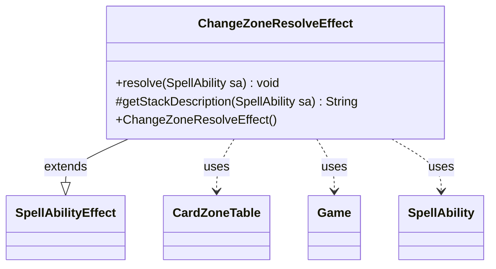

---
aliases:
  - ChangeZoneResolveEffect
tags:
  - java/class
  - module/forge-game
  - pkg/forge/game/ability/effects
fqn: forge.game.ability.effects.ChangeZoneResolveEffect
package: forge.game.ability.effects
module: forge-game
kind: Class
---

# ChangeZoneResolveEffect

**Package:** `forge.game.ability.effects` &nbsp; **Module:** `forge-game` &nbsp; **Kind:** Class



## Relationships
**Extends:**
- [[forge.game.ability.SpellAbilityEffect|SpellAbilityEffect]]
**Uses:**
- [[forge.game.Game|Game]]
- [[forge.game.card.CardZoneTable|CardZoneTable]]
- [[forge.game.spellability.SpellAbility|SpellAbility]]

## Design Description

ChangeZoneResolveEffect is a concrete `SpellAbilityEffect` that handles the deferred trigger-dispatch phase of a zone-change ability. It does not relocate cards itself; instead its `resolve` method retrieves the `CardZoneTable` that an earlier effect accumulated on the `SpellAbility`, and—when one is present—fires the batched zone-change triggers for all recorded movements through `triggerChangesZoneAll`, then clears the table.

The design intent is separation of concerns: card movement and trigger resolution are split into distinct stages so that every zone change produced by a single ability is processed together as one batch, ensuring correct triggering. The `Game` is reached indirectly through the host card, keeping the effect free of external state, and the empty `getStackDescription` marks it as an internal mechanical step with no player-facing stack text.

## Source
`forge-game/src/main/java/forge/game/ability/effects/ChangeZoneResolveEffect.java`

```java
package forge.game.ability.effects;

import forge.game.Game;
import forge.game.ability.SpellAbilityEffect;
import forge.game.card.CardZoneTable;
import forge.game.spellability.SpellAbility;

public class ChangeZoneResolveEffect extends SpellAbilityEffect {

    public ChangeZoneResolveEffect() {
        // TODO Auto-generated constructor stub
    }

    @Override
    public void resolve(SpellAbility sa) {
        final Game game = sa.getHostCard().getGame();
        CardZoneTable table = sa.getChangeZoneTable();
        if (table != null) {
            table.triggerChangesZoneAll(game, sa);
            table.clear();
        }
    }

    /* (non-Javadoc)
     * @see forge.game.ability.SpellAbilityEffect#getStackDescription(forge.game.spellability.SpellAbility)
     */
    @Override
    protected String getStackDescription(SpellAbility sa) {
        return "";
    }
}
```
