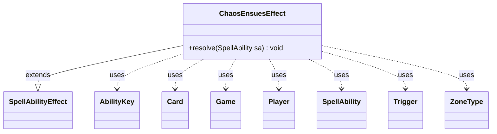

---
aliases:
  - ChaosEnsuesEffect
tags:
  - java/class
  - module/forge-game
  - pkg/forge/game/ability/effects
fqn: forge.game.ability.effects.ChaosEnsuesEffect
package: forge.game.ability.effects
module: forge-game
kind: Class
---

# ChaosEnsuesEffect

**Package:** `forge.game.ability.effects`   **Module:** `forge-game`   **Kind:** Class



## Relationships
**Extends:**
- [[forge.game.ability.SpellAbilityEffect|SpellAbilityEffect]]
**Uses:**
- [[forge.game.Game|Game]]
- [[forge.game.ability.AbilityKey|AbilityKey]]
- [[forge.game.card.Card|Card]]
- [[forge.game.player.Player|Player]]
- [[forge.game.spellability.SpellAbility|SpellAbility]]
- [[forge.game.trigger.Trigger|Trigger]]
- [[forge.game.zone.ZoneType|ZoneType]]

## Design Description

ChaosEnsuesEffect realizes the resolution of Magic's Planechase "chaos ensues" event, firing a plane card's chaos-triggered abilities rather than mutating the board itself. As a concrete subclass of `SpellAbilityEffect`, it overrides `resolve(SpellAbility)`, reading the host `Card`, activating `Player`, and `Game`, and silently no-ops outside Planechase by checking for active planes. It builds an `AbilityKey` parameter map and delegates to the game's trigger handler to run `TriggerType.ChaosEnsues`.

Notable design intent appears in the optional `Defined` handling: for each targeted `Card` whose chaos `Trigger` matches, it snapshots and temporarily widens the trigger's active `ZoneType` set so abilities fire even from revealed planar-deck cards (rule 311.7), registers them, then restores the original zones afterward. This save-and-restore pattern confines the side effect to one resolution, and an empty affected set short-circuits before triggering.

## Source
`forge-game/src/main/java/forge/game/ability/effects/ChaosEnsuesEffect.java`

```java
package forge.game.ability.effects;

import com.google.common.collect.Lists;

import forge.game.Game;
import forge.game.ability.AbilityKey;
import forge.game.ability.AbilityUtils;
import forge.game.ability.SpellAbilityEffect;
import forge.game.card.Card;
import forge.game.player.Player;
import forge.game.spellability.SpellAbility;
import forge.game.trigger.Trigger;
import forge.game.trigger.TriggerType;
import forge.game.zone.ZoneType;

import java.util.*;

public class ChaosEnsuesEffect extends SpellAbilityEffect {
    /** 311.7. Each plane card has a triggered ability that triggers “Whenever chaos ensues.” These are called
    chaos abilities. Each one is indicated by a chaos symbol to the left of the ability, though the symbol
    itself has no special rules meaning. This ability triggers if the chaos symbol is rolled on the planar
    die (see rule 901.9b), if a resolving spell or ability says that chaos ensues, or if a resolving spell or
    ability states that chaos ensues for a particular object. In the last case, the chaos ability can trigger
    even if that plane card is still in the planar deck but revealed. A chaos ability is controlled by the
    current planar controller. **/

    @Override
    public void resolve(SpellAbility sa) {
        final Card host = sa.getHostCard();
        final Player activator = sa.getActivatingPlayer();
        final Game game = activator.getGame();

        if (game.getActivePlanes() == null) { // not a planechase game, nothing happens
            return;
        }

        Map<AbilityKey, Object> runParams = AbilityKey.mapFromPlayer(activator);
        Map<Integer, EnumSet<ZoneType>> tweakedTrigs = new HashMap<>();

        List<Card> affected = Lists.newArrayList();
        if (sa.hasParam("Defined")) {
            for (final Card c : AbilityUtils.getDefinedCards(host, sa.getParam("Defined"), sa)) {
                for (Trigger t : c.getTriggers()) {
                    if (t.getMode() == TriggerType.ChaosEnsues) { // also allow current zone for any Defined
                        Set<ZoneType> zones = t.getActiveZone();
                        tweakedTrigs.put(t.getId(), EnumSet.copyOf(zones));
                        zones.add(c.getZone().getZoneType());
                        affected.add(c);
                        game.getTriggerHandler().registerOneTrigger(t);
                    }
                }
            }
            runParams.put(AbilityKey.Affected, affected);
            if (affected.isEmpty()) { // if no Defined has chaos ability, don't trigger non Defined
                return;
            }
        }

        game.getTriggerHandler().runTrigger(TriggerType.ChaosEnsues, runParams, false);

        for (Map.Entry<Integer, EnumSet<ZoneType>> e : tweakedTrigs.entrySet()) {
            for (Card c : affected) {
                for (Trigger t : c.getTriggers()) {
                    if (t.getId() == e.getKey()) {
                        EnumSet<ZoneType> zones = e.getValue();
                        t.setActiveZone(zones);
                    }
                }
            }
        }
    }
}
```

## Python
`forge/game/ability/effects/ChaosEnsuesEffect.py`

```python
from forge.game.Game import Game
from forge.game.ability.AbilityKey import AbilityKey
from forge.game.ability.AbilityUtils import AbilityUtils
from forge.game.ability.SpellAbilityEffect import SpellAbilityEffect
from forge.game.card.Card import Card
from forge.game.player.Player import Player
from forge.game.spellability.SpellAbility import SpellAbility
from forge.game.trigger.Trigger import Trigger
from forge.game.trigger.TriggerType import TriggerType
from forge.game.zone.ZoneType import ZoneType


class ChaosEnsuesEffect(SpellAbilityEffect):
    """ 311.7. Each plane card has a triggered ability that triggers "Whenever chaos ensues." These are called
    chaos abilities. Each one is indicated by a chaos symbol to the left of the ability, though the symbol
    itself has no special rules meaning. This ability triggers if the chaos symbol is rolled on the planar
    die (see rule 901.9b), if a resolving spell or ability says that chaos ensues, or if a resolving spell or
    ability states that chaos ensues for a particular object. In the last case, the chaos ability can trigger
    even if that plane card is still in the planar deck but revealed. A chaos ability is controlled by the
    current planar controller. """

    def resolve(self, sa: SpellAbility) -> None:
        host = sa.getHostCard()
        activator = sa.getActivatingPlayer()
        game = activator.getGame()

        if game.getActivePlanes() is None:  # not a planechase game, nothing happens
            return

        runParams = AbilityKey.mapFromPlayer(activator)
        tweakedTrigs = {}

        affected = []
        if sa.hasParam("Defined"):
            for c in AbilityUtils.getDefinedCards(host, sa.getParam("Defined"), sa):
                for t in c.getTriggers():
                    if t.getMode() == TriggerType.ChaosEnsues:  # also allow current zone for any Defined
                        zones = t.getActiveZone()
                        tweakedTrigs[t.getId()] = set(zones)
                        zones.add(c.getZone().getZoneType())
                        affected.append(c)
                        game.getTriggerHandler().registerOneTrigger(t)
            runParams[AbilityKey.Affected] = affected
            if not affected:  # if no Defined has chaos ability, don't trigger non Defined
                return

        game.getTriggerHandler().runTrigger(TriggerType.ChaosEnsues, runParams, False)

        for key, value in tweakedTrigs.items():
            for c in affected:
                for t in c.getTriggers():
                    if t.getId() == key:
                        zones = value
                        t.setActiveZone(zones)
```
