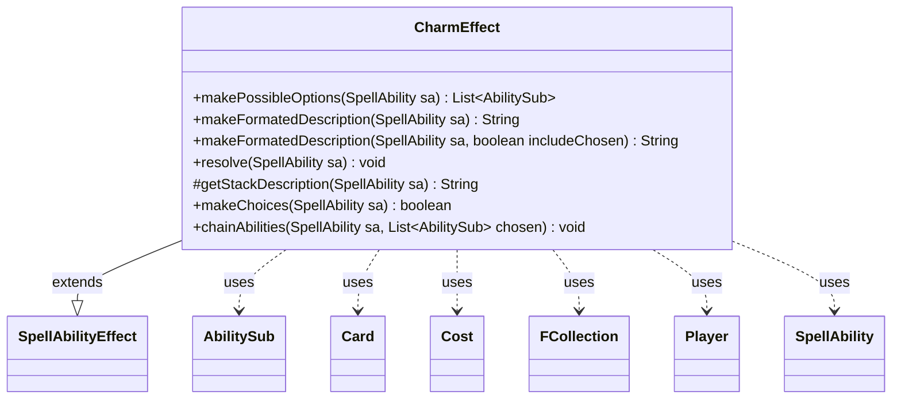

---
aliases:
  - CharmEffect
tags:
  - java/class
  - module/forge-game
  - pkg/forge/game/ability/effects
fqn: forge.game.ability.effects.CharmEffect
package: forge.game.ability.effects
module: forge-game
kind: Class
---

# CharmEffect

**Package:** `forge.game.ability.effects` &nbsp; **Module:** `forge-game` &nbsp; **Kind:** Class



## Relationships
**Extends:**
- [[forge.game.ability.SpellAbilityEffect|SpellAbilityEffect]]
**Uses:**
- [[forge.game.card.Card|Card]]
- [[forge.game.cost.Cost|Cost]]
- [[forge.game.player.Player|Player]]
- [[forge.game.spellability.AbilitySub|AbilitySub]]
- [[forge.game.spellability.SpellAbility|SpellAbility]]
- [[forge.util.collect.FCollection|FCollection]]

## Design Description

CharmEffect implements the resolution behavior for modal "charm" spells and abilities, where a player selects among several listed modes. Extending SpellAbilityEffect, it deliberately leaves `resolve` and `getStackDescription` empty: rather than executing effects directly, it transforms chosen modes into cloned AbilitySub objects chained onto the host SpellAbility (`chainAbilities`), letting the normal resolution stack carry them out in CharmOrder sequence. Its static helpers compute the legal mode set (`makePossibleOptions`, enforcing CR 603.3c legality and choice restrictions), drive selection (`makeChoices`, handling Entwine, Random, optional, opponent-choosers, and min/max counts), and build localized rules text (`makeFormatedDescription`, covering Spree, Tiered, Pawprint, and X variants).

The class is a largely stateless utility collaborating with Card, Player, Cost, SpellAbility/AbilitySub, and FCollection. A notable design choice is defensive copying of each chosen sub-ability, so a mode selected repeatedly resolves independently.

## Source
`forge-game/src/main/java/forge/game/ability/effects/CharmEffect.java`

```java
package forge.game.ability.effects;

import java.util.Comparator;
import java.util.List;

import org.apache.commons.lang3.StringUtils;

import com.google.common.collect.Lists;

import forge.game.ability.AbilityUtils;
import forge.game.ability.SpellAbilityEffect;
import forge.game.card.Card;
import forge.game.cost.Cost;
import forge.game.keyword.Keyword;
import forge.game.player.Player;
import forge.game.spellability.AbilitySub;
import forge.game.spellability.SpellAbility;
import forge.util.Aggregates;
import forge.util.Lang;
import forge.util.Localizer;
import forge.util.collect.FCollection;

public class CharmEffect extends SpellAbilityEffect {

    public static List<AbilitySub> makePossibleOptions(final SpellAbility sa) {
        final Card source = sa.getHostCard();
        List<String> restriction = null;

        if (sa.hasParam("ChoiceRestriction")) {
            restriction = source.getChosenModes(sa, sa.getParam("ChoiceRestriction"));
        }

        List<AbilitySub> choices = Lists.newArrayList(sa.getAdditionalAbilityList("Choices"));

        if (source.getZone() != null) {
            List<AbilitySub> toRemove = Lists.newArrayList();
            for (AbilitySub ch : choices) {
                // 603.3c If one of the modes would be illegal, that mode can't be chosen.
                if ((ch.usesTargeting() && ch.getMinTargets() > 0 &&
                        ch.getTargetRestrictions().getNumCandidates(ch, true) == 0) ||
                        (restriction != null && restriction.contains(ch.getDescription()))) {
                    toRemove.add(ch);
                }
            }
            choices.removeAll(toRemove);
        }

        int indx = 1;
        // set CharmOrder
        for (AbilitySub sub : choices) {
            sub.setSVar("CharmOrder", Integer.toString(indx));
            indx++;
        }
        return choices;
    }

    public static String makeFormatedDescription(SpellAbility sa) {
        return makeFormatedDescription(sa, true);
    }
    public static String makeFormatedDescription(SpellAbility sa, boolean includeChosen) {
        Card source = sa.getHostCard();

        List<AbilitySub> list = CharmEffect.makePossibleOptions(sa);
        String numParam = sa.getParamOrDefault("CharmNum", "1");
        boolean isX = numParam.equals("X");
        boolean repeat = sa.hasParam("CanRepeatModes");
        int num = 0;
        boolean additionalDesc = sa.hasParam("AdditionalDescription");
        boolean optional = sa.hasParam("Optional");
        // hotfix for complex cards when using getCardForUi
        if (source.getController() == null && !StringUtils.isNumeric(numParam) && additionalDesc && !optional) {
            // using getCardForUi game is not set, so can't guess max charm
            num = Integer.MAX_VALUE;
        } else {
            // fallback needed while ability building
            if (sa.getActivatingPlayer() == null) {
                sa.setActivatingPlayer(source.getController());
            }
            if (!isX) {
                num = AbilityUtils.calculateAmount(source, numParam, sa);
                if (!repeat) {
                    num = Math.min(num, list.size());
                }
            }
        }
        final int min = sa.hasParam("MinCharmNum") ? AbilityUtils.calculateAmount(source, sa.getParam("MinCharmNum"), sa) : num;

        boolean random = sa.hasParam("Random");
        boolean limit = sa.hasParam("ActivationLimit");
        boolean gameLimit = sa.hasParam("GameActivationLimit");
        boolean oppChooses = "Opponent".equals(sa.getParam("Chooser"));
        boolean spree = source.hasKeyword(Keyword.SPREE);
        boolean tiered = source.hasKeyword(Keyword.TIERED);

        StringBuilder sb = new StringBuilder();
        sb.append(sa.getCostDescription());

        if (!spree && !tiered) {
            sb.append(oppChooses ? "An opponent chooses " : "Choose ");
            if (isX) {
                sb.append(sa.hasParam("MinCharmNum") && min == 0 ? "up to " : "").append("X");
            } else if (num == min || num == Integer.MAX_VALUE) {
                sb.append(num == 0 ? "up to that many" : Lang.getNumeral(min));
            } else if (min == 0 && num == sa.getParam("Choices").split(",").length) {
                sb.append("any number ");
            } else if (min == 0) {
                sb.append("up to ").append(Lang.getNumeral(num));
            } else {
                sb.append(Lang.getNumeral(min)).append(" or ").append(list.size() == 2 ? "both" : "more");
            }
        }

        if (sa.hasParam("Pawprint")) {
            sb.append("{P} worth of modes");
        }

        if (sa.hasParam("ChoiceRestriction")) {
            String rest = sa.getParam("ChoiceRestriction");
            if (rest.equals("ThisGame")) {
                sb.append(" that hasn't been chosen");
            } else if (rest.equals("ThisTurn")) {
                sb.append(" that hasn't been chosen this turn");
            } else if (rest.equals("YourLastCombat")) {
                sb.append(" that wasn't chosen during your last combat");
            }
        }

        if (random) {
            sb.append(" at random.");
        }
        if (repeat) {
            sb.append(". You may choose the same mode more than once.");
        }
        if (limit) {
            int limitNum = AbilityUtils.calculateAmount(source, sa.getParam("ActivationLimit"), sa);
            if (limitNum == 1) {
                sb.append(". Activate only once each turn.");
            } else {
                sb.append(". Additional code needed in CharmEffect.");
            }
        }
        if (gameLimit) {
            int limitNum = AbilityUtils.calculateAmount(source, sa.getParam("GameActivationLimit"), sa);
            if (limitNum == 1) {
                sb.append(". Activate only once.");
            } else {
                sb.append(". Additional code needed in CharmEffect.");
            }
        }

        if (additionalDesc) {
            String addDescS = sa.getParam("AdditionalDescription");
            if (optional) {
                sb.append(". ").append(addDescS.trim());
            } else if (addDescS.startsWith(("."))) {
                sb.append(addDescS.trim());
            } else if (addDescS.startsWith("where X")) {
                sb.append(", ").append(addDescS.trim()).append(" \u2014");
            } else {
                sb.append(" ").append(addDescS.trim());
            }
        }

        if (!includeChosen) {
            sb.append(num == 1 ? " mode." : " modes.");
        } else if (!list.isEmpty()) {
            if (!spree && !tiered) {
                if (!repeat && !additionalDesc && !limit && !gameLimit) {
                    sb.append(" \u2014");
                }
                sb.append("\r\n");
            }
            for (AbilitySub sub : list) {
                if (spree) {
                    sb.append("+ " + new Cost(sub.getParam("ModeCost"), false).toSimpleString() + " \u2014 ");
                } else if (tiered) {
                    sb.append("\u2022 ").append(sub.getParam("PrecostDesc")).append(" \u2014 ");
                    sb.append(new Cost(sub.getParam("ModeCost"), false).toSimpleString() + " \u2014 ");
                } else if (sub.hasParam("Pawprint")) {
                    sb.append(StringUtils.repeat("{P}", Integer.parseInt(sub.getParam("Pawprint"))) + " \u2014 ");
                } else {
                    sb.append("\u2022 ");
                }
                sb.append(sub.getParam("SpellDescription"));
                sb.append("\r\n");
            }
            sb.append("\r\n");
        }
        return sb.toString();
    }

    @Override
    public void resolve(SpellAbility sa) {
        // all chosen modes have been chained as subabilities to this sa.
        // so nothing to do in this resolve
    }

    @Override
    protected String getStackDescription(SpellAbility sa) {
        // StackDescription based on Chosen SubAbilities allowed in chainAbilities
        return "";
    }

    public static boolean makeChoices(SpellAbility sa) {
        // CR 700.2g
        if (sa.isCopied()) {
            return true;
        }

        // reset all previous choices
        sa.setSubAbility(null);

        List<AbilitySub> choices = makePossibleOptions(sa);

        // Entwine does use all Choices
        if (sa.isEntwine()) {
            chainAbilities(sa, choices);
            return true;
        }

        final Card source = sa.getHostCard();
        final Player activator = sa.getActivatingPlayer();

        boolean canRepeat = sa.hasParam("CanRepeatModes");
        int num = AbilityUtils.calculateAmount(source, sa.getParamOrDefault("CharmNum", "1"), sa);
        final int min = sa.hasParam("MinCharmNum") ? AbilityUtils.calculateAmount(source, sa.getParam("MinCharmNum"), sa) : num;

        if (!canRepeat) {
            // not enough choices
            if (min > choices.size()) {
                return false;
            }
            num = Math.min(num, choices.size());
        }

        boolean isOptional = sa.hasParam("Optional");
        if (isOptional && !activator.getController().confirmAction(sa, null, Localizer.getInstance().getMessage("lblWouldYouLikeCharm", source.getTranslatedName()), null)) {
            return false;
        }

        if (sa.hasParam("Random")) {
            chainAbilities(sa, Aggregates.random(choices, num));
            return true;
        }

        Player chooser = sa.getActivatingPlayer();

        if (sa.hasParam("Chooser")) {
            // Three modal cards require you to choose a player to make the modal choice'
            // Two of these also reference the chosen player during the spell effect

            //String choosers = sa.getParam("Chooser");
            FCollection<Player> opponents = activator.getOpponents(); // all cards have Choser$ Opponent, so it's hardcoded here
            chooser = activator.getController().chooseSingleEntityForEffect(opponents, sa, "Choose an opponent", null);
            sa.setChoosingPlayer(chooser);
        }

        List<AbilitySub> chosen = chooser.getController().chooseModeForAbility(sa, choices, min, num, canRepeat);
        chainAbilities(sa, chosen);

        // trigger without chosen modes are removed from stack
        if (sa.isTrigger()) {
            return chosen != null && !chosen.isEmpty();
        }

        // for spells and activated abilities it is possible to chose zero if minCharmNum allows it
        return true;
    }

    public static void chainAbilities(SpellAbility sa, List<AbilitySub> chosen) {
        if (chosen == null) {
            return;
        }

        // Sort Chosen by SA order
        chosen.sort(Comparator.comparingInt(o -> o.getSVarInt("CharmOrder")));

        int indx = 1;
        for (AbilitySub sub : chosen) {
            // Clone the chosen, just in case the same subAb gets chosen multiple times
            AbilitySub clone = (AbilitySub)sub.copy(sa.getActivatingPlayer());

            clone.setSVar("CharmOrder", Integer.toString(indx));
            indx++;

            // make StackDescription be the SpellDescription if it doesn't already have one
            if (!clone.hasParam("StackDescription")) {
                clone.putParam("StackDescription", "SpellDescription");
            }

            // add Clone to Tail of sa
            sa.appendSubAbility(clone);
        }
    }

}
```

## Python
`forge/game/ability/effects/CharmEffect.py`

```python
from forge.game.ability.AbilityUtils import AbilityUtils
from forge.game.ability.SpellAbilityEffect import SpellAbilityEffect
from forge.game.card.Card import Card
from forge.game.cost.Cost import Cost
from forge.game.keyword.Keyword import Keyword
from forge.game.player.Player import Player
from forge.game.spellability.AbilitySub import AbilitySub
from forge.game.spellability.SpellAbility import SpellAbility
from forge.util.Aggregates import Aggregates
from forge.util.Lang import Lang
from forge.util.Localizer import Localizer
from forge.util.collect.FCollection import FCollection


class CharmEffect(SpellAbilityEffect):

    @staticmethod
    def makePossibleOptions(sa):
        source = sa.getHostCard()
        restriction = None

        if sa.hasParam("ChoiceRestriction"):
            restriction = source.getChosenModes(sa, sa.getParam("ChoiceRestriction"))

        choices = list(sa.getAdditionalAbilityList("Choices"))

        if source.getZone() is not None:
            toRemove = []
            for ch in choices:
                # 603.3c If one of the modes would be illegal, that mode can't be chosen.
                if ((ch.usesTargeting() and ch.getMinTargets() > 0 and
                        ch.getTargetRestrictions().getNumCandidates(ch, True) == 0) or
                        (restriction is not None and ch.getDescription() in restriction)):
                    toRemove.append(ch)
            for ch in toRemove:
                choices.remove(ch)

        indx = 1
        # set CharmOrder
        for sub in choices:
            sub.setSVar("CharmOrder", str(indx))
            indx += 1
        return choices

    @staticmethod
    def makeFormatedDescription(sa, includeChosen=True):
        source = sa.getHostCard()

        list_ = CharmEffect.makePossibleOptions(sa)
        numParam = sa.getParamOrDefault("CharmNum", "1")
        isX = numParam == "X"
        repeat = sa.hasParam("CanRepeatModes")
        num = 0
        additionalDesc = sa.hasParam("AdditionalDescription")
        optional = sa.hasParam("Optional")
        # hotfix for complex cards when using getCardForUi
        if source.getController() is None and not numParam.isnumeric() and additionalDesc and not optional:
            # using getCardForUi game is not set, so can't guess max charm
            num = 2147483647
        else:
            # fallback needed while ability building
            if sa.getActivatingPlayer() is None:
                sa.setActivatingPlayer(source.getController())
            if not isX:
                num = AbilityUtils.calculateAmount(source, numParam, sa)
                if not repeat:
                    num = min(num, len(list_))
        min_ = AbilityUtils.calculateAmount(source, sa.getParam("MinCharmNum"), sa) if sa.hasParam("MinCharmNum") else num

        random = sa.hasParam("Random")
        limit = sa.hasParam("ActivationLimit")
        gameLimit = sa.hasParam("GameActivationLimit")
        oppChooses = "Opponent" == sa.getParam("Chooser")
        spree = source.hasKeyword(Keyword.SPREE)
        tiered = source.hasKeyword(Keyword.TIERED)

        sb = []
        sb.append(sa.getCostDescription())

        if not spree and not tiered:
            sb.append("An opponent chooses " if oppChooses else "Choose ")
            if isX:
                sb.append("up to " if sa.hasParam("MinCharmNum") and min_ == 0 else "")
                sb.append("X")
            elif num == min_ or num == 2147483647:
                sb.append("up to that many" if num == 0 else Lang.getNumeral(min_))
            elif min_ == 0 and num == len(sa.getParam("Choices").split(",")):
                sb.append("any number ")
            elif min_ == 0:
                sb.append("up to ")
                sb.append(Lang.getNumeral(num))
            else:
                sb.append(Lang.getNumeral(min_))
                sb.append(" or ")
                sb.append("both" if len(list_) == 2 else "more")

        if sa.hasParam("Pawprint"):
            sb.append("{P} worth of modes")

        if sa.hasParam("ChoiceRestriction"):
            rest = sa.getParam("ChoiceRestriction")
            if rest == "ThisGame":
                sb.append(" that hasn't been chosen")
            elif rest == "ThisTurn":
                sb.append(" that hasn't been chosen this turn")
            elif rest == "YourLastCombat":
                sb.append(" that wasn't chosen during your last combat")

        if random:
            sb.append(" at random.")
        if repeat:
            sb.append(". You may choose the same mode more than once.")
        if limit:
            limitNum = AbilityUtils.calculateAmount(source, sa.getParam("ActivationLimit"), sa)
            if limitNum == 1:
                sb.append(". Activate only once each turn.")
            else:
                sb.append(". Additional code needed in CharmEffect.")
        if gameLimit:
            limitNum = AbilityUtils.calculateAmount(source, sa.getParam("GameActivationLimit"), sa)
            if limitNum == 1:
                sb.append(". Activate only once.")
            else:
                sb.append(". Additional code needed in CharmEffect.")

        if additionalDesc:
            addDescS = sa.getParam("AdditionalDescription")
            if optional:
                sb.append(". ")
                sb.append(addDescS.strip())
            elif addDescS.startswith("."):
                sb.append(addDescS.strip())
            elif addDescS.startswith("where X"):
                sb.append(", ")
                sb.append(addDescS.strip())
                sb.append(" \u2014")
            else:
                sb.append(" ")
                sb.append(addDescS.strip())

        if not includeChosen:
            sb.append(" mode." if num == 1 else " modes.")
        elif len(list_) != 0:
            if not spree and not tiered:
                if not repeat and not additionalDesc and not limit and not gameLimit:
                    sb.append(" \u2014")
                sb.append("\r\n")
            for sub in list_:
                if spree:
                    sb.append("+ " + Cost(sub.getParam("ModeCost"), False).toSimpleString() + " \u2014 ")
                elif tiered:
                    sb.append("\u2022 ")
                    sb.append(sub.getParam("PrecostDesc"))
                    sb.append(" \u2014 ")
                    sb.append(Cost(sub.getParam("ModeCost"), False).toSimpleString() + " \u2014 ")
                elif sub.hasParam("Pawprint"):
                    sb.append("{P}" * int(sub.getParam("Pawprint")) + " \u2014 ")
                else:
                    sb.append("\u2022 ")
                sb.append(sub.getParam("SpellDescription"))
                sb.append("\r\n")
            sb.append("\r\n")
        return "".join(sb)

    def resolve(self, sa):
        # all chosen modes have been chained as subabilities to this sa.
        # so nothing to do in this resolve
        pass

    def getStackDescription(self, sa):
        # StackDescription based on Chosen SubAbilities allowed in chainAbilities
        return ""

    @staticmethod
    def makeChoices(sa):
        # CR 700.2g
        if sa.isCopied():
            return True

        # reset all previous choices
        sa.setSubAbility(None)

        choices = CharmEffect.makePossibleOptions(sa)

        # Entwine does use all Choices
        if sa.isEntwine():
            CharmEffect.chainAbilities(sa, choices)
            return True

        source = sa.getHostCard()
        activator = sa.getActivatingPlayer()

        canRepeat = sa.hasParam("CanRepeatModes")
        num = AbilityUtils.calculateAmount(source, sa.getParamOrDefault("CharmNum", "1"), sa)
        min_ = AbilityUtils.calculateAmount(source, sa.getParam("MinCharmNum"), sa) if sa.hasParam("MinCharmNum") else num

        if not canRepeat:
            # not enough choices
            if min_ > len(choices):
                return False
            num = min(num, len(choices))

        isOptional = sa.hasParam("Optional")
        if isOptional and not activator.getController().confirmAction(sa, None, Localizer.getInstance().getMessage("lblWouldYouLikeCharm", source.getTranslatedName()), None):
            return False

        if sa.hasParam("Random"):
            CharmEffect.chainAbilities(sa, Aggregates.random(choices, num))
            return True

        chooser = sa.getActivatingPlayer()

        if sa.hasParam("Chooser"):
            # Three modal cards require you to choose a player to make the modal choice'
            # Two of these also reference the chosen player during the spell effect

            # String choosers = sa.getParam("Chooser");
            opponents = activator.getOpponents()  # all cards have Choser$ Opponent, so it's hardcoded here
            chooser = activator.getController().chooseSingleEntityForEffect(opponents, sa, "Choose an opponent", None)
            sa.setChoosingPlayer(chooser)

        chosen = chooser.getController().chooseModeForAbility(sa, choices, min_, num, canRepeat)
        CharmEffect.chainAbilities(sa, chosen)

        # trigger without chosen modes are removed from stack
        if sa.isTrigger():
            return chosen is not None and len(chosen) != 0

        # for spells and activated abilities it is possible to chose zero if minCharmNum allows it
        return True

    @staticmethod
    def chainAbilities(sa, chosen):
        if chosen is None:
            return

        # Sort Chosen by SA order
        chosen.sort(key=lambda o: o.getSVarInt("CharmOrder"))

        indx = 1
        for sub in chosen:
            # Clone the chosen, just in case the same subAb gets chosen multiple times
            clone = sub.copy(sa.getActivatingPlayer())

            clone.setSVar("CharmOrder", str(indx))
            indx += 1

            # make StackDescription be the SpellDescription if it doesn't already have one
            if not clone.hasParam("StackDescription"):
                clone.putParam("StackDescription", "SpellDescription")

            # add Clone to Tail of sa
            sa.appendSubAbility(clone)
```
