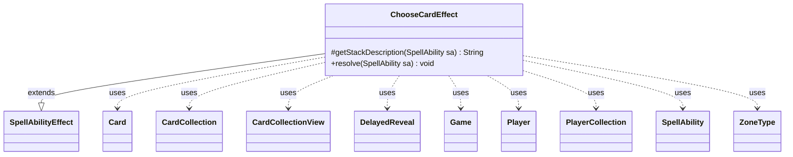

---
aliases:
  - ChooseCardEffect
tags:
  - java/class
  - module/forge-game
  - pkg/forge/game/ability/effects
fqn: forge.game.ability.effects.ChooseCardEffect
package: forge.game.ability.effects
module: forge-game
kind: Class
---

# ChooseCardEffect

**Package:** `forge.game.ability.effects`   **Module:** `forge-game`   **Kind:** Class



## Relationships
**Extends:**
- [[forge.game.ability.SpellAbilityEffect|SpellAbilityEffect]]
**Uses:**
- [[forge.game.Game|Game]]
- [[forge.game.card.Card|Card]]
- [[forge.game.card.CardCollection|CardCollection]]
- [[forge.game.card.CardCollectionView|CardCollectionView]]
- [[forge.game.player.DelayedReveal|DelayedReveal]]
- [[forge.game.player.Player|Player]]
- [[forge.game.player.PlayerCollection|PlayerCollection]]
- [[forge.game.spellability.SpellAbility|SpellAbility]]
- [[forge.game.zone.ZoneType|ZoneType]]

## Design Description

ChooseCardEffect is a resolution handler that implements the data-driven "choose a card" game action. It extends `SpellAbilityEffect`, overriding `getStackDescription` to build a localized, human-readable summary and `resolve` to execute the choice within Forge's ability framework. During resolution it derives a candidate `CardCollectionView` from configurable `ZoneType`s (defaulting to the battlefield), validity restrictions, and controller filters, then prompts each defined or targeted `Player`'s controller to pick.

The design favors extensive parameterization over bespoke Java: a branching chain of optional `SpellAbility` parameters selects among specialized modes—one of each basic type, party types, bounded total power, distinct powers, control/non-control splits, random selection, and a `DelayedReveal`-backed quasi-library search. Chosen cards are optionally revealed, recorded via `setChosenCards`, and may be remembered, imprinted, or stored in the host's chosen map, letting card scripts compose downstream effects declaratively.

## Source
`forge-game/src/main/java/forge/game/ability/effects/ChooseCardEffect.java`

```java
package forge.game.ability.effects;

import java.util.*;

import com.google.common.collect.Lists;
import forge.game.Direction;
import forge.game.player.DelayedReveal;
import forge.game.player.PlayerView;

import forge.card.CardType;
import forge.game.Game;
import forge.game.ability.AbilityUtils;
import forge.game.ability.SpellAbilityEffect;
import forge.game.card.Card;
import forge.game.card.CardCollection;
import forge.game.card.CardCollectionView;
import forge.game.card.CardLists;
import forge.game.card.CardPredicates;
import forge.game.player.Player;
import forge.game.player.PlayerActionConfirmMode;
import forge.game.player.PlayerCollection;
import forge.game.spellability.SpellAbility;
import forge.game.zone.ZoneType;
import forge.util.Aggregates;
import forge.util.Lang;
import forge.util.Localizer;

public class ChooseCardEffect extends SpellAbilityEffect {
    @Override
    protected String getStackDescription(SpellAbility sa) {
        final StringBuilder sb = new StringBuilder();
        final int numCards = sa.hasParam("Amount") ?
                AbilityUtils.calculateAmount(sa.getHostCard(), sa.getParam("Amount"), sa) : 1;

        sb.append(Lang.joinHomogenous(getTargetPlayers(sa))).append(" ");
        if (sa.hasParam("Mandatory")) {
            sb.append(getTargetPlayers(sa).size() == 1 ? "chooses " : "choose ");
        } else {
            sb.append("may choose ");
        }
        String desc = sa.getParamOrDefault("ChoiceDesc", "card");
        if (!desc.contains("card") && !desc.contains("control")) {
            desc = desc + " card";
        }
        sb.append(Lang.nounWithNumeralExceptOne(numCards, desc));
        if (sa.hasParam("FromDesc")) {
            sb.append(" from ").append(sa.getParam("FromDesc"));
        } else if (sa.hasParam("ChoiceZone") && sa.getParam("ChoiceZone").equals("Hand")) {
            sb.append(" in their hand");
        }
        sb.append(".");

        return sb.toString();
    }

    @Override
    public void resolve(SpellAbility sa) {
        final Card host = sa.getHostCard();
        final Player activator = sa.getActivatingPlayer();
        final Game game = activator.getGame();
        CardCollection allChosen = new CardCollection();

        final PlayerCollection tgtPlayers = getDefinedPlayersOrTargeted(sa);

        List<ZoneType> choiceZone = Lists.newArrayList(ZoneType.Battlefield);
        if (sa.hasParam("ChoiceZone")) {
            choiceZone = ZoneType.listValueOf(sa.getParam("ChoiceZone"));
        }
        CardCollectionView choices = sa.hasParam("AllCards") ? game.getCardsInGame() : game.getCardsIn(choiceZone);
        if (sa.hasParam("Choices")) {
            choices = CardLists.getValidCards(choices, sa.getParam("Choices"), activator, host, sa);
        }
        if (sa.hasParam("TargetControls")) {
            choices = CardLists.filterControlledBy(choices, tgtPlayers);
        }
        if (sa.hasParam("DefinedCards")) {
            choices = AbilityUtils.getDefinedCards(host, sa.getParam("DefinedCards"), sa);
        }
        if (sa.hasParam("IncludeSpellsOnStack")) {
            CardCollectionView stack = game.getCardsIn(ZoneType.Stack);
            CardCollection combined = new CardCollection();
            combined.addAll(stack);
            combined.addAll(choices);
            choices = combined;
        }

        final String amountValue = sa.getParamOrDefault("Amount", "1");
        int validAmount;
        if (amountValue.equals("Random")) {
            validAmount = Aggregates.randomInt(0, choices.size());
        } else {
            validAmount = AbilityUtils.calculateAmount(host, amountValue, sa);
        }
        final int minAmount = sa.hasParam("MinAmount") ? Integer.parseInt(sa.getParam("MinAmount")) : validAmount;

        if (validAmount <= 0) {
            return;
        }

        boolean revealTitle = sa.hasParam("RevealTitle");
        for (Player p : tgtPlayers) {
            CardCollectionView pChoices = choices;
            CardCollection chosen = new CardCollection();
            if (!p.isInGame()) {
                p = getNewChooser(sa, p);
            }
            if (sa.hasParam("ControlledByPlayer")) {
                final String param = sa.getParam("ControlledByPlayer");
                if (param.equals("Chooser")) {
                    pChoices = CardLists.filterControlledBy(pChoices, p);
                } else if (param.equals("Left") || param.equals("Right")) {
                    pChoices = CardLists.filterControlledBy(pChoices, game.getNextPlayerAfter(p,
                        Direction.valueOf(param)));
                } else {
                    pChoices = CardLists.filterControlledBy(pChoices, AbilityUtils.getDefinedPlayers(host, param, sa));
                }
            }
            boolean dontRevealToOwner = true;
            if (sa.hasParam("EachBasicType")) {
                // Choose one of each BasicLand given special place
                for (final String type : CardType.getBasicTypes()) {
                    final CardCollectionView cl = CardLists.getType(pChoices, type);
                    if (!cl.isEmpty()) {
                        final String prompt = Localizer.getInstance().getMessage("lblChoose") + " " + Lang.nounWithAmount(1, type);
                        Card c = p.getController().chooseSingleEntityForEffect(cl, sa, prompt, false, null);
                        if (c != null) {
                            chosen.add(c);
                        }
                    }
                }
            } else if (sa.hasParam("ChooseEach")) {
                final String s = sa.getParam("ChooseEach");
                final Collection<String> types = s.equals("Party") ? CardType.Constant.PARTY_TYPES : Arrays.asList(s.split(" & "));
                for (final String type : types) {
                    CardCollection valids = CardLists.filter(pChoices, CardPredicates.isType(type));
                    if (!valids.isEmpty()) {
                        final String prompt = Localizer.getInstance().getMessage("lblChoose") + " " +
                                Lang.nounWithNumeralExceptOne(1, type);
                        Card c = p.getController().chooseSingleEntityForEffect(valids, sa, prompt, 
                            !sa.hasParam("Mandatory"), null);
                        if (c != null) {
                            chosen.add(c);
                        }
                    }
                }
            } else if (sa.hasParam("WithTotalPower")) {
                final int totP = AbilityUtils.calculateAmount(host, sa.getParam("WithTotalPower"), sa);
                CardCollection negativeCreats = CardLists.filterLEPower(p.getCreaturesInPlay(), -1);
                int negativeNum = Aggregates.sum(negativeCreats, Card::getNetPower);
                CardCollection creature = CardLists.filterLEPower(p.getCreaturesInPlay(), totP - negativeNum);
                CardCollection chosenPool = new CardCollection();
                int chosenP = 0;
                while (!creature.isEmpty()) {
                    Card c = p.getController().chooseSingleEntityForEffect(creature, sa,
                            Localizer.getInstance().getMessage("lblSelectCreatureWithTotalPowerLessOrEqualTo", (totP - chosenP - negativeNum))
                                    + "\r\n(" + Localizer.getInstance().getMessage("lblSelected") + ":" + chosenPool + ")\r\n(" + Localizer.getInstance().getMessage("lblTotalPowerNum", chosenP) + ")", chosenP <= totP, null);
                    if (c == null) {
                        if (p.getController().confirmAction(sa, PlayerActionConfirmMode.OptionalChoose, Localizer.getInstance().getMessage("lblCancelChooseConfirm"), null)) {
                            break;
                        }
                    } else {
                        chosenP += c.getNetPower();
                        chosenPool.add(c);
                        negativeCreats.remove(c);
                        negativeNum = Aggregates.sum(negativeCreats, Card::getNetPower);
                        creature = CardLists.filterLEPower(p.getCreaturesInPlay(), totP - chosenP - negativeNum);
                        creature.removeAll(chosenPool);
                    }
                }
                chosen.addAll(chosenPool);
            } else if (sa.hasParam("WithDifferentPowers")) {
                String restrict = sa.getParam("Choices");
                CardCollection chosenPool = new CardCollection();
                String title = Localizer.getInstance().getMessage("lblChooseCreature");
                Card choice = null;
                while (!pChoices.isEmpty() && chosenPool.size() < validAmount) {
                    boolean optional = chosenPool.size() >= minAmount;
                    CardCollection creature = (CardCollection) pChoices;
                    if (!chosenPool.isEmpty()) {
                        title = Localizer.getInstance().getMessage("lblChooseCreatureWithDiffPower");
                    }
                    choice = p.getController().chooseSingleEntityForEffect(creature, sa, title, optional, null);
                    if (choice == null) {
                        break;
                    }
                    chosenPool.add(choice);
                    restrict = restrict + (restrict.contains(".") ? "+powerNE" : ".powerNE") + choice.getNetPower();
                    pChoices = CardLists.getValidCards(pChoices, restrict, activator, host, sa);
                }
                if (choice != null) {
                    chosenPool.add(choice);
                }
                chosen.addAll(chosenPool);
            } else if (sa.hasParam("EachDifferentPower")) {
                List<Integer> powers = new ArrayList<>();
                CardCollection chosenPool = new CardCollection();
                for (Card c : pChoices) {
                    int pow = c.getNetPower();
                    if (!powers.contains(pow)) {
                        powers.add(c.getNetPower());
                    }
                }
                Collections.sort(powers);
                String re = sa.getParam("Choices");
                re = re + (re.contains(".") ? "+powerEQ" : ".powerEQ");
                for (int i : powers) {
                    String restrict = re + i;
                    CardCollection valids = CardLists.getValidCards(pChoices, restrict, activator, host, sa);
                    Card choice = p.getController().chooseSingleEntityForEffect(valids, sa,
                            Localizer.getInstance().getMessage("lblChooseCreatureWithXPower", i), false, null);
                    chosenPool.add(choice);
                }
                chosen.addAll(chosenPool);
            } else if (sa.hasParam("ControlAndNot")) {
                String title = sa.hasParam("ChoiceTitle") ? sa.getParam("ChoiceTitle") : Localizer.getInstance().getMessage("lblChooseCreature");
                // Targeted player (p) chooses N creatures that belongs to them
                CardCollection tgtPlayerCtrl = CardLists.filterControlledBy(pChoices, p);
                chosen.addAll(p.getController().chooseCardsForEffect(tgtPlayerCtrl, sa, title + " " + "you control", minAmount, validAmount,
                        !sa.hasParam("Mandatory"), null));
                // Targeted player (p) chooses N creatures that don't belong to them
                CardCollection notTgtPlayerCtrl = new CardCollection(pChoices);
                notTgtPlayerCtrl.removeAll(tgtPlayerCtrl);
                chosen.addAll(p.getController().chooseCardsForEffect(notTgtPlayerCtrl, sa, title + " " + "you don't control", minAmount, validAmount,
                        !sa.hasParam("Mandatory"), null));
            } else if (sa.hasParam("AtRandom") && !pChoices.isEmpty()) {
                // don't pass FCollection for direct modification, the Set part would get messed up
                chosen = new CardCollection(Aggregates.random(pChoices, validAmount));
                dontRevealToOwner = false;
            } else {
                String title = sa.hasParam("ChoiceTitle") ? sa.getParam("ChoiceTitle") : Localizer.getInstance().getMessage("lblChooseaCard") + " ";
                if (sa.hasParam("ChoiceTitleAppend")) {
                    String tag = "";
                    String value = sa.getParam("ChoiceTitleAppend");
                    if (value.startsWith("Defined ")) {
                        tag = AbilityUtils.getDefinedPlayers(host, value.substring(8), sa).toString();
                    } else if (value.equals("ChosenType")) {
                        tag = host.getChosenType();
                    }
                    if (!tag.isEmpty()) {
                        title = title + " (" + tag +")";
                    }
                }
                if (sa.hasParam("QuasiLibrarySearch")) {
                    Long controlTimestamp = null;
                    if (activator.equals(p)) {
                        Map.Entry<Long, Player> searchControlPlayer = p.getControlledWhileSearching();
                        if (searchControlPlayer != null) {
                            controlTimestamp = searchControlPlayer.getKey();
                            p.addController(controlTimestamp, searchControlPlayer.getValue());
                        }
                    }

                    final Player searched = AbilityUtils.getDefinedPlayers(host, sa.getParam("QuasiLibrarySearch"), sa).get(0);
                    final int fetchNum = Math.min(searched.getCardsIn(ZoneType.Library).size(), 4);
                    CardCollectionView shown = !p.hasKeyword("LimitSearchLibrary")
                            ? searched.getCardsIn(ZoneType.Library) : searched.getCardsIn(ZoneType.Library, fetchNum);
                    DelayedReveal delayedReveal = new DelayedReveal(shown, ZoneType.Library, PlayerView.get(searched),
                            host.getTranslatedName() + " - " +
                                    Localizer.getInstance().getMessage("lblLookingCardIn") + " ");
                    Card choice = p.getController().chooseSingleEntityForEffect(pChoices, delayedReveal, sa, title,
                            !sa.hasParam("Mandatory"), p, null);
                    if (choice == null) {
                        return;
                    }
                    chosen.add(choice);

                    if (controlTimestamp != null) {
                        p.removeController(controlTimestamp);
                    }
                } else {
                    chosen.addAll(p.getController().chooseCardsForEffect(pChoices, sa, title, minAmount, validAmount,
                            !sa.hasParam("Mandatory"), null));
                }
            }
            if (sa.hasParam("Reveal") && !sa.hasParam("Secretly")) {
                game.getAction().reveal(chosen, p, dontRevealToOwner, revealTitle ? sa.getParam("RevealTitle") : 
                    Localizer.getInstance().getMessage("lblChosenCards") + " ", !revealTitle);
            }
            if (sa.hasParam("ChosenMap")) {
                host.addToChosenMap(p, chosen);
            }
            allChosen.addAll(chosen);
        }
        if (sa.hasParam("Reveal") && sa.hasParam("Secretly")) {
            game.getAction().revealTo(allChosen, game.getPlayers(), revealTitle ?
                    sa.getParam("RevealTitle") : Localizer.getInstance().getMessage("lblChosenCards") + " ", 
                    !revealTitle);
        }
        host.setChosenCards(allChosen);
        if (sa.hasParam("ForgetOtherRemembered")) {
            host.clearRemembered();
        }
        if (sa.hasParam("RememberChosen")) {
            host.addRemembered(allChosen);
        }
        if (sa.hasParam("ForgetChosen")) {
            host.removeRemembered(allChosen);
        }
        if (sa.hasParam("ImprintChosen")) {
            host.addImprintedCards(allChosen);
        }
    }
}
```

## Python
`forge/game/ability/effects/ChooseCardEffect.py`

```python
from forge.game.Direction import Direction
from forge.game.player.DelayedReveal import DelayedReveal
from forge.game.player.PlayerView import PlayerView
from forge.card.CardType import CardType
from forge.game.Game import Game
from forge.game.ability.AbilityUtils import AbilityUtils
from forge.game.ability.SpellAbilityEffect import SpellAbilityEffect
from forge.game.card.Card import Card
from forge.game.card.CardCollection import CardCollection
from forge.game.card.CardCollectionView import CardCollectionView
from forge.game.card.CardLists import CardLists
from forge.game.card.CardPredicates import CardPredicates
from forge.game.player.Player import Player
from forge.game.player.PlayerActionConfirmMode import PlayerActionConfirmMode
from forge.game.player.PlayerCollection import PlayerCollection
from forge.game.spellability.SpellAbility import SpellAbility
from forge.game.zone.ZoneType import ZoneType
from forge.util.Aggregates import Aggregates
from forge.util.Lang import Lang
from forge.util.Localizer import Localizer


class ChooseCardEffect(SpellAbilityEffect):
    def getStackDescription(self, sa: SpellAbility) -> str:
        sb = []
        numCards = AbilityUtils.calculateAmount(sa.getHostCard(), sa.getParam("Amount"), sa) \
            if sa.hasParam("Amount") else 1

        sb.append(Lang.joinHomogenous(self.getTargetPlayers(sa)))
        sb.append(" ")
        if sa.hasParam("Mandatory"):
            sb.append("chooses " if len(self.getTargetPlayers(sa)) == 1 else "choose ")
        else:
            sb.append("may choose ")
        desc = sa.getParamOrDefault("ChoiceDesc", "card")
        if "card" not in desc and "control" not in desc:
            desc = desc + " card"
        sb.append(Lang.nounWithNumeralExceptOne(numCards, desc))
        if sa.hasParam("FromDesc"):
            sb.append(" from ")
            sb.append(sa.getParam("FromDesc"))
        elif sa.hasParam("ChoiceZone") and sa.getParam("ChoiceZone") == "Hand":
            sb.append(" in their hand")
        sb.append(".")

        return "".join(sb)

    def resolve(self, sa: SpellAbility) -> None:
        host = sa.getHostCard()
        activator = sa.getActivatingPlayer()
        game = activator.getGame()
        allChosen = CardCollection()

        tgtPlayers = self.getDefinedPlayersOrTargeted(sa)

        choiceZone = [ZoneType.Battlefield]
        if sa.hasParam("ChoiceZone"):
            choiceZone = ZoneType.listValueOf(sa.getParam("ChoiceZone"))
        choices = game.getCardsInGame() if sa.hasParam("AllCards") else game.getCardsIn(choiceZone)
        if sa.hasParam("Choices"):
            choices = CardLists.getValidCards(choices, sa.getParam("Choices"), activator, host, sa)
        if sa.hasParam("TargetControls"):
            choices = CardLists.filterControlledBy(choices, tgtPlayers)
        if sa.hasParam("DefinedCards"):
            choices = AbilityUtils.getDefinedCards(host, sa.getParam("DefinedCards"), sa)
        if sa.hasParam("IncludeSpellsOnStack"):
            stack = game.getCardsIn(ZoneType.Stack)
            combined = CardCollection()
            combined.addAll(stack)
            combined.addAll(choices)
            choices = combined

        amountValue = sa.getParamOrDefault("Amount", "1")
        if amountValue == "Random":
            validAmount = Aggregates.randomInt(0, choices.size())
        else:
            validAmount = AbilityUtils.calculateAmount(host, amountValue, sa)
        minAmount = int(sa.getParam("MinAmount")) if sa.hasParam("MinAmount") else validAmount

        if validAmount <= 0:
            return

        revealTitle = sa.hasParam("RevealTitle")
        for p in tgtPlayers:
            pChoices = choices
            chosen = CardCollection()
            if not p.isInGame():
                p = self.getNewChooser(sa, p)
            if sa.hasParam("ControlledByPlayer"):
                param = sa.getParam("ControlledByPlayer")
                if param == "Chooser":
                    pChoices = CardLists.filterControlledBy(pChoices, p)
                elif param == "Left" or param == "Right":
                    pChoices = CardLists.filterControlledBy(pChoices, game.getNextPlayerAfter(p,
                        Direction.valueOf(param)))
                else:
                    pChoices = CardLists.filterControlledBy(pChoices, AbilityUtils.getDefinedPlayers(host, param, sa))
            dontRevealToOwner = True
            if sa.hasParam("EachBasicType"):
                # Choose one of each BasicLand given special place
                for type in CardType.getBasicTypes():
                    cl = CardLists.getType(pChoices, type)
                    if not cl.isEmpty():
                        prompt = Localizer.getInstance().getMessage("lblChoose") + " " + Lang.nounWithAmount(1, type)
                        c = p.getController().chooseSingleEntityForEffect(cl, sa, prompt, False, None)
                        if c is not None:
                            chosen.add(c)
            elif sa.hasParam("ChooseEach"):
                s = sa.getParam("ChooseEach")
                types = CardType.Constant.PARTY_TYPES if s == "Party" else s.split(" & ")
                for type in types:
                    valids = CardLists.filter(pChoices, CardPredicates.isType(type))
                    if not valids.isEmpty():
                        prompt = Localizer.getInstance().getMessage("lblChoose") + " " + \
                            Lang.nounWithNumeralExceptOne(1, type)
                        c = p.getController().chooseSingleEntityForEffect(valids, sa, prompt,
                            not sa.hasParam("Mandatory"), None)
                        if c is not None:
                            chosen.add(c)
            elif sa.hasParam("WithTotalPower"):
                totP = AbilityUtils.calculateAmount(host, sa.getParam("WithTotalPower"), sa)
                negativeCreats = CardLists.filterLEPower(p.getCreaturesInPlay(), -1)
                negativeNum = Aggregates.sum(negativeCreats, lambda c: c.getNetPower())
                creature = CardLists.filterLEPower(p.getCreaturesInPlay(), totP - negativeNum)
                chosenPool = CardCollection()
                chosenP = 0
                while not creature.isEmpty():
                    c = p.getController().chooseSingleEntityForEffect(creature, sa,
                            Localizer.getInstance().getMessage("lblSelectCreatureWithTotalPowerLessOrEqualTo", (totP - chosenP - negativeNum))
                                    + "\r\n(" + Localizer.getInstance().getMessage("lblSelected") + ":" + str(chosenPool) + ")\r\n(" + Localizer.getInstance().getMessage("lblTotalPowerNum", chosenP) + ")", chosenP <= totP, None)
                    if c is None:
                        if p.getController().confirmAction(sa, PlayerActionConfirmMode.OptionalChoose, Localizer.getInstance().getMessage("lblCancelChooseConfirm"), None):
                            break
                    else:
                        chosenP += c.getNetPower()
                        chosenPool.add(c)
                        negativeCreats.remove(c)
                        negativeNum = Aggregates.sum(negativeCreats, lambda c: c.getNetPower())
                        creature = CardLists.filterLEPower(p.getCreaturesInPlay(), totP - chosenP - negativeNum)
                        creature.removeAll(chosenPool)
                chosen.addAll(chosenPool)
            elif sa.hasParam("WithDifferentPowers"):
                restrict = sa.getParam("Choices")
                chosenPool = CardCollection()
                title = Localizer.getInstance().getMessage("lblChooseCreature")
                choice = None
                while not pChoices.isEmpty() and chosenPool.size() < validAmount:
                    optional = chosenPool.size() >= minAmount
                    creature = pChoices
                    if not chosenPool.isEmpty():
                        title = Localizer.getInstance().getMessage("lblChooseCreatureWithDiffPower")
                    choice = p.getController().chooseSingleEntityForEffect(creature, sa, title, optional, None)
                    if choice is None:
                        break
                    chosenPool.add(choice)
                    restrict = restrict + ("+powerNE" if "." in restrict else ".powerNE") + str(choice.getNetPower())
                    pChoices = CardLists.getValidCards(pChoices, restrict, activator, host, sa)
                if choice is not None:
                    chosenPool.add(choice)
                chosen.addAll(chosenPool)
            elif sa.hasParam("EachDifferentPower"):
                powers = []
                chosenPool = CardCollection()
                for c in pChoices:
                    pow = c.getNetPower()
                    if pow not in powers:
                        powers.append(c.getNetPower())
                powers.sort()
                re = sa.getParam("Choices")
                re = re + ("+powerEQ" if "." in re else ".powerEQ")
                for i in powers:
                    restrict = re + str(i)
                    valids = CardLists.getValidCards(pChoices, restrict, activator, host, sa)
                    choice = p.getController().chooseSingleEntityForEffect(valids, sa,
                            Localizer.getInstance().getMessage("lblChooseCreatureWithXPower", i), False, None)
                    chosenPool.add(choice)
                chosen.addAll(chosenPool)
            elif sa.hasParam("ControlAndNot"):
                title = sa.getParam("ChoiceTitle") if sa.hasParam("ChoiceTitle") else Localizer.getInstance().getMessage("lblChooseCreature")
                # Targeted player (p) chooses N creatures that belongs to them
                tgtPlayerCtrl = CardLists.filterControlledBy(pChoices, p)
                chosen.addAll(p.getController().chooseCardsForEffect(tgtPlayerCtrl, sa, title + " " + "you control", minAmount, validAmount,
                        not sa.hasParam("Mandatory"), None))
                # Targeted player (p) chooses N creatures that don't belong to them
                notTgtPlayerCtrl = CardCollection(pChoices)
                notTgtPlayerCtrl.removeAll(tgtPlayerCtrl)
                chosen.addAll(p.getController().chooseCardsForEffect(notTgtPlayerCtrl, sa, title + " " + "you don't control", minAmount, validAmount,
                        not sa.hasParam("Mandatory"), None))
            elif sa.hasParam("AtRandom") and not pChoices.isEmpty():
                # don't pass FCollection for direct modification, the Set part would get messed up
                chosen = CardCollection(Aggregates.random(pChoices, validAmount))
                dontRevealToOwner = False
            else:
                title = sa.getParam("ChoiceTitle") if sa.hasParam("ChoiceTitle") else Localizer.getInstance().getMessage("lblChooseaCard") + " "
                if sa.hasParam("ChoiceTitleAppend"):
                    tag = ""
                    value = sa.getParam("ChoiceTitleAppend")
                    if value.startswith("Defined "):
                        tag = str(AbilityUtils.getDefinedPlayers(host, value[8:], sa))
                    elif value == "ChosenType":
                        tag = host.getChosenType()
                    if tag != "":
                        title = title + " (" + tag + ")"
                if sa.hasParam("QuasiLibrarySearch"):
                    controlTimestamp = None
                    if activator.equals(p):
                        searchControlPlayer = p.getControlledWhileSearching()
                        if searchControlPlayer is not None:
                            controlTimestamp = searchControlPlayer.getKey()
                            p.addController(controlTimestamp, searchControlPlayer.getValue())

                    searched = AbilityUtils.getDefinedPlayers(host, sa.getParam("QuasiLibrarySearch"), sa).get(0)
                    fetchNum = min(searched.getCardsIn(ZoneType.Library).size(), 4)
                    shown = searched.getCardsIn(ZoneType.Library) if not p.hasKeyword("LimitSearchLibrary") \
                        else searched.getCardsIn(ZoneType.Library, fetchNum)
                    delayedReveal = DelayedReveal(shown, ZoneType.Library, PlayerView.get(searched),
                            host.getTranslatedName() + " - " +
                                    Localizer.getInstance().getMessage("lblLookingCardIn") + " ")
                    choice = p.getController().chooseSingleEntityForEffect(pChoices, delayedReveal, sa, title,
                            not sa.hasParam("Mandatory"), p, None)
                    if choice is None:
                        return
                    chosen.add(choice)

                    if controlTimestamp is not None:
                        p.removeController(controlTimestamp)
                else:
                    chosen.addAll(p.getController().chooseCardsForEffect(pChoices, sa, title, minAmount, validAmount,
                            not sa.hasParam("Mandatory"), None))
            if sa.hasParam("Reveal") and not sa.hasParam("Secretly"):
                game.getAction().reveal(chosen, p, dontRevealToOwner, sa.getParam("RevealTitle") if revealTitle else
                    Localizer.getInstance().getMessage("lblChosenCards") + " ", not revealTitle)
            if sa.hasParam("ChosenMap"):
                host.addToChosenMap(p, chosen)
            allChosen.addAll(chosen)
        if sa.hasParam("Reveal") and sa.hasParam("Secretly"):
            game.getAction().revealTo(allChosen, game.getPlayers(),
                    sa.getParam("RevealTitle") if revealTitle else Localizer.getInstance().getMessage("lblChosenCards") + " ",
                    not revealTitle)
        host.setChosenCards(allChosen)
        if sa.hasParam("ForgetOtherRemembered"):
            host.clearRemembered()
        if sa.hasParam("RememberChosen"):
            host.addRemembered(allChosen)
        if sa.hasParam("ForgetChosen"):
            host.removeRemembered(allChosen)
        if sa.hasParam("ImprintChosen"):
            host.addImprintedCards(allChosen)
```
