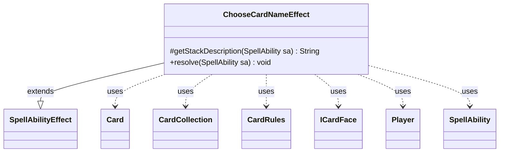

---
aliases:
  - ChooseCardNameEffect
tags:
  - java/class
  - module/forge-game
  - pkg/forge/game/ability/effects
fqn: forge.game.ability.effects.ChooseCardNameEffect
package: forge.game.ability.effects
module: forge-game
kind: Class
---

# ChooseCardNameEffect

**Package:** `forge.game.ability.effects` &nbsp; **Module:** `forge-game` &nbsp; **Kind:** Class



## Relationships
**Extends:**
- [[forge.game.ability.SpellAbilityEffect|SpellAbilityEffect]]
**Uses:**
- [[forge.card.CardRules|CardRules]]
- [[forge.card.ICardFace|ICardFace]]
- [[forge.game.card.Card|Card]]
- [[forge.game.card.CardCollection|CardCollection]]
- [[forge.game.player.Player|Player]]
- [[forge.game.spellability.SpellAbility|SpellAbility]]

## Design Description

`ChooseCardNameEffect` implements the resolution logic for an ability that has one or more players name a card. It extends `SpellAbilityEffect`, overriding `getStackDescription` for a human-readable stack line and `resolve` for the actual behavior, plugging into Forge's ability-effect framework. For each targeted `Player` still in the game, it builds the pool of legal names and either prompts that player's controller via `chooseCardName` or, when `AtRandom` is set, selects one automatically.

The class centers on flexible name sourcing through three modes: deriving `ICardFace`s from defined `Card`s, parsing an explicit `ChooseFromList`, or filtering the global database via `CardFacePredicates` against a `ValidCards` expression. It collaborates with `CardCollection`/`CardLists` for filtering, `CardRules` to handle split faces (special-casing cards like Alhammarret), and `StaticData` for the master card pool, recording each result on both the host card and the choosing player.

## Source
`forge-game/src/main/java/forge/game/ability/effects/ChooseCardNameEffect.java`

```java
package forge.game.ability.effects;

import java.util.*;
import java.util.function.Predicate;

import forge.StaticData;
import forge.card.CardFacePredicates;
import forge.card.CardRules;
import forge.card.CardSplitType;
import forge.card.ICardFace;
import forge.game.ability.AbilityUtils;
import forge.game.ability.SpellAbilityEffect;
import forge.game.card.Card;
import forge.game.card.CardCollection;
import forge.game.card.CardLists;
import forge.game.player.Player;
import forge.game.spellability.SpellAbility;
import forge.util.*;
import org.apache.commons.lang3.StringUtils;

public class ChooseCardNameEffect extends SpellAbilityEffect {

    @Override
    protected String getStackDescription(SpellAbility sa) {
        return Lang.joinHomogenous(getTargetPlayers(sa)) + " names a card.";
    }

    @Override
    public void resolve(SpellAbility sa) {
        final Card host = sa.getHostCard();

        String valid = "Card";
        String validDesc = null;
        String message = null;

        if (sa.hasParam("ValidCards")) {
            valid = sa.getParam("ValidCards");
            validDesc = sa.getParam("ValidDescription");
        }

        boolean randomChoice = sa.hasParam("AtRandom");
        boolean chooseFromDefined = sa.hasParam("ChooseFromDefinedCards");
        boolean chooseFromList = sa.hasParam("ChooseFromList");

        if (!randomChoice) {
            if (sa.hasParam("SelectPrompt")) {
                message = sa.getParam("SelectPrompt");
            } else if (null == validDesc) {
                message = Localizer.getInstance().getMessage("lblChooseACardName");
            } else {
                message = Localizer.getInstance().getMessage("lblChooseASpecificCard", validDesc);
            }
        }

        for (final Player p : getTargetPlayers(sa)) {
            if (!p.isInGame()) {
                continue;
            }
            String chosen;
            if (chooseFromDefined) {
                CardCollection choices = AbilityUtils.getDefinedCards(host, sa.getParam("ChooseFromDefinedCards"), sa);
                choices = CardLists.getValidCards(choices, valid, host.getController(), host, sa);
                List<ICardFace> faces = new ArrayList<>();
                // get Card
                for (final Card c : choices) {
                    final CardRules rules = c.getRules();
                    if (faces.contains(rules.getMainPart()))
                        continue;
                    faces.add(rules.getMainPart());
                    // Alhammarret only allows Split for other faces
                    if (rules.getSplitType() == CardSplitType.Split) {
                        faces.add(rules.getOtherPart());
                    }
                }
                Collections.sort(faces);
                chosen = p.getController().chooseCardName(sa, faces, message);
            } else if (chooseFromList) {
                String [] names = sa.getParam("ChooseFromList").split(",");
                List<ICardFace> faces = new ArrayList<>();
                for (String name : names) {
                    // Cardnames that include "," must use ";" instead in ChooseFromList$ (i.e. Tovolar; Dire Overlord)
                    name = name.replace(";", ",");
                    if (sa.hasParam("ExcludeChosen") && host.getNamedCards().contains(name)) {
                        continue;
                    }
                    faces.add(StaticData.instance().getCommonCards().getFaceByName(name));
                }
                if (randomChoice) {
                    chosen = Aggregates.random(faces).getName();
                } else {
                    chosen = p.getController().chooseCardName(sa, faces, message);
                }
            } else {
                // use CardFace because you might name a alternate names
                Predicate<ICardFace> cpp = x -> true;
                if (sa.hasParam("ValidCards")) {
                    //Calculating/replacing this must happen before running valid in CardFacePredicates
                    if (valid.contains("cmcEQ") && !StringUtils.isNumeric(valid.split("cmcEQ")[1])) {
                        String s = valid.split("cmcEQ")[1];
                        valid = valid.replace(s, String.valueOf(AbilityUtils.calculateAmount(host, s, sa)));
                    }
                    if (valid.contains("ManaCost=")) {
                        if (valid.contains("ManaCost=Equipped")) {
                            String s = host.getEquipping().getManaCost().getShortString();
                            valid = valid.replace("=Equipped", s);
                        } else if (valid.contains("ManaCost=Imprinted")) {
                            String s = host.getImprintedCards().getFirst().getManaCost().getShortString();
                            valid = valid.replace("=Imprinted", s);
                        }
                    }
                    cpp = CardFacePredicates.valid(valid);
                }
                if (randomChoice) {
                    chosen = StaticData.instance().getCommonCards().streamAllFaces()
                            .filter(cpp).collect(StreamUtil.random()).map(ICardFace::getName).orElse("");
                } else {
                    chosen = p.getController().chooseCardName(sa, cpp, valid, message);
                }
            }

            if (!chosen.isEmpty()) {
                host.addNamedCard(chosen);
            }
            if (!randomChoice) {
                p.setNamedCard(chosen);
            }
        }
    }

}
```

## Python
`forge/game/ability/effects/ChooseCardNameEffect.py`

```python
from forge.game.ability.SpellAbilityEffect import SpellAbilityEffect
from forge.card.CardRules import CardRules
from forge.card.ICardFace import ICardFace
from forge.game.card.Card import Card
from forge.game.card.CardCollection import CardCollection
from forge.game.player.Player import Player
from forge.game.spellability.SpellAbility import SpellAbility

from forge.StaticData import StaticData
from forge.card.CardFacePredicates import CardFacePredicates
from forge.card.CardSplitType import CardSplitType
from forge.game.ability.AbilityUtils import AbilityUtils
from forge.game.card.CardLists import CardLists
from forge.util.Lang import Lang
from forge.util.Localizer import Localizer
from forge.util.Aggregates import Aggregates
from forge.util.StreamUtil import StreamUtil
from org.apache.commons.lang3.StringUtils import StringUtils


class ChooseCardNameEffect(SpellAbilityEffect):

    def getStackDescription(self, sa: SpellAbility) -> str:
        return Lang.joinHomogenous(self.getTargetPlayers(sa)) + " names a card."

    def resolve(self, sa: SpellAbility) -> None:
        host = sa.getHostCard()

        valid = "Card"
        validDesc = None
        message = None

        if sa.hasParam("ValidCards"):
            valid = sa.getParam("ValidCards")
            validDesc = sa.getParam("ValidDescription")

        randomChoice = sa.hasParam("AtRandom")
        chooseFromDefined = sa.hasParam("ChooseFromDefinedCards")
        chooseFromList = sa.hasParam("ChooseFromList")

        if not randomChoice:
            if sa.hasParam("SelectPrompt"):
                message = sa.getParam("SelectPrompt")
            elif validDesc is None:
                message = Localizer.getInstance().getMessage("lblChooseACardName")
            else:
                message = Localizer.getInstance().getMessage("lblChooseASpecificCard", validDesc)

        for p in self.getTargetPlayers(sa):
            if not p.isInGame():
                continue
            chosen = None
            if chooseFromDefined:
                choices = AbilityUtils.getDefinedCards(host, sa.getParam("ChooseFromDefinedCards"), sa)
                choices = CardLists.getValidCards(choices, valid, host.getController(), host, sa)
                faces: list[ICardFace] = []
                # get Card
                for c in choices:
                    rules = c.getRules()
                    if rules.getMainPart() in faces:
                        continue
                    faces.append(rules.getMainPart())
                    # Alhammarret only allows Split for other faces
                    if rules.getSplitType() == CardSplitType.Split:
                        faces.append(rules.getOtherPart())
                faces.sort()
                chosen = p.getController().chooseCardName(sa, faces, message)
            elif chooseFromList:
                names = sa.getParam("ChooseFromList").split(",")
                faces: list[ICardFace] = []
                for name in names:
                    # Cardnames that include "," must use ";" instead in ChooseFromList$ (i.e. Tovolar; Dire Overlord)
                    name = name.replace(";", ",")
                    if sa.hasParam("ExcludeChosen") and name in host.getNamedCards():
                        continue
                    faces.append(StaticData.instance().getCommonCards().getFaceByName(name))
                if randomChoice:
                    chosen = Aggregates.random(faces).getName()
                else:
                    chosen = p.getController().chooseCardName(sa, faces, message)
            else:
                # use CardFace because you might name a alternate names
                cpp = lambda x: True
                if sa.hasParam("ValidCards"):
                    # Calculating/replacing this must happen before running valid in CardFacePredicates
                    if "cmcEQ" in valid and not StringUtils.isNumeric(valid.split("cmcEQ")[1]):
                        s = valid.split("cmcEQ")[1]
                        valid = valid.replace(s, str(AbilityUtils.calculateAmount(host, s, sa)))
                    if "ManaCost=" in valid:
                        if "ManaCost=Equipped" in valid:
                            s = host.getEquipping().getManaCost().getShortString()
                            valid = valid.replace("=Equipped", s)
                        elif "ManaCost=Imprinted" in valid:
                            s = host.getImprintedCards().getFirst().getManaCost().getShortString()
                            valid = valid.replace("=Imprinted", s)
                    cpp = CardFacePredicates.valid(valid)
                if randomChoice:
                    chosen = StaticData.instance().getCommonCards().streamAllFaces() \
                        .filter(cpp).collect(StreamUtil.random()).map(ICardFace.getName).orElse("")
                else:
                    chosen = p.getController().chooseCardName(sa, cpp, valid, message)

            if chosen:
                host.addNamedCard(chosen)
            if not randomChoice:
                p.setNamedCard(chosen)
```
