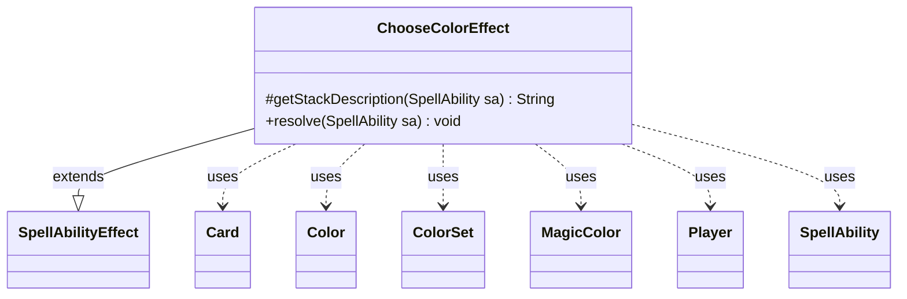

---
aliases:
  - ChooseColorEffect
tags:
  - java/class
  - module/forge-game
  - pkg/forge/game/ability/effects
fqn: forge.game.ability.effects.ChooseColorEffect
package: forge.game.ability.effects
module: forge-game
kind: Class
---

# ChooseColorEffect

**Package:** `forge.game.ability.effects` &nbsp; **Module:** `forge-game` &nbsp; **Kind:** Class



## Relationships
**Extends:**
- [[forge.game.ability.SpellAbilityEffect|SpellAbilityEffect]]
**Uses:**
- [[forge.card.ColorSet|ColorSet]]
- [[forge.card.MagicColor|MagicColor]]
- [[forge.card.MagicColor.Color|Color]]
- [[forge.game.card.Card|Card]]
- [[forge.game.player.Player|Player]]
- [[forge.game.spellability.SpellAbility|SpellAbility]]

## Design Description

`ChooseColorEffect` is a concrete `SpellAbilityEffect` that resolves abilities asking one or more players to pick a color. It overrides `getStackDescription` to produce the readable "X chooses a color" summary and `resolve` to perform the selection, keeping the behavior data-driven through `SpellAbility` parameters rather than hard-coded rules.

In `resolve` it assembles the candidate list from `MagicColor` constants, then refines it via `Choices`, `ColorsFrom` (deriving a `ColorSet` from referenced `Card`s, short-circuiting if colorless), and `Exclude`. For each target `Player` it derives minimum and maximum counts from flags such as `UpTo`, `TwoColors`, and `OrColors`, selects a localized prompt, and either chooses randomly or delegates to the player's controller. The chosen `ColorSet` is recorded on the host `Card` via `setChosenColors`, collaborating with `ColorSet`, `MagicColor`, and the controller abstraction to centralize count logic and localization while leaving the actual decision to the player.

## Source
`forge-game/src/main/java/forge/game/ability/effects/ChooseColorEffect.java`

```java
package forge.game.ability.effects;

import forge.card.ColorSet;
import forge.card.MagicColor;
import forge.game.ability.AbilityUtils;
import forge.game.ability.SpellAbilityEffect;
import forge.game.card.Card;
import forge.game.card.CardUtil;
import forge.game.player.Player;
import forge.game.spellability.SpellAbility;
import forge.util.Aggregates;
import forge.util.Lang;
import forge.util.Localizer;

import java.util.ArrayList;
import java.util.Arrays;
import java.util.List;
import java.util.stream.Collectors;

public class ChooseColorEffect extends SpellAbilityEffect {

    @Override
    protected String getStackDescription(SpellAbility sa) {
        final StringBuilder sb = new StringBuilder();

        sb.append(Lang.joinHomogenous(getTargetPlayers(sa)));

        sb.append(" chooses a color");
        if (sa.hasParam("OrColors")) {
            sb.append(" or colors");
        }
        sb.append(".");

        return sb.toString();
    }

    @Override
    public void resolve(SpellAbility sa) {
        final Card card = sa.getHostCard();

        List<String> colorChoices = new ArrayList<>(MagicColor.Constant.ONLY_COLORS);
        if (sa.hasParam("Choices")) {
            String[] restrictedChoices = sa.getParam("Choices").split(",");
            colorChoices = Arrays.asList(restrictedChoices);
        }
        if (sa.hasParam("ColorsFrom")) {
            ColorSet cs = CardUtil.getColorsFromCards(AbilityUtils.getDefinedCards(card, sa.getParam("ColorsFrom"), sa));
            if (cs.isColorless()) {
                return;
            }
            colorChoices = cs.stream().map(Object::toString).collect(Collectors.toCollection(ArrayList::new));
        }
        if (sa.hasParam("Exclude")) {
            for (String s : sa.getParam("Exclude").split(",")) {
                colorChoices.remove(s);
            }
        }

        for (Player p : getTargetPlayers(sa)) {
            if (!p.isInGame()) {
                p = getNewChooser(sa, p);
            }

            int cntMin = sa.hasParam("UpTo") ? 0 : sa.hasParam("TwoColors") ? 2 : 1;
            int cntMax = sa.hasParam("TwoColors") ? 2 : sa.hasParam("OrColors") ? colorChoices.size() : 1;
            String prompt = null;
            if (cntMax == 1) {
                prompt = Localizer.getInstance().getMessage("lblChooseAColor");
            } else if (cntMax > cntMin) {
                if (cntMax >= MagicColor.NUMBER_OR_COLORS) {
                    prompt = Localizer.getInstance().getMessage("lblAtLastChooseNumColors", Lang.getNumeral(cntMin));
                } else {
                    prompt = Localizer.getInstance().getMessage("lblChooseSpecifiedRangeColors", Lang.getNumeral(cntMin), Lang.getNumeral(cntMax));
                }
            } else {
                prompt = Localizer.getInstance().getMessage("lblChooseNColors", Lang.getNumeral(cntMax));
            }
            ColorSet chosenColors = ColorSet.C;
            Player noNotify = p;
            if (sa.hasParam("Random")) {
                String choice;
                for (int i=0; i<cntMin; i++) {
                    choice = Aggregates.random(colorChoices);
                    colorChoices.remove(choice);
                    chosenColors = ColorSet.combine(chosenColors, ColorSet.fromNames(choice));
                }
                noNotify = null;
            } else {
                chosenColors = p.getController().chooseColors(prompt, sa, cntMin, cntMax, ColorSet.fromNames(colorChoices));
            }
            if (chosenColors.isColorless()) {
                return;
            }
            card.setChosenColors(chosenColors.stream().map(MagicColor.Color::getName).collect(Collectors.toList()));
            String desc = Lang.joinHomogenous(chosenColors.stream().map(MagicColor.Color::getTranslatedName).collect(Collectors.toList()));
            p.getGame().getAction().notifyOfValue(sa, p, desc, noNotify);
        }
    }
}
```
