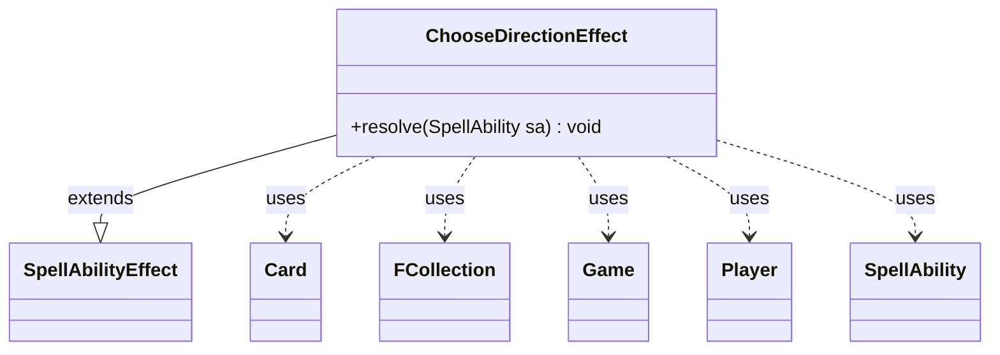

---
aliases:
  - ChooseDirectionEffect
tags:
  - java/class
  - module/forge-game
  - pkg/forge/game/ability/effects
fqn: forge.game.ability.effects.ChooseDirectionEffect
package: forge.game.ability.effects
module: forge-game
kind: Class
---

# ChooseDirectionEffect

**Package:** `forge.game.ability.effects` &nbsp; **Module:** `forge-game` &nbsp; **Kind:** Class



## Relationships
**Extends:**
- [[forge.game.ability.SpellAbilityEffect|SpellAbilityEffect]]
**Uses:**
- [[forge.game.Game|Game]]
- [[forge.game.card.Card|Card]]
- [[forge.game.player.Player|Player]]
- [[forge.game.spellability.SpellAbility|SpellAbility]]
- [[forge.util.collect.FCollection|FCollection]]

## Design Description

ChooseDirectionEffect is a concrete spell-ability resolution handler implementing the "choose a direction" game action that certain Magic cards require. As a subclass of SpellAbilityEffect, it overrides `resolve` to execute when the host ability resolves, slotting into Forge's effect-dispatch framework where each distinct card behavior is modeled as its own effect class.

On resolution it retrieves the host Card and its Game, builds an FCollection of the players representing the clockwise (left) turn order and its reverse for anti-clockwise (right), and reports both orderings to the activating Player's controller. It then prompts that controller with a binary Left/Right choice and records the outcome on the source card via `setChosenDirection`. The design delegates all user interaction to the PlayerController abstraction and routes display strings through Localizer, keeping the rules logic UI-agnostic; an inline TODO flags that a dedicated turn-order UI is still wanted.

## Source
`forge-game/src/main/java/forge/game/ability/effects/ChooseDirectionEffect.java`

```java
package forge.game.ability.effects;

import com.google.common.collect.Lists;

import forge.game.Direction;
import forge.game.Game;
import forge.game.ability.SpellAbilityEffect;
import forge.game.card.Card;
import forge.game.player.Player;
import forge.game.player.PlayerController.BinaryChoiceType;
import forge.game.spellability.SpellAbility;
import forge.util.Localizer;
import forge.util.collect.FCollection;

public class ChooseDirectionEffect extends SpellAbilityEffect {
    @Override
    public void resolve(final SpellAbility sa) {
        final Card source = sa.getHostCard();
        final Game game = source.getGame();
        final FCollection<Player> left = new FCollection<>(game.getPlayers());
        // TODO: We'd better set up turn order UI here
        final String info = Localizer.getInstance().getMessage("lblLeftClockwise") + ": " + left + "\r\n" + Localizer.getInstance().getMessage("lblRightAntiClockwise") + ":" + Lists.reverse(left);
        sa.getActivatingPlayer().getController().notifyOfValue(sa, source, info);

        boolean chosen = sa.getActivatingPlayer().getController().chooseBinary(sa,
                Localizer.getInstance().getMessage("lblChooseDirection"), BinaryChoiceType.LeftOrRight);
        source.setChosenDirection(chosen ? Direction.Left : Direction.Right);
    }
}
```

## Python
`forge/game/ability/effects/ChooseDirectionEffect.py`

````python
package = "forge.game.ability.effects"

Let me produce the Python port.

The Java uses `com.google.common.collect.Lists` (reverse) and `forge.game.Direction`, `forge.game.player.PlayerController.BinaryChoiceType`, `forge.util.Localizer`. These aren't all in the Relationships, but I should still import them faithfully per the FQN rules where applicable. The rules say import for every dependency type from Java imports and Relationships. Let me map:

- forge.game.Direction -> from forge.game.Direction import Direction
- forge.game.Game -> from forge.game.Game import Game
- forge.game.ability.SpellAbilityEffect -> from forge.game.ability.SpellAbilityEffect import SpellAbilityEffect
- forge.game.card.Card -> from forge.game.card.Card import Card
- forge.game.player.Player -> from forge.game.player.Player import Player
- forge.game.player.PlayerController.BinaryChoiceType -> nested type. FQN is forge.game.player.PlayerController.BinaryChoiceType. The module path is type's FQN... BinaryChoiceType is nested in PlayerController. I'll import from forge.game.player.PlayerController import BinaryChoiceType? The rule: module path is the type's FQN and imported symbol is its simple name. So from forge.game.player.PlayerController.BinaryChoiceType import BinaryChoiceType. Hmm but it's a nested enum. Safer: import PlayerController. Actually the rule is mechanical. BinaryChoiceType's FQN... it's a nested class. I'll follow the pattern: `from forge.game.player.PlayerController import BinaryChoiceType`. That's idiomatic Python for a nested type defined in PlayerController module. I'll use that.
- forge.game.spellability.SpellAbility -> from forge.game.spellability.SpellAbility import SpellAbility
- forge.util.Localizer -> from forge.util.Localizer import Localizer
- forge.util.collect.FCollection -> from forge.util.collect.FCollection import FCollection
- com.google.common.collect.Lists -> not forge. Use Python reversed(list). I'll use list(reversed(left)).

Let me write it.```python
from forge.game.Direction import Direction
from forge.game.Game import Game
from forge.game.ability.SpellAbilityEffect import SpellAbilityEffect
from forge.game.card.Card import Card
from forge.game.player.Player import Player
from forge.game.player.PlayerController import BinaryChoiceType
from forge.game.spellability.SpellAbility import SpellAbility
from forge.util.Localizer import Localizer
from forge.util.collect.FCollection import FCollection


class ChooseDirectionEffect(SpellAbilityEffect):
    def resolve(self, sa: SpellAbility) -> None:
        source = sa.getHostCard()
        game = source.getGame()
        left = FCollection(game.getPlayers())
        # TODO: We'd better set up turn order UI here
        info = Localizer.getInstance().getMessage("lblLeftClockwise") + ": " + str(left) + "\r\n" + Localizer.getInstance().getMessage("lblRightAntiClockwise") + ":" + str(list(reversed(left)))
        sa.getActivatingPlayer().getController().notifyOfValue(sa, source, info)

        chosen = sa.getActivatingPlayer().getController().chooseBinary(sa,
                Localizer.getInstance().getMessage("lblChooseDirection"), BinaryChoiceType.LeftOrRight)
        source.setChosenDirection(Direction.Left if chosen else Direction.Right)
````
