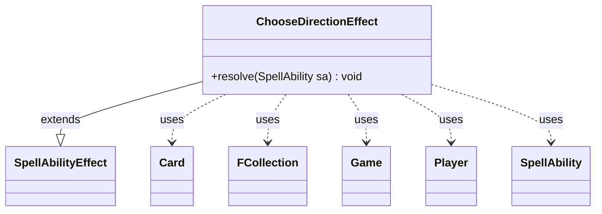

---
aliases:
  - ChooseDirectionEffect
tags:
  - java/class
  - module/forge-game
  - pkg/forge/game/ability/effects
fqn: forge.game.ability.effects.ChooseDirectionEffect
package: forge.game.ability.effects
module: forge-game
kind: Class
---

# ChooseDirectionEffect

**Package:** `forge.game.ability.effects` &nbsp; **Module:** `forge-game` &nbsp; **Kind:** Class



## Relationships
**Extends:**
- [[forge.game.ability.SpellAbilityEffect|SpellAbilityEffect]]
**Uses:**
- [[forge.game.Game|Game]]
- [[forge.game.card.Card|Card]]
- [[forge.game.player.Player|Player]]
- [[forge.game.spellability.SpellAbility|SpellAbility]]
- [[forge.util.collect.FCollection|FCollection]]

## Design Description

ChooseDirectionEffect is a concrete spell-ability resolution handler implementing the "choose a direction" game action that certain Magic cards require. As a subclass of SpellAbilityEffect, it overrides `resolve` to execute when the host ability resolves, slotting into Forge's effect-dispatch framework where each distinct card behavior is modeled as its own effect class.

On resolution it retrieves the host Card and its Game, builds an FCollection of the players representing the clockwise (left) turn order and its reverse for anti-clockwise (right), and reports both orderings to the activating Player's controller. It then prompts that controller with a binary Left/Right choice and records the outcome on the source card via `setChosenDirection`. The design delegates all user interaction to the PlayerController abstraction and routes display strings through Localizer, keeping the rules logic UI-agnostic; an inline TODO flags that a dedicated turn-order UI is still wanted.

## Source
`forge-game/src/main/java/forge/game/ability/effects/ChooseDirectionEffect.java`

```java
package forge.game.ability.effects;

import com.google.common.collect.Lists;

import forge.game.Direction;
import forge.game.Game;
import forge.game.ability.SpellAbilityEffect;
import forge.game.card.Card;
import forge.game.player.Player;
import forge.game.player.PlayerController.BinaryChoiceType;
import forge.game.spellability.SpellAbility;
import forge.util.Localizer;
import forge.util.collect.FCollection;

public class ChooseDirectionEffect extends SpellAbilityEffect {
    @Override
    public void resolve(final SpellAbility sa) {
        final Card source = sa.getHostCard();
        final Game game = source.getGame();
        final FCollection<Player> left = new FCollection<>(game.getPlayers());
        // TODO: We'd better set up turn order UI here
        final String info = Localizer.getInstance().getMessage("lblLeftClockwise") + ": " + left + "\r\n" + Localizer.getInstance().getMessage("lblRightAntiClockwise") + ":" + Lists.reverse(left);
        sa.getActivatingPlayer().getController().notifyOfValue(sa, source, info);

        boolean chosen = sa.getActivatingPlayer().getController().chooseBinary(sa,
                Localizer.getInstance().getMessage("lblChooseDirection"), BinaryChoiceType.LeftOrRight);
        source.setChosenDirection(chosen ? Direction.Left : Direction.Right);
    }
}
```
