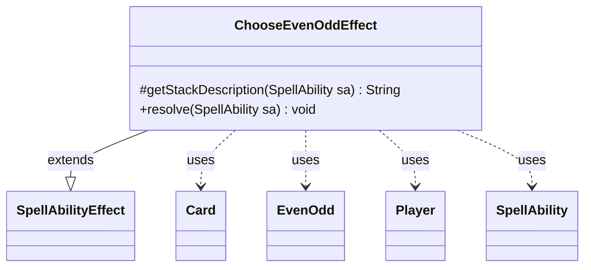

---
aliases:
  - ChooseEvenOddEffect
tags:
  - java/class
  - module/forge-game
  - pkg/forge/game/ability/effects
fqn: forge.game.ability.effects.ChooseEvenOddEffect
package: forge.game.ability.effects
module: forge-game
kind: Class
---

# ChooseEvenOddEffect

**Package:** `forge.game.ability.effects`   **Module:** `forge-game`   **Kind:** Class



## Relationships
**Extends:**
- [[forge.game.ability.SpellAbilityEffect|SpellAbilityEffect]]
**Uses:**
- [[forge.game.EvenOdd|EvenOdd]]
- [[forge.game.card.Card|Card]]
- [[forge.game.player.Player|Player]]
- [[forge.game.spellability.SpellAbility|SpellAbility]]

## Design Description

`ChooseEvenOddEffect` resolves the "choose even or odd" mechanic in which a player declares a parity that later card rules consult. As a concrete subclass of `SpellAbilityEffect`, it supplies the two hooks the ability framework expects: `getStackDescription`, which builds a readable stack entry naming the choosing players, and `resolve`, which performs the choice when the ability resolves.

In `resolve` it iterates the ability's target `Player`s, skipping any no longer in the game, and delegates the binary decision to each player's `PlayerController` via `chooseBinary`, mapping the boolean result onto the `EvenOdd` enum and storing it on the host `Card`. An optional `Notify` parameter announces the picked value through the game's action and localization services. The effect stays stateless and data-driven—parity lives on the card for downstream queries—while routing the decision through the controller abstraction so AI and human players share one path.

## Source
`forge-game/src/main/java/forge/game/ability/effects/ChooseEvenOddEffect.java`

```java
package forge.game.ability.effects;

import forge.game.EvenOdd;
import forge.game.ability.SpellAbilityEffect;
import forge.game.card.Card;
import forge.game.player.Player;
import forge.game.player.PlayerController.BinaryChoiceType;
import forge.game.spellability.SpellAbility;
import forge.util.Lang;
import forge.util.Localizer;

public class ChooseEvenOddEffect extends SpellAbilityEffect {

    /* (non-Javadoc)
     * @see forge.card.abilityfactory.SpellEffect#getStackDescription(java.util.Map, forge.card.spellability.SpellAbility)
     */
    @Override
    protected String getStackDescription(SpellAbility sa) {
        final StringBuilder sb = new StringBuilder();

        sb.append(Lang.joinHomogenous(getTargetPlayers(sa)));
        sb.append("chooses even or odd.");

        return sb.toString();
    }

    @Override
    public void resolve(SpellAbility sa) {
        final Card card = sa.getHostCard();

        for (final Player p : getTargetPlayers(sa)) {
            if (!p.isInGame()) {
                continue;
            }
            EvenOdd chosen = p.getController().chooseBinary(sa, "odd or even", BinaryChoiceType.OddsOrEvens) ? EvenOdd.Odd : EvenOdd.Even;
            card.setChosenEvenOdd(chosen);
            if (sa.hasParam("Notify")) {
                p.getGame().getAction().notifyOfValue(sa, card, Localizer.getInstance().getMessage("lblPlayerPickedChosen", p.getName(), chosen), p);
            }
        }
        card.updateStateForView();
    }
}
```

## Python
`forge/game/ability/effects/ChooseEvenOddEffect.py`

```python
package forge.game.ability.effects

from forge.game.EvenOdd import EvenOdd
from forge.game.ability.SpellAbilityEffect import SpellAbilityEffect
from forge.game.card.Card import Card
from forge.game.player.Player import Player
from forge.game.player.PlayerController import BinaryChoiceType
from forge.game.spellability.SpellAbility import SpellAbility
from forge.util.Lang import Lang
from forge.util.Localizer import Localizer


class ChooseEvenOddEffect(SpellAbilityEffect):

    # (non-Javadoc)
    # @see forge.card.abilityfactory.SpellEffect#getStackDescription(java.util.Map, forge.card.spellability.SpellAbility)
    def getStackDescription(self, sa: SpellAbility) -> str:
        sb = []

        sb.append(Lang.joinHomogenous(self.getTargetPlayers(sa)))
        sb.append("chooses even or odd.")

        return "".join(sb)

    def resolve(self, sa: SpellAbility) -> None:
        card = sa.getHostCard()

        for p in self.getTargetPlayers(sa):
            if not p.isInGame():
                continue
            chosen = EvenOdd.Odd if p.getController().chooseBinary(sa, "odd or even", BinaryChoiceType.OddsOrEvens) else EvenOdd.Even
            card.setChosenEvenOdd(chosen)
            if sa.hasParam("Notify"):
                p.getGame().getAction().notifyOfValue(sa, card, Localizer.getInstance().getMessage("lblPlayerPickedChosen", p.getName(), chosen), p)
        card.updateStateForView()
```
