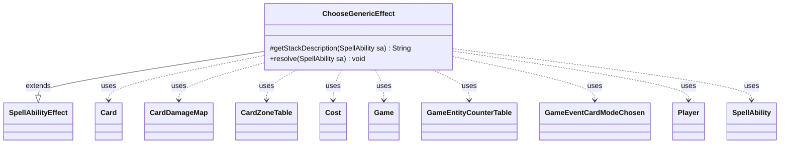

---
aliases:
  - ChooseGenericEffect
tags:
  - java/class
  - module/forge-game
  - pkg/forge/game/ability/effects
fqn: forge.game.ability.effects.ChooseGenericEffect
package: forge.game.ability.effects
module: forge-game
kind: Class
---

# ChooseGenericEffect

**Package:** `forge.game.ability.effects` &nbsp; **Module:** `forge-game` &nbsp; **Kind:** Class



## Relationships
**Extends:**
- [[forge.game.ability.SpellAbilityEffect|SpellAbilityEffect]]
**Uses:**
- [[forge.game.Game|Game]]
- [[forge.game.GameEntityCounterTable|GameEntityCounterTable]]
- [[forge.game.card.Card|Card]]
- [[forge.game.card.CardDamageMap|CardDamageMap]]
- [[forge.game.card.CardZoneTable|CardZoneTable]]
- [[forge.game.cost.Cost|Cost]]
- [[forge.game.event.GameEventCardModeChosen|GameEventCardModeChosen]]
- [[forge.game.player.Player|Player]]
- [[forge.game.spellability.SpellAbility|SpellAbility]]

## Design Description

ChooseGenericEffect is a resolution handler for "choose one (or more) from a list" abilities, extending SpellAbilityEffect to slot into Forge's ability-resolution pipeline by overriding getStackDescription and resolve. For each defined or targeted Player it gathers the host SpellAbility's "Choices" sub-abilities, filters out options whose restrictions or UnlessCost cannot be satisfied, has the player's controller pick the configured amount, and resolves the selections via AbilityUtils—falling back to a FallbackAbility when nothing is payable.

It collaborates with Game to fire GameEventCardModeChosen notifications and apply outcomes, and optionally installs shared CardDamageMap, GameEntityCounterTable, and CardZoneTable accumulators so damage and zone changes batch and apply once at the end. Numerous optional parameters (AtRandom with the "Urza" retargeting case, NumRandomChoices, Secretly, ShowChoice, TempRemember) reflect a design intent to drive many distinct card behaviors from one data-configurable effect.

## Source
`forge-game/src/main/java/forge/game/ability/effects/ChooseGenericEffect.java`

```java
package forge.game.ability.effects;

import java.util.List;

import com.google.common.collect.ImmutableMap;
import com.google.common.collect.Lists;

import forge.game.ability.AbilityUtils;
import forge.game.ability.SpellAbilityEffect;
import forge.game.card.Card;
import forge.game.card.CardDamageMap;
import forge.game.card.CardZoneTable;
import forge.game.cost.Cost;
import forge.game.event.GameEventCardModeChosen;
import forge.game.Game;
import forge.game.GameEntityCounterTable;
import forge.game.player.Player;
import forge.game.spellability.SpellAbility;
import forge.util.*;

public class ChooseGenericEffect extends SpellAbilityEffect {

    @Override
    protected String getStackDescription(SpellAbility sa) {
        final StringBuilder sb = new StringBuilder();
        final List<Player> players = getDefinedPlayersOrTargeted(sa); 
        
        sb.append(Lang.joinHomogenous(players));
        sb.append(players.size() == 1 ? " chooses" : " choose").append(" from a list.");

        return sb.toString();
    }

    @Override
    public void resolve(SpellAbility sa) {
        final Card host = sa.getHostCard();
        final Game game = host.getGame();

        final List<SpellAbility> abilities = Lists.newArrayList(sa.getAdditionalAbilityList("Choices"));
        if (sa.hasParam("NumRandomChoices")) {
            int n = AbilityUtils.calculateAmount(host, sa.getParam("NumRandomChoices"), sa);
            while (abilities.size() > n) {
                Aggregates.removeRandom(abilities);
            }
        }
        // TODO Can this be simplified somehow to avoid needing a dedicated fallback ability?
        final SpellAbility fallback = sa.getAdditionalAbility("FallbackAbility");
        final int amount = AbilityUtils.calculateAmount(host, sa.getParamOrDefault("ChoiceAmount", "1"), sa);
        
        final boolean tempRem = sa.hasParam("TempRemember");
        final boolean secretly = sa.hasParam("Secretly");
        final StringBuilder record = new StringBuilder();
        final boolean changeZoneTable = sa.hasParam("ChangeZoneTable");
        final boolean damageMap = sa.hasParam("DamageMap");

        if (damageMap) {
            sa.setDamageMap(new CardDamageMap());
            sa.setPreventMap(new CardDamageMap());
            sa.setCounterTable(new GameEntityCounterTable());
        }
        if (changeZoneTable) sa.setChangeZoneTable(new CardZoneTable());

        for (Player p : getDefinedPlayersOrTargeted(sa)) {
            if (!p.isInGame()) {
                p = getNewChooser(sa, p);
            }

            // determine if any of the choices are not valid
            List<SpellAbility> availableSA = Lists.newArrayList(abilities);
            for (SpellAbility saChoice : abilities) {
                if (saChoice.getRestrictions() != null && !saChoice.getRestrictions().checkOtherRestrictions(host, saChoice, sa.getActivatingPlayer())) {
                    availableSA.remove(saChoice);
                } else if (saChoice.hasParam("UnlessCost")) {
                    // generic check for if the cost can be paid
                    Cost unlessCost = new Cost(saChoice.getParam("UnlessCost"), false);
                    if (!unlessCost.canPay(sa, p, true)) {
                        availableSA.remove(saChoice);
                    }
                }
            }

            List<SpellAbility> chosenSAs = Lists.newArrayList();
            String prompt = sa.getParamOrDefault("ChoicePrompt", "Choose");
            boolean random = false;

            if (sa.hasParam("AtRandom")) {
                random = true;
                chosenSAs = Aggregates.random(availableSA, amount);

                int i = 0;
                while (sa.getParam("AtRandom").equals("Urza") && i < chosenSAs.size()) {
                    if (!chosenSAs.get(i).usesTargeting()) {
                        i++;
                    } else if (chosenSAs.get(i).getTargetRestrictions().hasCandidates(chosenSAs.get(i))) {
                        p.getController().chooseTargetsFor(chosenSAs.get(i));
                        i++;
                    } else {
                        chosenSAs.set(i, Aggregates.random(abilities));
                    }
                }
            } else if (!availableSA.isEmpty()) {
                chosenSAs = p.getController().chooseSpellAbilitiesForEffect(availableSA, sa, prompt, amount, ImmutableMap.of());
            }

            List<Object> oldRem = Lists.newArrayList(IterableUtil.filter(host.getRemembered(), Player.class));
            if (tempRem) {
                host.removeRemembered(oldRem);
                host.addRemembered(p); // currently we only ever need the Chooser, may need more support later
            }
            if (!chosenSAs.isEmpty()) {
                for (SpellAbility chosenSA : chosenSAs) {
                    String chosenValue = chosenSA.getDescription();
                    if (sa.hasParam("ShowChoice")) {
                        boolean dontNotifySelf = sa.getParam("ShowChoice").equals("ExceptSelf");
                        game.getAction().notifyOfValue(sa, p, chosenValue, dontNotifySelf ? p : null);
                    } else if (secretly) {
                        if (record.length() > 0) record.append("\r\n");
                        record.append(Localizer.getInstance().getMessage("lblPlayerChooseValue", p, chosenValue));
                    }
                    if (sa.hasParam("SetChosenMode")) {
                        sa.getHostCard().setChosenMode(chosenValue);
                    }
                    game.fireEvent(new GameEventCardModeChosen(p, host.getName(), chosenValue,
                            sa.hasParam("ShowChoice"), random));
                    
                    AbilityUtils.resolve(chosenSA);
                }
            } else {
                // no choices are valid, e.g. maybe all Unless costs are unpayable
                if (fallback != null) {
                    game.fireEvent(new GameEventCardModeChosen(p, host.getName(), fallback.getDescription(),
                            sa.hasParam("ShowChoice"), random));
                    AbilityUtils.resolve(fallback);
                } else if (!random) {
                    System.err.println("Warning: all Unless costs were unpayable for " + host.getName() +", but it had no FallbackAbility defined. Doing nothing (this is most likely incorrect behavior).");
                }
            }
            if (tempRem) {
                host.removeRemembered(p);
                host.addRemembered(oldRem);
            } 
        }
        if (secretly) {
            game.getAction().notifyOfValue(sa, host, record.toString(), null);
        }
        if (damageMap) game.getAction().dealDamage(false, sa.getDamageMap(), sa.getPreventMap(), 
                    sa.getCounterTable(), sa);
        if (changeZoneTable) {
            sa.getChangeZoneTable().triggerChangesZoneAll(game, sa);
            sa.setChangeZoneTable(null);
        }
        if (sa.hasParam("Guess")) {
            game.incPiledGuessedSA();
        }
    }

}
```
