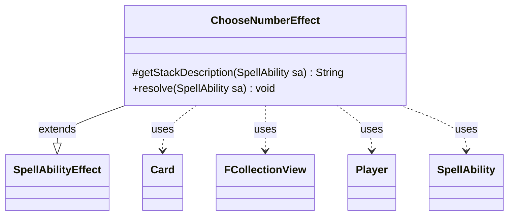

---
aliases:
  - ChooseNumberEffect
tags:
  - java/class
  - module/forge-game
  - pkg/forge/game/ability/effects
fqn: forge.game.ability.effects.ChooseNumberEffect
package: forge.game.ability.effects
module: forge-game
kind: Class
---

# ChooseNumberEffect

**Package:** `forge.game.ability.effects`   **Module:** `forge-game`   **Kind:** Class



## Relationships
**Extends:**
- [[forge.game.ability.SpellAbilityEffect|SpellAbilityEffect]]
**Uses:**
- [[forge.game.card.Card|Card]]
- [[forge.game.player.Player|Player]]
- [[forge.game.spellability.SpellAbility|SpellAbility]]
- [[forge.util.collect.FCollectionView|FCollectionView]]

## Design Description

`ChooseNumberEffect` realizes the resolution logic for "choose a number" spell abilities within Forge's ability-effect framework. Extending `SpellAbilityEffect`, it overrides `getStackDescription` for stack text and `resolve` to drive the actual choice, reading script parameters off the `SpellAbility` to decide whether each targeted `Player` picks randomly, announces any number, selects from a filtered candidate list, or chooses within a min/max range, then records the result on the host `Card`'s chosen-number state.

The class centralizes considerable branching to support secret simultaneous choices, comparison of highest and lowest values, and an optional guessing mechanic. Based on outcomes it dispatches additional sub-abilities (Highest, Lowest, NotLowest, MatchedAbility, GuessCorrect/Wrong) via `AbilityUtils.resolve`, using the `Card`'s remembered-objects list and an `FCollectionView<Player>` of guessers to pass data between the choice phase and the triggered follow-up effects—keeping all numeric-choice variants behind one declaratively configured effect.

## Source
`forge-game/src/main/java/forge/game/ability/effects/ChooseNumberEffect.java`

```java
package forge.game.ability.effects;

import java.util.ArrayList;
import java.util.List;
import java.util.Map;
import java.util.Map.Entry;

import com.google.common.collect.Lists;
import com.google.common.collect.Maps;

import forge.game.ability.AbilityUtils;
import forge.game.ability.SpellAbilityEffect;
import forge.game.card.Card;
import forge.game.player.Player;
import forge.game.spellability.SpellAbility;
import forge.util.Lang;
import forge.util.Localizer;
import forge.util.MyRandom;
import forge.util.collect.FCollectionView;

import org.apache.commons.lang3.tuple.Pair;

public class ChooseNumberEffect extends SpellAbilityEffect {

    /* (non-Javadoc)
     * @see forge.card.abilityfactory.SpellEffect#getStackDescription(java.util.Map, forge.card.spellability.SpellAbility)
     */
    @Override
    protected String getStackDescription(SpellAbility sa) {
        final StringBuilder sb = new StringBuilder();

        sb.append(Lang.joinHomogenous(getTargetPlayers(sa)));

        sb.append(" chooses a number.");

        return sb.toString();
    }

    @Override
    public void resolve(SpellAbility sa) {
        final Card source = sa.getHostCard();

        final boolean random = sa.hasParam("Random");
        final boolean anyNumber = sa.hasParam("ChooseAnyNumber");
        final boolean secretlyChoose = sa.hasParam("Secretly");

        final String sMin = sa.getParamOrDefault("Min", "0");
        final int min = AbilityUtils.calculateAmount(source, sMin, sa);
        final String sMax = sa.getParamOrDefault("Max", "99");
        final int max = AbilityUtils.calculateAmount(source, sMax, sa);

        final Map<Player, Integer> chooseMap = Maps.newHashMap();

        // defined guesser must try to guess the chosen - currently only on "The Toymaker's Trap"
        boolean guessedCorrect = false;
        Pair<Player, Integer> guessPair = null;
        // may need future work to ensure chooser and guesser get same choices even in absence of RemoveChoices param
        List<Integer> choices = new ArrayList<>();

        for (final Player p : getTargetPlayers(sa)) {
            if (!p.isInGame()) {
                continue;
            }
            Integer chosen;
            if (random) {
                chosen = MyRandom.getRandom().nextInt((max - min) + 1) + min;
                //TODO more useful notify for RepeatEach -> ChooseNumber with random
                p.getGame().getAction().notifyOfValue(sa, p, Integer.toString(chosen), null);
            } else {
                String title = sa.hasParam("ListTitle") ? sa.getParam("ListTitle") : Localizer.getInstance().getMessage("lblChooseNumber");
                if (anyNumber) {
                    Integer value = p.getController().announceRequirements(sa, min, max, title);
                    chosen = value == null ? 0 : value;
                } else if (sa.hasParam("RemoveChoices")) {
                    // currently we always remove remembered numbers, so the value is not really used yet
                    for (int i = min; i <= max; i++) {
                        choices.add(i);
                    }
                    for (Object o : source.getRemembered()) {
                        if (o instanceof Integer) choices.remove((Integer) o);
                    }
                    if (choices.isEmpty()) continue;
                    chosen = p.getController().chooseNumber(sa, title, choices, null);
                } else {
                    chosen = p.getController().chooseNumber(sa, title, min, max);
                }
                // don't notify here, because most scripts I've seen don't store that number in a long term
            }
            if (secretlyChoose && sa.hasParam("KeepSecret")) {
                source.setChosenNumber(chosen, true);
            } else if (secretlyChoose) {
                chooseMap.put(p, chosen);
            } else {
                source.setChosenNumber(chosen, false);
            }
            if (sa.hasParam("Notify")) {
                p.getGame().getAction().notifyOfValue(sa, source, Localizer.getInstance().
                getMessage("lblPlayerPickedChosen", p.getName(), chosen), p);
            }
            if (sa.hasParam("Guesser") && chosen != null) { // if nothing was chosen, there is nothing to guess
                final FCollectionView<Player> gChoices = 
                    AbilityUtils.getDefinedPlayers(source, sa.getParam("Guesser"), sa);
                final Player guesser = choices.isEmpty() ? null : p.getController().
                    chooseSingleEntityForEffect(gChoices, sa, Localizer.getInstance().getMessage("lblChoosePlayer"), 
                        false, null);
                if (guesser != null) {
                    guessPair = Pair.of(guesser, guesser.getController().chooseNumber(sa, 
                    Localizer.getInstance().getMessage("lblChooseNumber"), choices, null));
                    // if more complicated effects require this in the future it may be worth a unique message
                    if (chooseMap.containsValue(guessPair.getValue())) guessedCorrect = true;
                }
                source.getGame().incPiledGuessedSA();
            }
        }

        if (secretlyChoose && !chooseMap.isEmpty()) {
            StringBuilder sb = new StringBuilder();
            List<Player> highestNum = Lists.newArrayList();
            List<Player> lowestNum = Lists.newArrayList();
            int highest = 0;
            int lowest = Integer.MAX_VALUE;
            if (guessPair != null) {
                sb.append(Localizer.getInstance().getMessage("lblPlayerGuessedNum", guessPair.getKey().getName(),
                        String.valueOf(guessPair.getValue())));
                sb.append("\r\n");
            }
            for (Entry<Player, Integer> ev : chooseMap.entrySet()) {
                int num = ev.getValue();
                Player player = ev.getKey();
                sb.append(Localizer.getInstance().getMessage("lblPlayerChoseNum", player.getName(), num));
                sb.append("\r\n");
                if (num > highest) {
                    highestNum.clear();
                    highest = num;
                }
                if (num == highest) {
                    highestNum.add(player);
                }
                if (num < lowest) {
                    lowestNum.clear();
                    lowest = num;
                }
                if (num == lowest) {
                    lowestNum.add(player);
                }
            }

            boolean matched = highestNum.size() == chooseMap.size();
            source.getGame().getAction().notifyOfValue(sa, source, sb.toString(), null);

            if (sa.hasParam("ChooseNumberSubAbility")) {
                SpellAbility sub = sa.getAdditionalAbility("ChooseNumberSubAbility");

                for (Player p : chooseMap.keySet()) {
                    source.addRemembered(p);
                    source.setChosenNumber(chooseMap.get(p));
                    AbilityUtils.resolve(sub);
                    source.clearRemembered();
                }
            }

            if (sa.hasParam("Lowest")) {
                SpellAbility sub = sa.getAdditionalAbility("Lowest");

                for (Player p : lowestNum) {
                    source.addRemembered(p);
                    source.setChosenNumber(lowest);
                    AbilityUtils.resolve(sub);
                    source.clearRemembered();
                }
            }

            if (sa.hasParam("NotLowest")) {
                List<Player> notLowestNum = Lists.newArrayList();
                for (Player p : chooseMap.keySet()) {
                    if (!lowestNum.contains(p)) {
                        notLowestNum.add(p);
                    }
                }
                SpellAbility sub = sa.getAdditionalAbility("NotLowest");

                for (Player p : notLowestNum) {
                    source.addRemembered(p);
                    AbilityUtils.resolve(sub);
                    source.clearRemembered();
                }
            }

            if (sa.hasParam("Highest")) {
                SpellAbility sub = sa.getAdditionalAbility("Highest");

                for (Player p : highestNum) {
                    source.addRemembered(p);
                    source.setChosenNumber(highest);
                    AbilityUtils.resolve(sub);
                    source.clearRemembered();
                }
                if (sa.hasParam("RememberHighest")) {
                    source.addRemembered(highestNum);
                }
            }

            if (sa.hasParam("GuessCorrect") && guessedCorrect) { // correct guess doesn't use any chosen num yet
                SpellAbility sub = sa.getAdditionalAbility("GuessCorrect");
                AbilityUtils.resolve(sub);
            }

            if (sa.hasParam("GuessWrong") && guessPair != null && !guessedCorrect) {
                SpellAbility sub = sa.getAdditionalAbility("GuessWrong");
                // wrong currently uses the guess, not the chosen
                source.setChosenNumber(guessPair.getValue());
                source.addRemembered(guessPair.getKey());
                AbilityUtils.resolve(sub);
                source.clearChosenNumber();
                source.removeRemembered(guessPair.getKey());
            }

            if (matched && sa.hasParam("MatchedAbility")) {
                SpellAbility sub = sa.getAdditionalAbility("MatchedAbility");
                AbilityUtils.resolve(sub);
            }

            if (!matched && sa.hasParam("UnmatchedAbility")) {
                SpellAbility sub = sa.getAdditionalAbility("UnmatchedAbility");
                AbilityUtils.resolve(sub);
            }
        }

        if (sa.hasParam("RememberChosen")) source.addRemembered(chooseMap.values());
    }

}
```

## Python
`forge/game/ability/effects/ChooseNumberEffect.py`

```python
from typing import List

from forge.game.ability.AbilityUtils import AbilityUtils
from forge.game.ability.SpellAbilityEffect import SpellAbilityEffect
from forge.game.card.Card import Card
from forge.game.player.Player import Player
from forge.game.spellability.SpellAbility import SpellAbility
from forge.util.Lang import Lang
from forge.util.Localizer import Localizer
from forge.util.MyRandom import MyRandom
from forge.util.collect.FCollectionView import FCollectionView

from org.apache.commons.lang3.tuple.Pair import Pair


class ChooseNumberEffect(SpellAbilityEffect):

    # (non-Javadoc)
    # @see forge.card.abilityfactory.SpellEffect#getStackDescription(java.util.Map, forge.card.spellability.SpellAbility)
    def getStackDescription(self, sa: SpellAbility) -> str:
        sb = []

        sb.append(Lang.joinHomogenous(self.getTargetPlayers(sa)))

        sb.append(" chooses a number.")

        return "".join(sb)

    def resolve(self, sa: SpellAbility) -> None:
        source = sa.getHostCard()

        random = sa.hasParam("Random")
        anyNumber = sa.hasParam("ChooseAnyNumber")
        secretlyChoose = sa.hasParam("Secretly")

        sMin = sa.getParamOrDefault("Min", "0")
        min = AbilityUtils.calculateAmount(source, sMin, sa)
        sMax = sa.getParamOrDefault("Max", "99")
        max = AbilityUtils.calculateAmount(source, sMax, sa)

        chooseMap: dict[Player, int] = {}

        # defined guesser must try to guess the chosen - currently only on "The Toymaker's Trap"
        guessedCorrect = False
        guessPair = None
        # may need future work to ensure chooser and guesser get same choices even in absence of RemoveChoices param
        choices: List[int] = []

        for p in self.getTargetPlayers(sa):
            if not p.isInGame():
                continue
            chosen = None
            if random:
                chosen = MyRandom.getRandom().nextInt((max - min) + 1) + min
                # TODO more useful notify for RepeatEach -> ChooseNumber with random
                p.getGame().getAction().notifyOfValue(sa, p, str(chosen), None)
            else:
                title = sa.getParam("ListTitle") if sa.hasParam("ListTitle") else Localizer.getInstance().getMessage("lblChooseNumber")
                if anyNumber:
                    value = p.getController().announceRequirements(sa, min, max, title)
                    chosen = 0 if value is None else value
                elif sa.hasParam("RemoveChoices"):
                    # currently we always remove remembered numbers, so the value is not really used yet
                    for i in range(min, max + 1):
                        choices.append(i)
                    for o in source.getRemembered():
                        if isinstance(o, int):
                            choices.remove(o)
                    if not choices:
                        continue
                    chosen = p.getController().chooseNumber(sa, title, choices, None)
                else:
                    chosen = p.getController().chooseNumber(sa, title, min, max)
                # don't notify here, because most scripts I've seen don't store that number in a long term
            if secretlyChoose and sa.hasParam("KeepSecret"):
                source.setChosenNumber(chosen, True)
            elif secretlyChoose:
                chooseMap[p] = chosen
            else:
                source.setChosenNumber(chosen, False)
            if sa.hasParam("Notify"):
                p.getGame().getAction().notifyOfValue(sa, source, Localizer.getInstance().
                    getMessage("lblPlayerPickedChosen", p.getName(), chosen), p)
            if sa.hasParam("Guesser") and chosen is not None:  # if nothing was chosen, there is nothing to guess
                gChoices: FCollectionView[Player] = \
                    AbilityUtils.getDefinedPlayers(source, sa.getParam("Guesser"), sa)
                guesser = None if not choices else p.getController(). \
                    chooseSingleEntityForEffect(gChoices, sa, Localizer.getInstance().getMessage("lblChoosePlayer"),
                        False, None)
                if guesser is not None:
                    guessPair = Pair.of(guesser, guesser.getController().chooseNumber(sa,
                        Localizer.getInstance().getMessage("lblChooseNumber"), choices, None))
                    # if more complicated effects require this in the future it may be worth a unique message
                    if guessPair.getValue() in chooseMap.values():
                        guessedCorrect = True
                source.getGame().incPiledGuessedSA()

        if secretlyChoose and chooseMap:
            sb = []
            highestNum: List[Player] = []
            lowestNum: List[Player] = []
            highest = 0
            lowest = 2147483647
            if guessPair is not None:
                sb.append(Localizer.getInstance().getMessage("lblPlayerGuessedNum", guessPair.getKey().getName(),
                        str(guessPair.getValue())))
                sb.append("\r\n")
            for player, num in chooseMap.items():
                sb.append(Localizer.getInstance().getMessage("lblPlayerChoseNum", player.getName(), num))
                sb.append("\r\n")
                if num > highest:
                    highestNum.clear()
                    highest = num
                if num == highest:
                    highestNum.append(player)
                if num < lowest:
                    lowestNum.clear()
                    lowest = num
                if num == lowest:
                    lowestNum.append(player)

            matched = len(highestNum) == len(chooseMap)
            source.getGame().getAction().notifyOfValue(sa, source, "".join(sb), None)

            if sa.hasParam("ChooseNumberSubAbility"):
                sub = sa.getAdditionalAbility("ChooseNumberSubAbility")

                for p in chooseMap.keys():
                    source.addRemembered(p)
                    source.setChosenNumber(chooseMap.get(p))
                    AbilityUtils.resolve(sub)
                    source.clearRemembered()

            if sa.hasParam("Lowest"):
                sub = sa.getAdditionalAbility("Lowest")

                for p in lowestNum:
                    source.addRemembered(p)
                    source.setChosenNumber(lowest)
                    AbilityUtils.resolve(sub)
                    source.clearRemembered()

            if sa.hasParam("NotLowest"):
                notLowestNum: List[Player] = []
                for p in chooseMap.keys():
                    if p not in lowestNum:
                        notLowestNum.append(p)
                sub = sa.getAdditionalAbility("NotLowest")

                for p in notLowestNum:
                    source.addRemembered(p)
                    AbilityUtils.resolve(sub)
                    source.clearRemembered()

            if sa.hasParam("Highest"):
                sub = sa.getAdditionalAbility("Highest")

                for p in highestNum:
                    source.addRemembered(p)
                    source.setChosenNumber(highest)
                    AbilityUtils.resolve(sub)
                    source.clearRemembered()
                if sa.hasParam("RememberHighest"):
                    source.addRemembered(highestNum)

            if sa.hasParam("GuessCorrect") and guessedCorrect:  # correct guess doesn't use any chosen num yet
                sub = sa.getAdditionalAbility("GuessCorrect")
                AbilityUtils.resolve(sub)

            if sa.hasParam("GuessWrong") and guessPair is not None and not guessedCorrect:
                sub = sa.getAdditionalAbility("GuessWrong")
                # wrong currently uses the guess, not the chosen
                source.setChosenNumber(guessPair.getValue())
                source.addRemembered(guessPair.getKey())
                AbilityUtils.resolve(sub)
                source.clearChosenNumber()
                source.removeRemembered(guessPair.getKey())

            if matched and sa.hasParam("MatchedAbility"):
                sub = sa.getAdditionalAbility("MatchedAbility")
                AbilityUtils.resolve(sub)

            if not matched and sa.hasParam("UnmatchedAbility"):
                sub = sa.getAdditionalAbility("UnmatchedAbility")
                AbilityUtils.resolve(sub)

        if sa.hasParam("RememberChosen"):
            source.addRemembered(chooseMap.values())
```
