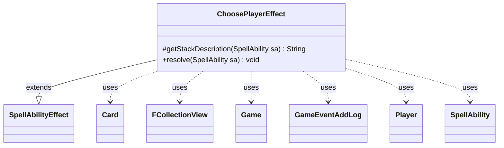

---
aliases:
  - ChoosePlayerEffect
tags:
  - java/class
  - module/forge-game
  - pkg/forge/game/ability/effects
fqn: forge.game.ability.effects.ChoosePlayerEffect
package: forge.game.ability.effects
module: forge-game
kind: Class
---

# ChoosePlayerEffect

**Package:** `forge.game.ability.effects`   **Module:** `forge-game`   **Kind:** Class



## Relationships
**Extends:**
- [[forge.game.ability.SpellAbilityEffect|SpellAbilityEffect]]
**Uses:**
- [[forge.game.Game|Game]]
- [[forge.game.card.Card|Card]]
- [[forge.game.event.GameEventAddLog|GameEventAddLog]]
- [[forge.game.player.Player|Player]]
- [[forge.game.spellability.SpellAbility|SpellAbility]]
- [[forge.util.collect.FCollectionView|FCollectionView]]

## Design Description

ChoosePlayerEffect implements the resolution logic for a "choose a player" spell ability in Forge's MTG engine. As a concrete subclass of SpellAbilityEffect, it overrides `getStackDescription` to build a readable stack summary and `resolve` to perform the choice. For each target Player it assembles a candidate pool—either an explicit `Choices` set or all players in turn order via Game—then picks one randomly or through the controller's `chooseSingleEntityForEffect`, respecting Optional, Random, and Secretly parameters.

The selection is recorded on the host Card as a secret, protecting, or chosen player, with optional remembering and a game-log entry fired through Game and GameEventAddLog. The design is data-driven and stateless, configured entirely by script parameters, and supports branching follow-ups via `ChooseSubAbility` and `CantChooseSubAbility`—defensively re-hosting these on the current host card to survive stale references after cloning. It collaborates with SpellAbility, Card, Player, and FCollectionView.

## Source
`forge-game/src/main/java/forge/game/ability/effects/ChoosePlayerEffect.java`

```java
package forge.game.ability.effects;

import forge.game.Game;
import forge.game.GameLogEntryType;
import forge.game.ability.AbilityUtils;
import forge.game.event.GameEventAddLog;
import forge.game.ability.SpellAbilityEffect;
import forge.game.card.Card;
import forge.game.player.Player;
import forge.game.spellability.SpellAbility;
import forge.util.Aggregates;
import forge.util.Lang;
import forge.util.Localizer;
import forge.util.collect.FCollectionView;

public class ChoosePlayerEffect extends SpellAbilityEffect {

    @Override
    protected String getStackDescription(SpellAbility sa) {
        final StringBuilder sb = new StringBuilder();

        sb.append(Lang.joinHomogenous(getTargetPlayers(sa)));

        sb.append(" chooses a player.");

        return sb.toString();
    }

    @Override
    public void resolve(SpellAbility sa) {
        final Card card = sa.getHostCard();
        final Game game = card.getGame();

        final FCollectionView<Player> choices = sa.hasParam("Choices") ? AbilityUtils.getDefinedPlayers(
                card, sa.getParam("Choices"), sa) : game.getPlayersInTurnOrder();

        final String choiceDesc = sa.hasParam("ChoiceTitle") ? sa.getParam("ChoiceTitle") :
                Localizer.getInstance().getMessage("lblChoosePlayer");
        final boolean random = sa.hasParam("Random");
        final boolean secret = sa.hasParam("Secretly");

        for (final Player p : getTargetPlayers(sa)) {
            if (!p.isInGame()) {
                continue;
            }
            Player chosen;
            if (random) {
                chosen = choices.isEmpty() ? null : Aggregates.random(choices);
            } else {
                chosen = choices.isEmpty() ? null : p.getController().chooseSingleEntityForEffect(choices, sa, choiceDesc, sa.hasParam("Optional"), null);
            }
            if (null != chosen) {
                if (secret) {
                    card.setSecretChosenPlayer(chosen);
                } else if (sa.hasParam("Protect")) {
                    card.setProtectingPlayer(chosen);
                } else {
                    card.setChosenPlayer(chosen);
                }
                if (sa.hasParam("ForgetOtherRemembered")) {
                    card.clearRemembered();
                }
                if (sa.hasParam("RememberChosen")) {
                    card.addRemembered(chosen);
                }
                if (!secret) {
                    //ie Shared Fate – log the chosen player
                    if (sa.hasParam("DontNotify")) game.fireEvent(new GameEventAddLog(GameLogEntryType.INFORMATION, Localizer.getInstance().getMessage("lblPlayerPickedChosen", sa.getActivatingPlayer(), chosen)));
                    else game.getAction().notifyOfValue(sa, p, Localizer.getInstance().getMessage("lblPlayerPickedChosen", sa.getActivatingPlayer(), chosen), null);
                }
                // SubAbility that only fires if a player is chosen
                SpellAbility chosenSA = sa.getAdditionalAbility("ChooseSubAbility");
                if (chosenSA != null) {
                    if (!chosenSA.getHostCard().equals(sa.getHostCard())) {
                        System.out.println("Warning: ChooseSubAbility had the wrong host set (potentially after cloning the root SA), attempting to correct...");
                        chosenSA.setHostCard(sa.getHostCard());
                    }
                    AbilityUtils.resolve(chosenSA);
                }
            } else {
                // SubAbility that only fires if a player is not chosen
                SpellAbility notChosenSA = sa.getAdditionalAbility("CantChooseSubAbility");
                if (notChosenSA != null) {
                    if (!notChosenSA.getHostCard().equals(sa.getHostCard())) {
                        System.out.println("Warning: CantChooseSubAbility had the wrong host set (potentially after cloning the root SA), attempting to correct...");
                        notChosenSA.setHostCard(sa.getHostCard());
                    }
                    AbilityUtils.resolve(notChosenSA);
                }
            }
        }
    }
}
```

## Python
`forge/game/ability/effects/ChoosePlayerEffect.py`

```python
from forge.game.Game import Game
from forge.game.GameLogEntryType import GameLogEntryType
from forge.game.ability.AbilityUtils import AbilityUtils
from forge.game.event.GameEventAddLog import GameEventAddLog
from forge.game.ability.SpellAbilityEffect import SpellAbilityEffect
from forge.game.card.Card import Card
from forge.game.player.Player import Player
from forge.game.spellability.SpellAbility import SpellAbility
from forge.util.Aggregates import Aggregates
from forge.util.Lang import Lang
from forge.util.Localizer import Localizer
from forge.util.collect.FCollectionView import FCollectionView


class ChoosePlayerEffect(SpellAbilityEffect):

    def getStackDescription(self, sa: SpellAbility) -> str:
        sb = []

        sb.append(Lang.joinHomogenous(self.getTargetPlayers(sa)))

        sb.append(" chooses a player.")

        return "".join(sb)

    def resolve(self, sa: SpellAbility) -> None:
        card = sa.getHostCard()
        game = card.getGame()

        choices = AbilityUtils.getDefinedPlayers(
            card, sa.getParam("Choices"), sa) if sa.hasParam("Choices") else game.getPlayersInTurnOrder()

        choiceDesc = sa.getParam("ChoiceTitle") if sa.hasParam("ChoiceTitle") else \
            Localizer.getInstance().getMessage("lblChoosePlayer")
        random = sa.hasParam("Random")
        secret = sa.hasParam("Secretly")

        for p in self.getTargetPlayers(sa):
            if not p.isInGame():
                continue
            chosen: Player
            if random:
                chosen = None if choices.isEmpty() else Aggregates.random(choices)
            else:
                chosen = None if choices.isEmpty() else p.getController().chooseSingleEntityForEffect(choices, sa, choiceDesc, sa.hasParam("Optional"), None)
            if None is not chosen:
                if secret:
                    card.setSecretChosenPlayer(chosen)
                elif sa.hasParam("Protect"):
                    card.setProtectingPlayer(chosen)
                else:
                    card.setChosenPlayer(chosen)
                if sa.hasParam("ForgetOtherRemembered"):
                    card.clearRemembered()
                if sa.hasParam("RememberChosen"):
                    card.addRemembered(chosen)
                if not secret:
                    # ie Shared Fate ΓÇô log the chosen player
                    if sa.hasParam("DontNotify"):
                        game.fireEvent(GameEventAddLog(GameLogEntryType.INFORMATION, Localizer.getInstance().getMessage("lblPlayerPickedChosen", sa.getActivatingPlayer(), chosen)))
                    else:
                        game.getAction().notifyOfValue(sa, p, Localizer.getInstance().getMessage("lblPlayerPickedChosen", sa.getActivatingPlayer(), chosen), None)
                # SubAbility that only fires if a player is chosen
                chosenSA = sa.getAdditionalAbility("ChooseSubAbility")
                if chosenSA is not None:
                    if not chosenSA.getHostCard().equals(sa.getHostCard()):
                        print("Warning: ChooseSubAbility had the wrong host set (potentially after cloning the root SA), attempting to correct...")
                        chosenSA.setHostCard(sa.getHostCard())
                    AbilityUtils.resolve(chosenSA)
            else:
                # SubAbility that only fires if a player is not chosen
                notChosenSA = sa.getAdditionalAbility("CantChooseSubAbility")
                if notChosenSA is not None:
                    if not notChosenSA.getHostCard().equals(sa.getHostCard()):
                        print("Warning: CantChooseSubAbility had the wrong host set (potentially after cloning the root SA), attempting to correct...")
                        notChosenSA.setHostCard(sa.getHostCard())
                    AbilityUtils.resolve(notChosenSA)
```
