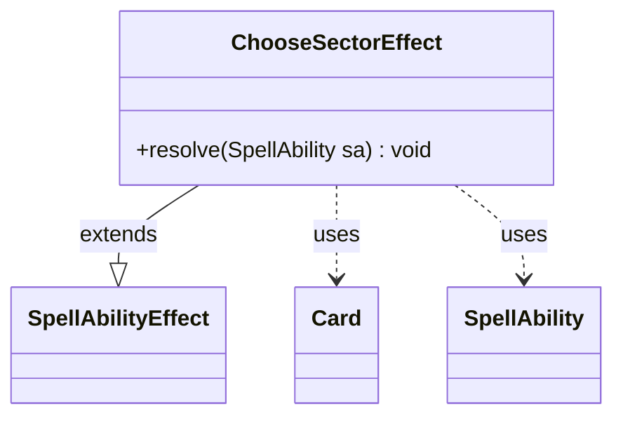

---
aliases:
  - ChooseSectorEffect
tags:
  - java/class
  - module/forge-game
  - pkg/forge/game/ability/effects
fqn: forge.game.ability.effects.ChooseSectorEffect
package: forge.game.ability.effects
module: forge-game
kind: Class
---

# ChooseSectorEffect

**Package:** `forge.game.ability.effects` &nbsp; **Module:** `forge-game` &nbsp; **Kind:** Class



## Relationships
**Extends:**
- [[forge.game.ability.SpellAbilityEffect|SpellAbilityEffect]]
**Uses:**
- [[forge.game.card.Card|Card]]
- [[forge.game.spellability.SpellAbility|SpellAbility]]

## Design Description

ChooseSectorEffect is a concrete resolution handler for the "choose a sector" game action, sitting as a leaf in Forge's ability-effect hierarchy. By extending `SpellAbilityEffect`, it plugs into the engine's data-driven ability system, where effects are dispatched generically and override `resolve(SpellAbility)` to apply their outcome when the ability resolves.

Its responsibility is narrow: it reads the host `Card` from the incoming `SpellAbility`, delegates the actual selection to the controlling player's controller via `chooseSector`, forwarding the optional `AILogic` parameter so AI and human players share one decision path, then stores the result with `setChosenSector`. The design keeps the effect stateless and deferred, pushing the choice mechanism onto the player-controller abstraction rather than embedding selection logic itself.

## Source
`forge-game/src/main/java/forge/game/ability/effects/ChooseSectorEffect.java`

```java
package forge.game.ability.effects;

import forge.game.ability.SpellAbilityEffect;
import forge.game.card.Card;
import forge.game.spellability.SpellAbility;

public class ChooseSectorEffect extends SpellAbilityEffect {

    @Override
    public void resolve(SpellAbility sa) {
        final Card card = sa.getHostCard();
        final String chosen = card.getController().getController().chooseSector(null, sa.getParamOrDefault("AILogic", ""));
        card.setChosenSector(chosen);
    }
}
```

## Python
`forge/game/ability/effects/ChooseSectorEffect.py`

```python
from forge.game.ability.SpellAbilityEffect import SpellAbilityEffect
from forge.game.card.Card import Card
from forge.game.spellability.SpellAbility import SpellAbility


class ChooseSectorEffect(SpellAbilityEffect):

    def resolve(self, sa: SpellAbility) -> None:
        card = sa.getHostCard()
        chosen = card.getController().getController().chooseSector(None, sa.getParamOrDefault("AILogic", ""))
        card.setChosenSector(chosen)
```
