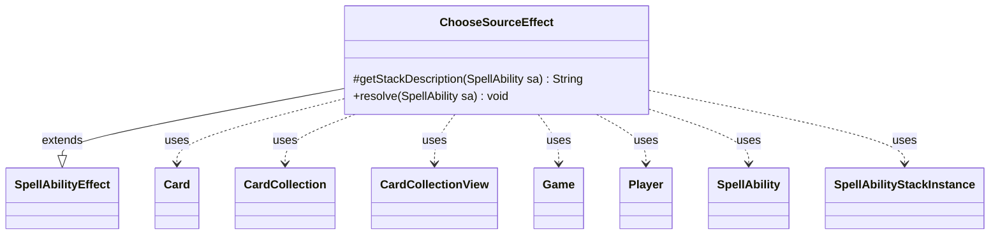

---
aliases:
  - ChooseSourceEffect
tags:
  - java/class
  - module/forge-game
  - pkg/forge/game/ability/effects
fqn: forge.game.ability.effects.ChooseSourceEffect
package: forge.game.ability.effects
module: forge-game
kind: Class
---

# ChooseSourceEffect

**Package:** `forge.game.ability.effects`   **Module:** `forge-game`   **Kind:** Class



## Relationships
**Extends:**
- [[forge.game.ability.SpellAbilityEffect|SpellAbilityEffect]]
**Uses:**
- [[forge.game.Game|Game]]
- [[forge.game.card.Card|Card]]
- [[forge.game.card.CardCollection|CardCollection]]
- [[forge.game.card.CardCollectionView|CardCollectionView]]
- [[forge.game.player.Player|Player]]
- [[forge.game.spellability.SpellAbility|SpellAbility]]
- [[forge.game.spellability.SpellAbilityStackInstance|SpellAbilityStackInstance]]

## Design Description

The class has already been fully documented — the note includes a complete Design Description. My task is to produce that description prose as output.

ChooseSourceEffect is a concrete spell-ability effect that implements the game action of having one or more players choose a "source" object during resolution. Extending `SpellAbilityEffect`, it overrides `getStackDescription` to render a human-readable stack message and `resolve` to perform the actual choice. Its core responsibility is assembling the pool of eligible sources by surveying every place a source can live—permanents on the battlefield, spells on the stack, objects merely referenced by stack effects (triggering, targeted, and replacement objects), and face-up cards in the command zone—then optionally narrowing that pool through `Choices` and `TargetControls` parameters.

It collaborates with `Game` and `ZoneType` to enumerate zones, `CardCollection`/`CardCollectionView` and `CardLists` to filter candidates, and the target `Player`'s controller to prompt the selection. A notable design intent is the use of sentinel `Card` instances with negative IDs as labelled category dividers in the choice list, paired with a re-prompt loop that rejects any divider, so the UI presents grouped, headed options while guaranteeing a real source is chosen. Results are stored via `setChosenCards`, with optional remembering.

## Source
`forge-game/src/main/java/forge/game/ability/effects/ChooseSourceEffect.java`

```java
package forge.game.ability.effects;

import java.util.List;

import forge.game.Game;
import forge.game.ability.AbilityUtils;
import forge.game.ability.SpellAbilityEffect;
import forge.game.card.Card;
import forge.game.card.CardCollection;
import forge.game.card.CardCollectionView;
import forge.game.card.CardLists;
import forge.game.player.Player;
import forge.game.spellability.SpellAbility;
import forge.game.spellability.SpellAbilityStackInstance;
import forge.game.zone.ZoneType;
import forge.util.Lang;
import forge.util.Localizer;

public class ChooseSourceEffect extends SpellAbilityEffect {
    @Override
    protected String getStackDescription(SpellAbility sa) {
        final StringBuilder sb = new StringBuilder();

        sb.append(Lang.joinHomogenous(getTargetPlayers(sa)));

        sb.append(" chooses a source.");

        return sb.toString();
    }

    @Override
    public void resolve(SpellAbility sa) {
        final Card host = sa.getHostCard();
        final Game game = sa.getActivatingPlayer().getGame();

        final List<Player> tgtPlayers = getTargetPlayers(sa);

        CardCollection stackSources = new CardCollection();
        CardCollection referencedSources = new CardCollection();
        CardCollection commandZoneSources = new CardCollection();
        CardCollection sourcesToChooseFrom = new CardCollection();

        // Get the list of permanent cards
        CardCollectionView permanentSources = game.getCardsIn(ZoneType.Battlefield);

        // A source can be a face-up card in the command zone
        for (Card c : game.getCardsIn(ZoneType.Command)) {
            if (!c.isFaceDown()) {
                commandZoneSources.add(c);
            }
        }

        // Get the list of cards that produce effects on the stack
        for (SpellAbilityStackInstance stackinst : game.getStack()) {
            stackSources.add(stackinst.getSourceCard());

            // Get the list of cards that are referenced by effects on the stack
            SpellAbility siSpellAbility = stackinst.getSpellAbility();
            for (Object c : siSpellAbility.getTriggeringObjects().values()) {
                if (c instanceof Card) {
                    if (!stackSources.contains(c)) {
                        referencedSources.add((Card) c);
                    }
                }
            }
            if (siSpellAbility.getTargetCard() != null) {
                referencedSources.add(siSpellAbility.getTargetCard());
            }
            for (Object c : siSpellAbility.getReplacingObjects().values()) {
                if (c instanceof Card) {
                    if (!stackSources.contains(c)) {
                        referencedSources.add((Card) c);
                    }
                }
            }
        }

        if (sa.hasParam("Choices")) {
            permanentSources = CardLists.getValidCards(permanentSources, sa.getParam("Choices"), host.getController(), host, sa);
            stackSources = CardLists.getValidCards(stackSources, sa.getParam("Choices"), host.getController(), host, sa);
            referencedSources = CardLists.getValidCards(referencedSources, sa.getParam("Choices"), host.getController(), host, sa);
            commandZoneSources = CardLists.getValidCards(commandZoneSources, sa.getParam("Choices"), host.getController(), host, sa);
        }
        if (sa.hasParam("TargetControls")) {
            permanentSources = CardLists.filterControlledBy(permanentSources, tgtPlayers.get(0));
            stackSources = CardLists.filterControlledBy(stackSources, tgtPlayers.get(0));
            referencedSources = CardLists.filterControlledBy(referencedSources, tgtPlayers.get(0));
            commandZoneSources = CardLists.filterControlledBy(commandZoneSources, tgtPlayers.get(0));
        }

        Card divPermanentSources = new Card(-1, game);
        divPermanentSources.setName("--PERMANENTS:--");
        Card divStackSources = new Card(-2, game);
        divStackSources.setName("--SPELLS ON THE STACK:--");
        Card divReferencedSources = new Card(-3, game);
        divReferencedSources.setName("--OBJECTS REFERRED TO ON THE STACK:--");
        Card divCommandZoneSources = new Card(-4, game);
        divCommandZoneSources.setName("--CARDS IN THE COMMAND ZONE:--");

        if (!permanentSources.isEmpty()) {
            sourcesToChooseFrom.add(divPermanentSources);
            sourcesToChooseFrom.addAll(permanentSources);
        }
        if (!stackSources.isEmpty()) {
            sourcesToChooseFrom.add(divStackSources);
            sourcesToChooseFrom.addAll(stackSources);
        }
        if (!referencedSources.isEmpty()) {
            sourcesToChooseFrom.add(divReferencedSources);
            sourcesToChooseFrom.addAll(referencedSources);
        }
        if (!commandZoneSources.isEmpty()) {
            sourcesToChooseFrom.add(divCommandZoneSources);
            sourcesToChooseFrom.addAll(commandZoneSources);
        }

        if (sourcesToChooseFrom.isEmpty()) {
            return;
        }

        final int validAmount = AbilityUtils.calculateAmount(host, sa.getParamOrDefault("Amount", "1"), sa);

        for (final Player p : tgtPlayers) {
            if (!p.isInGame()) {
                continue;
            }
            final CardCollection chosen = new CardCollection();
            for (int i = 0; i < validAmount; i++) {
                final String choiceTitle = sa.hasParam("ChoiceTitle") ? sa.getParam("ChoiceTitle") : Localizer.getInstance().getMessage("lblChooseSource") + " ";
                Card o = null;
                do {
                    o = p.getController().chooseSingleEntityForEffect(sourcesToChooseFrom, sa, choiceTitle, null);
                } while (o == null || o.getName().startsWith("--"));
                chosen.add(o);
                sourcesToChooseFrom.remove(o);
            }
            host.setChosenCards(chosen);
            if (sa.hasParam("RememberChosen")) {
                host.addRemembered(chosen);
            }
        }
    }
}
```

## Python
`forge/game/ability/effects/ChooseSourceEffect.py`

```python
from typing import List

from forge.game.Game import Game
from forge.game.ability.AbilityUtils import AbilityUtils
from forge.game.ability.SpellAbilityEffect import SpellAbilityEffect
from forge.game.card.Card import Card
from forge.game.card.CardCollection import CardCollection
from forge.game.card.CardCollectionView import CardCollectionView
from forge.game.card.CardLists import CardLists
from forge.game.player.Player import Player
from forge.game.spellability.SpellAbility import SpellAbility
from forge.game.spellability.SpellAbilityStackInstance import SpellAbilityStackInstance
from forge.game.zone.ZoneType import ZoneType
from forge.util.Lang import Lang
from forge.util.Localizer import Localizer


class ChooseSourceEffect(SpellAbilityEffect):
    def getStackDescription(self, sa: SpellAbility) -> str:
        sb = []

        sb.append(Lang.joinHomogenous(self.getTargetPlayers(sa)))

        sb.append(" chooses a source.")

        return "".join(sb)

    def resolve(self, sa: SpellAbility) -> None:
        host = sa.getHostCard()
        game = sa.getActivatingPlayer().getGame()

        tgtPlayers = self.getTargetPlayers(sa)

        stackSources = CardCollection()
        referencedSources = CardCollection()
        commandZoneSources = CardCollection()
        sourcesToChooseFrom = CardCollection()

        # Get the list of permanent cards
        permanentSources = game.getCardsIn(ZoneType.Battlefield)

        # A source can be a face-up card in the command zone
        for c in game.getCardsIn(ZoneType.Command):
            if not c.isFaceDown():
                commandZoneSources.add(c)

        # Get the list of cards that produce effects on the stack
        for stackinst in game.getStack():
            stackSources.add(stackinst.getSourceCard())

            # Get the list of cards that are referenced by effects on the stack
            siSpellAbility = stackinst.getSpellAbility()
            for c in siSpellAbility.getTriggeringObjects().values():
                if isinstance(c, Card):
                    if c not in stackSources:
                        referencedSources.add(c)
            if siSpellAbility.getTargetCard() is not None:
                referencedSources.add(siSpellAbility.getTargetCard())
            for c in siSpellAbility.getReplacingObjects().values():
                if isinstance(c, Card):
                    if c not in stackSources:
                        referencedSources.add(c)

        if sa.hasParam("Choices"):
            permanentSources = CardLists.getValidCards(permanentSources, sa.getParam("Choices"), host.getController(), host, sa)
            stackSources = CardLists.getValidCards(stackSources, sa.getParam("Choices"), host.getController(), host, sa)
            referencedSources = CardLists.getValidCards(referencedSources, sa.getParam("Choices"), host.getController(), host, sa)
            commandZoneSources = CardLists.getValidCards(commandZoneSources, sa.getParam("Choices"), host.getController(), host, sa)
        if sa.hasParam("TargetControls"):
            permanentSources = CardLists.filterControlledBy(permanentSources, tgtPlayers.get(0))
            stackSources = CardLists.filterControlledBy(stackSources, tgtPlayers.get(0))
            referencedSources = CardLists.filterControlledBy(referencedSources, tgtPlayers.get(0))
            commandZoneSources = CardLists.filterControlledBy(commandZoneSources, tgtPlayers.get(0))

        divPermanentSources = Card(-1, game)
        divPermanentSources.setName("--PERMANENTS:--")
        divStackSources = Card(-2, game)
        divStackSources.setName("--SPELLS ON THE STACK:--")
        divReferencedSources = Card(-3, game)
        divReferencedSources.setName("--OBJECTS REFERRED TO ON THE STACK:--")
        divCommandZoneSources = Card(-4, game)
        divCommandZoneSources.setName("--CARDS IN THE COMMAND ZONE:--")

        if not permanentSources.isEmpty():
            sourcesToChooseFrom.add(divPermanentSources)
            sourcesToChooseFrom.addAll(permanentSources)
        if not stackSources.isEmpty():
            sourcesToChooseFrom.add(divStackSources)
            sourcesToChooseFrom.addAll(stackSources)
        if not referencedSources.isEmpty():
            sourcesToChooseFrom.add(divReferencedSources)
            sourcesToChooseFrom.addAll(referencedSources)
        if not commandZoneSources.isEmpty():
            sourcesToChooseFrom.add(divCommandZoneSources)
            sourcesToChooseFrom.addAll(commandZoneSources)

        if sourcesToChooseFrom.isEmpty():
            return

        validAmount = AbilityUtils.calculateAmount(host, sa.getParamOrDefault("Amount", "1"), sa)

        for p in tgtPlayers:
            if not p.isInGame():
                continue
            chosen = CardCollection()
            for i in range(validAmount):
                choiceTitle = sa.getParam("ChoiceTitle") if sa.hasParam("ChoiceTitle") else Localizer.getInstance().getMessage("lblChooseSource") + " "
                o = None
                while True:
                    o = p.getController().chooseSingleEntityForEffect(sourcesToChooseFrom, sa, choiceTitle, None)
                    if not (o is None or o.getName().startswith("--")):
                        break
                chosen.add(o)
                sourcesToChooseFrom.remove(o)
            host.setChosenCards(chosen)
            if sa.hasParam("RememberChosen"):
                host.addRemembered(chosen)
```
