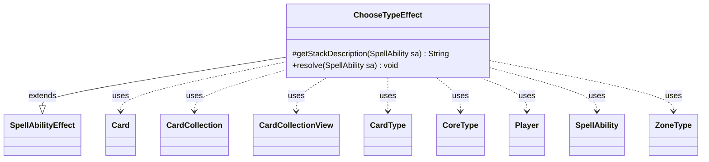

---
aliases:
  - ChooseTypeEffect
tags:
  - java/class
  - module/forge-game
  - pkg/forge/game/ability/effects
fqn: forge.game.ability.effects.ChooseTypeEffect
package: forge.game.ability.effects
module: forge-game
kind: Class
---

# ChooseTypeEffect

**Package:** `forge.game.ability.effects`   **Module:** `forge-game`   **Kind:** Class



## Relationships
**Extends:**
- [[forge.game.ability.SpellAbilityEffect|SpellAbilityEffect]]
**Uses:**
- [[forge.card.CardType|CardType]]
- [[forge.card.CardType.CoreType|CoreType]]
- [[forge.game.card.Card|Card]]
- [[forge.game.card.CardCollection|CardCollection]]
- [[forge.game.card.CardCollectionView|CardCollectionView]]
- [[forge.game.player.Player|Player]]
- [[forge.game.spellability.SpellAbility|SpellAbility]]
- [[forge.game.zone.ZoneType|ZoneType]]

## Design Description

ChooseTypeEffect is a concrete spell/ability resolution handler that prompts a player to choose a card type. It extends `SpellAbilityEffect`, overriding `getStackDescription` to summarize the choice for the game log and `resolve` to perform it. Its central responsibility is assembling a candidate list of valid type strings driven by the ability's `Type` parameter—"Card", "Creature", "Land", "Planeswalker", "Shared", and so on—sourcing them from `CardType`'s static catalogs, from defined cards' types, or from the most prevalent creature type in a given `ZoneType`, then narrowing the list via `ValidTypes`/`InvalidTypes` and previously noted types.

The design is deliberately data-driven: card scripts steer every aspect through `SpellAbility` parameters, including random versus controller-driven selection (`AtRandom`), secrecy (`Secretly`), and where the result is stored (chosen type, secondary type, or noted types). It collaborates with `Player` and its controller to capture the selection, uses `CardCollection`/`CardCollectionView` for zone queries, and writes the outcome back onto the host `Card`, throwing when a required choice yields no valid types.

## Source
`forge-game/src/main/java/forge/game/ability/effects/ChooseTypeEffect.java`

```java
package forge.game.ability.effects;

import java.util.ArrayList;
import java.util.Arrays;
import java.util.List;

import forge.card.CardType;
import forge.game.ability.AbilityUtils;
import forge.game.ability.SpellAbilityEffect;
import forge.game.card.Card;
import forge.game.card.CardCollection;
import forge.game.card.CardCollectionView;
import forge.game.card.CardFactoryUtil;
import forge.game.player.Player;
import forge.game.spellability.SpellAbility;
import forge.game.zone.ZoneType;
import forge.util.Aggregates;
import forge.util.Lang;

public class ChooseTypeEffect extends SpellAbilityEffect {

    @Override
    protected String getStackDescription(SpellAbility sa) {
        final StringBuilder sb = new StringBuilder();

        if (!sa.usesTargeting()) {
            sb.append(Lang.joinHomogenous(getTargetPlayers(sa)));
            sb.append(" chooses a ").append(sa.getParam("Type").toLowerCase()).append(" type.");
        } else {
            sb.append("Please improve the stack description.");
        }

        return sb.toString();
    }

    @Override
    public void resolve(SpellAbility sa) {
        final Card card = sa.getHostCard();
        final String type = sa.getParam("Type");
        final List<String> validTypes = new ArrayList<>();
        final List<Player> tgtPlayers = getTargetPlayers(sa);
        final boolean secret = sa.hasParam("Secretly");

        if (sa.hasParam("ValidTypes")) {
            validTypes.addAll(Arrays.asList(sa.getParam("ValidTypes").split(",")));
        } else {
            switch (type) {
            case "Card":
                validTypes.addAll(CardType.getAllCardTypes());
                break;
            case "Creature":
                if (sa.hasParam("TypesFromDefined")) {
                    for (final Card c : AbilityUtils.getDefinedCards(card, sa.getParam("TypesFromDefined"), sa)) {
                        validTypes.addAll(c.getType().getCreatureTypes());
                    }
                } else if (sa.hasParam("MostPrevalentInDefinedZone")) {
                    final String[] info = sa.getParam("MostPrevalentInDefinedZone").split("_");
                    final Player definedP = AbilityUtils.getDefinedPlayers(sa.getHostCard(), info[0], sa).get(0);
                    final ZoneType z = info.length > 1 ? ZoneType.smartValueOf(info[1]) : ZoneType.Battlefield;
                    CardCollectionView zoneCards = definedP.getCardsIn(z);
                    for (String s : CardFactoryUtil.getMostProminentCreatureType(zoneCards)) {
                        validTypes.add(s);
                    }
                } else {
                    validTypes.addAll(CardType.getAllCreatureTypes());
                }
                break;
            case "Basic Land":
                validTypes.addAll(CardType.getBasicTypes());
                break;
            case "Nonbasic Land":
                validTypes.addAll(CardType.getNonBasicTypes());
                break;
            case "Land":
                validTypes.addAll(CardType.getAllLandTypes());
                break;
            case "Planeswalker":
                validTypes.addAll(CardType.getAllWalkerTypes());
                break;
            case "CreatureInTargetedDeck":
                for (final Player p : tgtPlayers) {
                    for (Card c : p.getAllCards()) {
                        if (c.getType().getCreatureTypes() != null) {
                            for (String s : c.getType().getCreatureTypes()) {
                                if (!validTypes.contains(s)) {
                                    validTypes.add(s);
                                }
                            }
                        }
                    }
                }
                break;
            case "Shared":
                if (sa.hasParam("TypesFromDefined")) {
                    CardCollection def = AbilityUtils.getDefinedCards(card, sa.getParam("TypesFromDefined"), sa);
                    if (def.size() < 2) break; // need at least 2 cards to work with to find shared types
                    final Card card1 = def.get(0);
                    def.remove(0);
                    for (final CardType.CoreType ct : card1.getType().getCoreTypes()) {
                        boolean shared = true;
                        for (final Card c : def) {
                            if (!c.getType().hasType(ct)) {
                                shared = false;
                                break;
                            }
                        }
                        if (shared) validTypes.add(ct.name());
                    }
                }
            }
        }

        if (sa.hasParam("InvalidTypes")) {
            validTypes.removeAll(Arrays.asList(sa.getParam("InvalidTypes").split(",")));
        }

        if (sa.hasParam("Note") && card.hasAnyNotedType()) {
            for (String noted : card.getNotedTypes()) {
                validTypes.remove(noted);
            }
        }

        if (validTypes.isEmpty() && sa.hasParam("TypesFromDefined")) {
            // OK to end up with no choices/have nothing new to note
        } else if (!validTypes.isEmpty()) {
            for (final Player p : tgtPlayers) {
                String choice;
                Player noNotify = p;
                if (sa.hasParam("AtRandom")) {
                    choice = Aggregates.random(validTypes);
                    noNotify = null;
                } else {
                    choice = p.getController().chooseSomeType(type, sa, validTypes);
                }

                if (!secret) p.getGame().getAction().notifyOfValue(sa, p, choice, noNotify);

                if (sa.hasParam("Note")) {
                    card.addNotedType(choice);
                    if (!sa.hasParam("ChooseNoted")) {
                        continue;
                    }
                }
                if (sa.hasParam("ChooseType2")) {
                    card.setChosenType2(choice);
                } else {
                    if (secret) card.setSecretChosenType(choice);
                    else card.setChosenType(choice);
                }
            }
        } else {
            throw new RuntimeException(sa.getHostCard() + "'s ability resulted in no types to choose from");
        }
    }

}
```

## Python
`forge/game/ability/effects/ChooseTypeEffect.py`

```python
package = None
from typing import List

from forge.card.CardType import CardType
from forge.game.ability.AbilityUtils import AbilityUtils
from forge.game.ability.SpellAbilityEffect import SpellAbilityEffect
from forge.game.card.Card import Card
from forge.game.card.CardCollection import CardCollection
from forge.game.card.CardCollectionView import CardCollectionView
from forge.game.card.CardFactoryUtil import CardFactoryUtil
from forge.game.player.Player import Player
from forge.game.spellability.SpellAbility import SpellAbility
from forge.game.zone.ZoneType import ZoneType
from forge.util.Aggregates import Aggregates
from forge.util.Lang import Lang


class ChooseTypeEffect(SpellAbilityEffect):

    def getStackDescription(self, sa: SpellAbility) -> str:
        sb = []

        if not sa.usesTargeting():
            sb.append(Lang.joinHomogenous(self.getTargetPlayers(sa)))
            sb.append(" chooses a ")
            sb.append(sa.getParam("Type").lower())
            sb.append(" type.")
        else:
            sb.append("Please improve the stack description.")

        return "".join(sb)

    def resolve(self, sa: SpellAbility) -> None:
        card = sa.getHostCard()
        type = sa.getParam("Type")
        validTypes: List[str] = []
        tgtPlayers = self.getTargetPlayers(sa)
        secret = sa.hasParam("Secretly")

        if sa.hasParam("ValidTypes"):
            validTypes.extend(sa.getParam("ValidTypes").split(","))
        else:
            if type == "Card":
                validTypes.extend(CardType.getAllCardTypes())
            elif type == "Creature":
                if sa.hasParam("TypesFromDefined"):
                    for c in AbilityUtils.getDefinedCards(card, sa.getParam("TypesFromDefined"), sa):
                        validTypes.extend(c.getType().getCreatureTypes())
                elif sa.hasParam("MostPrevalentInDefinedZone"):
                    info = sa.getParam("MostPrevalentInDefinedZone").split("_")
                    definedP = AbilityUtils.getDefinedPlayers(sa.getHostCard(), info[0], sa)[0]
                    z = ZoneType.smartValueOf(info[1]) if len(info) > 1 else ZoneType.Battlefield
                    zoneCards = definedP.getCardsIn(z)
                    for s in CardFactoryUtil.getMostProminentCreatureType(zoneCards):
                        validTypes.append(s)
                else:
                    validTypes.extend(CardType.getAllCreatureTypes())
            elif type == "Basic Land":
                validTypes.extend(CardType.getBasicTypes())
            elif type == "Nonbasic Land":
                validTypes.extend(CardType.getNonBasicTypes())
            elif type == "Land":
                validTypes.extend(CardType.getAllLandTypes())
            elif type == "Planeswalker":
                validTypes.extend(CardType.getAllWalkerTypes())
            elif type == "CreatureInTargetedDeck":
                for p in tgtPlayers:
                    for c in p.getAllCards():
                        if c.getType().getCreatureTypes() is not None:
                            for s in c.getType().getCreatureTypes():
                                if s not in validTypes:
                                    validTypes.append(s)
            elif type == "Shared":
                if sa.hasParam("TypesFromDefined"):
                    def_ = AbilityUtils.getDefinedCards(card, sa.getParam("TypesFromDefined"), sa)
                    if def_.size() < 2:
                        pass  # need at least 2 cards to work with to find shared types
                    else:
                        card1 = def_.get(0)
                        def_.remove(0)
                        for ct in card1.getType().getCoreTypes():
                            shared = True
                            for c in def_:
                                if not c.getType().hasType(ct):
                                    shared = False
                                    break
                            if shared:
                                validTypes.append(ct.name())

        if sa.hasParam("InvalidTypes"):
            for t in sa.getParam("InvalidTypes").split(","):
                if t in validTypes:
                    validTypes.remove(t)

        if sa.hasParam("Note") and card.hasAnyNotedType():
            for noted in card.getNotedTypes():
                if noted in validTypes:
                    validTypes.remove(noted)

        if not validTypes and sa.hasParam("TypesFromDefined"):
            # OK to end up with no choices/have nothing new to note
            pass
        elif validTypes:
            for p in tgtPlayers:
                noNotify = p
                if sa.hasParam("AtRandom"):
                    choice = Aggregates.random(validTypes)
                    noNotify = None
                else:
                    choice = p.getController().chooseSomeType(type, sa, validTypes)

                if not secret:
                    p.getGame().getAction().notifyOfValue(sa, p, choice, noNotify)

                if sa.hasParam("Note"):
                    card.addNotedType(choice)
                    if not sa.hasParam("ChooseNoted"):
                        continue
                if sa.hasParam("ChooseType2"):
                    card.setChosenType2(choice)
                else:
                    if secret:
                        card.setSecretChosenType(choice)
                    else:
                        card.setChosenType(choice)
        else:
            raise RuntimeError(str(sa.getHostCard()) + "'s ability resulted in no types to choose from")
```
