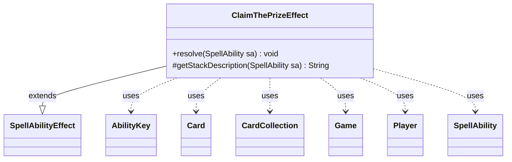

---
aliases:
  - ClaimThePrizeEffect
tags:
  - java/class
  - module/forge-game
  - pkg/forge/game/ability/effects
fqn: forge.game.ability.effects.ClaimThePrizeEffect
package: forge.game.ability.effects
module: forge-game
kind: Class
---

# ClaimThePrizeEffect

**Package:** `forge.game.ability.effects` &nbsp; **Module:** `forge-game` &nbsp; **Kind:** Class



## Relationships
**Extends:**
- [[forge.game.ability.SpellAbilityEffect|SpellAbilityEffect]]
**Uses:**
- [[forge.game.Game|Game]]
- [[forge.game.ability.AbilityKey|AbilityKey]]
- [[forge.game.card.Card|Card]]
- [[forge.game.card.CardCollection|CardCollection]]
- [[forge.game.player.Player|Player]]
- [[forge.game.spellability.SpellAbility|SpellAbility]]

## Design Description

ClaimThePrizeEffect is a concrete spell-ability effect that implements the "Claim the Prize" mechanic for Attraction cards. As a subclass of `SpellAbilityEffect`, it plugs into Forge's resolution framework by overriding `resolve` to perform the game action and `getStackDescription` to render a human-readable stack entry. On resolution it locates the relevant Attraction cards via `AbilityUtils.getDefinedCards` (defaulting to "Self"), then for each one builds an `AbilityKey` parameter map seeded from the activating `Player` and fires a `ClaimPrize` trigger through the `Game`'s trigger handler.

Its design intent is delegation: rather than applying prize rewards directly, it raises the `ClaimPrize` trigger event, letting each Attraction's own triggered abilities define the actual reward. This keeps the effect generic and data-driven, collaborating loosely with `Card`, `CardCollection`, and `SpellAbility` while leaving card-specific behavior to the trigger system.

## Source
`forge-game/src/main/java/forge/game/ability/effects/ClaimThePrizeEffect.java`

```java
package forge.game.ability.effects;

import forge.game.Game;
import forge.game.ability.AbilityKey;
import forge.game.ability.AbilityUtils;
import forge.game.ability.SpellAbilityEffect;
import forge.game.card.Card;
import forge.game.card.CardCollection;
import forge.game.player.Player;
import forge.game.spellability.SpellAbility;
import forge.game.trigger.TriggerType;
import forge.util.Lang;

import java.util.Map;

public class ClaimThePrizeEffect extends SpellAbilityEffect {

    @Override
    public void resolve(SpellAbility sa) {
        final Card host = sa.getHostCard();
        final Player activator = sa.getActivatingPlayer();
        final Game game = activator.getGame();
        final CardCollection attractions = AbilityUtils.getDefinedCards(host, sa.getParamOrDefault("Defined", "Self"), sa);

        for(Card c : attractions) {
            final Map<AbilityKey, Object> runParams = AbilityKey.mapFromPlayer(activator);
            runParams.put(AbilityKey.Card, c);
            game.getTriggerHandler().runTrigger(TriggerType.ClaimPrize, runParams, false);
        }
    }

    @Override
    protected String getStackDescription(SpellAbility sa) {
        final Card host = sa.getHostCard();
        final CardCollection attractions = AbilityUtils.getDefinedCards(host, sa.getParamOrDefault("Defined", "Self"), sa);
        return String.format("Claim the Prize from %s!", Lang.joinHomogenous(attractions));
    }
}
```
