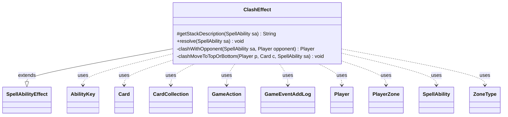

---
aliases:
  - ClashEffect
tags:
  - java/class
  - module/forge-game
  - pkg/forge/game/ability/effects
fqn: forge.game.ability.effects.ClashEffect
package: forge.game.ability.effects
module: forge-game
kind: Class
---

# ClashEffect

**Package:** `forge.game.ability.effects` &nbsp; **Module:** `forge-game` &nbsp; **Kind:** Class



## Relationships
**Extends:**
- [[forge.game.ability.SpellAbilityEffect|SpellAbilityEffect]]
**Uses:**
- [[forge.game.GameAction|GameAction]]
- [[forge.game.ability.AbilityKey|AbilityKey]]
- [[forge.game.card.Card|Card]]
- [[forge.game.card.CardCollection|CardCollection]]
- [[forge.game.event.GameEventAddLog|GameEventAddLog]]
- [[forge.game.player.Player|Player]]
- [[forge.game.spellability.SpellAbility|SpellAbility]]
- [[forge.game.zone.PlayerZone|PlayerZone]]
- [[forge.game.zone.ZoneType|ZoneType]]

## Design Description

ClashEffect is a concrete `SpellAbilityEffect` subclass that implements Magic's "clash" mechanic within Forge's ability-factory framework, overriding `getStackDescription` to render the stack text and `resolve` to drive the interaction. On resolution it pits the host card's controller against an opponent—either `Defined` or chosen interactively—then branches to the `WinSubAbility` or `OtherwiseSubAbility` according to the outcome.

The core comparison lives in the private static helper `clashWithOpponent`, where each player reveals their library's top card and the higher converted mana cost wins (ties yield no winner). A second helper, `clashMoveToTopOrBottom`, defers the top-or-bottom placement decision to each `Player`'s controller and routes the card through `GameAction`, logging the result via `GameEventAddLog`. Finally it fires `Clashed` triggers for both players through the game's `TriggerHandler`, integrating the effect with Forge's event and triggered-ability subsystems.

## Source
`forge-game/src/main/java/forge/game/ability/effects/ClashEffect.java`

```java
package forge.game.ability.effects;

import java.util.Map;

import forge.game.GameAction;
import forge.game.GameLogEntryType;
import forge.game.ability.AbilityKey;
import forge.game.event.GameEventAddLog;
import forge.game.ability.AbilityUtils;
import forge.game.ability.SpellAbilityEffect;
import forge.game.card.Card;
import forge.game.card.CardCollection;
import forge.game.player.Player;
import forge.game.spellability.SpellAbility;
import forge.game.trigger.TriggerType;
import forge.game.zone.PlayerZone;
import forge.game.zone.ZoneType;
import forge.util.Localizer;

public class ClashEffect extends SpellAbilityEffect {

    /* (non-Javadoc)
     * @see forge.card.abilityfactory.SpellEffect#getStackDescription(java.util.Map, forge.card.spellability.SpellAbility)
     */
    @Override
    protected String getStackDescription(final SpellAbility sa) {
        return sa.getHostCard().getDisplayName() + " - Clash with an opponent.";
    }

    /* (non-Javadoc)
     * @see forge.card.abilityfactory.SpellEffect#resolve(java.util.Map, forge.card.spellability.SpellAbility)
     */
    @Override
    public void resolve(final SpellAbility sa) {
        final Card source = sa.getHostCard();
        final Player player = source.getController();
        final Player opponent = sa.hasParam("Defined") ?
                AbilityUtils.getDefinedPlayers(source, sa.getParam("Defined"), sa).getFirst() :
                sa.getActivatingPlayer().getController().chooseSingleEntityForEffect(player.getOpponents(), sa,
                        Localizer.getInstance().getMessage("lblChooseOpponent"), null);
        final Player winner = clashWithOpponent(sa, opponent);

        if (player.equals(winner)) {
            SpellAbility sub = sa.getAdditionalAbility("WinSubAbility");
            if (sub != null) {
                AbilityUtils.resolve(sub);
            }
        } else {
            SpellAbility sub = sa.getAdditionalAbility("OtherwiseSubAbility");
            if (sub != null) {
                AbilityUtils.resolve(sub);
            }
        }

        final Map<AbilityKey, Object> runParams = AbilityKey.mapFromPlayer(player);
        runParams.put(AbilityKey.Won, player.equals(winner) ? "True" : "False");
        source.getGame().getTriggerHandler().runTrigger(TriggerType.Clashed, runParams, false);
        final Map<AbilityKey, Object> runParams2 = AbilityKey.mapFromPlayer(opponent);
        runParams2.put(AbilityKey.Won, opponent.equals(winner) ? "True" : "False");
        source.getGame().getTriggerHandler().runTrigger(TriggerType.Clashed, runParams2, false);
    }

    /**
     * <p>
     * clashWithOpponent.
     * </p>
     *
     * @return a boolean.
     */
    private static Player clashWithOpponent(final SpellAbility sa, Player opponent) {
        /*
         * Each clashing player reveals the top card of his or her library, then
         * puts that card on the top or bottom. A player wins if his or her card
         * had a higher mana cost.
         *
         * Clash you win or win you don't. There is no tie.
         */
        final Card source = sa.getHostCard();
        final Player player = source.getController();
        final ZoneType lib = ZoneType.Library;

        if (sa.hasParam("RememberClasher")) {
            source.addRemembered(opponent);
        }

        final PlayerZone pLib = player.getZone(lib);
        final PlayerZone oLib = opponent.getZone(lib);

        if (pLib.isEmpty() && oLib.isEmpty()) {
            return null;
        }

        final StringBuilder reveal = new StringBuilder();
        Card pCard = null;
        Card oCard = null;
        final CardCollection toReveal = new CardCollection();
        int pCMC = -1;
        int oCMC = -1;

        if (!pLib.isEmpty()) {
            pCard = pLib.get(0);
            pCMC = pCard.getCMC();
            toReveal.add(pCard);

            reveal.append(player).append(" " + Localizer.getInstance().getMessage("lblReveals") + ": ").append(pCard.getDisplayName()).append(". " + Localizer.getInstance().getMessage("lblCMC") + "= ").append(pCMC);
            reveal.append("\n");
        }
        if (!oLib.isEmpty()) {
            oCard = oLib.get(0);
            oCMC = oCard.getCMC();
            toReveal.add(oCard);

            reveal.append(opponent).append(" " + Localizer.getInstance().getMessage("lblReveals") + ": ").append(oCard.getDisplayName()).append(". " + Localizer.getInstance().getMessage("lblCMC") + "= ").append(oCMC);
            reveal.append("\n");
        }

        Player winner = null;

        // no winner, still show the revealed cards rather than do nothing
        if (pCMC == oCMC) {
            reveal.append(Localizer.getInstance().getMessage("lblNoWinner"));
        } else {
            winner = pCMC > oCMC ? player : opponent;
            reveal.append(winner + " " + Localizer.getInstance().getMessage("lblWinsClash") + ".");
        }

        player.getGame().getAction().revealTo(toReveal, player.getGame().getPlayers(), reveal.toString(), false);

        clashMoveToTopOrBottom(player, pCard, sa);
        clashMoveToTopOrBottom(opponent, oCard, sa);

        return winner;
    }

    private static void clashMoveToTopOrBottom(final Player p, final Card c, final SpellAbility sa) {
        if (c == null) {
            return;
        }
        final GameAction action = p.getGame().getAction();
        final boolean putOnTop = p.getController().willPutCardOnTop(c);
        final String location = putOnTop ? "top" : "bottom";
        final String clashOutcome = p.getName() + " clashed and put " + c.getDisplayName() + " to the " + location + " of library.";

        if (putOnTop) {
            action.moveToLibrary(c, sa);
        } else {
            action.moveToBottomOfLibrary(c, sa);
        }
        p.getGame().fireEvent(new GameEventAddLog(GameLogEntryType.STACK_RESOLVE, clashOutcome));
    }
}
```
