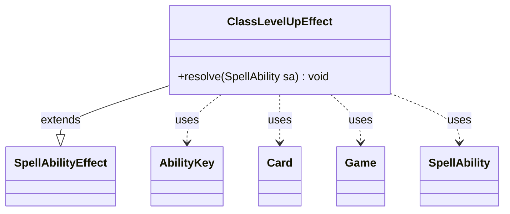

---
aliases:
  - ClassLevelUpEffect
tags:
  - java/class
  - module/forge-game
  - pkg/forge/game/ability/effects
fqn: forge.game.ability.effects.ClassLevelUpEffect
package: forge.game.ability.effects
module: forge-game
kind: Class
---

# ClassLevelUpEffect

**Package:** `forge.game.ability.effects` &nbsp; **Module:** `forge-game` &nbsp; **Kind:** Class



## Relationships
**Extends:**
- [[forge.game.ability.SpellAbilityEffect|SpellAbilityEffect]]
**Uses:**
- [[forge.game.Game|Game]]
- [[forge.game.ability.AbilityKey|AbilityKey]]
- [[forge.game.card.Card|Card]]
- [[forge.game.spellability.SpellAbility|SpellAbility]]

## Design Description

Class `ClassLevelUpEffect` is a concrete spell-ability effect that advances the "Class" enchantment level of its host card by one. As a subclass of `SpellAbilityEffect`, it overrides `resolve(SpellAbility)` to implement the engine's standard effect-resolution contract, plugging into Forge's ability-resolution pipeline.

When resolved, it reads the host `Card` and `Game`, guards that the ability corresponds to the current level, then increments the stored class level. It deliberately re-runs static abilities and clears and re-registers the host's triggers so newly unlocked level abilities come online immediately. Finally it builds an `AbilityKey` parameter map carrying the new level and fires a `ClassLevelGained` trigger, letting other game objects react. The design keeps state on the `Card` while delegating activation and event propagation to the shared `Game` services.

## Source
`forge-game/src/main/java/forge/game/ability/effects/ClassLevelUpEffect.java`

```java
package forge.game.ability.effects;

import java.util.Map;

import forge.game.Game;
import forge.game.ability.AbilityKey;
import forge.game.ability.SpellAbilityEffect;
import forge.game.card.Card;
import forge.game.spellability.SpellAbility;
import forge.game.trigger.TriggerType;

public class ClassLevelUpEffect extends SpellAbilityEffect {

    /* (non-Javadoc)
     * @see forge.card.abilityfactory.SpellEffect#resolve(java.util.Map, forge.card.spellability.SpellAbility)
     */
    @Override
    public void resolve(SpellAbility sa) {
        final Card host = sa.getHostCard();
        final Game game = host.getGame();
        int level = host.getClassLevel();

        if (!sa.isClassLevelNAbility(level)) {
            return;
        }

        host.setClassLevel(++level);

        // need to run static ability to get Trigger online
        game.getAction().checkStaticAbilities();

        // Re-register triggers for target card
        game.getTriggerHandler().clearActiveTriggers(host, null);
        game.getTriggerHandler().registerActiveTrigger(host, false);

        final Map<AbilityKey, Object> runParams = AbilityKey.mapFromCard(host);
        runParams.put(AbilityKey.ClassLevel, level);
        game.getTriggerHandler().runTrigger(TriggerType.ClassLevelGained, runParams, false);
    }
}
```

## Python
`forge/game/ability/effects/ClassLevelUpEffect.py`

```python
from typing import Map

from forge.game.Game import Game
from forge.game.ability.AbilityKey import AbilityKey
from forge.game.ability.SpellAbilityEffect import SpellAbilityEffect
from forge.game.card.Card import Card
from forge.game.spellability.SpellAbility import SpellAbility
from forge.game.trigger.TriggerType import TriggerType


class ClassLevelUpEffect(SpellAbilityEffect):

    # (non-Javadoc)
    # @see forge.card.abilityfactory.SpellEffect#resolve(java.util.Map, forge.card.spellability.SpellAbility)
    def resolve(self, sa: SpellAbility) -> None:
        host = sa.getHostCard()
        game = host.getGame()
        level = host.getClassLevel()

        if not sa.isClassLevelNAbility(level):
            return

        level += 1
        host.setClassLevel(level)

        # need to run static ability to get Trigger online
        game.getAction().checkStaticAbilities()

        # Re-register triggers for target card
        game.getTriggerHandler().clearActiveTriggers(host, None)
        game.getTriggerHandler().registerActiveTrigger(host, False)

        runParams = AbilityKey.mapFromCard(host)
        runParams[AbilityKey.ClassLevel] = level
        game.getTriggerHandler().runTrigger(TriggerType.ClassLevelGained, runParams, False)
```
