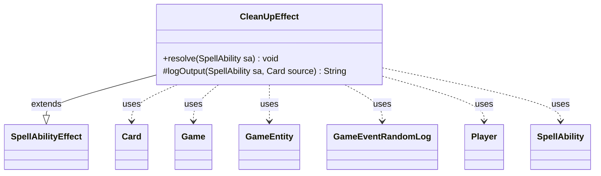

---
aliases:
  - CleanUpEffect
tags:
  - java/class
  - module/forge-game
  - pkg/forge/game/ability/effects
fqn: forge.game.ability.effects.CleanUpEffect
package: forge.game.ability.effects
module: forge-game
kind: Class
---

# CleanUpEffect

**Package:** `forge.game.ability.effects` &nbsp; **Module:** `forge-game` &nbsp; **Kind:** Class



## Relationships
**Extends:**
- [[forge.game.ability.SpellAbilityEffect|SpellAbilityEffect]]
**Uses:**
- [[forge.game.Game|Game]]
- [[forge.game.GameEntity|GameEntity]]
- [[forge.game.card.Card|Card]]
- [[forge.game.event.GameEventRandomLog|GameEventRandomLog]]
- [[forge.game.player.Player|Player]]
- [[forge.game.spellability.SpellAbility|SpellAbility]]

## Design Description

CleanUpEffect is a resolution-only ability effect that resets transient bookkeeping state on a card during gameplay. As a concrete subclass of `SpellAbilityEffect`, it overrides `resolve(SpellAbility)` and is driven entirely by optional parameters declared on the SpellAbility (`ClearRemembered`, `ForgetDefined`, `ClearImprinted`, `ClearTriggered`, `ClearCoinFlips`, and the various chosen-card/player/type/color and named-card clears), giving card scripts one declarative effect for wiping a card's remembered, imprinted, chosen, and triggered data.

It acts on either a `Defined`/targeted `Card` or the host card, reaching through the owning `Game` to clear matching state on the card's saved game-state copy and into the trigger handler to drop delayed triggers. Collaborating with `Card`, `Game`, `GameEntity`, `Player`, and `AbilityUtils`, it keeps all clearing logic data-driven and centralized. The protected `logOutput` helper composes a localized summary of what was cleared, broadcast via `GameEventRandomLog` when `Log` is set so the change surfaces in the game log.

## Source
`forge-game/src/main/java/forge/game/ability/effects/CleanUpEffect.java`

```java
package forge.game.ability.effects;

import com.google.common.collect.Lists;

import forge.game.Game;
import forge.game.GameEntity;
import forge.game.ability.AbilityUtils;
import forge.game.ability.SpellAbilityEffect;
import forge.game.card.Card;
import forge.game.event.GameEventRandomLog;
import forge.game.player.Player;
import forge.game.spellability.SpellAbility;
import forge.util.Localizer;

public class CleanUpEffect extends SpellAbilityEffect {

    /* (non-Javadoc)
     * @see forge.card.abilityfactory.SpellEffect#resolve(java.util.Map, forge.card.spellability.SpellAbility)
     */
    @Override
    public void resolve(SpellAbility sa) {
        Card source;
        if (sa.hasParam("Defined")) {
            source = getDefinedCardsOrTargeted(sa).get(0);
        } else {
            source = sa.getHostCard();
        }
        final Game game = source.getGame();

        String logMessage = "";
        if (sa.hasParam("Log")) {
            logMessage = logOutput(sa, source);
        }

        if (sa.hasParam("ClearRemembered")) {
            source.clearRemembered();
            game.getCardState(source).clearRemembered();
        }
        if (sa.hasParam("ForgetDefined")) {
            for (final GameEntity ge : AbilityUtils.getDefinedEntities(source, sa.getParam("ForgetDefined"), sa)) {
                source.removeRemembered(ge);
            }
        }
        if (sa.hasParam("ClearImprinted")) {
            source.clearImprintedCards();
            game.getCardState(source).clearImprintedCards();
        }
        if (sa.hasParam("ClearTriggered")) {
            game.getTriggerHandler().clearDelayedTrigger(source);
        }
        if (sa.hasParam("ClearCoinFlips")) {
            source.clearFlipResult();
        }
        if (sa.hasParam("ClearChosenCard")) {
            source.setChosenCards(null);
        }
        if (sa.hasParam("ClearChosenPlayer")) {
            source.setChosenPlayer(null);
        }
        if (sa.hasParam("ClearChosenType")) {
            source.setChosenType("");
            source.setChosenType2("");
        }
        if (sa.hasParam("ClearChosenColor")) {
            source.setChosenColors(null);
        }
        if (sa.hasParam("ClearNamedCard")) {
            source.setNamedCards(Lists.newArrayList());
        }
        if (sa.hasParam("Log")) {
            source.getController().getGame().fireEvent(new GameEventRandomLog(logMessage));
        }
    }

    protected String logOutput(SpellAbility sa, Card source) {
        final StringBuilder log = new StringBuilder();
        final String name = source.getTranslatedName();
        String linebreak = "\r\n";

        if (sa.hasParam("ClearRemembered") && source.getRememberedCount() != 0) {
            for (Object o : source.getRemembered()) {
                String rem = o.toString();
                if (o instanceof Card) {
                    log.append(log.length() > 0 ? linebreak : "");
                    log.append(Localizer.getInstance().getMessage("lblChosenCard", name, rem));
                } else if (o instanceof Player) {
                    log.append(log.length() > 0 ? linebreak : "");
                    log.append(Localizer.getInstance().getMessage("lblChosenPlayer", name, rem));
                }
            }
        }

        String chCard = sa.hasParam("ClearChosenCard") && source.hasChosenCard() ? source.getChosenCards()
                .toString().replace("[","").replace("]", "") : "";
        if (chCard.length() > 0 && !log.toString().contains(chCard)) {
            log.append(log.length() > 0 ? linebreak : "");
            String message = source.getChosenCards().size() > 1 ? "lblChosenMultiCard" : "lblChosenCard";
            log.append(Localizer.getInstance().getMessage(message, name, chCard));
        }

        String chPlay = sa.hasParam("ClearChosenPlayer") && source.hasChosenPlayer()
                ? source.getChosenPlayer().toString() : "";
        if (chPlay.length() > 0 && !log.toString().contains(chPlay)) {
            log.append(log.length() > 0 ? linebreak : "");
            log.append(Localizer.getInstance().getMessage("lblChosenPlayer", name, chPlay));
        }
        log.append(log.length() > 0 ? "" : Localizer.getInstance().getMessage("lblNoValidChoice", name));

        return log.toString();
    }
}
```
