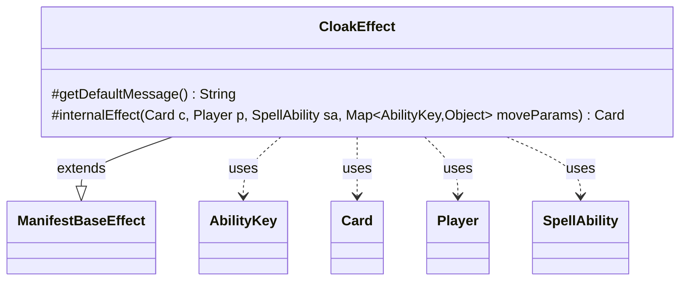

---
aliases:
  - CloakEffect
tags:
  - java/class
  - module/forge-game
  - pkg/forge/game/ability/effects
fqn: forge.game.ability.effects.CloakEffect
package: forge.game.ability.effects
module: forge-game
kind: Class
---

# CloakEffect

**Package:** `forge.game.ability.effects` &nbsp; **Module:** `forge-game` &nbsp; **Kind:** Class



## Relationships
**Extends:**
- [[forge.game.ability.effects.ManifestBaseEffect|ManifestBaseEffect]]
**Uses:**
- [[forge.game.ability.AbilityKey|AbilityKey]]
- [[forge.game.card.Card|Card]]
- [[forge.game.player.Player|Player]]
- [[forge.game.spellability.SpellAbility|SpellAbility]]

## Design Description

CloakEffect cloaks one or more target cards as part of an activated or triggered ability, implemented as a concrete `internalEffect` strategy within the manifest-style effect family. By extending `ManifestBaseEffect`, it reuses the shared card-selection and movement scaffolding, supplying only the cloak-specific behavior and the "choose cards" prompt via `getDefaultMessage()`.

The class collaborates with `Card`, `Player`, and `SpellAbility` to apply the effect: it optionally taps the card per the `Tapped` parameter, delegates the actual transformation to `Card.cloak()`, and—when `RememberCloaked` is set and the card successfully cloaks—records the resulting card on the host via `addRemembered`, threading `AbilityKey` move parameters through to preserve event context. The design keeps responsibility narrow, leaning on the base class for orchestration while encoding only the rules text unique to cloaking.

## Source
`forge-game/src/main/java/forge/game/ability/effects/CloakEffect.java`

```java
package forge.game.ability.effects;

import java.util.Map;

import forge.game.ability.AbilityKey;
import forge.game.card.Card;
import forge.game.player.Player;
import forge.game.spellability.SpellAbility;
import forge.util.Localizer;

public class CloakEffect extends ManifestBaseEffect {
    @Override
    protected String getDefaultMessage() {
        return Localizer.getInstance().getMessage("lblChooseCards");
    }

    @Override
    protected Card internalEffect(Card c, Player p, SpellAbility sa, Map<AbilityKey, Object> moveParams) {
        final Card source = sa.getHostCard();
        if (sa.hasParam("Tapped")) {
            c.setTapped(true);
        }
        Card rem = c.cloak(p, sa, moveParams);
        if (rem != null && sa.hasParam("RememberCloaked") && rem.isCloaked()) {
            source.addRemembered(rem);
        }
        return rem;
    }
}
```
