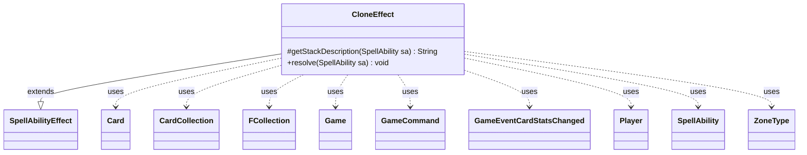

---
aliases:
  - CloneEffect
tags:
  - java/class
  - module/forge-game
  - pkg/forge/game/ability/effects
fqn: forge.game.ability.effects.CloneEffect
package: forge.game.ability.effects
module: forge-game
kind: Class
---

# CloneEffect

**Package:** `forge.game.ability.effects`   **Module:** `forge-game`   **Kind:** Class



## Relationships
**Extends:**
- [[forge.game.ability.SpellAbilityEffect|SpellAbilityEffect]]
**Uses:**
- [[forge.GameCommand|GameCommand]]
- [[forge.game.Game|Game]]
- [[forge.game.card.Card|Card]]
- [[forge.game.card.CardCollection|CardCollection]]
- [[forge.game.event.GameEventCardStatsChanged|GameEventCardStatsChanged]]
- [[forge.game.player.Player|Player]]
- [[forge.game.spellability.SpellAbility|SpellAbility]]
- [[forge.game.zone.ZoneType|ZoneType]]
- [[forge.util.collect.FCollection|FCollection]]

## Design Description

CloneEffect is a concrete spell-ability resolution handler implementing Magic's "becomes a copy of" mechanic. Extending `SpellAbilityEffect`, it overrides `getStackDescription` to produce a human-readable summary and `resolve` to perform the cloning. It selects a source card to copy—via `Choices`, a `Defined` reference, spell targeting, or a chosen name—and one or more `CloneTarget` cards (defaulting to the host), then applies a clone state built by `CardFactory` against a fresh game timestamp.

The design absorbs considerable rules nuance: it respects zone and phased-out restrictions, optional confirmations, ETB-tapped and keyword-pump modifiers, and last-state filtering so replacement-effect clones can't copy cards entering alongside them. For durational clones it registers a `GameCommand` that reverses the clone state and restores remembered/imprinted cards—skipping those whose owners have lost—when the duration ends. It collaborates with `Card`/`CardCollection`, `Player`, `Game`, and `ZoneType`, firing `GameEventCardStatsChanged` to keep views synchronized.

## Source
`forge-game/src/main/java/forge/game/ability/effects/CloneEffect.java`

```java
package forge.game.ability.effects;

import com.google.common.collect.Lists;
import forge.GameCommand;
import forge.StaticData;
import forge.game.Game;
import forge.game.ability.AbilityUtils;
import forge.game.ability.SpellAbilityEffect;
import forge.game.card.*;
import forge.game.event.GameEventCardStatsChanged;
import forge.game.player.Player;
import forge.game.spellability.SpellAbility;
import forge.game.zone.ZoneType;
import forge.util.IterableUtil;
import forge.util.Localizer;
import forge.util.collect.FCollection;

import java.util.ArrayList;
import java.util.Arrays;
import java.util.List;

public class CloneEffect extends SpellAbilityEffect {

    @Override
    protected String getStackDescription(SpellAbility sa) {
        final StringBuilder sb = new StringBuilder();
        final Card host = sa.getHostCard();
        Card tgtCard = host;

        Card cardToCopy = host;
        if (sa.hasParam("Defined")) {
            List<Card> cloneSources = AbilityUtils.getDefinedCards(host, sa.getParam("Defined"), sa);
            if (!cloneSources.isEmpty()) {
                cardToCopy = cloneSources.get(0);
            }
        } else if (sa.usesTargeting()) {
            cardToCopy = sa.getTargetCard();
        }

        List<Card> cloneTargets = AbilityUtils.getDefinedCards(host, sa.getParam("CloneTarget"), sa);
        if (!cloneTargets.isEmpty()) {
            tgtCard = cloneTargets.get(0);
        }

        sb.append(tgtCard);
        sb.append(" becomes a copy of ").append(cardToCopy).append(".");

        return sb.toString();
    }

    @Override
    public void resolve(SpellAbility sa) {
        if (!checkValidDuration(sa.getParam("Duration"), sa)) {
            return;
        }

        final Card host = sa.getHostCard();
        final Player activator = sa.getActivatingPlayer();
        List<Card> cloneTargets = new ArrayList<>();
        final Game game = activator.getGame();
        final List<String> pumpKeywords = Lists.newArrayList();

        if (sa.hasParam("PumpKeywords")) {
            pumpKeywords.addAll(Arrays.asList(sa.getParam("PumpKeywords").split(" & ")));
        }

        // find cloning source i.e. thing to be copied
        Card cardToCopy = null;

        if (sa.hasParam("Choices")) {
            ZoneType choiceZone = ZoneType.Battlefield;
            if (sa.hasParam("ChoiceZone")) {
                choiceZone = ZoneType.smartValueOf(sa.getParam("ChoiceZone"));
            }
            CardCollection choices = new CardCollection(game.getCardsIn(choiceZone));

            // choices need to be filtered by LastState Battlefield or Graveyard
            // if a Clone enters the field as other cards it could clone,
            // the clone should not be able to clone them
            // but do that only for Replacement Effects
            if (sa.isReplacementAbility()) {
                if (choiceZone.equals(ZoneType.Battlefield)) {
                    choices.retainAll(sa.getLastStateBattlefield());
                } else if (choiceZone.equals(ZoneType.Graveyard)) {
                    choices.retainAll(sa.getLastStateGraveyard());
                }
            }

            choices = CardLists.getValidCards(choices, sa.getParam("Choices"), activator, host, sa);
            boolean choiceOpt = sa.hasParam("ChoiceOptional");

            String title = sa.hasParam("ChoiceTitle") ? sa.getParam("ChoiceTitle") :
                    Localizer.getInstance().getMessage("lblChooseaCard") + " ";
            cardToCopy = activator.getController().chooseSingleEntityForEffect(choices, sa, title, choiceOpt, null);
        } else if (sa.hasParam("Defined")) {
            List<Card> cloneSources = AbilityUtils.getDefinedCards(host, sa.getParam("Defined"), sa);
            if (!cloneSources.isEmpty()) {
                cardToCopy = cloneSources.get(0);
            }
        } else if (sa.usesTargeting()) {
            cardToCopy = sa.getTargetCard();
        } else if (sa.hasParam("CopyFromChosenName")) {
            String name = host.getNamedCard();
            cardToCopy = Card.fromPaperCard(StaticData.instance().getCommonCards().getUniqueByName(name), activator);
        }
        if (cardToCopy == null) {
            return;
        }

        final boolean optional = sa.hasParam("Optional");
        if (optional && !host.getController().getController().confirmAction(sa, null, Localizer.getInstance().getMessage("lblDoYouWantCopy", cardToCopy.getTranslatedName()), null)) {
            return;
        }

        // find target of cloning i.e. card becoming a clone
        if (sa.hasParam("CloneTarget")) {
            cloneTargets = AbilityUtils.getDefinedCards(host, sa.getParam("CloneTarget"), sa);
            if (cloneTargets.isEmpty()) {
                return;
            }
        } else if (sa.hasParam("Choices") && sa.usesTargeting()) {
            cloneTargets.add(sa.getTargetCard());
        } else {
            cloneTargets.add(host);
        }

        if (cloneTargets.contains(cardToCopy) && sa.hasParam("ExcludeChosen")) {
            cloneTargets.remove(cardToCopy);
        }

        final long ts = game.getNextTimestamp();

        for (Card tgtCard : cloneTargets) {
            if (sa.hasParam("CloneZone") &&
                    !tgtCard.isInZone(ZoneType.smartValueOf(sa.getParam("CloneZone")))) {
                continue;
            }

            if (tgtCard.isPhasedOut()) {
                continue;
            }

            game.getTriggerHandler().clearActiveTriggers(tgtCard, null);

            tgtCard.addCloneState(CardFactory.getCloneStates(cardToCopy, tgtCard, sa), ts);
            tgtCard.updateRooms();

            // set ETB tapped of clone
            if (sa.hasParam("IntoPlayTapped")) {
                tgtCard.setTapped(true);
            }

            if (!pumpKeywords.isEmpty()) {
                tgtCard.addChangedCardKeywords(pumpKeywords, Lists.newArrayList(), false, ts, null);
                TokenEffectBase.addPumpUntil(sa, tgtCard, ts);
            }

            tgtCard.updateStateForView();

            // when clone is itself, cleanup from old abilities
            if (host.equals(tgtCard) && !sa.hasParam("ImprintRememberedNoCleanup")) {
                tgtCard.clearImprintedCards();
                tgtCard.clearRemembered();
            }

            if (sa.hasParam("Duration")) {
                final Card cloneCard = tgtCard;
                // if clone is temporary, target needs old values back after (keep Death-Mask Duplicant working)
                final Iterable<Card> clonedImprinted = new CardCollection(tgtCard.getImprintedCards());
                final Iterable<Object> clonedRemembered = new FCollection<>(tgtCard.getRemembered());

                final GameCommand unclone = new GameCommand() {
                    private static final long serialVersionUID = -78375985476256279L;

                    @Override
                    public void run() {
                        if (cloneCard.removeCloneState(ts)) {
                            // remove values gained while being cloned
                            cloneCard.clearImprintedCards();
                            cloneCard.clearRemembered();
                            // restore original Remembered and Imprinted, ignore cards from players who lost
                            cloneCard.addImprintedCards(IterableUtil.filter(clonedImprinted, CardPredicates.ownerLives()));
                            cloneCard.addRemembered(IterableUtil.filter(clonedRemembered, Player.class));
                            cloneCard.addRemembered(IterableUtil.filter(IterableUtil.filter(clonedRemembered, Card.class), CardPredicates.ownerLives()));
                            cloneCard.updateStateForView();
                            game.fireEvent(new GameEventCardStatsChanged(cloneCard));
                        }
                    }
                };

                addUntilCommand(sa, unclone);
            }

            // now we can also cleanup in case target was another card
            tgtCard.clearRemembered();
            tgtCard.clearImprintedCards();

            if (sa.hasParam("RememberCloneOrigin")) {
                tgtCard.addRemembered(cardToCopy);
            }
            // spire
            tgtCard.setMarkedColors(cardToCopy.getMarkedColors());

            game.fireEvent(new GameEventCardStatsChanged(tgtCard));
        }
    }
}
```

## Python
`forge/game/ability/effects/CloneEffect.py`

```python
from forge.GameCommand import GameCommand
from forge.StaticData import StaticData
from forge.game.Game import Game
from forge.game.ability.AbilityUtils import AbilityUtils
from forge.game.ability.SpellAbilityEffect import SpellAbilityEffect
from forge.game.ability.effects.TokenEffectBase import TokenEffectBase
from forge.game.card.Card import Card
from forge.game.card.CardCollection import CardCollection
from forge.game.card.CardLists import CardLists
from forge.game.card.CardFactory import CardFactory
from forge.game.card.CardPredicates import CardPredicates
from forge.game.event.GameEventCardStatsChanged import GameEventCardStatsChanged
from forge.game.player.Player import Player
from forge.game.spellability.SpellAbility import SpellAbility
from forge.game.zone.ZoneType import ZoneType
from forge.util.IterableUtil import IterableUtil
from forge.util.Localizer import Localizer
from forge.util.collect.FCollection import FCollection


class CloneEffect(SpellAbilityEffect):

    def getStackDescription(self, sa: SpellAbility) -> str:
        sb = []
        host = sa.getHostCard()
        tgtCard = host

        cardToCopy = host
        if sa.hasParam("Defined"):
            cloneSources = AbilityUtils.getDefinedCards(host, sa.getParam("Defined"), sa)
            if cloneSources:
                cardToCopy = cloneSources[0]
        elif sa.usesTargeting():
            cardToCopy = sa.getTargetCard()

        cloneTargets = AbilityUtils.getDefinedCards(host, sa.getParam("CloneTarget"), sa)
        if cloneTargets:
            tgtCard = cloneTargets[0]

        sb.append(str(tgtCard))
        sb.append(" becomes a copy of ")
        sb.append(str(cardToCopy))
        sb.append(".")

        return "".join(sb)

    def resolve(self, sa: SpellAbility) -> None:
        if not self.checkValidDuration(sa.getParam("Duration"), sa):
            return

        host = sa.getHostCard()
        activator = sa.getActivatingPlayer()
        cloneTargets = []
        game = activator.getGame()
        pumpKeywords = []

        if sa.hasParam("PumpKeywords"):
            pumpKeywords.extend(sa.getParam("PumpKeywords").split(" & "))

        # find cloning source i.e. thing to be copied
        cardToCopy = None

        if sa.hasParam("Choices"):
            choiceZone = ZoneType.Battlefield
            if sa.hasParam("ChoiceZone"):
                choiceZone = ZoneType.smartValueOf(sa.getParam("ChoiceZone"))
            choices = CardCollection(game.getCardsIn(choiceZone))

            # choices need to be filtered by LastState Battlefield or Graveyard
            # if a Clone enters the field as other cards it could clone,
            # the clone should not be able to clone them
            # but do that only for Replacement Effects
            if sa.isReplacementAbility():
                if choiceZone == ZoneType.Battlefield:
                    choices.retainAll(sa.getLastStateBattlefield())
                elif choiceZone == ZoneType.Graveyard:
                    choices.retainAll(sa.getLastStateGraveyard())

            choices = CardLists.getValidCards(choices, sa.getParam("Choices"), activator, host, sa)
            choiceOpt = sa.hasParam("ChoiceOptional")

            title = sa.getParam("ChoiceTitle") if sa.hasParam("ChoiceTitle") else \
                Localizer.getInstance().getMessage("lblChooseaCard") + " "
            cardToCopy = activator.getController().chooseSingleEntityForEffect(choices, sa, title, choiceOpt, None)
        elif sa.hasParam("Defined"):
            cloneSources = AbilityUtils.getDefinedCards(host, sa.getParam("Defined"), sa)
            if cloneSources:
                cardToCopy = cloneSources[0]
        elif sa.usesTargeting():
            cardToCopy = sa.getTargetCard()
        elif sa.hasParam("CopyFromChosenName"):
            name = host.getNamedCard()
            cardToCopy = Card.fromPaperCard(StaticData.instance().getCommonCards().getUniqueByName(name), activator)
        if cardToCopy is None:
            return

        optional = sa.hasParam("Optional")
        if optional and not host.getController().getController().confirmAction(sa, None, Localizer.getInstance().getMessage("lblDoYouWantCopy", cardToCopy.getTranslatedName()), None):
            return

        # find target of cloning i.e. card becoming a clone
        if sa.hasParam("CloneTarget"):
            cloneTargets = AbilityUtils.getDefinedCards(host, sa.getParam("CloneTarget"), sa)
            if not cloneTargets:
                return
        elif sa.hasParam("Choices") and sa.usesTargeting():
            cloneTargets.append(sa.getTargetCard())
        else:
            cloneTargets.append(host)

        if cardToCopy in cloneTargets and sa.hasParam("ExcludeChosen"):
            cloneTargets.remove(cardToCopy)

        ts = game.getNextTimestamp()

        for tgtCard in cloneTargets:
            if sa.hasParam("CloneZone") and \
                    not tgtCard.isInZone(ZoneType.smartValueOf(sa.getParam("CloneZone"))):
                continue

            if tgtCard.isPhasedOut():
                continue

            game.getTriggerHandler().clearActiveTriggers(tgtCard, None)

            tgtCard.addCloneState(CardFactory.getCloneStates(cardToCopy, tgtCard, sa), ts)
            tgtCard.updateRooms()

            # set ETB tapped of clone
            if sa.hasParam("IntoPlayTapped"):
                tgtCard.setTapped(True)

            if pumpKeywords:
                tgtCard.addChangedCardKeywords(pumpKeywords, [], False, ts, None)
                TokenEffectBase.addPumpUntil(sa, tgtCard, ts)

            tgtCard.updateStateForView()

            # when clone is itself, cleanup from old abilities
            if host == tgtCard and not sa.hasParam("ImprintRememberedNoCleanup"):
                tgtCard.clearImprintedCards()
                tgtCard.clearRemembered()

            if sa.hasParam("Duration"):
                cloneCard = tgtCard
                # if clone is temporary, target needs old values back after (keep Death-Mask Duplicant working)
                clonedImprinted = CardCollection(tgtCard.getImprintedCards())
                clonedRemembered = FCollection(tgtCard.getRemembered())

                class Unclone(GameCommand):
                    serialVersionUID = -78375985476256279

                    def run(self):
                        if cloneCard.removeCloneState(ts):
                            # remove values gained while being cloned
                            cloneCard.clearImprintedCards()
                            cloneCard.clearRemembered()
                            # restore original Remembered and Imprinted, ignore cards from players who lost
                            cloneCard.addImprintedCards(IterableUtil.filter(clonedImprinted, CardPredicates.ownerLives()))
                            cloneCard.addRemembered(IterableUtil.filter(clonedRemembered, Player))
                            cloneCard.addRemembered(IterableUtil.filter(IterableUtil.filter(clonedRemembered, Card), CardPredicates.ownerLives()))
                            cloneCard.updateStateForView()
                            game.fireEvent(GameEventCardStatsChanged(cloneCard))

                unclone = Unclone()

                self.addUntilCommand(sa, unclone)

            # now we can also cleanup in case target was another card
            tgtCard.clearRemembered()
            tgtCard.clearImprintedCards()

            if sa.hasParam("RememberCloneOrigin"):
                tgtCard.addRemembered(cardToCopy)
            # spire
            tgtCard.setMarkedColors(cardToCopy.getMarkedColors())

            game.fireEvent(GameEventCardStatsChanged(tgtCard))
```
