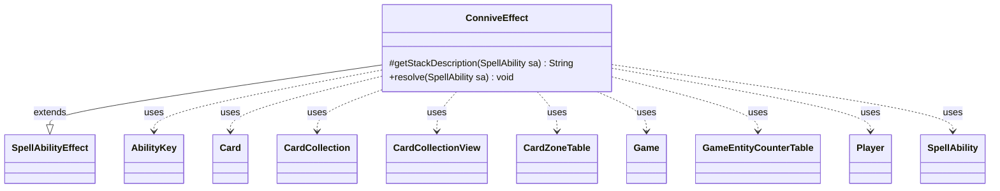

---
aliases:
  - ConniveEffect
tags:
  - java/class
  - module/forge-game
  - pkg/forge/game/ability/effects
fqn: forge.game.ability.effects.ConniveEffect
package: forge.game.ability.effects
module: forge-game
kind: Class
---

# ConniveEffect

**Package:** `forge.game.ability.effects` &nbsp; **Module:** `forge-game` &nbsp; **Kind:** Class



## Relationships
**Extends:**
- [[forge.game.ability.SpellAbilityEffect|SpellAbilityEffect]]
**Uses:**
- [[forge.game.Game|Game]]
- [[forge.game.GameEntityCounterTable|GameEntityCounterTable]]
- [[forge.game.ability.AbilityKey|AbilityKey]]
- [[forge.game.card.Card|Card]]
- [[forge.game.card.CardCollection|CardCollection]]
- [[forge.game.card.CardCollectionView|CardCollectionView]]
- [[forge.game.card.CardZoneTable|CardZoneTable]]
- [[forge.game.player.Player|Player]]
- [[forge.game.spellability.SpellAbility|SpellAbility]]

## Design Description

ConniveEffect implements the resolution logic for Magic's "connive" keyword action as a concrete `SpellAbilityEffect` subclass within Forge's data-driven ability framework. It overrides `getStackDescription` to build the human-readable stack text and `resolve` to execute the effect: each targeted creature's controller draws and then discards the configured number of cards, and the creature gains a +1/+1 counter for every nonland card discarded.

The design carefully handles multiplayer ordering and game-state integrity. Controllers are sorted into APNAP turn order via `Collections.rotate`, and each resolves its connivers one at a time through player-driven choices. It collaborates with `Player`, `Card`, and `CardCollection` for the draw/discard flow while batching side effects through a `CardZoneTable`, a `GameEntityCounterTable`, and an `AbilityKey` move-parameter map so zone changes and counter placements apply atomically. Notably, it re-fetches the conniver's current `Game` state and confirms it is still on the battlefield with an unchanged timestamp before adding counters, guarding against the creature leaving or being reset mid-resolution.

## Source
`forge-game/src/main/java/forge/game/ability/effects/ConniveEffect.java`

```java
package forge.game.ability.effects;

import com.google.common.collect.Maps;
import forge.game.Game;
import forge.game.GameActionUtil;
import forge.game.GameEntityCounterTable;
import forge.game.ability.AbilityKey;
import forge.game.ability.AbilityUtils;
import forge.game.ability.SpellAbilityEffect;
import forge.game.card.*;
import forge.game.player.Player;
import forge.game.spellability.SpellAbility;
import forge.game.zone.ZoneType;
import forge.util.Lang;
import forge.util.Localizer;

import java.util.ArrayList;
import java.util.Collections;
import java.util.List;
import java.util.Map;

public class ConniveEffect extends SpellAbilityEffect {

    /* (non-Javadoc)
     * @see forge.game.ability.SpellAbilityEffect#getStackDescription(forge.game.spellability.SpellAbility)
     * returns the automatically generated stack description string
     */
    @Override
    protected String getStackDescription(SpellAbility sa) {
        List<Card> tgt = getTargetCards(sa);
        if (tgt.size() <= 0) {
            return "";
        } else {
            final StringBuilder sb = new StringBuilder();
            sb.append(Lang.joinHomogenous(tgt)).append(tgt.size() > 1 ? " connive." : " connives.");
            return sb.toString();
        }
    }

    /* (non-Javadoc)
     * @see forge.game.ability.SpellAbilityEffect#resolve(forge.game.spellability.SpellAbility)
     */
    @Override
    public void resolve(SpellAbility sa) {
        final Card host = sa.getHostCard();
        final Game game = host.getGame();
        final int num = AbilityUtils.calculateAmount(host, sa.getParamOrDefault("ConniveNum", "1"), sa);

        CardCollection toConnive = getTargetCards(sa);
        if (toConnive.isEmpty()) { // if nothing is conniving, we're done
            return;
        }

        List<Player> controllers = new ArrayList<>();
        for (Card c : toConnive) {
            final Player controller = c.getController();
            if (!controllers.contains(controller)) {
                controllers.add(controller);
            }
        }
        //order controllers by APNAP
        int indexAP = controllers.indexOf(game.getPhaseHandler().getPlayerTurn());
        if (indexAP != -1) {
            Collections.rotate(controllers, - indexAP);
        }

        for (final Player p : controllers) {
            final CardCollection connivers = CardLists.filterControlledBy(toConnive, p);
            while (!connivers.isEmpty()) {
                final Map<AbilityKey, Object> moveParams = AbilityKey.newMap();
                final CardZoneTable zoneMovements = AbilityKey.addCardZoneTableParams(moveParams, sa);
                final GameEntityCounterTable counterPlacements = new GameEntityCounterTable();

                Card conniver = connivers.size() > 1 ? p.getController().chooseSingleEntityForEffect(connivers, sa,
                        Localizer.getInstance().getMessage("lblChooseConniver"), null) : connivers.get(0);
                connivers.remove(conniver);

                p.drawCards(num, sa, moveParams);

                // in case anything triggers from drawing that happened before discard, e.g. Sneaky Snacker
                game.getTriggerHandler().collectTriggerForWaiting();

                CardCollection hand = new CardCollection(p.getCardsIn(ZoneType.Hand));
                if (hand.isEmpty() || !p.canDiscardBy(sa, true)) {
                    continue;
                }

                int amt = Math.min(hand.size(), num);
                CardCollectionView toBeDiscarded = amt == 0 ? CardCollection.EMPTY :
                        p.getController().chooseCardsToDiscardFrom(p, sa, hand, amt, amt);

                toBeDiscarded = GameActionUtil.orderCardsByTheirOwners(game, toBeDiscarded, ZoneType.Graveyard, sa);

                // need to get newest game state to check if it is still on the battlefield and the timestamp didn't change
                Card gamec = game.getCardState(conniver);
                // if the card is not in the game anymore, this might still return true, but it's no problem
                if (game.getZoneOf(gamec).is(ZoneType.Battlefield) && gamec.equalsWithGameTimestamp(conniver)) {
                    int numCntrs = CardLists.getValidCardCount(toBeDiscarded, "Card.nonLand", p, host, sa);
                    conniver.addCounter(CounterEnumType.P1P1, numCntrs, p, counterPlacements);
                }
                final Map<Player, CardCollectionView> discardedMap = Maps.newHashMap();
                discardedMap.put(p, CardCollection.getView(toBeDiscarded));
                discard(sa, true, discardedMap, moveParams);
                counterPlacements.replaceCounterEffect(game, sa);
                zoneMovements.triggerChangesZoneAll(game, sa);
            }
        }
    }
}
```
