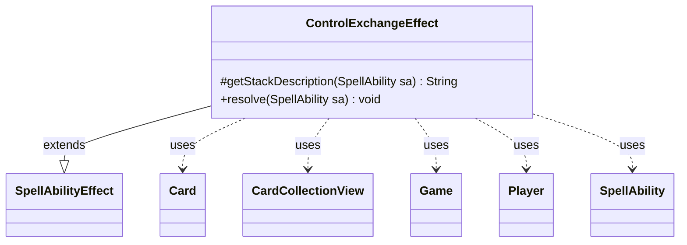

---
aliases:
  - ControlExchangeEffect
tags:
  - java/class
  - module/forge-game
  - pkg/forge/game/ability/effects
fqn: forge.game.ability.effects.ControlExchangeEffect
package: forge.game.ability.effects
module: forge-game
kind: Class
---

# ControlExchangeEffect

**Package:** `forge.game.ability.effects` &nbsp; **Module:** `forge-game` &nbsp; **Kind:** Class



## Relationships
**Extends:**
- [[forge.game.ability.SpellAbilityEffect|SpellAbilityEffect]]
**Uses:**
- [[forge.game.Game|Game]]
- [[forge.game.card.Card|Card]]
- [[forge.game.card.CardCollectionView|CardCollectionView]]
- [[forge.game.player.Player|Player]]
- [[forge.game.spellability.SpellAbility|SpellAbility]]

## Design Description

ControlExchangeEffect implements the resolution logic for spell abilities that swap control of two permanents, such as Magic's "exchange control" effects. As a concrete subclass of SpellAbilityEffect, it plugs into Forge's ability-factory framework, overriding `getStackDescription` to render a human-readable summary and `resolve` to apply the swap. It resolves its two operands from either targeted Cards or a "Defined" parameter, then collaborates with the Card, Player, and Game model to perform the exchange. Notable design intent includes defensive guards—both permanents must remain in play, not phased out, and be legally controllable by the prospective new controller—and a single Game timestamp applied via `addTempController` so the two control changes are simultaneous and correctly layered. Optional player confirmation and a RememberExchanged hook reflect Forge's data-driven card-scripting conventions.

## Source
`forge-game/src/main/java/forge/game/ability/effects/ControlExchangeEffect.java`

```java
package forge.game.ability.effects;

import java.util.List;

import forge.game.Game;
import forge.game.ability.AbilityUtils;
import forge.game.ability.SpellAbilityEffect;
import forge.game.card.Card;
import forge.game.card.CardCollectionView;
import forge.game.player.Player;
import forge.game.spellability.SpellAbility;
import forge.util.Localizer;


public class ControlExchangeEffect extends SpellAbilityEffect {

    /* (non-Javadoc)
     * @see forge.card.abilityfactory.SpellEffect#getStackDescription(java.util.Map, forge.card.spellability.SpellAbility)
     */
    @Override
    protected String getStackDescription(SpellAbility sa) {
        Card object1 = null;
        Card object2 = null;
        CardCollectionView tgts = null;
        if (sa.usesTargeting()) {
            tgts = sa.getTargets().getTargetCards();
            if (tgts.size() > 0) {
                object1 = tgts.get(0);
            }
        }
        if (sa.hasParam("Defined")) {
            List<Card> cards = AbilityUtils.getDefinedCards(sa.getHostCard(), sa.getParam("Defined"), sa);
            object2 = cards.isEmpty() ? null : cards.get(0);
            if (cards.size() > 1 && !sa.usesTargeting()) {
                object1 = cards.get(1);
            }
        } else if (tgts.size() > 1) {
            object2 = tgts.get(1);
        }

        if (object1 == null || object2 == null) {
            return "";
        }

        return object1 + " exchanges controller with " + object2;
    }

    /* (non-Javadoc)
     * @see forge.card.abilityfactory.SpellEffect#resolve(java.util.Map, forge.card.spellability.SpellAbility)
     */
    @Override
    public void resolve(SpellAbility sa) {
        Card host = sa.getHostCard();
        Game game = host.getGame();
        Card object1 = null;
        Card object2 = null;

        CardCollectionView tgts = null;
        if (sa.usesTargeting()) {
            tgts = sa.getTargets().getTargetCards();
            if (tgts.size() > 0) {
                object1 = tgts.get(0);
            }
        }
        if (sa.hasParam("Defined")) {
            final List<Card> cards = AbilityUtils.getDefinedCards(host, sa.getParam("Defined"), sa);
            object2 = cards.isEmpty() ? null : cards.get(0);
            if (cards.size() > 1 && !sa.usesTargeting()) {
                object1 = cards.get(1);
            }
        } else if (tgts.size() > 1) {
            object2 = tgts.get(1);
        }

        if (object1 == null || object2 == null || !object1.isInPlay() || !object2.isInPlay()
                || object1.isPhasedOut() || object2.isPhasedOut()) {
            return;
        }

        final Player player1 = object1.getController();
        final Player player2 = object2.getController();

        if (!object2.canBeControlledBy(player1) || !object1.canBeControlledBy(player2)) {
            return;
        }

        if (sa.hasParam("Optional") && !sa.getActivatingPlayer().getController().confirmAction(sa, null,
                Localizer.getInstance().getMessage("lblExchangeControl",
                        object1.getTranslatedName(),
                        object2.getTranslatedName()), null)) {
            return;
        }

        final long tStamp = game.getNextTimestamp();
        object2.addTempController(player1, tStamp);
        object1.addTempController(player2, tStamp);
        if (sa.hasParam("RememberExchanged")) {
            host.addRemembered(object1);
            host.addRemembered(object2);
        }
    }

}
```
