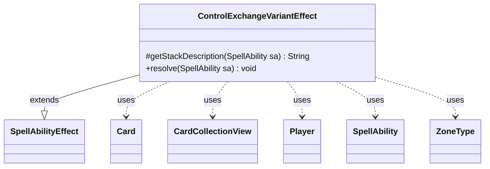

---
aliases:
  - ControlExchangeVariantEffect
tags:
  - java/class
  - module/forge-game
  - pkg/forge/game/ability/effects
fqn: forge.game.ability.effects.ControlExchangeVariantEffect
package: forge.game.ability.effects
module: forge-game
kind: Class
---

# ControlExchangeVariantEffect

**Package:** `forge.game.ability.effects` &nbsp; **Module:** `forge-game` &nbsp; **Kind:** Class



## Relationships
**Extends:**
- [[forge.game.ability.SpellAbilityEffect|SpellAbilityEffect]]
**Uses:**
- [[forge.game.card.Card|Card]]
- [[forge.game.card.CardCollectionView|CardCollectionView]]
- [[forge.game.player.Player|Player]]
- [[forge.game.spellability.SpellAbility|SpellAbility]]
- [[forge.game.zone.ZoneType|ZoneType]]

## Design Description

Control exchange variant effect: implements a resolvable game effect that swaps control of cards between two players, modeling Magic permanents-exchange spells such as "exchange control of permanents."

As a concrete `SpellAbilityEffect` subclass, it overrides `getStackDescription` to summarize the action for the game stack and `resolve` to carry it out. The effect targets exactly two players, reads optional `Zone` (default Battlefield) and `Type` parameters, and uses `AbilityUtils.filterListByType` to build matching `CardCollectionView` lists from each player's zone. The activating player chooses equal numbers of cards from each side through the controller interface, after which every card is validated via `canBeControlledBy` the opposing player before any change occurs. Control is then reassigned through `Card.addTempController` under a single shared timestamp. The equal-count constraint and up-front validation enforce a symmetric, all-or-nothing exchange, while the common timestamp keeps the control changes consistent within the layer system.

## Source
`forge-game/src/main/java/forge/game/ability/effects/ControlExchangeVariantEffect.java`

```java
package forge.game.ability.effects;

import java.util.List;

import org.apache.commons.lang3.StringUtils;

import forge.game.ability.AbilityUtils;
import forge.game.ability.SpellAbilityEffect;
import forge.game.card.Card;
import forge.game.card.CardCollectionView;
import forge.game.player.Player;
import forge.game.spellability.SpellAbility;
import forge.game.zone.ZoneType;
import forge.util.Localizer;


public class ControlExchangeVariantEffect extends SpellAbilityEffect {
    @Override
    protected String getStackDescription(SpellAbility sa) {
        return "Exchange cards controlled by " + StringUtils.join(getTargetPlayers(sa), ",");
    }

    @Override
    public void resolve(SpellAbility sa) {
        final Player activator = sa.getActivatingPlayer();
        final List<Player> players = getTargetPlayers(sa);
        if (players.size() != 2) {
            return;
        }
        final Player player1 = players.get(0);
        final Player player2 = players.get(1);
        final ZoneType zone = ZoneType.smartValueOf(sa.getParamOrDefault("Zone", "Battlefield"));
        final String type = sa.getParamOrDefault("Type", "Card");
        // get valid lists
        CardCollectionView list1 = AbilityUtils.filterListByType(player1.getCardsIn(zone), type, sa);
        CardCollectionView list2 = AbilityUtils.filterListByType(player2.getCardsIn(zone), type, sa);
        int max = Math.min(list1.size(), list2.size());
        // choose the same number of cards
        CardCollectionView chosen1 = activator.getController().chooseCardsForEffect(list1, sa, Localizer.getInstance().getMessage("lblChooseCards") + ":" + player1, 0, max, true, null);
        int num = chosen1.size();
        CardCollectionView chosen2 = activator.getController().chooseCardsForEffect(list2, sa, Localizer.getInstance().getMessage("lblChooseCards") + ":" + player2, num, num, true, null);
        // check all cards can be controlled by the other player
        for (final Card c : chosen1) {
            if (!c.canBeControlledBy(player2)) {
                return;
            }
        }
        for (final Card c : chosen2) {
            if (!c.canBeControlledBy(player1)) {
                return;
            }
        }
        // set new controller
        final long tStamp = sa.getActivatingPlayer().getGame().getNextTimestamp();
        for (final Card c : chosen1) {
            c.addTempController(player2, tStamp);
        }
        for (final Card c : chosen2) {
            c.addTempController(player1, tStamp);
        }
    }
}
```
