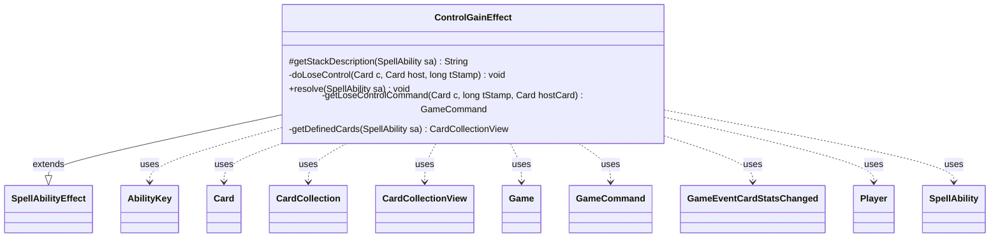

---
aliases:
  - ControlGainEffect
tags:
  - java/class
  - module/forge-game
  - pkg/forge/game/ability/effects
fqn: forge.game.ability.effects.ControlGainEffect
package: forge.game.ability.effects
module: forge-game
kind: Class
---

# ControlGainEffect

**Package:** `forge.game.ability.effects`   **Module:** `forge-game`   **Kind:** Class



## Relationships
**Extends:**
- [[forge.game.ability.SpellAbilityEffect|SpellAbilityEffect]]
**Uses:**
- [[forge.GameCommand|GameCommand]]
- [[forge.game.Game|Game]]
- [[forge.game.ability.AbilityKey|AbilityKey]]
- [[forge.game.card.Card|Card]]
- [[forge.game.card.CardCollection|CardCollection]]
- [[forge.game.card.CardCollectionView|CardCollectionView]]
- [[forge.game.event.GameEventCardStatsChanged|GameEventCardStatsChanged]]
- [[forge.game.player.Player|Player]]
- [[forge.game.spellability.SpellAbility|SpellAbility]]


## Design Description

ControlGainEffect implements the resolution logic for "gain control" abilities in Forge's MTG engine. As a concrete `SpellAbilityEffect` subclass, it overrides `getStackDescription` to build human-readable rules text and `resolve` to apply the control change, assigning each defined or chosen `Card` a timestamped temporary controller drawn from the targeted `Player`. It works through `CardCollection`/`CardCollectionView` to enumerate targets and through `Game` to allocate timestamps, fire `GameEventCardStatsChanged`, and register cleanup hooks.

A key design intent is its duration model: instead of tracking control statically, it wraps the reversal (`doLoseControl`) in `GameCommand` closures registered against the trigger named by the `LoseControl` parameter — end-of-turn, untap, change-of-controller, leaves-play, or static check — so control reverts under the right condition. Optional untap, granted keywords, and remembered targets are layered onto the same timestamp for consistent rollback.

## Source
`forge-game/src/main/java/forge/game/ability/effects/ControlGainEffect.java`

```java
package forge.game.ability.effects;

import java.util.Arrays;
import java.util.Collections;
import java.util.List;
import java.util.Map;

import com.google.common.collect.Lists;

import com.google.common.collect.Maps;
import forge.GameCommand;
import forge.game.Game;
import forge.game.ability.AbilityKey;
import forge.game.ability.AbilityUtils;
import forge.game.ability.SpellAbilityEffect;
import forge.game.card.Card;
import forge.game.card.CardCollection;
import forge.game.card.CardCollectionView;
import forge.game.card.CardLists;
import forge.game.event.GameEventCardStatsChanged;
import forge.game.player.Player;
import forge.game.spellability.SpellAbility;
import forge.game.trigger.TriggerType;
import forge.game.zone.ZoneType;
import forge.util.Localizer;

public class ControlGainEffect extends SpellAbilityEffect {

    @Override
    protected String getStackDescription(SpellAbility sa) {
        final StringBuilder sb = new StringBuilder();

        final List<Player> newController = getDefinedPlayersOrTargeted(sa, "NewController");
        if (newController.isEmpty()) {
            newController.add(sa.getActivatingPlayer());
        }

        sb.append(newController.get(0)).append(" gains control of");

        final CardCollectionView tgts = getDefinedCards(sa);
        if (tgts.isEmpty()) {
        	sb.append(" (nothing)");
        } else {
            for (final Card c : tgts) {
                sb.append(" ");
                if (c.isFaceDown()) {
                    sb.append("Face-down creature (").append(c.getId()).append(')');
                } else {
                    sb.append(c);
                }
            }
        }
        if (sa.hasParam("LoseControl")) {
            String loseCont = sa.getParam("LoseControl");
            if (loseCont.contains("EOT")) {
                sb.append(" until end of turn");
            } else if (loseCont.contains("Untap")) {
                sb.append(" for as long as ").append(sa.getHostCard()).append(" remains tapped");
            } else if (loseCont.contains("LoseControl")) {
                sb.append(" for as long as you control ").append(sa.getHostCard());
            } else if (loseCont.contains("LeavesPlay")) {
                sb.append(" for as long as ").append(sa.getHostCard()).append( "remains on the battlefield");
            } else if (loseCont.equals("StaticCommandCheck")) {
                sb.append(" for as long as that creature remains enchanted");
            } else if (loseCont.equals("UntilTheEndOfYourNextTurn")) {
                sb.append(" until the end of your next turn");
            }
        }
        sb.append(".");

        if (sa.hasParam("Untap")) {
            sb.append(" Untap it.");
        }
        final List<String> keywords = sa.hasParam("AddKWs") ? Arrays.asList(sa.getParam("AddKWs").split(" & ")) : null;
        if (sa.hasParam("AddKWs")) {
            sb.append(" It gains ");
            for (int i = 0; i < keywords.size(); i++) {
                sb.append(keywords.get(i).toLowerCase());
                sb.append(keywords.size() > 2 && i+1 != keywords.size() ? ", " : "");
                sb.append(keywords.size() == 2 && i == 0 ? " " : "");
                sb.append(i+2 == keywords.size() ? "and " : "");
            }
            sb.append(" until end of turn.");
        }

        return sb.toString();
    }

    private static void doLoseControl(final Card c, final Card host, final long tStamp) {
        if (null == c || c.hasKeyword("Other players can't gain control of CARDNAME.")) {
            return;
        }
        final Game game = host.getGame();
        if (c.isInPlay()) {
            c.removeTempController(tStamp);

            game.getAction().controllerChangeZoneCorrection(c);
        }
        host.removeGainControlTargets(c);
    }

    @Override
    public void resolve(SpellAbility sa) {
        Card source = sa.getHostCard();
        final Player activator = sa.getActivatingPlayer();

        final boolean bUntap = sa.hasParam("Untap");
        final boolean remember = sa.hasParam("RememberControlled");
        final boolean forget = sa.hasParam("ForgetControlled");
        final List<String> keywords = sa.hasParam("AddKWs") ? Arrays.asList(sa.getParam("AddKWs").split(" & ")) : null;
        final List<String> lose = sa.hasParam("LoseControl") ? Arrays.asList(sa.getParam("LoseControl").split(",")) : null;

        final List<Player> controllers = getDefinedPlayersOrTargeted(sa, "NewController");

        final Player newController = controllers.isEmpty() ? activator : controllers.get(0);
        final Game game = newController.getGame();

        CardCollectionView tgtCards;
        if (sa.hasParam("Choices")) {
            Player chooser = sa.hasParam("Chooser") ? AbilityUtils.getDefinedPlayers(source,
                    sa.getParam("Chooser"), sa).get(0) : activator;
            CardCollectionView choices = CardLists.getValidCards(game.getCardsIn(ZoneType.Battlefield),
                    sa.getParam("Choices"), activator, source, sa);
            if (choices.isEmpty()) {
                return;
            }
            String title = sa.hasParam("ChoiceTitle") ? sa.getParam("ChoiceTitle") :
                Localizer.getInstance().getMessage("lblChooseaCard") +" ";
            tgtCards = chooser.getController().chooseCardsForEffect(choices, sa, title, 1, 1, false, null);
        } else {
            tgtCards = getDefinedCards(sa);
        }

        // check for lose control criteria right away
        if (lose != null && lose.contains("LeavesPlay") && !source.isInPlay()) {
            return;
        }
        if (lose != null && lose.contains("LoseControl") && source.getController() != sa.getActivatingPlayer()) {
            return;
        }
        if (lose != null && lose.contains("Untap") && !source.isTapped()) {
            return;
        }

        CardCollection untapped = new CardCollection();
        for (Card tgtC : tgtCards) {
            if (!tgtC.isInPlay() || !tgtC.canBeControlledBy(newController)) {
                continue;
            }
            if (tgtC.isPhasedOut()) {
                continue;
            }

            if (sa.hasParam("Optional") && !activator.getController().confirmAction(sa, null,
                    Localizer.getInstance().getMessage("lblGainControlConfirm", newController,
                            tgtC.getTranslatedName()), null)) {
                continue;
            }

            if (!tgtC.equals(source) && !source.getGainControlTargets().contains(tgtC)) {
                source.addGainControlTarget(tgtC);
            }

            long tStamp = game.getNextTimestamp();
            tgtC.addTempController(newController, tStamp);

            if (bUntap) {
                if (tgtC.untap()) untapped.add(tgtC);
            }

            if (keywords != null) {
                tgtC.addChangedCardKeywords(keywords, Lists.newArrayList(), false, tStamp, null);
                game.fireEvent(new GameEventCardStatsChanged(tgtC));
            }

            if (remember && !source.isRemembered(tgtC)) {
                source.addRemembered(tgtC);
            }

            if (forget && source.isRemembered(tgtC)) {
                source.removeRemembered(tgtC);
            }

            if (lose != null) {
                final GameCommand loseControl = getLoseControlCommand(tgtC, tStamp, source);
                if (lose.contains("LeavesPlay") && source != tgtC) { // Only return control if host and target are different cards
                    source.addLeavesPlayCommand(loseControl);
                }
                if (lose.contains("Untap")) {
                    source.addUntapCommand(loseControl);
                }
                if (lose.contains("LoseControl")) {
                    source.addChangeControllerCommand(loseControl);
                }
                if (lose.contains("EOT")) {
                    game.getEndOfTurn().addUntil(loseControl);
                    tgtC.addChangedSVars(Collections.singletonMap("SacMe", "6"), tStamp, 0);
                }
                if (lose.contains("EndOfCombat")) {
                    game.getEndOfCombat().addUntil(loseControl);
                    tgtC.addChangedSVars(Collections.singletonMap("SacMe", "6"), tStamp, 0);
                }
                if (lose.contains("StaticCommandCheck")) {
                    String leftVar = sa.getSVar(sa.getParam("StaticCommandCheckSVar"));
                    String rightVar = sa.getParam("StaticCommandSVarCompare");
                    source.addStaticCommandList(new Object[]{leftVar, rightVar, tgtC, loseControl});
                }
                if (lose.contains("UntilSourceUnattached")) {
                    Card attachment = (Card) sa.getTriggeringObject(AbilityKey.Source);
                    attachment.addLeavesPlayCommand(loseControl);
                    attachment.addPhaseOutCommand(loseControl);
                    attachment.addUnattachCommand(loseControl);
                }
                if (lose.contains("UntilTheEndOfYourNextTurn")) {
                    if (game.getPhaseHandler().isPlayerTurn(sa.getActivatingPlayer())) {
                        game.getEndOfTurn().registerUntilEnd(sa.getActivatingPlayer(), loseControl);
                    } else {
                        game.getEndOfTurn().addUntilEnd(sa.getActivatingPlayer(), loseControl);
                    }
                }
            }

            if (keywords != null) {
                // Add keywords only until end of turn
                final GameCommand untilKeywordEOT = new GameCommand() {
                    private static final long serialVersionUID = -42244224L;

                    @Override
                    public void run() {
                        tgtC.removeChangedCardKeywords(tStamp, 0);
                    }
                };
                game.getEndOfTurn().addUntil(untilKeywordEOT);
            }

            game.getAction().controllerChangeZoneCorrection(tgtC);
        } // end foreach target

        if (!untapped.isEmpty()) {
            final Map<AbilityKey, Object> runParams = AbilityKey.newMap();
            final Map<Player, CardCollection> map = Maps.newHashMap();
            map.put(activator, untapped);
            runParams.put(AbilityKey.Map, map);
            game.getTriggerHandler().runTrigger(TriggerType.UntapAll, runParams, false);
        }
    }

    /**
     * <p>
     * getLoseControlCommand.
     * </p>
     *
     * @param i
     *            a int.
     * @param originalController
     *            a {@link forge.game.player.Player} object.
     * @return a {@link forge.GameCommand} object.
     */
    private static GameCommand getLoseControlCommand(final Card c, final long tStamp, final Card hostCard) {
        final GameCommand loseControl = new GameCommand() {
            private static final long serialVersionUID = 878543373519872418L;

            @Override
            public void run() {
                doLoseControl(c, hostCard, tStamp);
                c.removeChangedSVars(tStamp, 0);
            }
        };

        return loseControl;
    }

    private CardCollectionView getDefinedCards(final SpellAbility sa) {
        final Game game = sa.getHostCard().getGame();
        if (sa.hasParam("AllValid")) {
            return AbilityUtils.filterListByType(game.getCardsIn(ZoneType.Battlefield), sa.getParam("AllValid"), sa);
        }
        return getDefinedCardsOrTargeted(sa);
    }
}
```

## Python
`forge/game/ability/effects/ControlGainEffect.py`

```python
from forge.GameCommand import GameCommand
from forge.game.Game import Game
from forge.game.ability.AbilityKey import AbilityKey
from forge.game.ability.AbilityUtils import AbilityUtils
from forge.game.ability.SpellAbilityEffect import SpellAbilityEffect
from forge.game.card.Card import Card
from forge.game.card.CardCollection import CardCollection
from forge.game.card.CardCollectionView import CardCollectionView
from forge.game.card.CardLists import CardLists
from forge.game.event.GameEventCardStatsChanged import GameEventCardStatsChanged
from forge.game.player.Player import Player
from forge.game.spellability.SpellAbility import SpellAbility
from forge.game.trigger.TriggerType import TriggerType
from forge.game.zone.ZoneType import ZoneType
from forge.util.Localizer import Localizer


class ControlGainEffect(SpellAbilityEffect):

    def getStackDescription(self, sa):
        sb = []

        newController = self.getDefinedPlayersOrTargeted(sa, "NewController")
        if not newController:
            newController.append(sa.getActivatingPlayer())

        sb.append(str(newController[0]))
        sb.append(" gains control of")

        tgts = self.getDefinedCards(sa)
        if not tgts:
            sb.append(" (nothing)")
        else:
            for c in tgts:
                sb.append(" ")
                if c.isFaceDown():
                    sb.append("Face-down creature (")
                    sb.append(str(c.getId()))
                    sb.append(')')
                else:
                    sb.append(str(c))
        if sa.hasParam("LoseControl"):
            loseCont = sa.getParam("LoseControl")
            if "EOT" in loseCont:
                sb.append(" until end of turn")
            elif "Untap" in loseCont:
                sb.append(" for as long as ")
                sb.append(str(sa.getHostCard()))
                sb.append(" remains tapped")
            elif "LoseControl" in loseCont:
                sb.append(" for as long as you control ")
                sb.append(str(sa.getHostCard()))
            elif "LeavesPlay" in loseCont:
                sb.append(" for as long as ")
                sb.append(str(sa.getHostCard()))
                sb.append("remains on the battlefield")
            elif loseCont == "StaticCommandCheck":
                sb.append(" for as long as that creature remains enchanted")
            elif loseCont == "UntilTheEndOfYourNextTurn":
                sb.append(" until the end of your next turn")
        sb.append(".")

        if sa.hasParam("Untap"):
            sb.append(" Untap it.")
        keywords = sa.getParam("AddKWs").split(" & ") if sa.hasParam("AddKWs") else None
        if sa.hasParam("AddKWs"):
            sb.append(" It gains ")
            for i in range(len(keywords)):
                sb.append(keywords[i].lower())
                sb.append(", " if len(keywords) > 2 and i + 1 != len(keywords) else "")
                sb.append(" " if len(keywords) == 2 and i == 0 else "")
                sb.append("and " if i + 2 == len(keywords) else "")
            sb.append(" until end of turn.")

        return "".join(sb)

    @staticmethod
    def doLoseControl(c, host, tStamp):
        if c is None or c.hasKeyword("Other players can't gain control of CARDNAME."):
            return
        game = host.getGame()
        if c.isInPlay():
            c.removeTempController(tStamp)

            game.getAction().controllerChangeZoneCorrection(c)
        host.removeGainControlTargets(c)

    def resolve(self, sa):
        source = sa.getHostCard()
        activator = sa.getActivatingPlayer()

        bUntap = sa.hasParam("Untap")
        remember = sa.hasParam("RememberControlled")
        forget = sa.hasParam("ForgetControlled")
        keywords = sa.getParam("AddKWs").split(" & ") if sa.hasParam("AddKWs") else None
        lose = sa.getParam("LoseControl").split(",") if sa.hasParam("LoseControl") else None

        controllers = self.getDefinedPlayersOrTargeted(sa, "NewController")

        newController = activator if not controllers else controllers[0]
        game = newController.getGame()

        if sa.hasParam("Choices"):
            chooser = AbilityUtils.getDefinedPlayers(source, sa.getParam("Chooser"), sa)[0] \
                if sa.hasParam("Chooser") else activator
            choices = CardLists.getValidCards(game.getCardsIn(ZoneType.Battlefield),
                    sa.getParam("Choices"), activator, source, sa)
            if not choices:
                return
            title = sa.getParam("ChoiceTitle") if sa.hasParam("ChoiceTitle") else \
                Localizer.getInstance().getMessage("lblChooseaCard") + " "
            tgtCards = chooser.getController().chooseCardsForEffect(choices, sa, title, 1, 1, False, None)
        else:
            tgtCards = self.getDefinedCards(sa)

        # check for lose control criteria right away
        if lose is not None and "LeavesPlay" in lose and not source.isInPlay():
            return
        if lose is not None and "LoseControl" in lose and source.getController() != sa.getActivatingPlayer():
            return
        if lose is not None and "Untap" in lose and not source.isTapped():
            return

        untapped = CardCollection()
        for tgtC in tgtCards:
            if not tgtC.isInPlay() or not tgtC.canBeControlledBy(newController):
                continue
            if tgtC.isPhasedOut():
                continue

            if sa.hasParam("Optional") and not activator.getController().confirmAction(sa, None,
                    Localizer.getInstance().getMessage("lblGainControlConfirm", newController,
                            tgtC.getTranslatedName()), None):
                continue

            if not tgtC.equals(source) and tgtC not in source.getGainControlTargets():
                source.addGainControlTarget(tgtC)

            tStamp = game.getNextTimestamp()
            tgtC.addTempController(newController, tStamp)

            if bUntap:
                if tgtC.untap():
                    untapped.add(tgtC)

            if keywords is not None:
                tgtC.addChangedCardKeywords(keywords, [], False, tStamp, None)
                game.fireEvent(GameEventCardStatsChanged(tgtC))

            if remember and not source.isRemembered(tgtC):
                source.addRemembered(tgtC)

            if forget and source.isRemembered(tgtC):
                source.removeRemembered(tgtC)

            if lose is not None:
                loseControl = self.getLoseControlCommand(tgtC, tStamp, source)
                if "LeavesPlay" in lose and source != tgtC:  # Only return control if host and target are different cards
                    source.addLeavesPlayCommand(loseControl)
                if "Untap" in lose:
                    source.addUntapCommand(loseControl)
                if "LoseControl" in lose:
                    source.addChangeControllerCommand(loseControl)
                if "EOT" in lose:
                    game.getEndOfTurn().addUntil(loseControl)
                    tgtC.addChangedSVars({"SacMe": "6"}, tStamp, 0)
                if "EndOfCombat" in lose:
                    game.getEndOfCombat().addUntil(loseControl)
                    tgtC.addChangedSVars({"SacMe": "6"}, tStamp, 0)
                if "StaticCommandCheck" in lose:
                    leftVar = sa.getSVar(sa.getParam("StaticCommandCheckSVar"))
                    rightVar = sa.getParam("StaticCommandSVarCompare")
                    source.addStaticCommandList([leftVar, rightVar, tgtC, loseControl])
                if "UntilSourceUnattached" in lose:
                    attachment = sa.getTriggeringObject(AbilityKey.Source)
                    attachment.addLeavesPlayCommand(loseControl)
                    attachment.addPhaseOutCommand(loseControl)
                    attachment.addUnattachCommand(loseControl)
                if "UntilTheEndOfYourNextTurn" in lose:
                    if game.getPhaseHandler().isPlayerTurn(sa.getActivatingPlayer()):
                        game.getEndOfTurn().registerUntilEnd(sa.getActivatingPlayer(), loseControl)
                    else:
                        game.getEndOfTurn().addUntilEnd(sa.getActivatingPlayer(), loseControl)

            if keywords is not None:
                # Add keywords only until end of turn
                class _UntilKeywordEOT(GameCommand):
                    serialVersionUID = -42244224

                    def run(self):
                        tgtC.removeChangedCardKeywords(tStamp, 0)

                untilKeywordEOT = _UntilKeywordEOT()
                game.getEndOfTurn().addUntil(untilKeywordEOT)

            game.getAction().controllerChangeZoneCorrection(tgtC)
        # end foreach target

        if not untapped.isEmpty():
            runParams = AbilityKey.newMap()
            map = {}
            map[activator] = untapped
            runParams[AbilityKey.Map] = map
            game.getTriggerHandler().runTrigger(TriggerType.UntapAll, runParams, False)

    @staticmethod
    def getLoseControlCommand(c, tStamp, hostCard):
        class _LoseControl(GameCommand):
            serialVersionUID = 878543373519872418

            def run(self):
                ControlGainEffect.doLoseControl(c, hostCard, tStamp)
                c.removeChangedSVars(tStamp, 0)

        loseControl = _LoseControl()

        return loseControl

    def getDefinedCards(self, sa):
        game = sa.getHostCard().getGame()
        if sa.hasParam("AllValid"):
            return AbilityUtils.filterListByType(game.getCardsIn(ZoneType.Battlefield), sa.getParam("AllValid"), sa)
        return self.getDefinedCardsOrTargeted(sa)
```
