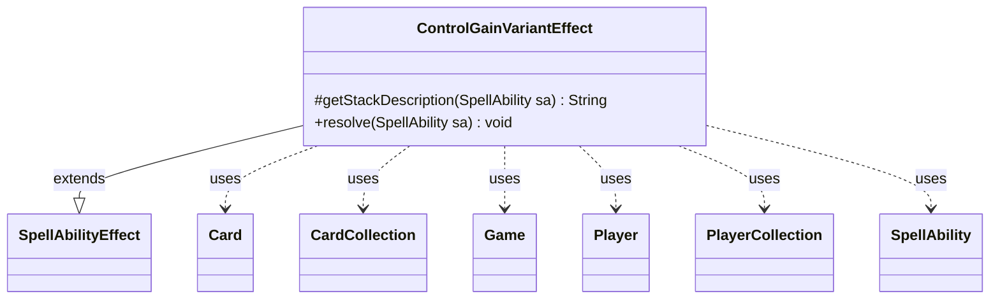

---
aliases:
  - ControlGainVariantEffect
tags:
  - java/class
  - module/forge-game
  - pkg/forge/game/ability/effects
fqn: forge.game.ability.effects.ControlGainVariantEffect
package: forge.game.ability.effects
module: forge-game
kind: Class
---

# ControlGainVariantEffect

**Package:** `forge.game.ability.effects` &nbsp; **Module:** `forge-game` &nbsp; **Kind:** Class



## Relationships
**Extends:**
- [[forge.game.ability.SpellAbilityEffect|SpellAbilityEffect]]
**Uses:**
- [[forge.game.Game|Game]]
- [[forge.game.card.Card|Card]]
- [[forge.game.card.CardCollection|CardCollection]]
- [[forge.game.player.Player|Player]]
- [[forge.game.player.PlayerCollection|PlayerCollection]]
- [[forge.game.spellability.SpellAbility|SpellAbility]]


## Design Description

ControlGainVariantEffect is a concrete spell-ability effect that resolves Magic cards in which several players simultaneously gain control of multiple permanents. As its leading comment explains, it exists because a plain GainControl ability embedded in RepeatEach loops mishandles timestamps; this class instead computes all control changes against a single shared timestamp obtained from the Game. Extending SpellAbilityEffect, it overrides `resolve` to perform the work and `getStackDescription` to delegate to the ability's own description.

Internally `resolve` dispatches on the `ChangeController` parameter, handling each card-specific variant (Aminatou's directional shift, Homeward Path's owner-return, Scrambleverse's randomization, Order of Succession's and Inniaz's player choices) by building a `Map<Player, CardCollection>` of intended new controllers. It collaborates with the Game and a rotated PlayerCollection to order players relative to the activator, gathers valid Cards from the battlefield, then assigns control via `addTempController`, guarding that each card is still in play and legally controllable.

## Source
`forge-game/src/main/java/forge/game/ability/effects/ControlGainVariantEffect.java`

```java
package forge.game.ability.effects;

import java.util.Collections;
import java.util.Map;

import com.google.common.collect.Maps;

import forge.game.Direction;
import forge.game.Game;
import forge.game.ability.SpellAbilityEffect;
import forge.game.card.Card;
import forge.game.card.CardCollection;
import forge.game.card.CardLists;
import forge.game.card.CardPredicates;
import forge.game.player.Player;
import forge.game.player.PlayerCollection;
import forge.game.spellability.SpellAbility;
import forge.game.zone.ZoneType;
import forge.util.Aggregates;

public class ControlGainVariantEffect extends SpellAbilityEffect {
    /* (non-Javadoc)
     * @see forge.card.abilityfactory.SpellEffect#getStackDescription(java.util.Map, forge.card.spellability.SpellAbility)
     */
    @Override
    protected String getStackDescription(SpellAbility sa) {
        return sa.getDescription();
    }

    @Override
    public void resolve(SpellAbility sa) {
        // Multiple players gain control of multiple permanents in an effect
        // GainControl embedded in RepeatEach effects don't work well with timestamps
        final Card source = sa.getHostCard();
        final Game game = source.getGame();
        long tStamp = game.getNextTimestamp();
        final String controller = sa.getParam("ChangeController");
        final Map<Player, CardCollection> gainControl = Maps.newHashMap(); // {newController, CardCollection}
        final PlayerCollection players = game.getPlayers();

        int aidx = players.indexOf(sa.getActivatingPlayer());
        if (aidx != -1) {
            Collections.rotate(players, -aidx);
        }

        CardCollection tgtCards = CardLists.getValidCards(game.getCardsIn(ZoneType.Battlefield),
                sa.getParam("AllValid"), source.getController(), source, sa);

        if ("NextPlayerInChosenDirection".equals(controller) && (source.getChosenDirection() != null) ) {// Aminatou, the Fateshifter
            for (final Player p : players) {
                gainControl.put(p, CardLists.filterControlledBy(tgtCards, game.getNextPlayerAfter(p, source.getChosenDirection())));
            }
        } else if ("CardOwner".equals(controller)) {// Homeward Path, Trostani Discordant etc.
            for (final Player p : players) {
                gainControl.put(p, CardLists.filter(tgtCards, CardPredicates.isOwner(p)));
            }
        } else if ("Random".equals(controller)) {// Scrambleverse
            for (final Card c : tgtCards) {
                final Player p = Aggregates.random(players);
                if (gainControl.containsKey(p)) {
                    gainControl.get(p).add(0, c);
                } else {
                    gainControl.put(p, new CardCollection(c));
                }
            }
        } else if ("ChooseNextPlayerInChosenDirection".equals(controller) && (source.getChosenDirection() != null)) {// Order of Succession
            Player p = sa.getActivatingPlayer();
            do {
                final CardCollection valid = CardLists.filterControlledBy(tgtCards, game.getNextPlayerAfter(p, source.getChosenDirection()));
                final Card c = p.getController().chooseSingleEntityForEffect(valid, sa, " ", null);
                if (c != null) {
                    gainControl.put(p, new CardCollection(c));
                }
                p = game.getNextPlayerAfter(p, source.getChosenDirection());
            } while (!p.equals(sa.getActivatingPlayer()));
        } else if ("ChooseFromPlayerToTheirRight".equals(controller)) {// Inniaz, the Gale Force
            for (final Player p : players) {
                final CardCollection valid = CardLists.filterControlledBy(tgtCards, game.getNextPlayerAfter(p, Direction.Right));
                final Card c = sa.getActivatingPlayer().getController().chooseSingleEntityForEffect(valid, sa,
                        "Choose one for the new Controller: " + p.getName(), null);
                if (c != null) {
                    gainControl.put(p, new CardCollection(c));
                }
            }
        }

        for (Map.Entry<Player, CardCollection> e : gainControl.entrySet()) {
            final Player newController = e.getKey();
            for (Card tgtC : e.getValue()) {
                if (!tgtC.isInPlay() || !tgtC.canBeControlledBy(newController)) {
                    continue;
                }
                tgtC.addTempController(newController, tStamp);
            }
        }
    }

}
```

## Python
`forge/game/ability/effects/ControlGainVariantEffect.py`

```python
from forge.game.ability.SpellAbilityEffect import SpellAbilityEffect
from forge.game.Game import Game
from forge.game.card.Card import Card
from forge.game.card.CardCollection import CardCollection
from forge.game.player.Player import Player
from forge.game.player.PlayerCollection import PlayerCollection
from forge.game.spellability.SpellAbility import SpellAbility

from forge.game.Direction import Direction
from forge.game.card.CardLists import CardLists
from forge.game.card.CardPredicates import CardPredicates
from forge.game.zone.ZoneType import ZoneType
from forge.util.Aggregates import Aggregates


class ControlGainVariantEffect(SpellAbilityEffect):
    # (non-Javadoc)
    # @see forge.card.abilityfactory.SpellEffect#getStackDescription(java.util.Map, forge.card.spellability.SpellAbility)
    def getStackDescription(self, sa: SpellAbility) -> str:
        return sa.getDescription()

    def resolve(self, sa: SpellAbility) -> None:
        # Multiple players gain control of multiple permanents in an effect
        # GainControl embedded in RepeatEach effects don't work well with timestamps
        source = sa.getHostCard()
        game = source.getGame()
        tStamp = game.getNextTimestamp()
        controller = sa.getParam("ChangeController")
        gainControl: dict[Player, CardCollection] = {}  # {newController, CardCollection}
        players = game.getPlayers()

        aidx = players.indexOf(sa.getActivatingPlayer())
        if aidx != -1:
            # Collections.rotate(players, -aidx)
            n = len(players)
            if n != 0:
                shift = (-aidx) % n
                rotated = players[-shift:] + players[:-shift] if shift != 0 else list(players)
                players[:] = rotated

        tgtCards = CardLists.getValidCards(game.getCardsIn(ZoneType.Battlefield),
                sa.getParam("AllValid"), source.getController(), source, sa)

        if "NextPlayerInChosenDirection" == controller and source.getChosenDirection() is not None:  # Aminatou, the Fateshifter
            for p in players:
                gainControl[p] = CardLists.filterControlledBy(tgtCards, game.getNextPlayerAfter(p, source.getChosenDirection()))
        elif "CardOwner" == controller:  # Homeward Path, Trostani Discordant etc.
            for p in players:
                gainControl[p] = CardLists.filter(tgtCards, CardPredicates.isOwner(p))
        elif "Random" == controller:  # Scrambleverse
            for c in tgtCards:
                p = Aggregates.random(players)
                if p in gainControl:
                    gainControl[p].add(0, c)
                else:
                    gainControl[p] = CardCollection(c)
        elif "ChooseNextPlayerInChosenDirection" == controller and source.getChosenDirection() is not None:  # Order of Succession
            p = sa.getActivatingPlayer()
            while True:
                valid = CardLists.filterControlledBy(tgtCards, game.getNextPlayerAfter(p, source.getChosenDirection()))
                c = p.getController().chooseSingleEntityForEffect(valid, sa, " ", None)
                if c is not None:
                    gainControl[p] = CardCollection(c)
                p = game.getNextPlayerAfter(p, source.getChosenDirection())
                if p == sa.getActivatingPlayer():
                    break
        elif "ChooseFromPlayerToTheirRight" == controller:  # Inniaz, the Gale Force
            for p in players:
                valid = CardLists.filterControlledBy(tgtCards, game.getNextPlayerAfter(p, Direction.Right))
                c = sa.getActivatingPlayer().getController().chooseSingleEntityForEffect(valid, sa,
                        "Choose one for the new Controller: " + p.getName(), None)
                if c is not None:
                    gainControl[p] = CardCollection(c)

        for newController, cards in gainControl.items():
            for tgtC in cards:
                if not tgtC.isInPlay() or not tgtC.canBeControlledBy(newController):
                    continue
                tgtC.addTempController(newController, tStamp)
```
