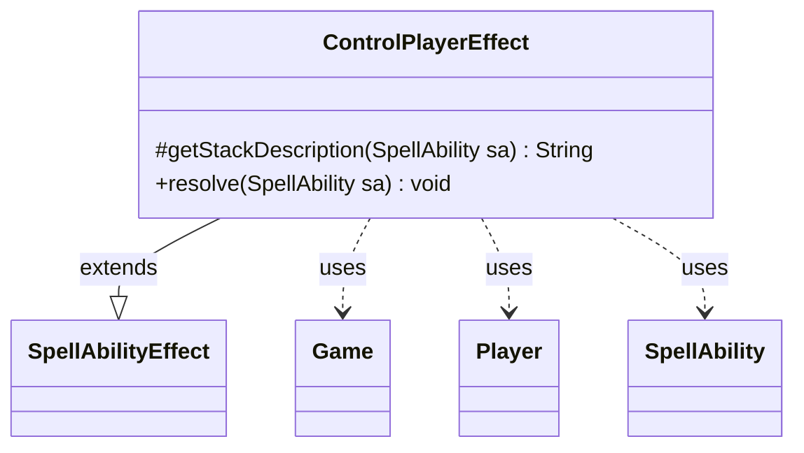

---
aliases:
  - ControlPlayerEffect
tags:
  - java/class
  - module/forge-game
  - pkg/forge/game/ability/effects
fqn: forge.game.ability.effects.ControlPlayerEffect
package: forge.game.ability.effects
module: forge-game
kind: Class
---

# ControlPlayerEffect

**Package:** `forge.game.ability.effects` &nbsp; **Module:** `forge-game` &nbsp; **Kind:** Class



## Relationships
**Extends:**
- [[forge.game.ability.SpellAbilityEffect|SpellAbilityEffect]]
**Uses:**
- [[forge.game.Game|Game]]
- [[forge.game.player.Player|Player]]
- [[forge.game.spellability.SpellAbility|SpellAbility]]

## Design Description

`ControlPlayerEffect` implements the resolution behavior for an ability that lets one player temporarily assume control of one or more target players. As a concrete subclass of `SpellAbilityEffect`, it supplies two overrides: `getStackDescription`, which composes a human-readable summary ("X controls Y during their next turn") using `Lang` and `TextUtil`, and `resolve`, which performs the control transfer. It is driven by a `SpellAbility`, from which it derives the controlling `Player` (via `AbilityUtils` on the `Controller` parameter) and the target players, and it operates against the `Game`'s phase-timing hooks.

The notable design intent is timing-sensitive deferral: rather than acting immediately, it registers `addUntil` callbacks on either the combat boundaries or the cleanup step (per the `Combat` parameter), granting control at a fresh timestamp and pairing each `addController` with a matching `removeController` for clean release. It also guards against CR 800.4b by aborting when the controller has left the game.

## Source
`forge-game/src/main/java/forge/game/ability/effects/ControlPlayerEffect.java`

```java
package forge.game.ability.effects;

import java.util.List;

import forge.game.Game;
import forge.game.ability.AbilityUtils;
import forge.game.ability.SpellAbilityEffect;
import forge.game.player.Player;
import forge.game.spellability.SpellAbility;
import forge.util.Lang;
import forge.util.TextUtil;

/**
 * TODO: Write javadoc for this type.
 *
 */
public class ControlPlayerEffect extends SpellAbilityEffect {

    @Override
    protected String getStackDescription(SpellAbility sa) {
        List<Player> tgtPlayers = getTargetPlayers(sa);
        return TextUtil.concatWithSpace(sa.getActivatingPlayer().toString(), "controls", Lang.joinHomogenous(tgtPlayers), "during their next turn");
    }

    @SuppressWarnings("serial")
    @Override
    public void resolve(SpellAbility sa) {
        final Player controller = AbilityUtils.getDefinedPlayers(sa.getHostCard(), sa.getParam("Controller"), sa).get(0);
        final Game game = controller.getGame();
        final boolean combat = sa.hasParam("Combat");

        for (final Player pTarget: getTargetPlayers(sa)) {
            // before next untap gain control
            (combat ? game.getBeginOfCombat() : game.getCleanup()).addUntil(pTarget, () -> {
                // CR 800.4b
                if (!controller.isInGame()) {
                    return;
                }

                long ts = game.getNextTimestamp();
                pTarget.addController(ts, controller);

                // after following cleanup release control
                (combat ? game.getEndOfCombat() : game.getCleanup()).addUntil(() -> pTarget.removeController(ts));
            });
        }
    }
}
```

## Python
`forge/game/ability/effects/ControlPlayerEffect.py`

```python
from typing import List

from forge.game.Game import Game
from forge.game.ability.AbilityUtils import AbilityUtils
from forge.game.ability.SpellAbilityEffect import SpellAbilityEffect
from forge.game.player.Player import Player
from forge.game.spellability.SpellAbility import SpellAbility
from forge.util.Lang import Lang
from forge.util.TextUtil import TextUtil


# TODO: Write javadoc for this type.
class ControlPlayerEffect(SpellAbilityEffect):

    def getStackDescription(self, sa: SpellAbility) -> str:
        tgtPlayers: List[Player] = self.getTargetPlayers(sa)
        return TextUtil.concatWithSpace(str(sa.getActivatingPlayer()), "controls", Lang.joinHomogenous(tgtPlayers), "during their next turn")

    def resolve(self, sa: SpellAbility) -> None:
        controller: Player = AbilityUtils.getDefinedPlayers(sa.getHostCard(), sa.getParam("Controller"), sa)[0]
        game: Game = controller.getGame()
        combat: bool = sa.hasParam("Combat")

        for pTarget in self.getTargetPlayers(sa):
            # before next untap gain control
            def gainControl(pTarget=pTarget):
                # CR 800.4b
                if not controller.isInGame():
                    return

                ts = game.getNextTimestamp()
                pTarget.addController(ts, controller)

                # after following cleanup release control
                (game.getEndOfCombat() if combat else game.getCleanup()).addUntil(lambda: pTarget.removeController(ts))

            (game.getBeginOfCombat() if combat else game.getCleanup()).addUntil(pTarget, gainControl)
```
