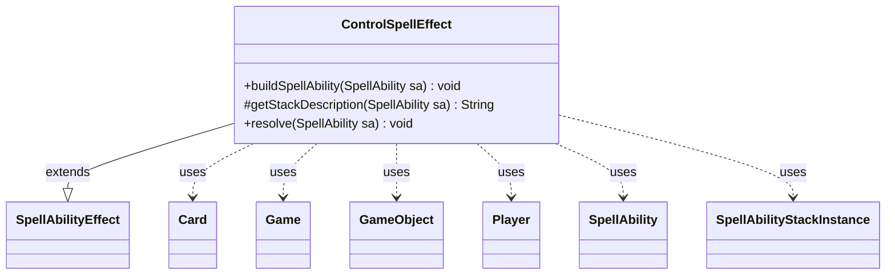

---
aliases:
  - ControlSpellEffect
tags:
  - java/class
  - module/forge-game
  - pkg/forge/game/ability/effects
fqn: forge.game.ability.effects.ControlSpellEffect
package: forge.game.ability.effects
module: forge-game
kind: Class
---

# ControlSpellEffect

**Package:** `forge.game.ability.effects` &nbsp; **Module:** `forge-game` &nbsp; **Kind:** Class



## Relationships
**Extends:**
- [[forge.game.ability.SpellAbilityEffect|SpellAbilityEffect]]
**Uses:**
- [[forge.game.Game|Game]]
- [[forge.game.GameObject|GameObject]]
- [[forge.game.card.Card|Card]]
- [[forge.game.player.Player|Player]]
- [[forge.game.spellability.SpellAbility|SpellAbility]]
- [[forge.game.spellability.SpellAbilityStackInstance|SpellAbilityStackInstance]]


## Design Description

`ControlSpellEffect` implements the resolution behavior for abilities that take control of a spell currently on the stack. As a concrete subclass of `SpellAbilityEffect`, it specializes three template hooks from its supertype: `buildSpellAbility` restricts targeting to the `Stack` zone, `getStackDescription` renders the "X gains control of Y" stack text (masking face-down spells as "Morph"), and `resolve` carries out the control change as a permanent effect. During resolution it resolves the new controller (the defined `NewController`, falling back to the activating player), applies a temporary controller to each targeted spell's host `Card` using a fresh game timestamp, and rewrites the matching `SpellAbilityStackInstance`'s activating player so the spell resolves under its new controller.

It collaborates with `Game` for stack lookup and timestamp sequencing, and with `Card`, `Player`, and `SpellAbilityStackInstance` to apply the effect. Notable design intent appears in the `GameObject`-based "Exchange" mode, which swaps control bidirectionally between the spell and a `DefinedExchange` permanent—guarded against unavailable, phased-out, or uncontrollable partners—and in the optional `Remember` bookkeeping that records affected objects on the source card.

## Source
`forge-game/src/main/java/forge/game/ability/effects/ControlSpellEffect.java`

```java
package forge.game.ability.effects;

import java.util.List;

import com.google.common.collect.Iterables;
import forge.game.Game;
import forge.game.GameObject;
import forge.game.ability.SpellAbilityEffect;
import forge.game.card.Card;
import forge.game.player.Player;
import forge.game.spellability.SpellAbility;
import forge.game.spellability.SpellAbilityStackInstance;
import forge.game.zone.ZoneType;

public class ControlSpellEffect extends SpellAbilityEffect {

    @Override
    public void buildSpellAbility(SpellAbility sa) {
        super.buildSpellAbility(sa);
        if (sa.usesTargeting()) {
            sa.getTargetRestrictions().setZone(ZoneType.Stack);
        }
    }

    /* (non-Javadoc)
     * @see forge.card.abilityfactory.SpellEffect#getStackDescription(java.util.Map, forge.card.spellability.SpellAbility)
     */
    @Override
    protected String getStackDescription(SpellAbility sa) {
        final StringBuilder sb = new StringBuilder();

        List<Player> newController = getTargetPlayers(sa, "NewController");
        if (newController.isEmpty()) {
            newController.add(sa.getActivatingPlayer());
        }

        sb.append(newController).append(" gains control of ");

        for (SpellAbility spell : getTargetSpells(sa)) {
            Card c = spell.getHostCard();
            sb.append(" ");
            if (c.isFaceDown()) {
                sb.append("Morph");
            } else {
                sb.append(c);
            }
        }
        sb.append(".");

        return sb.toString();
    }

    @Override
    public void resolve(SpellAbility sa) {
        // Gaining Control of Spells is a permanent effect
        Card source = sa.getHostCard();

        boolean exchange = sa.getParam("Mode").equals("Exchange");
        boolean remember = sa.hasParam("Remember");
        final List<Player> controllers = getDefinedPlayersOrTargeted(sa, "NewController");

        Player newController = controllers.isEmpty() ? sa.getActivatingPlayer() : controllers.get(0);
        final Game game = newController.getGame();

        for (SpellAbility spell : getTargetSpells(sa)) {
            Card tgtC = spell.getHostCard();
            long tStamp = game.getNextTimestamp();
            SpellAbilityStackInstance si = game.getStack().getInstanceMatchingSpellAbilityID(spell);
            if (exchange) {
                // Currently the only Exchange Control for Spells is a Permanent Trigger
                // Use "DefinedExchange" to Reference Object that is Exchanging the other direction
                GameObject obj = Iterables.getFirst(getDefinedOrTargeted(sa, "DefinedExchange"), null);
                if (obj instanceof Card c) {
                    if (!c.isInPlay() || c.isPhasedOut() || si == null) {
                        // Exchanging object isn't available, continue
                        continue;
                    }

                    if (!c.canBeControlledBy(si.getActivatingPlayer())) {
                        continue;
                    }

                    if (remember) {
                        source.addRemembered(c);
                    }
                    newController = c.getController();
                    c.addTempController(si.getActivatingPlayer(), tStamp);
                    c.runChangeControllerCommands();
                }
            }

            if (remember) {
                source.addRemembered(tgtC);
            }
            if (tgtC.getController() != newController) {
                tgtC.runChangeControllerCommands();
            }
            tgtC.addTempController(newController, tStamp);
            si.setActivatingPlayer(newController);
        }
    }
}
```
