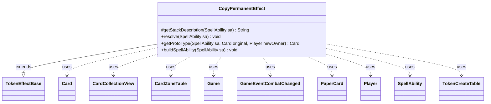

---
aliases:
  - CopyPermanentEffect
tags:
  - java/class
  - module/forge-game
  - pkg/forge/game/ability/effects
fqn: forge.game.ability.effects.CopyPermanentEffect
package: forge.game.ability.effects
module: forge-game
kind: Class
---

# CopyPermanentEffect

**Package:** `forge.game.ability.effects`   **Module:** `forge-game`   **Kind:** Class



## Relationships
**Extends:**
- [[forge.game.ability.effects.TokenEffectBase|TokenEffectBase]]
**Uses:**
- [[forge.game.Game|Game]]
- [[forge.game.card.Card|Card]]
- [[forge.game.card.CardCollectionView|CardCollectionView]]
- [[forge.game.card.CardZoneTable|CardZoneTable]]
- [[forge.game.card.TokenCreateTable|TokenCreateTable]]
- [[forge.game.event.GameEventCombatChanged|GameEventCombatChanged]]
- [[forge.game.player.Player|Player]]
- [[forge.game.spellability.SpellAbility|SpellAbility]]
- [[forge.item.PaperCard|PaperCard]]

## Design Description

CopyPermanentEffect implements the resolution logic for spell and ability effects that create token copies of permanents, extending TokenEffectBase to reuse its shared token-creation pipeline (notably `makeTokenTable`). Its central responsibility is interpreting the script parameters that determine *what* to copy and *how many*: it gathers copy sources from defined or targeted cards, player choices, named cards, a chosen map, or randomly selected supported PaperCards, builds prototype Cards through the static `getProtoType` helper, and batches them into a TokenCreateTable keyed by controller for creation.

It collaborates with SpellAbility for parameters and stack description, Player and Game for context, controllers, and optional confirmation, and Card/CardCollectionView for source selection, while routing zone changes through CardZoneTable and firing GameEventCombatChanged when combat is affected. Notable design intent includes rules-compliance guards—skipping instants and sorceries, preserving transform faces and back-side state, and copying marked colors—plus `buildSpellAbility` pre-wiring the Populate keyword to copy a controlled creature token.

## Source
`forge-game/src/main/java/forge/game/ability/effects/CopyPermanentEffect.java`

```java
package forge.game.ability.effects;

import java.util.Arrays;
import java.util.List;
import java.util.function.Predicate;

import forge.card.GamePieceType;
import forge.item.PaperCardPredicates;
import forge.util.*;
import org.apache.commons.lang3.StringUtils;
import org.apache.commons.lang3.mutable.MutableBoolean;

import com.google.common.collect.Lists;

import forge.StaticData;
import forge.card.CardRarity;
import forge.card.CardRulesPredicates;
import forge.card.CardStateName;
import forge.game.Game;
import forge.game.ability.AbilityUtils;
import forge.game.card.Card;
import forge.game.card.CardCollectionView;
import forge.game.card.CardFactory;
import forge.game.card.CardLists;
import forge.game.card.CardPredicates;
import forge.game.card.CardZoneTable;
import forge.game.card.TokenCreateTable;
import forge.game.event.GameEventCombatChanged;
import forge.game.player.Player;
import forge.game.player.PlayerActionConfirmMode;
import forge.game.spellability.SpellAbility;
import forge.game.zone.ZoneType;
import forge.item.PaperCard;

public class CopyPermanentEffect extends TokenEffectBase {

    @Override
    protected String getStackDescription(SpellAbility sa) {
        if (sa.hasParam("Populate")) {
            return "Populate. (Create a token that's a copy of a creature token you control.)";
        }
        final StringBuilder sb = new StringBuilder();

        final Player activator = sa.getActivatingPlayer();
        final int numCopies = sa.hasParam("NumCopies") ?
                AbilityUtils.calculateAmount(sa.getHostCard(), sa.getParam("NumCopies"), sa) : 1;

        sb.append(activator).append(" creates ");
        if (sa.hasParam("DefinedName")) {
            sb.append(Lang.nounWithNumeralExceptOne(numCopies, sa.getParam("DefinedName") + " token"));
        } else {
            final List<Card> tgtCards = getTargetCards(sa);
            boolean justOne = tgtCards.size() == 1;
            boolean addKWs = sa.hasParam("AddKeywords");

            sb.append(Lang.nounWithNumeralExceptOne(numCopies, "token"));
            sb.append(numCopies == 1 ? " that's a copy" : " that are copies").append(" of ");
            sb.append(Lang.joinHomogenous(tgtCards));

            if (addKWs) {
                final List<String> keywords = Lists.newArrayList();
                keywords.addAll(Arrays.asList(sa.getParam("AddKeywords").split(" & ")));
                if (sa.getDescription().contains("except")) {
                    sb.append(", except ").append(justOne ? "it has " : "they have ");
                } else {
                    sb.append(". ").append(justOne ? "It gains " : "They gain ");
                }
                sb.append(Lang.joinHomogenous(keywords).toLowerCase());
            }

            if (sa.hasParam("AddTriggers")) {
                final String oDesc = sa.getDescription();
                final String trigStg = oDesc.contains("\"") ?
                        oDesc.substring(oDesc.indexOf("\""),oDesc.lastIndexOf("\"") + 1) :
                        "[trigger text parsing error]";
                if (addKWs) {
                    sb.append(" and ").append(trigStg);
                } else {
                    sb.append(". ").append(justOne ? "It gains " : "They gain ").append(trigStg);
                }
            } else {
                sb.append(".");
            }

            if (sa.hasParam("AtEOT")) {
                String atEOT = sa.getParam("AtEOT");
                String verb = "Sacrifice ";
                if (atEOT.startsWith("Exile")) {
                    verb = "Exile ";
                }
                sb.append(" ").append(verb).append(justOne ? "it " : "them ").append("at ");
                String when = "the beginning of the next end step.";
                if (atEOT.endsWith("Combat")) {
                    when = "end of combat.";
                }
                sb.append(when);
            }
        }

        return sb.toString();
    }

    /* (non-Javadoc)
     * @see forge.card.ability.SpellAbilityEffect#resolve(forge.card.spellability.SpellAbility)
     */
    @Override
    public void resolve(final SpellAbility sa) {
        final Card host = sa.getHostCard();
        final Player activator = sa.getActivatingPlayer();
        final Game game = host.getGame();
        boolean useZoneTable = true;
        boolean chosenMap = "ChosenMap".equals(sa.getParam("Defined"));
        CardZoneTable triggerList = sa.getChangeZoneTable();
        if (triggerList == null) {
            triggerList = new CardZoneTable();
            useZoneTable = false;
        }
        if (sa.hasParam("ChangeZoneTable")) {
            sa.setChangeZoneTable(triggerList);
            useZoneTable = true;
        }

        MutableBoolean combatChanged = new MutableBoolean(false);
        TokenCreateTable tokenTable = new TokenCreateTable();

        if (sa.hasParam("Optional") && !activator.getController().confirmAction(sa, null,
                Localizer.getInstance().getMessage("lblCopyPermanentConfirm"), null)) {
            return;
        }

        final int numCopies = sa.hasParam("NumCopies") ? AbilityUtils.calculateAmount(host,
                sa.getParam("NumCopies"), sa) : 1;

        List<Player> controllers = Lists.newArrayList();
        if (sa.hasParam("Controller")) {
            controllers = AbilityUtils.getDefinedPlayers(host, sa.getParam("Controller"), sa);
        } else if (chosenMap) {
            controllers.addAll(host.getChosenMap().keySet());
        }
        if (controllers.isEmpty()) {
            controllers.add(activator);
        }

        for (final Player controller : controllers) {
            if (!controller.isInGame()) {
                continue;
            }
            List<Card> tgtCards = Lists.newArrayList();

            if (sa.hasParam("ValidSupportedCopy")) {
                Iterable<PaperCard> cards = StaticData.instance().getCommonCards().getUniqueCards();
                String valid = sa.getParam("ValidSupportedCopy");
                if (valid.contains("X")) {
                    valid = TextUtil.fastReplace(valid,
                            "X", Integer.toString(AbilityUtils.calculateAmount(host, "X", sa)));
                }
                if (StringUtils.containsIgnoreCase(valid, "creature")) {
                    cards = IterableUtil.filter(cards, PaperCardPredicates.IS_CREATURE);
                }
                if (StringUtils.containsIgnoreCase(valid, "equipment")) {
                    Predicate<PaperCard> cpp = PaperCardPredicates.fromRules(CardRulesPredicates.IS_EQUIPMENT);
                    cards = IterableUtil.filter(cards, cpp);
                }
                if (sa.hasParam("RandomCopied")) {
                    List<PaperCard> copysource = Lists.newArrayList(cards);
                    List<Card> choice = Lists.newArrayList();
                    final String num = sa.getParamOrDefault("RandomNum", "1");
                    int ncopied = AbilityUtils.calculateAmount(host, num, sa);
                    while (ncopied > 0 && !copysource.isEmpty()) {
                        final PaperCard cp = Aggregates.random(copysource);
                        Card possibleCard = Card.fromPaperCard(cp, activator); // Need to temporarily set the Owner so the Game is set

                        if (possibleCard.isValid(valid, host.getController(), host, sa)) {
                            if (host.getController().isAI() && possibleCard.getRules() != null && possibleCard.getRules().getAiHints().getRemAIDecks())
                                continue;
                            choice.add(possibleCard);
                            ncopied -= 1;
                        }
                        copysource.remove(cp);
                    }
                    tgtCards = choice;

                    System.err.println("Copying random permanent(s): " + tgtCards.toString());
                }
            } else if (sa.hasParam("DefinedName")) {
                String name = sa.getParam("DefinedName");
                if (name.equals("NamedCard")) {
                    if (!host.getNamedCard().isEmpty()) {
                        name = host.getNamedCard();
                    }
                }
                PaperCard pc = StaticData.instance().getCommonCards().getUniqueByName(name);
                if (pc != null) {
                    tgtCards.add(Card.fromPaperCard(pc, controller));
                }
            } else if (sa.hasParam("Choices")) {
                Player chooser = activator;
                if (sa.hasParam("Chooser")) {
                    final String choose = sa.getParam("Chooser");
                    chooser = AbilityUtils.getDefinedPlayers(host, choose, sa).get(0);
                }

                // For Mimic Vat with mutated creature, need to choose one imprinted card
                CardCollectionView choices = sa.hasParam("Defined") ? getDefinedCardsOrTargeted(sa) : game.getCardsIn(ZoneType.Battlefield);
                choices = CardLists.getValidCards(choices, sa.getParam("Choices"), activator, host, sa);
                if (!choices.isEmpty()) {
                    String title = sa.hasParam("ChoiceTitle") ? sa.getParam("ChoiceTitle") : Localizer.getInstance().getMessage("lblChooseaCard");

                    if (sa.hasParam("WithDifferentNames")) {
                        // any Number of choices with different names
                        while (!choices.isEmpty()) {
                            Card choosen = chooser.getController().chooseSingleEntityForEffect(choices, sa, title, true, null);

                            if (choosen != null) {
                                tgtCards.add(choosen);
                                choices = CardLists.filter(choices, CardPredicates.sharesNameWith(choosen).negate());
                            } else if (chooser.getController().confirmAction(sa, PlayerActionConfirmMode.OptionalChoose, Localizer.getInstance().getMessage("lblCancelChooseConfirm"), null)) {
                                break;
                            }
                        }
                    } else {
                        Card choosen = chooser.getController().chooseSingleEntityForEffect(choices, sa, title, false, null);
                        if (choosen != null) {
                            tgtCards.add(choosen);
                        }
                    }
                }
            } else if (chosenMap) {
                if (sa.hasParam("ChosenMapIndex")) {
                    final int index = Integer.parseInt(sa.getParam("ChosenMapIndex"));
                    if (index >= host.getChosenMap().get(controller).size()) continue;
                    tgtCards.add(host.getChosenMap().get(controller).get(index));
                } else tgtCards = host.getChosenMap().get(controller);
            } else {
                tgtCards = getDefinedCardsOrTargeted(sa);
            }

            for (final Card c : tgtCards) {
                // 111.5. Similarly, if an effect would create a token that is a copy of an instant or sorcery card, no token is created.
                // instant and sorcery can't enter the battlefield
                // and it can't be replaced by other tokens
                if (c.isInstant() || c.isSorcery()) {
                    continue;
                }

                // because copy should be able to copy LKI values, don't handle target and timestamp there

                if (sa.hasParam("ForEach")) {
                    for (Player p : AbilityUtils.getDefinedPlayers(host, sa.getParam("ForEach"), sa)) {
                        if (sa.hasParam("OptionalForEach") && !activator.getController().confirmAction(sa, null,
                                Localizer.getInstance().getMessage("lblCopyPermanentConfirm") + " (" + p + ")", null)) {
                            continue;
                        }
                        Card proto = getProtoType(sa, c, controller);
                        proto.addRemembered(p);
                        tokenTable.put(controller, proto, numCopies);
                    }
                } else {
                    tokenTable.put(controller, getProtoType(sa, c, controller), numCopies);
                }
            } // end foreach Card
        }

        makeTokenTable(tokenTable, true, triggerList, combatChanged, sa);

        if (!useZoneTable) {
            triggerList.triggerChangesZoneAll(game, sa);
        }
        if (combatChanged.isTrue()) {
            game.updateCombatForView();
            game.fireEvent(new GameEventCombatChanged());
        }
    }

    public static Card getProtoType(final SpellAbility sa, final Card original, final Player newOwner) {
        final Card copy;
        if (sa.hasParam("DefinedName")) {
            copy = original;
            String name = TextUtil.fastReplace(TextUtil.fastReplace(original.getName(), ",", ""), " ", "_").toLowerCase();
            String set = sa.getOriginalHost().getSetCode();
            copy.getCurrentState().setRarity(CardRarity.Token);
            copy.getCurrentState().setSetCode(set);
            copy.getCurrentState().setImageKey(StaticData.instance().getOtherImageKey(name, set));
        } else {
            final Card host = sa.getHostCard();

            int id = newOwner == null ? 0 : newOwner.getGame().nextCardId();
            // need to create a physical card first, i need the original card faces
            copy = CardFactory.getCard(original.getPaperCard(), newOwner, id, host.getGame());

            copy.setStates(CardFactory.getCloneStates(original, copy, sa));
            // force update the now set State
            if (original.isTransformable()) {
                copy.setState(original.isTransformed() ? CardStateName.Backside : CardStateName.Original, true, true);
                // 707.8a If an effect creates a token that is a copy of a transforming permanent or a transforming double-faced card not on the battlefield,
                // the resulting token is a transforming token that has both a front face and a back face.
                // The characteristics of each face are determined by the copiable values of the same face of the permanent it is a copy of, as modified by any other copy effects that apply to that permanent.
                // If the token is a copy of a transforming permanent with its back face up, the token enters the battlefield with its back face up.
                // This rule does not apply to tokens that are created with their own set of characteristics and enter the battlefield as a copy of a transforming permanent due to a replacement effect.
                copy.setBackSide(original.isBackSide());
            } else {
                copy.setState(copy.getCurrentStateName(), true, true);
            }
        }
        // spire
        copy.setMarkedColors(original.getMarkedColors());

        copy.setTokenSpawningAbility(sa);
        copy.setGamePieceType(GamePieceType.TOKEN);

        return copy;
    }

    @Override
    public void buildSpellAbility(SpellAbility sa) {
        super.buildSpellAbility(sa);
        if (sa.hasParam("Populate")) {
            sa.putParam("Choices", "Creature.token+YouCtrl");
            sa.putParam("ChoiceTitle", "Choose a creature token to copy");
            if (!sa.hasParam("SpellDescription")) {
                StringBuilder sb = new StringBuilder("Populate");
                sb.append(" (Create a token that's a copy of a creature token you control.)");
                sa.putParam("SpellDescription", sb.toString());
            }
        }
    }
}
```

## Python
`forge/game/ability/effects/CopyPermanentEffect.py`

```python
package forge.game.ability.effects

from forge.game.ability.effects.TokenEffectBase import TokenEffectBase

from forge.StaticData import StaticData
from forge.card.CardRarity import CardRarity
from forge.card.CardRulesPredicates import CardRulesPredicates
from forge.card.CardStateName import CardStateName
from forge.card.GamePieceType import GamePieceType
from forge.game.Game import Game
from forge.game.ability.AbilityUtils import AbilityUtils
from forge.game.card.Card import Card
from forge.game.card.CardCollectionView import CardCollectionView
from forge.game.card.CardFactory import CardFactory
from forge.game.card.CardLists import CardLists
from forge.game.card.CardPredicates import CardPredicates
from forge.game.card.CardZoneTable import CardZoneTable
from forge.game.card.TokenCreateTable import TokenCreateTable
from forge.game.event.GameEventCombatChanged import GameEventCombatChanged
from forge.game.player.Player import Player
from forge.game.player.PlayerActionConfirmMode import PlayerActionConfirmMode
from forge.game.spellability.SpellAbility import SpellAbility
from forge.game.zone.ZoneType import ZoneType
from forge.item.PaperCard import PaperCard
from forge.item.PaperCardPredicates import PaperCardPredicates
from forge.util.Lang import Lang
from forge.util.Localizer import Localizer
from forge.util.TextUtil import TextUtil
from forge.util.IterableUtil import IterableUtil
from forge.util.Aggregates import Aggregates

from org.apache.commons.lang3 import StringUtils
from org.apache.commons.lang3.mutable.MutableBoolean import MutableBoolean

from com.google.common.collect import Lists


class CopyPermanentEffect(TokenEffectBase):

    def getStackDescription(self, sa: SpellAbility) -> str:
        if sa.hasParam("Populate"):
            return "Populate. (Create a token that's a copy of a creature token you control.)"
        sb = []

        activator = sa.getActivatingPlayer()
        numCopies = AbilityUtils.calculateAmount(sa.getHostCard(), sa.getParam("NumCopies"), sa) \
            if sa.hasParam("NumCopies") else 1

        sb.append(str(activator))
        sb.append(" creates ")
        if sa.hasParam("DefinedName"):
            sb.append(Lang.nounWithNumeralExceptOne(numCopies, sa.getParam("DefinedName") + " token"))
        else:
            tgtCards = self.getTargetCards(sa)
            justOne = len(tgtCards) == 1
            addKWs = sa.hasParam("AddKeywords")

            sb.append(Lang.nounWithNumeralExceptOne(numCopies, "token"))
            sb.append(" that's a copy" if numCopies == 1 else " that are copies")
            sb.append(" of ")
            sb.append(Lang.joinHomogenous(tgtCards))

            if addKWs:
                keywords = Lists.newArrayList()
                keywords.addAll(Arrays.asList(...))

I'll write idiomatic Python preserving intent. Let me produce final.

For the keyword join, Java `Lang.joinHomogenous(keywords).toLowerCase()`. In Python `.lower()`.

Let me write the whole thing.package forge.game.ability.effects

from forge.game.ability.effects.TokenEffectBase import TokenEffectBase

from forge.StaticData import StaticData
from forge.card.CardRarity import CardRarity
from forge.card.CardRulesPredicates import CardRulesPredicates
from forge.card.CardStateName import CardStateName
from forge.card.GamePieceType import GamePieceType
from forge.game.Game import Game
from forge.game.ability.AbilityUtils import AbilityUtils
from forge.game.card.Card import Card
from forge.game.card.CardCollectionView import CardCollectionView
from forge.game.card.CardFactory import CardFactory
from forge.game.card.CardLists import CardLists
from forge.game.card.CardPredicates import CardPredicates
from forge.game.card.CardZoneTable import CardZoneTable
from forge.game.card.TokenCreateTable import TokenCreateTable
from forge.game.event.GameEventCombatChanged import GameEventCombatChanged
from forge.game.player.Player import Player
from forge.game.player.PlayerActionConfirmMode import PlayerActionConfirmMode
from forge.game.spellability.SpellAbility import SpellAbility
from forge.game.zone.ZoneType import ZoneType
from forge.item.PaperCard import PaperCard
from forge.item.PaperCardPredicates import PaperCardPredicates
from forge.util.Lang import Lang
from forge.util.Localizer import Localizer
from forge.util.TextUtil import TextUtil
from forge.util.IterableUtil import IterableUtil
from forge.util.Aggregates import Aggregates


class CopyPermanentEffect(TokenEffectBase):

    def getStackDescription(self, sa: SpellAbility) -> str:
        if sa.hasParam("Populate"):
            return "Populate. (Create a token that's a copy of a creature token you control.)"
        sb = []

        activator = sa.getActivatingPlayer()
        numCopies = AbilityUtils.calculateAmount(sa.getHostCard(), sa.getParam("NumCopies"), sa) \
            if sa.hasParam("NumCopies") else 1

        sb.append(str(activator))
        sb.append(" creates ")
        if sa.hasParam("DefinedName"):
            sb.append(Lang.nounWithNumeralExceptOne(numCopies, sa.getParam("DefinedName") + " token"))
        else:
            tgtCards = self.getTargetCards(sa)
            justOne = len(tgtCards) == 1
            addKWs = sa.hasParam("AddKeywords")

            sb.append(Lang.nounWithNumeralExceptOne(numCopies, "token"))
            sb.append(" that's a copy" if numCopies == 1 else " that are copies")
            sb.append(" of ")
            sb.append(Lang.joinHomogenous(tgtCards))

            if addKWs:
                keywords = []
                keywords.extend(sa.getParam("AddKeywords").split(" & "))
                if "except" in sa.getDescription():
                    sb.append(", except ")
                    sb.append("it has " if justOne else "they have ")
                else:
                    sb.append(". ")
                    sb.append("It gains " if justOne else "They gain ")
                sb.append(Lang.joinHomogenous(keywords).lower())

            if sa.hasParam("AddTriggers"):
                oDesc = sa.getDescription()
                if "\"" in oDesc:
                    trigStg = oDesc[oDesc.index("\""):oDesc.rindex("\"") + 1]
                else:
                    trigStg = "[trigger text parsing error]"
                if addKWs:
                    sb.append(" and ")
                    sb.append(trigStg)
                else:
                    sb.append(". ")
                    sb.append("It gains " if justOne else "They gain ")
                    sb.append(trigStg)
            else:
                sb.append(".")

            if sa.hasParam("AtEOT"):
                atEOT = sa.getParam("AtEOT")
                verb = "Sacrifice "
                if atEOT.startswith("Exile"):
                    verb = "Exile "
                sb.append(" ")
                sb.append(verb)
                sb.append("it " if justOne else "them ")
                sb.append("at ")
                when = "the beginning of the next end step."
                if atEOT.endswith("Combat"):
                    when = "end of combat."
                sb.append(when)

        return "".join(sb)

    # (non-Javadoc)
    # @see forge.card.ability.SpellAbilityEffect#resolve(forge.card.spellability.SpellAbility)
    def resolve(self, sa: SpellAbility) -> None:
        host = sa.getHostCard()
        activator = sa.getActivatingPlayer()
        game = host.getGame()
        useZoneTable = True
        chosenMap = "ChosenMap" == sa.getParam("Defined")
        triggerList = sa.getChangeZoneTable()
        if triggerList is None:
            triggerList = CardZoneTable()
            useZoneTable = False
        if sa.hasParam("ChangeZoneTable"):
            sa.setChangeZoneTable(triggerList)
            useZoneTable = True

        combatChanged = MutableBoolean(False)
        tokenTable = TokenCreateTable()

        if sa.hasParam("Optional") and not activator.getController().confirmAction(sa, None,
                Localizer.getInstance().getMessage("lblCopyPermanentConfirm"), None):
            return

        numCopies = AbilityUtils.calculateAmount(host, sa.getParam("NumCopies"), sa) \
            if sa.hasParam("NumCopies") else 1

        controllers = []
        if sa.hasParam("Controller"):
            controllers = AbilityUtils.getDefinedPlayers(host, sa.getParam("Controller"), sa)
        elif chosenMap:
            controllers.extend(host.getChosenMap().keySet())
        if not controllers:
            controllers.append(activator)

        for controller in controllers:
            if not controller.isInGame():
                continue
            tgtCards = []

            if sa.hasParam("ValidSupportedCopy"):
                cards = StaticData.instance().getCommonCards().getUniqueCards()
                valid = sa.getParam("ValidSupportedCopy")
                if "X" in valid:
                    valid = TextUtil.fastReplace(valid,
                            "X", str(AbilityUtils.calculateAmount(host, "X", sa)))
                if StringUtils.containsIgnoreCase(valid, "creature"):
                    cards = IterableUtil.filter(cards, PaperCardPredicates.IS_CREATURE)
                if StringUtils.containsIgnoreCase(valid, "equipment"):
                    cpp = PaperCardPredicates.fromRules(CardRulesPredicates.IS_EQUIPMENT)
                    cards = IterableUtil.filter(cards, cpp)
                if sa.hasParam("RandomCopied"):
                    copysource = list(cards)
                    choice = []
                    num = sa.getParamOrDefault("RandomNum", "1")
                    ncopied = AbilityUtils.calculateAmount(host, num, sa)
                    while ncopied > 0 and copysource:
                        cp = Aggregates.random(copysource)
                        possibleCard = Card.fromPaperCard(cp, activator)  # Need to temporarily set the Owner so the Game is set

                        if possibleCard.isValid(valid, host.getController(), host, sa):
                            if host.getController().isAI() and possibleCard.getRules() is not None and possibleCard.getRules().getAiHints().getRemAIDecks():
                                continue
                            choice.append(possibleCard)
                            ncopied -= 1
                        copysource.remove(cp)
                    tgtCards = choice

                    import sys
                    print("Copying random permanent(s): " + str(tgtCards), file=sys.stderr)
            elif sa.hasParam("DefinedName"):
                name = sa.getParam("DefinedName")
                if name == "NamedCard":
                    if not host.getNamedCard().isEmpty():
                        name = host.getNamedCard()
                pc = StaticData.instance().getCommonCards().getUniqueByName(name)
                if pc is not None:
                    tgtCards.append(Card.fromPaperCard(pc, controller))
            elif sa.hasParam("Choices"):
                chooser = activator
                if sa.hasParam("Chooser"):
                    choose = sa.getParam("Chooser")
                    chooser = AbilityUtils.getDefinedPlayers(host, choose, sa).get(0)

                # For Mimic Vat with mutated creature, need to choose one imprinted card
                choices = self.getDefinedCardsOrTargeted(sa) if sa.hasParam("Defined") else game.getCardsIn(ZoneType.Battlefield)
                choices = CardLists.getValidCards(choices, sa.getParam("Choices"), activator, host, sa)
                if not choices.isEmpty():
                    title = sa.getParam("ChoiceTitle") if sa.hasParam("ChoiceTitle") else Localizer.getInstance().getMessage("lblChooseaCard")

                    if sa.hasParam("WithDifferentNames"):
                        # any Number of choices with different names
                        while not choices.isEmpty():
                            choosen = chooser.getController().chooseSingleEntityForEffect(choices, sa, title, True, None)

                            if choosen is not None:
                                tgtCards.append(choosen)
                                choices = CardLists.filter(choices, CardPredicates.sharesNameWith(choosen).negate())
                            elif chooser.getController().confirmAction(sa, PlayerActionConfirmMode.OptionalChoose, Localizer.getInstance().getMessage("lblCancelChooseConfirm"), None):
                                break
                    else:
                        choosen = chooser.getController().chooseSingleEntityForEffect(choices, sa, title, False, None)
                        if choosen is not None:
                            tgtCards.append(choosen)
            elif chosenMap:
                if sa.hasParam("ChosenMapIndex"):
                    index = int(sa.getParam("ChosenMapIndex"))
                    if index >= len(host.getChosenMap().get(controller)):
                        continue
                    tgtCards.append(host.getChosenMap().get(controller).get(index))
                else:
                    tgtCards = host.getChosenMap().get(controller)
            else:
                tgtCards = self.getDefinedCardsOrTargeted(sa)

            for c in tgtCards:
                # 111.5. Similarly, if an effect would create a token that is a copy of an instant or sorcery card, no token is created.
                # instant and sorcery can't enter the battlefield
                # and it can't be replaced by other tokens
                if c.isInstant() or c.isSorcery():
                    continue

                # because copy should be able to copy LKI values, don't handle target and timestamp there

                if sa.hasParam("ForEach"):
                    for p in AbilityUtils.getDefinedPlayers(host, sa.getParam("ForEach"), sa):
                        if sa.hasParam("OptionalForEach") and not activator.getController().confirmAction(sa, None,
                                Localizer.getInstance().getMessage("lblCopyPermanentConfirm") + " (" + str(p) + ")", None):
                            continue
                        proto = self.getProtoType(sa, c, controller)
                        proto.addRemembered(p)
                        tokenTable.put(controller, proto, numCopies)
                else:
                    tokenTable.put(controller, self.getProtoType(sa, c, controller), numCopies)
            # end foreach Card

        self.makeTokenTable(tokenTable, True, triggerList, combatChanged, sa)

        if not useZoneTable:
            triggerList.triggerChangesZoneAll(game, sa)
        if combatChanged.isTrue():
            game.updateCombatForView()
            game.fireEvent(GameEventCombatChanged())

    @staticmethod
    def getProtoType(sa: SpellAbility, original: Card, newOwner: Player) -> Card:
        if sa.hasParam("DefinedName"):
            copy = original
            name = TextUtil.fastReplace(TextUtil.fastReplace(original.getName(), ",", ""), " ", "_").lower()
            set = sa.getOriginalHost().getSetCode()
            copy.getCurrentState().setRarity(CardRarity.Token)
            copy.getCurrentState().setSetCode(set)
            copy.getCurrentState().setImageKey(StaticData.instance().getOtherImageKey(name, set))
        else:
            host = sa.getHostCard()

            id = 0 if newOwner is None else newOwner.getGame().nextCardId()
            # need to create a physical card first, i need the original card faces
            copy = CardFactory.getCard(original.getPaperCard(), newOwner, id, host.getGame())

            copy.setStates(CardFactory.getCloneStates(original, copy, sa))
            # force update the now set State
            if original.isTransformable():
                copy.setState(CardStateName.Backside if original.isTransformed() else CardStateName.Original, True, True)
                # 707.8a If an effect creates a token that is a copy of a transforming permanent or a transforming double-faced card not on the battlefield,
                # the resulting token is a transforming token that has both a front face and a back face.
                # The characteristics of each face are determined by the copiable values of the same face of the permanent it is a copy of, as modified by any other copy effects that apply to that permanent.
                # If the token is a copy of a transforming permanent with its back face up, the token enters the battlefield with its back face up.
                # This rule does not apply to tokens that are created with their own set of characteristics and enter the battlefield as a copy of a transforming permanent due to a replacement effect.
                copy.setBackSide(original.isBackSide())
            else:
                copy.setState(copy.getCurrentStateName(), True, True)
        # spire
        copy.setMarkedColors(original.getMarkedColors())

        copy.setTokenSpawningAbility(sa)
        copy.setGamePieceType(GamePieceType.TOKEN)

        return copy

    def buildSpellAbility(self, sa: SpellAbility) -> None:
        super().buildSpellAbility(sa)
        if sa.hasParam("Populate"):
            sa.putParam("Choices", "Creature.token+YouCtrl")
            sa.putParam("ChoiceTitle", "Choose a creature token to copy")
            if not sa.hasParam("SpellDescription"):
                sb = "Populate"
                sb += " (Create a token that's a copy of a creature token you control.)"
                sa.putParam("SpellDescription", sb)
```
