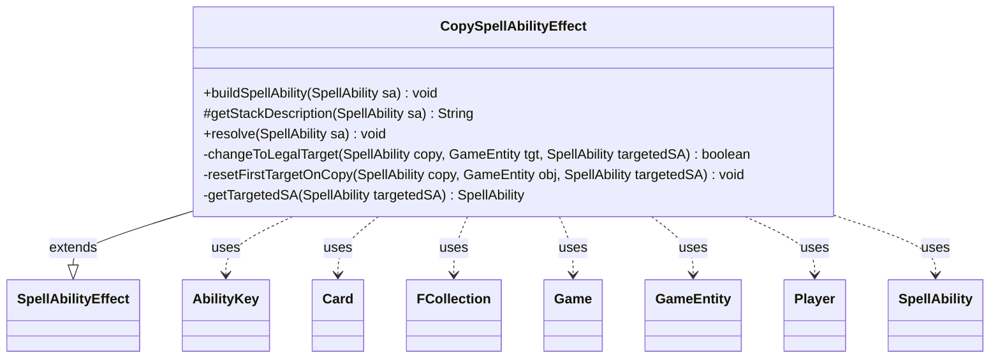

---
aliases:
  - CopySpellAbilityEffect
tags:
  - java/class
  - module/forge-game
  - pkg/forge/game/ability/effects
fqn: forge.game.ability.effects.CopySpellAbilityEffect
package: forge.game.ability.effects
module: forge-game
kind: Class
---

# CopySpellAbilityEffect

**Package:** `forge.game.ability.effects` &nbsp; **Module:** `forge-game` &nbsp; **Kind:** Class



## Relationships
**Extends:**
- [[forge.game.ability.SpellAbilityEffect|SpellAbilityEffect]]
**Uses:**
- [[forge.game.Game|Game]]
- [[forge.game.GameEntity|GameEntity]]
- [[forge.game.ability.AbilityKey|AbilityKey]]
- [[forge.game.card.Card|Card]]
- [[forge.game.player.Player|Player]]
- [[forge.game.spellability.SpellAbility|SpellAbility]]
- [[forge.util.collect.FCollection|FCollection]]

## Design Description

CopySpellAbilityEffect implements the resolution behavior for cards and abilities that copy spells or abilities already on the stack. Extending `SpellAbilityEffect`, it overrides `buildSpellAbility` to restrict targeting to the Stack zone, `getStackDescription` to render a readable summary, and `resolve` to produce the copies through `CardFactory`. It interprets numerous parameters (Amount, Controller, Optional, SingleChoice, CopyForEachCanTarget, DefinedTarget, MayChooseTarget, Epic) that encode distinct comprehensive-rules cases such as CR 707.10d/e.

In `resolve` it collaborates with the `Game`'s replacement handler to apply `CopySpell` replacement effects, marshalling parameters via `AbilityKey`, enumerating `GameEntity` candidates and `Player` controllers, and collecting target sets in `FCollection`. Private helpers (`getTargetedSA`, `changeToLegalTarget`, `resetFirstTargetOnCopy`) walk the sub-ability chain to retarget copies legally, separating rules-driven copy generation from controller-mediated choices and simultaneous play ordering.

## Source
`forge-game/src/main/java/forge/game/ability/effects/CopySpellAbilityEffect.java`

```java
package forge.game.ability.effects;

import com.google.common.collect.ImmutableMap;
import com.google.common.collect.Lists;
import forge.game.Game;
import forge.game.GameEntity;
import forge.game.GameObjectPredicates;
import forge.game.ability.AbilityKey;
import forge.game.ability.AbilityUtils;
import forge.game.ability.SpellAbilityEffect;
import forge.game.card.Card;
import forge.game.card.CardFactory;
import forge.game.keyword.Keyword;
import forge.game.player.Player;
import forge.game.replacement.ReplacementType;
import forge.game.spellability.SpellAbility;
import forge.game.zone.ZoneType;
import forge.util.*;
import forge.util.collect.FCollection;

import java.util.Iterator;
import java.util.List;
import java.util.Map;


public class CopySpellAbilityEffect extends SpellAbilityEffect {
    @Override
    public void buildSpellAbility(SpellAbility sa) {
        super.buildSpellAbility(sa);
        if (sa.usesTargeting()) {
            sa.getTargetRestrictions().setZone(ZoneType.Stack);
        }
    }

    @Override
    protected String getStackDescription(SpellAbility sa) {
        final StringBuilder sb = new StringBuilder();
        final List<SpellAbility> tgtSpells = getTargetSpells(sa);

        sb.append("Copy ");
        // TODO Someone fix this Description when Copying Charms
        final Iterator<SpellAbility> it = tgtSpells.iterator();
        while (it.hasNext()) {
            sb.append(it.next().getHostCard());
            if (it.hasNext()) {
                sb.append(", ");
            }
        }
        int amount = 1;
        if (sa.hasParam("Amount")) {
            amount = AbilityUtils.calculateAmount(sa.getHostCard(), sa.getParam("Amount"), sa);
        }
        if (amount > 1) {
            sb.append(" ").append(Lang.getNumeral(amount)).append(" times");
        }
        sb.append(".");
        // TODO probably add an optional "You may choose new targets..."
        return sb.toString();
    }

    /* (non-Javadoc)
     * @see forge.card.abilityfactory.SpellEffect#resolve(java.util.Map, forge.card.spellability.SpellAbility)
     */
    @Override
    public void resolve(SpellAbility sa) {
        final Card card = sa.getHostCard();
        final Game game = card.getGame();

        int amount = 1;
        if (sa.hasParam("Amount")) {
            amount = AbilityUtils.calculateAmount(card, sa.getParam("Amount"), sa);
        }

        List<SpellAbility> tgtSpells = getTargetSpells(sa);

        tgtSpells.removeIf(SpellAbility::cantBeCopied);

        if (tgtSpells.isEmpty() || amount == 0) {
            return;
        }

        List<Player> controllers = AbilityUtils.getDefinedPlayers(card, sa.getParam("Controller"), sa);

        boolean isOptional = sa.hasParam("Optional");

        for (Player controller : controllers) {
            List<SpellAbility> copies = Lists.newArrayList();

            List<SpellAbility> copySpells = tgtSpells;
            if (sa.hasParam("SingleChoice")) {
                SpellAbility chosenSA = controller.getController().chooseSingleSpellForEffect(tgtSpells, sa,
                        Localizer.getInstance().getMessage("lblSelectASpellCopy"), ImmutableMap.of());
                copySpells = Lists.newArrayList(chosenSA);
            }

            for (SpellAbility chosenSA : copySpells) {
                if (isOptional && !controller.getController().confirmAction(sa, null, Localizer.getInstance().getMessage("lblDoyouWantCopyTheSpell", chosenSA.getHostCard().getTranslatedName()), null)) {
                    continue;
                }

                // CR 707.10d
                if (sa.hasParam("CopyForEachCanTarget")) {
                    SpellAbility targetedSA = getTargetedSA(chosenSA);
                    if (targetedSA == null) {
                        continue;
                    }

                    FCollection<GameEntity> all = new FCollection<>(IterableUtil.filter(targetedSA.getTargetRestrictions().getAllCandidates(targetedSA, true), GameObjectPredicates.restriction(sa.getParam("CopyForEachCanTarget").split(","), sa.getActivatingPlayer(), card, sa)));
                    // Remove targeted players because getAllCandidates include all the valid players
                    all.removeAll(getTargetPlayers(targetedSA));

                    if (sa.hasParam("ChooseOnlyOne")) { // Beamsplitter Mage
                        GameEntity choice = controller.getController().chooseSingleEntityForEffect(all, sa, Localizer.getInstance().getMessage("lblChooseOne"), null);
                        if (choice != null) {
                            SpellAbility copy = CardFactory.copySpellAbilityAndPossiblyHost(sa, chosenSA, controller);
                            if (changeToLegalTarget(copy, choice, targetedSA)) {
                                copies.add(copy);
                            }
                        }
                    } else {
                        for (final GameEntity ge : all) {
                            SpellAbility copy = CardFactory.copySpellAbilityAndPossiblyHost(sa, chosenSA, controller);
                            resetFirstTargetOnCopy(copy, ge, targetedSA);
                            copies.add(copy);
                        }
                    }
                } else if (sa.hasParam("DefinedTarget")) { // CR 707.10e
                    final List<GameEntity> tgts = AbilityUtils.getDefinedEntities(card, sa.getParam("DefinedTarget"), sa);
                    if (tgts.isEmpty()) {
                        continue;
                    }
                    SpellAbility targetedSA = getTargetedSA(chosenSA);
                    if (targetedSA == null) {
                        continue;
                    }

                    FCollection<GameEntity>  newTgts = new FCollection<>();
                    for (GameEntity e : tgts) {
                        if (e instanceof Player) { // Zevlor
                            FCollection<GameEntity> choices = new FCollection<>(e);
                            choices.addAll(((Player) e).getCardsIn(ZoneType.Battlefield));
                            newTgts.add(controller.getController().chooseSingleEntityForEffect(choices, sa, Localizer.getInstance().getMessage("lblChooseOne"), null));
                        } else { // Ivy
                            newTgts.add(e);
                        }
                    }

                    for (GameEntity e : newTgts) {
                        SpellAbility copy = CardFactory.copySpellAbilityAndPossiblyHost(sa, chosenSA, controller);
                        if (changeToLegalTarget(copy, e, targetedSA)) {
                            copies.add(copy);
                        }
                    }
                } else {
                    for (int i = 0; i < amount; i++) {
                        SpellAbility copy = CardFactory.copySpellAbilityAndPossiblyHost(sa, chosenSA, controller);
                        if (sa.hasParam("IgnoreFreeze")) {
                            copy.putParam("IgnoreFreeze", "True");
                        }
                        if (sa.hasParam("MayChooseTarget")) {
                            copy.setMayChooseNewTargets(true);
                        }

                        // extra case for Epic to remove the keyword and the last part of the SpellAbility
                        if (sa.hasParam("Epic")) {
                            copy.getHostCard().removeIntrinsicKeyword(Keyword.EPIC);
                        }

                        copies.add(copy);
                    }
                }

                if (copies.isEmpty()) {
                    continue;
                }

                int addAmount = copies.size();
                final Map<AbilityKey, Object> repParams = AbilityKey.mapFromAffected(controller);
                repParams.put(AbilityKey.SpellAbility, chosenSA);
                repParams.put(AbilityKey.Amount, addAmount);

                switch (game.getReplacementHandler().run(ReplacementType.CopySpell, repParams)) {
                case NotReplaced:
                    break;
                case Updated: {
                    addAmount = (int) repParams.get(AbilityKey.Amount);
                    break;
                }
                default:
                    addAmount = 0;
                }

                if (addAmount <= 0) {
                    continue;
                }
                int extraAmount = addAmount - copies.size();
                for (int i = 0; i < extraAmount; i++) {
                    SpellAbility copy = CardFactory.copySpellAbilityAndPossiblyHost(sa, chosenSA, controller);
                    // extra copies added with CopySpellReplacenment currently always has new choose targets
                    copy.setMayChooseNewTargets(true);
                    copies.add(copy);
                }
            }

            controller.getController().orderAndPlaySimultaneousSa(copies);

            if (sa.hasParam("RememberCopies")) {
                card.addRemembered(copies);
            }
        }
    }

    private boolean changeToLegalTarget(SpellAbility copy, GameEntity tgt, SpellAbility targetedSA) {
        SpellAbility targetedCopy = getTargetedSA(copy);
        if (targetedCopy == null) {
            return false;
        }
        if (!targetedCopy.canTarget(tgt)) {
            return false;
        }
        resetFirstTargetOnCopy(targetedCopy, tgt, targetedSA);
        return true;
    }

    private void resetFirstTargetOnCopy(SpellAbility copy, GameEntity obj, SpellAbility targetedSA) {
        SpellAbility subAb = copy;
        while (subAb != null) {
            subAb.resetFirstTarget(obj, targetedSA);
            subAb = subAb.getSubAbility();
        }
    }

    private SpellAbility getTargetedSA(SpellAbility targetedSA) {
        // Find subability or rootability that has targets
        while (targetedSA != null) {
            if (targetedSA.usesTargeting() && !targetedSA.getTargets().isEmpty()) {
                break;
            }
            targetedSA = targetedSA.getSubAbility();
        }
        return targetedSA;
    }

}
```

## Python
`forge/game/ability/effects/CopySpellAbilityEffect.py`

```python
from forge.game.Game import Game
from forge.game.GameEntity import GameEntity
from forge.game.GameObjectPredicates import GameObjectPredicates
from forge.game.ability.AbilityKey import AbilityKey
from forge.game.ability.AbilityUtils import AbilityUtils
from forge.game.ability.SpellAbilityEffect import SpellAbilityEffect
from forge.game.card.Card import Card
from forge.game.card.CardFactory import CardFactory
from forge.game.keyword.Keyword import Keyword
from forge.game.player.Player import Player
from forge.game.replacement.ReplacementType import ReplacementType
from forge.game.spellability.SpellAbility import SpellAbility
from forge.game.zone.ZoneType import ZoneType
from forge.util.Lang import Lang
from forge.util.Localizer import Localizer
from forge.util.IterableUtil import IterableUtil
from forge.util.collect.FCollection import FCollection


class CopySpellAbilityEffect(SpellAbilityEffect):
    def buildSpellAbility(self, sa: SpellAbility) -> None:
        super().buildSpellAbility(sa)
        if sa.usesTargeting():
            sa.getTargetRestrictions().setZone(ZoneType.Stack)

    def getStackDescription(self, sa: SpellAbility) -> str:
        sb = []
        tgtSpells = self.getTargetSpells(sa)

        sb.append("Copy ")
        # TODO Someone fix this Description when Copying Charms
        it = iter(tgtSpells)
        try:
            current = next(it)
            while True:
                sb.append(str(current.getHostCard()))
                try:
                    current = next(it)
                except StopIteration:
                    break
                sb.append(", ")
        except StopIteration:
            pass
        amount = 1
        if sa.hasParam("Amount"):
            amount = AbilityUtils.calculateAmount(sa.getHostCard(), sa.getParam("Amount"), sa)
        if amount > 1:
            sb.append(" ")
            sb.append(Lang.getNumeral(amount))
            sb.append(" times")
        sb.append(".")
        # TODO probably add an optional "You may choose new targets..."
        return "".join(sb)

    # (non-Javadoc)
    # @see forge.card.abilityfactory.SpellEffect#resolve(java.util.Map, forge.card.spellability.SpellAbility)
    def resolve(self, sa: SpellAbility) -> None:
        card = sa.getHostCard()
        game = card.getGame()

        amount = 1
        if sa.hasParam("Amount"):
            amount = AbilityUtils.calculateAmount(card, sa.getParam("Amount"), sa)

        tgtSpells = self.getTargetSpells(sa)

        tgtSpells[:] = [s for s in tgtSpells if not s.cantBeCopied()]

        if not tgtSpells or amount == 0:
            return

        controllers = AbilityUtils.getDefinedPlayers(card, sa.getParam("Controller"), sa)

        isOptional = sa.hasParam("Optional")

        for controller in controllers:
            copies = []

            copySpells = tgtSpells
            if sa.hasParam("SingleChoice"):
                chosenSA = controller.getController().chooseSingleSpellForEffect(tgtSpells, sa,
                        Localizer.getInstance().getMessage("lblSelectASpellCopy"), {})
                copySpells = [chosenSA]

            for chosenSA in copySpells:
                if isOptional and not controller.getController().confirmAction(sa, None, Localizer.getInstance().getMessage("lblDoyouWantCopyTheSpell", chosenSA.getHostCard().getTranslatedName()), None):
                    continue

                # CR 707.10d
                if sa.hasParam("CopyForEachCanTarget"):
                    targetedSA = self.getTargetedSA(chosenSA)
                    if targetedSA is None:
                        continue

                    all = FCollection(IterableUtil.filter(targetedSA.getTargetRestrictions().getAllCandidates(targetedSA, True), GameObjectPredicates.restriction(sa.getParam("CopyForEachCanTarget").split(","), sa.getActivatingPlayer(), card, sa)))
                    # Remove targeted players because getAllCandidates include all the valid players
                    all.removeAll(self.getTargetPlayers(targetedSA))

                    if sa.hasParam("ChooseOnlyOne"):  # Beamsplitter Mage
                        choice = controller.getController().chooseSingleEntityForEffect(all, sa, Localizer.getInstance().getMessage("lblChooseOne"), None)
                        if choice is not None:
                            copy = CardFactory.copySpellAbilityAndPossiblyHost(sa, chosenSA, controller)
                            if self.changeToLegalTarget(copy, choice, targetedSA):
                                copies.append(copy)
                    else:
                        for ge in all:
                            copy = CardFactory.copySpellAbilityAndPossiblyHost(sa, chosenSA, controller)
                            self.resetFirstTargetOnCopy(copy, ge, targetedSA)
                            copies.append(copy)
                elif sa.hasParam("DefinedTarget"):  # CR 707.10e
                    tgts = AbilityUtils.getDefinedEntities(card, sa.getParam("DefinedTarget"), sa)
                    if not tgts:
                        continue
                    targetedSA = self.getTargetedSA(chosenSA)
                    if targetedSA is None:
                        continue

                    newTgts = FCollection()
                    for e in tgts:
                        if isinstance(e, Player):  # Zevlor
                            choices = FCollection(e)
                            choices.addAll(e.getCardsIn(ZoneType.Battlefield))
                            newTgts.add(controller.getController().chooseSingleEntityForEffect(choices, sa, Localizer.getInstance().getMessage("lblChooseOne"), None))
                        else:  # Ivy
                            newTgts.add(e)

                    for e in newTgts:
                        copy = CardFactory.copySpellAbilityAndPossiblyHost(sa, chosenSA, controller)
                        if self.changeToLegalTarget(copy, e, targetedSA):
                            copies.append(copy)
                else:
                    for i in range(amount):
                        copy = CardFactory.copySpellAbilityAndPossiblyHost(sa, chosenSA, controller)
                        if sa.hasParam("IgnoreFreeze"):
                            copy.putParam("IgnoreFreeze", "True")
                        if sa.hasParam("MayChooseTarget"):
                            copy.setMayChooseNewTargets(True)

                        # extra case for Epic to remove the keyword and the last part of the SpellAbility
                        if sa.hasParam("Epic"):
                            copy.getHostCard().removeIntrinsicKeyword(Keyword.EPIC)

                        copies.append(copy)

                if not copies:
                    continue

                addAmount = len(copies)
                repParams = AbilityKey.mapFromAffected(controller)
                repParams[AbilityKey.SpellAbility] = chosenSA
                repParams[AbilityKey.Amount] = addAmount

                result = game.getReplacementHandler().run(ReplacementType.CopySpell, repParams)
                if result == ReplacementType.NotReplaced:
                    pass
                elif result == ReplacementType.Updated:
                    addAmount = int(repParams.get(AbilityKey.Amount))
                else:
                    addAmount = 0

                if addAmount <= 0:
                    continue
                extraAmount = addAmount - len(copies)
                for i in range(extraAmount):
                    copy = CardFactory.copySpellAbilityAndPossiblyHost(sa, chosenSA, controller)
                    # extra copies added with CopySpellReplacenment currently always has new choose targets
                    copy.setMayChooseNewTargets(True)
                    copies.append(copy)

            controller.getController().orderAndPlaySimultaneousSa(copies)

            if sa.hasParam("RememberCopies"):
                card.addRemembered(copies)

    def changeToLegalTarget(self, copy: SpellAbility, tgt: GameEntity, targetedSA: SpellAbility) -> bool:
        targetedCopy = self.getTargetedSA(copy)
        if targetedCopy is None:
            return False
        if not targetedCopy.canTarget(tgt):
            return False
        self.resetFirstTargetOnCopy(targetedCopy, tgt, targetedSA)
        return True

    def resetFirstTargetOnCopy(self, copy: SpellAbility, obj: GameEntity, targetedSA: SpellAbility) -> None:
        subAb = copy
        while subAb is not None:
            subAb.resetFirstTarget(obj, targetedSA)
            subAb = subAb.getSubAbility()

    def getTargetedSA(self, targetedSA: SpellAbility) -> SpellAbility:
        # Find subability or rootability that has targets
        while targetedSA is not None:
            if targetedSA.usesTargeting() and not targetedSA.getTargets().isEmpty():
                break
            targetedSA = targetedSA.getSubAbility()
        return targetedSA
```
