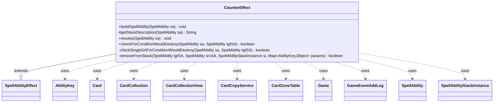

---
aliases:
  - CounterEffect
tags:
  - java/class
  - module/forge-game
  - pkg/forge/game/ability/effects
fqn: forge.game.ability.effects.CounterEffect
package: forge.game.ability.effects
module: forge-game
kind: Class
---

# CounterEffect

**Package:** `forge.game.ability.effects`   **Module:** `forge-game`   **Kind:** Class



## Relationships
**Extends:**
- [[forge.game.ability.SpellAbilityEffect|SpellAbilityEffect]]
**Uses:**
- [[forge.game.Game|Game]]
- [[forge.game.ability.AbilityKey|AbilityKey]]
- [[forge.game.card.Card|Card]]
- [[forge.game.card.CardCollection|CardCollection]]
- [[forge.game.card.CardCollectionView|CardCollectionView]]
- [[forge.game.card.CardCopyService|CardCopyService]]
- [[forge.game.card.CardZoneTable|CardZoneTable]]
- [[forge.game.event.GameEventAddLog|GameEventAddLog]]
- [[forge.game.spellability.SpellAbility|SpellAbility]]
- [[forge.game.spellability.SpellAbilityStackInstance|SpellAbilityStackInstance]]

## Design Description

CounterEffect implements the resolution logic for "counter" spells and abilities—those that nullify a spell or activated ability sitting on the stack. As a concrete `SpellAbilityEffect` subclass, it overrides `buildSpellAbility` to restrict targeting to the stack zone, `getStackDescription` to render player-facing text, and `resolve` to counter each targeted `SpellAbility`, honoring optional confirmation and a range of remember/destroy parameters.

The private helper `removeFromStack` does the heavy lifting: it runs `Counter` replacement effects, removes the `SpellAbilityStackInstance` from the `Game` stack, and routes the countered card to a configurable destination (graveyard, exile, hand, battlefield, or library) before firing `Countered` triggers and a `GameEventAddLog`. The static `checkForConditionWouldDestroy` chain shows notable design intent: it dry-runs destruction against `CardCopyService` copies with suppressed triggers to evaluate conditional counters, including a hacky special case for random-destruction effects. Throughout, behavior is driven by data-level parameter flags rather than hardcoded card logic.

## Source
`forge-game/src/main/java/forge/game/ability/effects/CounterEffect.java`

```java
package forge.game.ability.effects;

import com.google.common.collect.Lists;
import forge.game.Game;
import forge.game.GameLogEntryType;
import forge.game.ability.AbilityKey;
import forge.game.event.GameEventAddLog;
import forge.game.ability.ApiType;
import forge.game.ability.SpellAbilityEffect;
import forge.game.card.*;
import forge.game.replacement.ReplacementResult;
import forge.game.replacement.ReplacementType;
import forge.game.spellability.SpellAbility;
import forge.game.spellability.SpellAbilityStackInstance;
import forge.game.trigger.TriggerType;
import forge.game.zone.ZoneType;
import forge.util.Localizer;

import java.util.Arrays;
import java.util.List;
import java.util.Map;

public class CounterEffect extends SpellAbilityEffect {
    @Override
    public void buildSpellAbility(SpellAbility sa) {
        super.buildSpellAbility(sa);
        if (sa.usesTargeting()) {
            sa.getTargetRestrictions().setZone(ZoneType.Stack);
        }
    }

    @Override
    protected String getStackDescription(SpellAbility sa) {
        final StringBuilder sb = new StringBuilder();

        sb.append("Counter");

        boolean isAbility = false;
        for (final SpellAbility tgtSA : getTargetSpells(sa)) {
            sb.append(" ");
            sb.append(tgtSA.getHostCard());
            isAbility = tgtSA.isAbility();
            if (isAbility) {
                sb.append("'s ability");
            }
        }

        if (isAbility && sa.hasParam("DestroyPermanent")) {
            sb.append(" and destroy it");
        }

        if (sa.hasParam("UnlessCost")) {
            sb.append(" unless its controller pays {" + sa.getParam("UnlessCost") + "}");
        }

        sb.append(".");
        return sb.toString();
    } // end counterStackDescription

    @Override
    public void resolve(SpellAbility sa) {
        final Game game = sa.getActivatingPlayer().getGame();
        Map<AbilityKey, Object> params = AbilityKey.newMap();
        final CardZoneTable zoneMovements = AbilityKey.addCardZoneTableParams(params, sa);

        for (final SpellAbility tgtSA : getTargetSpells(sa)) {
            if (sa.hasParam("Optional") && !sa.getActivatingPlayer().getController().confirmAction(sa, null,
                    Localizer.getInstance().getMessage("lblWouldYouLikeProceedWithOptionalAbility") + " " + sa.getHostCard() + "?", null)) {
                return;
            }

            final Card tgtSACard = tgtSA.getHostCard();
            // should remember even that spell cannot be countered
            // currently all effects using this are targeted in case the spell gets countered before
            // so don't need to worry about LKI (else X amounts would be missing)
            if (sa.hasParam("RememberCounteredCMC")) {
                sa.getHostCard().addRemembered(tgtSACard.getCMC());
            }
            if (sa.hasParam("RememberForCounter")) {
                sa.getHostCard().addRemembered(tgtSACard);
            }

            if (tgtSA.isSpell() && !tgtSA.isCounterableBy(sa)) {
                continue;
            }

            final SpellAbilityStackInstance si = game.getStack().getInstanceMatchingSpellAbilityID(tgtSA);
            if (si == null) {
                continue;
            }

            if (sa.hasParam("ConditionWouldDestroy") && !checkForConditionWouldDestroy(sa, tgtSA)) {
                continue;
            }

            if (sa.hasParam("RememberSplicedOntoCounteredSpell") && tgtSA.getSplicedCards() != null) {
                sa.getHostCard().addRemembered(tgtSA.getSplicedCards());
            }

            if (!removeFromStack(tgtSA, sa, si, params)) {
                continue;
            }

            // Destroy Permanent may be able to be turned into a SubAbility
            if (tgtSA.isAbility() && sa.hasParam("DestroyPermanent")) {
                game.getAction().destroy(tgtSACard, sa, true, params);
            }

            if (sa.hasParam("RememberCountered")) {
                sa.getHostCard().addRemembered(tgtSACard);
            }
            if (sa.hasParam("RememberCounteredSA")) {
                sa.getHostCard().addRemembered(tgtSA);
            }
        }
        zoneMovements.triggerChangesZoneAll(game, sa);
    }

    public static boolean checkForConditionWouldDestroy(SpellAbility sa, SpellAbility tgtSA) {
        List<SpellAbility> testChain = Lists.newArrayList();

        // TODO: add anything that may be important for the test chain here
        SpellAbility currentTgtSA = tgtSA;
        while (currentTgtSA != null) {
            testChain.add(currentTgtSA);
            currentTgtSA = currentTgtSA.getSubAbility();
        }

        for (SpellAbility viableTgtSA : testChain) {
            if (checkSingleSAForConditionWouldDestroy(sa, viableTgtSA)) {
                return true;
            }
        }

        return false;
    }

    private static boolean checkSingleSAForConditionWouldDestroy(SpellAbility sa, SpellAbility tgtSA) {
        Game game = sa.getHostCard().getGame();

        if (tgtSA.getApi() != ApiType.Destroy && tgtSA.getApi() != ApiType.DestroyAll) {
            return false;
        }

        String wouldDestroy = sa.getParam("ConditionWouldDestroy");
        CardCollectionView cardsOTB = game.getCardsIn(ZoneType.Battlefield);
        // Potential candidates that our condition (ConditionWouldDestroy) is checking for
        CardCollection conditionCandidates = CardLists.getValidCards(cardsOTB, wouldDestroy, sa.getActivatingPlayer(), sa.getHostCard(), sa);

        // Determine which cards will be affected by the target SA
        CardCollection affected = new CardCollection();
        if (tgtSA.hasParam("ValidTgts") || tgtSA.hasParam("Defined")) {
            affected.addAll(getDefinedCardsOrTargeted(tgtSA));
        } else if (tgtSA.hasParam("ValidCards")) {
            affected.addAll(CardLists.getValidCards(cardsOTB, tgtSA.getParam("ValidCards"), tgtSA.getActivatingPlayer(), tgtSA.getHostCard(), tgtSA));
        }

        // Determine which of the condition-specific candidates are potentially affected with the target SA
        CardCollection validAffected = new CardCollection();
        for (Card cand : conditionCandidates) {
            if (affected.contains(cand)) {
                validAffected.add(cand);
            }
        }

        // Special case: Wild Swing random destruction - only counter if all targets are valid and each can be destroyed (100% chance
        // to destroy one of the owned lands)
        // TODO: this is hacky... make the detection of this ability more robust and generic?
        boolean isRandomDestruction = false;
        if (validAffected.isEmpty() && tgtSA.getRootAbility().getApi() == ApiType.Pump
            && tgtSA.getRootAbility().hasParam("TargetMax")
            && tgtSA.getRootAbility().getSubAbility() != null
            && tgtSA.getRootAbility().getSubAbility().getApi() == ApiType.ChooseCard
            && tgtSA.getRootAbility().getSubAbility().hasParam("AtRandom")
            && "ChosenCard".equals(tgtSA.getParam("Defined"))) {
            isRandomDestruction = true;
            boolean allValid = true;
            affected.addAll(getDefinedCardsOrTargeted(tgtSA.getRootAbility()));
            for (Card cand : conditionCandidates) {
                if (affected.contains(cand)) {
                    validAffected.add(cand);
                }
            }
            CardCollectionView rootTgts = tgtSA.getRootAbility().getTargets().getTargetCards();
            for (Card rootTgt : rootTgts) {
                if (!validAffected.contains(rootTgt)) {
                    allValid = false;
                    break;
                }
            }
            if (!allValid) {
                return false;
            }
        }

        if (validAffected.isEmpty()) {
            return false;
        } else if (tgtSA.hasParam("Sacrifice")) {
            return false; // Sacrifice doesn't count as Destroy
        }

        // Dry run Destroy on each validAffected to see if it can be destroyed at this moment
        boolean willDestroyCondition = false;
        final boolean noRegen = tgtSA.hasParam("NoRegen");
        Map<AbilityKey, Object> testParams = AbilityKey.newMap();
        testParams.put(AbilityKey.LastStateBattlefield, game.copyLastStateBattlefield());

        boolean willDestroyAll = true;
        for (Card aff : validAffected) {
            if (tgtSA.usesTargeting() && !aff.canBeTargetedBy(tgtSA)) {
                willDestroyAll = false;
                continue; // Should account for Protection/Hexproof/etc.
            }

            Card toBeDestroyed = new CardCopyService(aff).copyCard(true);

            game.getTriggerHandler().setSuppressAllTriggers(true);
            boolean destroyed = game.getAction().destroy(toBeDestroyed, tgtSA, !noRegen, testParams);
            game.getTriggerHandler().setSuppressAllTriggers(false);

            if (destroyed) {
                willDestroyCondition = true; // this should pick up replacement effects replacing Destroy
                if (!isRandomDestruction) {
                    break;
                }
            } else {
                willDestroyAll = false;
            }
        }

        return isRandomDestruction ? willDestroyAll : willDestroyCondition;
    }

    /**
     * <p>
     * removeFromStack.
     * </p>
     *
     * @param tgtSA
     *            a {@link forge.game.spellability.SpellAbility} object.
     * @param srcSA
     *            a {@link forge.game.spellability.SpellAbility} object.
     * @param si
     *            a {@link forge.game.spellability.SpellAbilityStackInstance}
     *            object.
     */
    private static boolean removeFromStack(final SpellAbility tgtSA, final SpellAbility srcSA, final SpellAbilityStackInstance si, Map<AbilityKey, Object> params) {
        final Game game = tgtSA.getActivatingPlayer().getGame();
        Card movedCard = null;
        final Card c = tgtSA.getHostCard();

        final Map<AbilityKey, Object> repParams = AbilityKey.mapFromAffected(c);
        repParams.put(AbilityKey.Cause, srcSA);
        repParams.put(AbilityKey.SpellAbility, tgtSA);
        if (game.getReplacementHandler().run(ReplacementType.Counter, repParams) != ReplacementResult.NotReplaced) {
            return false;
        }
        game.getStack().remove(si);

        // if the target card on stack was a spell with Bestow, then unbestow it
        c.unanimateBestow();

        params.put(AbilityKey.StackSa, tgtSA);

        String destination = srcSA.getParamOrDefault("Destination", "Graveyard");
        if (srcSA.hasParam("DestinationChoice")) { //Hinder
            List<String> pos = Arrays.asList(srcSA.getParam("DestinationChoice").split(","));
            destination = srcSA.getActivatingPlayer().getController().chooseSomeType(Localizer.getInstance().getMessage("lblRemoveDestination"), tgtSA, pos);
        }
        if (tgtSA.isAbility()) {
            // For Ability-targeted counterspells - do not move it anywhere,
            // even if Destination$ is specified.
        } else if (destination.equals("Graveyard")) {
            movedCard = game.getAction().moveToGraveyard(c, srcSA, params);
        } else if (destination.equals("Exile")) {
            if (!c.canExiledBy(srcSA, true)) {
                return false;
            }
            movedCard = game.getAction().exile(c, srcSA, params);
        } else if (destination.equals("Hand")) {
            movedCard = game.getAction().moveToHand(c, srcSA, params);
        } else if (destination.equals("Battlefield")) {
            // card is no longer cast
            c.setCastSA(null);
            c.setCastFrom(null);
            c.forceTurnFaceUp();
            c.setController(srcSA.getActivatingPlayer(), game.getNextTimestamp());
            movedCard = game.getAction().moveToPlay(c, srcSA.getActivatingPlayer(), srcSA, params);
        } else if (destination.equals("TopOfLibrary")) {
            movedCard = game.getAction().moveToLibrary(c, srcSA, params);
        } else if (destination.equals("BottomOfLibrary")) {
            movedCard = game.getAction().moveToBottomOfLibrary(c, srcSA, params);
        } else {
            throw new IllegalArgumentException("AbilityFactory_CounterMagic: Invalid Destination argument for card "
                    + srcSA.getHostCard().getName());
        }

        final Map<AbilityKey, Object> runParams = AbilityKey.mapFromCard(c);
        runParams.put(AbilityKey.Cause, srcSA);
        runParams.put(AbilityKey.SpellAbility, tgtSA);
        game.getTriggerHandler().runTrigger(TriggerType.Countered, runParams, false);

        if (!tgtSA.isAbility()) {
            game.fireEvent(new GameEventAddLog(GameLogEntryType.ZONE_CHANGE, "Send countered spell to " + destination));
        }

        return true;
    }

}
```

## Python
`forge/game/ability/effects/CounterEffect.py`

```python
from forge.game.Game import Game
from forge.game.GameLogEntryType import GameLogEntryType
from forge.game.ability.AbilityKey import AbilityKey
from forge.game.event.GameEventAddLog import GameEventAddLog
from forge.game.ability.ApiType import ApiType
from forge.game.ability.SpellAbilityEffect import SpellAbilityEffect
from forge.game.card.Card import Card
from forge.game.card.CardCollection import CardCollection
from forge.game.card.CardCollectionView import CardCollectionView
from forge.game.card.CardCopyService import CardCopyService
from forge.game.card.CardZoneTable import CardZoneTable
from forge.game.card.CardLists import CardLists
from forge.game.replacement.ReplacementResult import ReplacementResult
from forge.game.replacement.ReplacementType import ReplacementType
from forge.game.spellability.SpellAbility import SpellAbility
from forge.game.spellability.SpellAbilityStackInstance import SpellAbilityStackInstance
from forge.game.trigger.TriggerType import TriggerType
from forge.game.zone.ZoneType import ZoneType
from forge.util.Localizer import Localizer


class CounterEffect(SpellAbilityEffect):
    def buildSpellAbility(self, sa):
        super().buildSpellAbility(sa)
        if sa.usesTargeting():
            sa.getTargetRestrictions().setZone(ZoneType.Stack)

    def getStackDescription(self, sa):
        sb = []

        sb.append("Counter")

        isAbility = False
        for tgtSA in self.getTargetSpells(sa):
            sb.append(" ")
            sb.append(str(tgtSA.getHostCard()))
            isAbility = tgtSA.isAbility()
            if isAbility:
                sb.append("'s ability")

        if isAbility and sa.hasParam("DestroyPermanent"):
            sb.append(" and destroy it")

        if sa.hasParam("UnlessCost"):
            sb.append(" unless its controller pays {" + sa.getParam("UnlessCost") + "}")

        sb.append(".")
        return "".join(sb)
    # end counterStackDescription

    def resolve(self, sa):
        game = sa.getActivatingPlayer().getGame()
        params = AbilityKey.newMap()
        zoneMovements = AbilityKey.addCardZoneTableParams(params, sa)

        for tgtSA in self.getTargetSpells(sa):
            if sa.hasParam("Optional") and not sa.getActivatingPlayer().getController().confirmAction(sa, None,
                    Localizer.getInstance().getMessage("lblWouldYouLikeProceedWithOptionalAbility") + " " + str(sa.getHostCard()) + "?", None):
                return

            tgtSACard = tgtSA.getHostCard()
            # should remember even that spell cannot be countered
            # currently all effects using this are targeted in case the spell gets countered before
            # so don't need to worry about LKI (else X amounts would be missing)
            if sa.hasParam("RememberCounteredCMC"):
                sa.getHostCard().addRemembered(tgtSACard.getCMC())
            if sa.hasParam("RememberForCounter"):
                sa.getHostCard().addRemembered(tgtSACard)

            if tgtSA.isSpell() and not tgtSA.isCounterableBy(sa):
                continue

            si = game.getStack().getInstanceMatchingSpellAbilityID(tgtSA)
            if si is None:
                continue

            if sa.hasParam("ConditionWouldDestroy") and not CounterEffect.checkForConditionWouldDestroy(sa, tgtSA):
                continue

            if sa.hasParam("RememberSplicedOntoCounteredSpell") and tgtSA.getSplicedCards() is not None:
                sa.getHostCard().addRemembered(tgtSA.getSplicedCards())

            if not CounterEffect.removeFromStack(tgtSA, sa, si, params):
                continue

            # Destroy Permanent may be able to be turned into a SubAbility
            if tgtSA.isAbility() and sa.hasParam("DestroyPermanent"):
                game.getAction().destroy(tgtSACard, sa, True, params)

            if sa.hasParam("RememberCountered"):
                sa.getHostCard().addRemembered(tgtSACard)
            if sa.hasParam("RememberCounteredSA"):
                sa.getHostCard().addRemembered(tgtSA)
        zoneMovements.triggerChangesZoneAll(game, sa)

    @staticmethod
    def checkForConditionWouldDestroy(sa, tgtSA):
        testChain = []

        # TODO: add anything that may be important for the test chain here
        currentTgtSA = tgtSA
        while currentTgtSA is not None:
            testChain.append(currentTgtSA)
            currentTgtSA = currentTgtSA.getSubAbility()

        for viableTgtSA in testChain:
            if CounterEffect.checkSingleSAForConditionWouldDestroy(sa, viableTgtSA):
                return True

        return False

    @staticmethod
    def checkSingleSAForConditionWouldDestroy(sa, tgtSA):
        game = sa.getHostCard().getGame()

        if tgtSA.getApi() != ApiType.Destroy and tgtSA.getApi() != ApiType.DestroyAll:
            return False

        wouldDestroy = sa.getParam("ConditionWouldDestroy")
        cardsOTB = game.getCardsIn(ZoneType.Battlefield)
        # Potential candidates that our condition (ConditionWouldDestroy) is checking for
        conditionCandidates = CardLists.getValidCards(cardsOTB, wouldDestroy, sa.getActivatingPlayer(), sa.getHostCard(), sa)

        # Determine which cards will be affected by the target SA
        affected = CardCollection()
        if tgtSA.hasParam("ValidTgts") or tgtSA.hasParam("Defined"):
            affected.addAll(CounterEffect.getDefinedCardsOrTargeted(tgtSA))
        elif tgtSA.hasParam("ValidCards"):
            affected.addAll(CardLists.getValidCards(cardsOTB, tgtSA.getParam("ValidCards"), tgtSA.getActivatingPlayer(), tgtSA.getHostCard(), tgtSA))

        # Determine which of the condition-specific candidates are potentially affected with the target SA
        validAffected = CardCollection()
        for cand in conditionCandidates:
            if affected.contains(cand):
                validAffected.add(cand)

        # Special case: Wild Swing random destruction - only counter if all targets are valid and each can be destroyed (100% chance
        # to destroy one of the owned lands)
        # TODO: this is hacky... make the detection of this ability more robust and generic?
        isRandomDestruction = False
        if (validAffected.isEmpty() and tgtSA.getRootAbility().getApi() == ApiType.Pump
                and tgtSA.getRootAbility().hasParam("TargetMax")
                and tgtSA.getRootAbility().getSubAbility() is not None
                and tgtSA.getRootAbility().getSubAbility().getApi() == ApiType.ChooseCard
                and tgtSA.getRootAbility().getSubAbility().hasParam("AtRandom")
                and "ChosenCard" == tgtSA.getParam("Defined")):
            isRandomDestruction = True
            allValid = True
            affected.addAll(CounterEffect.getDefinedCardsOrTargeted(tgtSA.getRootAbility()))
            for cand in conditionCandidates:
                if affected.contains(cand):
                    validAffected.add(cand)
            rootTgts = tgtSA.getRootAbility().getTargets().getTargetCards()
            for rootTgt in rootTgts:
                if not validAffected.contains(rootTgt):
                    allValid = False
                    break
            if not allValid:
                return False

        if validAffected.isEmpty():
            return False
        elif tgtSA.hasParam("Sacrifice"):
            return False  # Sacrifice doesn't count as Destroy

        # Dry run Destroy on each validAffected to see if it can be destroyed at this moment
        willDestroyCondition = False
        noRegen = tgtSA.hasParam("NoRegen")
        testParams = AbilityKey.newMap()
        testParams.put(AbilityKey.LastStateBattlefield, game.copyLastStateBattlefield())

        willDestroyAll = True
        for aff in validAffected:
            if tgtSA.usesTargeting() and not aff.canBeTargetedBy(tgtSA):
                willDestroyAll = False
                continue  # Should account for Protection/Hexproof/etc.

            toBeDestroyed = CardCopyService(aff).copyCard(True)

            game.getTriggerHandler().setSuppressAllTriggers(True)
            destroyed = game.getAction().destroy(toBeDestroyed, tgtSA, not noRegen, testParams)
            game.getTriggerHandler().setSuppressAllTriggers(False)

            if destroyed:
                willDestroyCondition = True  # this should pick up replacement effects replacing Destroy
                if not isRandomDestruction:
                    break
            else:
                willDestroyAll = False

        return willDestroyAll if isRandomDestruction else willDestroyCondition

    @staticmethod
    def removeFromStack(tgtSA, srcSA, si, params):
        game = tgtSA.getActivatingPlayer().getGame()
        movedCard = None
        c = tgtSA.getHostCard()

        repParams = AbilityKey.mapFromAffected(c)
        repParams.put(AbilityKey.Cause, srcSA)
        repParams.put(AbilityKey.SpellAbility, tgtSA)
        if game.getReplacementHandler().run(ReplacementType.Counter, repParams) != ReplacementResult.NotReplaced:
            return False
        game.getStack().remove(si)

        # if the target card on stack was a spell with Bestow, then unbestow it
        c.unanimateBestow()

        params.put(AbilityKey.StackSa, tgtSA)

        destination = srcSA.getParamOrDefault("Destination", "Graveyard")
        if srcSA.hasParam("DestinationChoice"):  # Hinder
            pos = srcSA.getParam("DestinationChoice").split(",")
            destination = srcSA.getActivatingPlayer().getController().chooseSomeType(Localizer.getInstance().getMessage("lblRemoveDestination"), tgtSA, pos)
        if tgtSA.isAbility():
            # For Ability-targeted counterspells - do not move it anywhere,
            # even if Destination$ is specified.
            pass
        elif destination == "Graveyard":
            movedCard = game.getAction().moveToGraveyard(c, srcSA, params)
        elif destination == "Exile":
            if not c.canExiledBy(srcSA, True):
                return False
            movedCard = game.getAction().exile(c, srcSA, params)
        elif destination == "Hand":
            movedCard = game.getAction().moveToHand(c, srcSA, params)
        elif destination == "Battlefield":
            # card is no longer cast
            c.setCastSA(None)
            c.setCastFrom(None)
            c.forceTurnFaceUp()
            c.setController(srcSA.getActivatingPlayer(), game.getNextTimestamp())
            movedCard = game.getAction().moveToPlay(c, srcSA.getActivatingPlayer(), srcSA, params)
        elif destination == "TopOfLibrary":
            movedCard = game.getAction().moveToLibrary(c, srcSA, params)
        elif destination == "BottomOfLibrary":
            movedCard = game.getAction().moveToBottomOfLibrary(c, srcSA, params)
        else:
            raise ValueError("AbilityFactory_CounterMagic: Invalid Destination argument for card "
                    + srcSA.getHostCard().getName())

        runParams = AbilityKey.mapFromCard(c)
        runParams.put(AbilityKey.Cause, srcSA)
        runParams.put(AbilityKey.SpellAbility, tgtSA)
        game.getTriggerHandler().runTrigger(TriggerType.Countered, runParams, False)

        if not tgtSA.isAbility():
            game.fireEvent(GameEventAddLog(GameLogEntryType.ZONE_CHANGE, "Send countered spell to " + destination))

        return True
```
