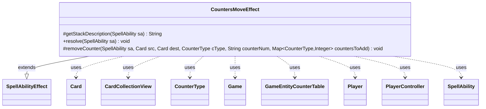

---
aliases:
  - CountersMoveEffect
tags:
  - java/class
  - module/forge-game
  - pkg/forge/game/ability/effects
fqn: forge.game.ability.effects.CountersMoveEffect
package: forge.game.ability.effects
module: forge-game
kind: Class
---

# CountersMoveEffect

**Package:** `forge.game.ability.effects`   **Module:** `forge-game`   **Kind:** Class



## Relationships
**Extends:**
- [[forge.game.ability.SpellAbilityEffect|SpellAbilityEffect]]
**Uses:**
- [[forge.game.Game|Game]]
- [[forge.game.GameEntityCounterTable|GameEntityCounterTable]]
- [[forge.game.card.Card|Card]]
- [[forge.game.card.CardCollectionView|CardCollectionView]]
- [[forge.game.card.CounterType|CounterType]]
- [[forge.game.player.Player|Player]]
- [[forge.game.player.PlayerController|PlayerController]]
- [[forge.game.spellability.SpellAbility|SpellAbility]]

## Design Description

CountersMoveEffect implements the resolution of Magic abilities that move counters between cards. As a concrete subclass of SpellAbilityEffect, it overrides `getStackDescription` to build a readable summary and `resolve` to perform the transfer, delegating the per-card work to a protected `removeCounter` helper that enforces legality (rule 121.5 self-move exclusion, `canReceiveCounters`/`canRemoveCounters`) and accumulates amounts into a pending add-map.

Driven by script parameters, it handles three topologies—many sources to one destination (`ValidSource`), one source to many destinations (`ValidDefined`), and direct target-to-target—and special counter modes such as "Any", "All", and "EachNotOn". It collaborates with Card and CounterType for state, Game for last-state updates, and PlayerController for interactive type/amount choices, staging all additions through a GameEntityCounterTable so replacement effects resolve atomically before counters are committed.

## Source
`forge-game/src/main/java/forge/game/ability/effects/CountersMoveEffect.java`

```java
package forge.game.ability.effects;

import java.util.List;
import java.util.Map;

import com.google.common.collect.Lists;
import com.google.common.collect.Maps;

import forge.game.Game;
import forge.game.GameEntityCounterTable;
import forge.game.ability.AbilityUtils;
import forge.game.ability.SpellAbilityEffect;
import forge.game.card.Card;
import forge.game.card.CardCollectionView;
import forge.game.card.CardLists;
import forge.game.card.CardPredicates;
import forge.game.card.CounterType;
import forge.game.player.Player;
import forge.game.player.PlayerController;
import forge.game.spellability.SpellAbility;
import forge.game.zone.ZoneType;
import forge.util.Localizer;
import forge.util.TextUtil;

public class CountersMoveEffect extends SpellAbilityEffect {

    @Override
    protected String getStackDescription(SpellAbility sa) {
        final StringBuilder sb = new StringBuilder();

        final List<Card> tgtCards = getDefinedCardsOrTargeted(sa);

        Card source = null;
        if (sa.usesTargeting() && sa.getMinTargets() == 2) {
            if (tgtCards.size() < 2) {
                return "";
            }
            source = tgtCards.remove(0);
        } else {
            List<Card> srcCards = getDefinedCardsOrTargeted(sa, "Source");

            if (srcCards.size() > 0) {
                source = srcCards.get(0);
            }
        }
        final String countername = sa.getParam("CounterType");
        final String counterAmount = sa.getParamOrDefault("CounterNum", "1");
        int amount = 0;
        if (!"Any".equals(counterAmount) && !"All".equals(counterAmount)) {
            amount = AbilityUtils.calculateAmount(sa.getHostCard(), counterAmount, sa);
        }

        sb.append("Move ");
        if ("Any".matches(countername)) {
            if (amount == 1) {
                sb.append("a counter");
            } else {
                sb.append(amount).append(" ").append(" counter");
            }
        } else if ("All".equals(countername)) {
            sb.append("all counter");
        } else {
            sb.append(amount).append(" ").append(countername).append(" counter");
        }
        if (amount != 1) {
            sb.append("s");
        }
        sb.append(" from ").append(source).append(" to ");
        try {
            sb.append(tgtCards.get(0));
        } catch (final IndexOutOfBoundsException exception) {
            System.out.println(TextUtil.concatWithSpace("Somehow this is missing targets?", source.toString()));
        }

        sb.append(".");
        return sb.toString();
    }

    @Override
    public void resolve(SpellAbility sa) {
        final Card host = sa.getHostCard();
        final String counterName = sa.getParam("CounterType");
        final String counterNum = sa.getParamOrDefault("CounterNum", "1");
        final Player activator = sa.getActivatingPlayer();
        final PlayerController pc = activator.getController();
        final Game game = host.getGame();

        CounterType cType = null;
        if (!counterName.matches("Any") && !counterName.matches("All")) {
            try {
                cType = CounterType.getType(counterName);
            } catch (Exception e) {
                System.out.println("Counter type doesn't match, nor does an SVar exist with the type name.");
                return;
            }
        }

        GameEntityCounterTable table = new GameEntityCounterTable();

        // uses for multi sources -> one defined/target
        // this needs given counter type
        if (sa.hasParam("ValidSource")) {
            CardCollectionView srcCards = CardLists.getValidCards(game.getCardsIn(ZoneType.Battlefield), sa.getParam("ValidSource"), activator, host, sa);
            List<Card> tgtCards = getDefinedCardsOrTargeted(sa);

            if (tgtCards.isEmpty()) {
                return;
            }
            Card dest = tgtCards.get(0);

            Card cur = game.getCardState(dest, null);
            if (cur == null || !cur.equalsWithGameTimestamp(dest)) {
                // Test to see if the card we're trying to add is in the expected state
                return;
            }
            dest = cur;

            Map<String, Object> params = Maps.newHashMap();
            params.put("Target", dest);

            if ("All".equals(counterName)) {
                // only select cards if the counterNum is any
                if (counterNum.equals("Any")) {
                    srcCards = CardLists.filter(srcCards, CardPredicates.hasCounters());
                    srcCards = activator.getController().chooseCardsForEffect(srcCards, sa,
                            Localizer.getInstance().getMessage("lblChooseTakeCountersCard", "any"), 0,
                            srcCards.size(), true, params);
                }
            } else {
                // target can't receive this counter type
                if (!dest.canReceiveCounters(cType)) {
                    return;
                }
                srcCards = CardLists.filter(srcCards, CardPredicates.hasCounter(cType));

                // only select cards if the counterNum is any
                if (counterNum.equals("Any")) {
                    params.put("CounterType", cType);
                    srcCards = activator.getController().chooseCardsForEffect(srcCards, sa,
                            Localizer.getInstance().getMessage("lblChooseTakeCountersCard", cType.getName()), 0,
                            srcCards.size(), true, params);
                }
            }

            Map<CounterType, Integer> countersToAdd = Maps.newHashMap();

            for (Card src : srcCards) {
                if ("All".equals(counterName)) {
                    final Map<CounterType, Integer> tgtCounters = Maps.newHashMap(src.getCounters());
                    for (Map.Entry<CounterType, Integer> e : tgtCounters.entrySet()) {
                        removeCounter(sa, src, dest, e.getKey(), counterNum, countersToAdd);
                    }
                } else {
                    removeCounter(sa, src, dest, cType, counterNum, countersToAdd);
                }
            }
            for (Map.Entry<CounterType, Integer> e : countersToAdd.entrySet()) {
                dest.addCounter(e.getKey(), e.getValue(), activator, table);
            }

            game.updateLastStateForCard(dest);
        } else if (sa.hasParam("ValidDefined")) {
            // one Source to many Targets
            // need given CounterType
            // currently used for Forgotten Ancient
            List<Card> srcCards = getDefinedCardsOrTargeted(sa, "Source");
            if (srcCards.isEmpty()) {
                return;
            }
            Card source = srcCards.get(0);

            if (source.getCounters(cType) <= 0) {
                return;
            }
            Map<String, Object> params = Maps.newHashMap();
            params.put("CounterType", cType);
            params.put("Source", source);

            CardCollectionView tgtCards = CardLists.getValidCards(game.getCardsIn(ZoneType.Battlefield), sa.getParam("ValidDefined"), activator, host, sa);

            if (counterNum.equals("Any")) {
                tgtCards = activator.getController().chooseCardsForEffect(
                        tgtCards, sa, Localizer.getInstance().getMessage("lblChooseCardToGetCountersFrom",
                                cType.getName(), source.getTranslatedName()),
                        0, tgtCards.size(), true, params);
            }

            boolean updateSource = false;

            for (final Card dest : tgtCards) {
                // rule 121.5: If the first and second objects are the same object, nothing happens
                if (source.equals(dest)) {
                    continue;
                }
                if (!dest.canReceiveCounters(cType)) {
                    continue;
                }
                if (!source.canRemoveCounters(cType)) {
                    continue;
                }

                Card cur = game.getCardState(dest, null);
                if (cur == null || !cur.equalsWithGameTimestamp(dest)) {
                    // Test to see if the card we're trying to add is in the expected state
                    continue;
                }

                params = Maps.newHashMap();
                params.put("CounterType", cType);
                params.put("Source", source);
                params.put("Target", cur);
                int cnum = activator.getController().chooseNumber(sa,
                        Localizer.getInstance().getMessage("lblPutHowManyTargetCounterOnCard", cType.getName(),
                                cur.getTranslatedName()),
                        0, source.getCounters(cType), params);

                if (cnum > 0) {
                    source.subtractCounter(cType, cnum, activator);
                    cur.addCounter(cType, cnum, activator, table);
                    game.updateLastStateForCard(cur);
                    updateSource = true;
                }
            }
            if (updateSource) {
                // update source
                game.updateLastStateForCard(source);
            }
        } else {
            Card source = null;
            List<Card> tgtCards = getDefinedCardsOrTargeted(sa);
            // special logic for moving from Target to Target
            if (sa.usesTargeting() && sa.getMinTargets() == 2) {
                if (tgtCards.size() < 2) {
                    return;
                }
                source = tgtCards.remove(0);
            } else {
                List<Card> srcCards = getDefinedCardsOrTargeted(sa, "Source");
                if (srcCards.size() > 0) {
                    source = srcCards.get(0);
                }
            }
            if (source == null) {
                return;
            }

            // source doesn't has any counters to move
            if (!source.hasCounters()) {
                return;
            }

            for (final Card dest : tgtCards) {
                if (null != dest) {
                    // rule 121.5: If the first and second objects are the same object, nothing happens
                    if (source.equals(dest)) {
                        continue;
                    }
                    Card cur = game.getCardState(dest, null);
                    if (cur == null || !cur.equalsWithGameTimestamp(dest)) {
                        // Test to see if the card we're trying to add is in the expected state
                        continue;
                    }

                    Map<CounterType, Integer> countersToAdd = Maps.newHashMap();
                    if ("All".equals(counterName)) {
                        final Map<CounterType, Integer> tgtCounters = Maps.newHashMap(source.getCounters());
                        for (Map.Entry<CounterType, Integer> e : tgtCounters.entrySet()) {
                            removeCounter(sa, source, cur, e.getKey(), counterNum, countersToAdd);
                        }
                    } else if ("EachNotOn".equals(counterName)) {
                        final Map<CounterType, Integer> tgtCounters = Maps.newHashMap(source.getCounters());
                        for (Map.Entry<CounterType, Integer> e : tgtCounters.entrySet()) {
                            if (cur.getCounters(e.getKey()) > 0) {
                                continue;
                            }
                            removeCounter(sa, source, cur, e.getKey(), counterNum, countersToAdd);
                        }
                    } else if ("Any".equals(counterName)) {
                        // any counterType currently only Leech Bonder
                        final Map<CounterType, Integer> tgtCounters = source.getCounters();

                        final List<CounterType> typeChoices = Lists.newArrayList();
                        // get types of counters
                        for (CounterType ct : tgtCounters.keySet()) {
                            if (dest.canReceiveCounters(ct) && source.canRemoveCounters(ct)) {
                                typeChoices.add(ct);
                            }
                        }
                        if (typeChoices.isEmpty()) {
                            return;
                        }

                        while (!typeChoices.isEmpty()) {
                            Map<String, Object> params = Maps.newHashMap();
                            params.put("Source", source);
                            params.put("Target", dest);
                            String title = Localizer.getInstance().getMessage("lblSelectRemoveCounterType");
                            CounterType chosenType = pc.chooseCounterType(typeChoices, sa, title, params);

                            removeCounter(sa, source, cur, chosenType, counterNum, countersToAdd);
                            if (!counterNum.equals("Any")) {
                                break;
                            }
                            typeChoices.remove(chosenType);
                        }
                    } else {
                        removeCounter(sa, source, cur, cType, counterNum, countersToAdd);
                    }

                    for (Map.Entry<CounterType, Integer> e : countersToAdd.entrySet()) {
                        cur.addCounter(e.getKey(), e.getValue(), activator, table);
                    }
                }
            }
            // update source
            game.updateLastStateForCard(source);
        }
        table.replaceCounterEffect(game, sa);
    } // moveCounterResolve

    protected void removeCounter(SpellAbility sa, final Card src, final Card dest, CounterType cType, String counterNum, Map<CounterType, Integer> countersToAdd) {
        final Card host = sa.getHostCard();
        final Player activator = sa.getActivatingPlayer();
        final PlayerController pc = activator.getController();
        final Game game = host.getGame();

        // rule 121.5: If the first and second objects are the same object, nothing happens
        if (src.equals(dest)) {
            return;
        }

        if (!dest.canReceiveCounters(cType)) {
            return;
        }
        if (!src.canRemoveCounters(cType)) {
            return;
        }

        int cmax = src.getCounters(cType);
        if (cmax <= 0) {
            return;
        }

        int cnum = 0;
        if (counterNum.equals("All")) {
            cnum = cmax;
        } else if (counterNum.equals("Any")) {
            Map<String, Object> params = Maps.newHashMap();
            params.put("CounterType", cType);
            params.put("Source", src);
            params.put("Target", dest);
            int min = sa.hasParam("NonZero") && countersToAdd.isEmpty() ? 1 : 0;
            cnum = pc.chooseNumber(
                    sa, Localizer.getInstance().getMessage("lblTakeHowManyTargetCounterFromCard",
                            cType.getName(), src.getTranslatedName()),
                    min, cmax, params);
        } else {
            cnum = Math.min(cmax, AbilityUtils.calculateAmount(host, counterNum, sa));
        }
        if (cnum > 0) {
            src.subtractCounter(cType, cnum, activator);
            game.updateLastStateForCard(src);
            countersToAdd.merge(cType, cnum, Integer::sum);
        }
    }
}
```

## Python
`forge/game/ability/effects/CountersMoveEffect.py`

```python
from forge.game.Game import Game
from forge.game.GameEntityCounterTable import GameEntityCounterTable
from forge.game.ability.AbilityUtils import AbilityUtils
from forge.game.ability.SpellAbilityEffect import SpellAbilityEffect
from forge.game.card.Card import Card
from forge.game.card.CardCollectionView import CardCollectionView
from forge.game.card.CardLists import CardLists
from forge.game.card.CardPredicates import CardPredicates
from forge.game.card.CounterType import CounterType
from forge.game.player.Player import Player
from forge.game.player.PlayerController import PlayerController
from forge.game.spellability.SpellAbility import SpellAbility
from forge.game.zone.ZoneType import ZoneType
from forge.util.Localizer import Localizer
from forge.util.TextUtil import TextUtil


class CountersMoveEffect(SpellAbilityEffect):

    def getStackDescription(self, sa: SpellAbility) -> str:
        sb = []

        tgtCards = self.getDefinedCardsOrTargeted(sa)

        source = None
        if sa.usesTargeting() and sa.getMinTargets() == 2:
            if len(tgtCards) < 2:
                return ""
            source = tgtCards.pop(0)
        else:
            srcCards = self.getDefinedCardsOrTargeted(sa, "Source")

            if len(srcCards) > 0:
                source = srcCards[0]

        countername = sa.getParam("CounterType")
        counterAmount = sa.getParamOrDefault("CounterNum", "1")
        amount = 0
        if counterAmount != "Any" and counterAmount != "All":
            amount = AbilityUtils.calculateAmount(sa.getHostCard(), counterAmount, sa)

        sb.append("Move ")
        if "Any" == countername:
            if amount == 1:
                sb.append("a counter")
            else:
                sb.append(str(amount))
                sb.append(" ")
                sb.append(" counter")
        elif "All" == countername:
            sb.append("all counter")
        else:
            sb.append(str(amount))
            sb.append(" ")
            sb.append(countername)
            sb.append(" counter")
        if amount != 1:
            sb.append("s")
        sb.append(" from ")
        sb.append(str(source))
        sb.append(" to ")
        try:
            sb.append(str(tgtCards[0]))
        except IndexError:
            print(TextUtil.concatWithSpace("Somehow this is missing targets?", str(source)))

        sb.append(".")
        return "".join(sb)

    def resolve(self, sa: SpellAbility) -> None:
        host = sa.getHostCard()
        counterName = sa.getParam("CounterType")
        counterNum = sa.getParamOrDefault("CounterNum", "1")
        activator = sa.getActivatingPlayer()
        pc = activator.getController()
        game = host.getGame()

        cType = None
        if counterName != "Any" and counterName != "All":
            try:
                cType = CounterType.getType(counterName)
            except Exception:
                print("Counter type doesn't match, nor does an SVar exist with the type name.")
                return

        table = GameEntityCounterTable()

        # uses for multi sources -> one defined/target
        # this needs given counter type
        if sa.hasParam("ValidSource"):
            srcCards = CardLists.getValidCards(game.getCardsIn(ZoneType.Battlefield), sa.getParam("ValidSource"), activator, host, sa)
            tgtCards = self.getDefinedCardsOrTargeted(sa)

            if len(tgtCards) == 0:
                return
            dest = tgtCards[0]

            cur = game.getCardState(dest, None)
            if cur is None or not cur.equalsWithGameTimestamp(dest):
                # Test to see if the card we're trying to add is in the expected state
                return
            dest = cur

            params = {}
            params["Target"] = dest

            if "All" == counterName:
                # only select cards if the counterNum is any
                if counterNum == "Any":
                    srcCards = CardLists.filter(srcCards, CardPredicates.hasCounters())
                    srcCards = activator.getController().chooseCardsForEffect(srcCards, sa,
                            Localizer.getInstance().getMessage("lblChooseTakeCountersCard", "any"), 0,
                            srcCards.size(), True, params)
            else:
                # target can't receive this counter type
                if not dest.canReceiveCounters(cType):
                    return
                srcCards = CardLists.filter(srcCards, CardPredicates.hasCounter(cType))

                # only select cards if the counterNum is any
                if counterNum == "Any":
                    params["CounterType"] = cType
                    srcCards = activator.getController().chooseCardsForEffect(srcCards, sa,
                            Localizer.getInstance().getMessage("lblChooseTakeCountersCard", cType.getName()), 0,
                            srcCards.size(), True, params)

            countersToAdd = {}

            for src in srcCards:
                if "All" == counterName:
                    tgtCounters = dict(src.getCounters())
                    for k, v in tgtCounters.items():
                        self.removeCounter(sa, src, dest, k, counterNum, countersToAdd)
                else:
                    self.removeCounter(sa, src, dest, cType, counterNum, countersToAdd)
            for k, v in countersToAdd.items():
                dest.addCounter(k, v, activator, table)

            game.updateLastStateForCard(dest)
        elif sa.hasParam("ValidDefined"):
            # one Source to many Targets
            # need given CounterType
            # currently used for Forgotten Ancient
            srcCards = self.getDefinedCardsOrTargeted(sa, "Source")
            if len(srcCards) == 0:
                return
            source = srcCards[0]

            if source.getCounters(cType) <= 0:
                return
            params = {}
            params["CounterType"] = cType
            params["Source"] = source

            tgtCards = CardLists.getValidCards(game.getCardsIn(ZoneType.Battlefield), sa.getParam("ValidDefined"), activator, host, sa)

            if counterNum == "Any":
                tgtCards = activator.getController().chooseCardsForEffect(
                        tgtCards, sa, Localizer.getInstance().getMessage("lblChooseCardToGetCountersFrom",
                                cType.getName(), source.getTranslatedName()),
                        0, tgtCards.size(), True, params)

            updateSource = False

            for dest in tgtCards:
                # rule 121.5: If the first and second objects are the same object, nothing happens
                if source.equals(dest):
                    continue
                if not dest.canReceiveCounters(cType):
                    continue
                if not source.canRemoveCounters(cType):
                    continue

                cur = game.getCardState(dest, None)
                if cur is None or not cur.equalsWithGameTimestamp(dest):
                    # Test to see if the card we're trying to add is in the expected state
                    continue

                params = {}
                params["CounterType"] = cType
                params["Source"] = source
                params["Target"] = cur
                cnum = activator.getController().chooseNumber(sa,
                        Localizer.getInstance().getMessage("lblPutHowManyTargetCounterOnCard", cType.getName(),
                                cur.getTranslatedName()),
                        0, source.getCounters(cType), params)

                if cnum > 0:
                    source.subtractCounter(cType, cnum, activator)
                    cur.addCounter(cType, cnum, activator, table)
                    game.updateLastStateForCard(cur)
                    updateSource = True
            if updateSource:
                # update source
                game.updateLastStateForCard(source)
        else:
            source = None
            tgtCards = self.getDefinedCardsOrTargeted(sa)
            # special logic for moving from Target to Target
            if sa.usesTargeting() and sa.getMinTargets() == 2:
                if len(tgtCards) < 2:
                    return
                source = tgtCards.pop(0)
            else:
                srcCards = self.getDefinedCardsOrTargeted(sa, "Source")
                if len(srcCards) > 0:
                    source = srcCards[0]
            if source is None:
                return

            # source doesn't has any counters to move
            if not source.hasCounters():
                return

            for dest in tgtCards:
                if dest is not None:
                    # rule 121.5: If the first and second objects are the same object, nothing happens
                    if source.equals(dest):
                        continue
                    cur = game.getCardState(dest, None)
                    if cur is None or not cur.equalsWithGameTimestamp(dest):
                        # Test to see if the card we're trying to add is in the expected state
                        continue

                    countersToAdd = {}
                    if "All" == counterName:
                        tgtCounters = dict(source.getCounters())
                        for k, v in tgtCounters.items():
                            self.removeCounter(sa, source, cur, k, counterNum, countersToAdd)
                    elif "EachNotOn" == counterName:
                        tgtCounters = dict(source.getCounters())
                        for k, v in tgtCounters.items():
                            if cur.getCounters(k) > 0:
                                continue
                            self.removeCounter(sa, source, cur, k, counterNum, countersToAdd)
                    elif "Any" == counterName:
                        # any counterType currently only Leech Bonder
                        tgtCounters = source.getCounters()

                        typeChoices = []
                        # get types of counters
                        for ct in tgtCounters.keys():
                            if dest.canReceiveCounters(ct) and source.canRemoveCounters(ct):
                                typeChoices.append(ct)
                        if len(typeChoices) == 0:
                            return

                        while len(typeChoices) != 0:
                            params = {}
                            params["Source"] = source
                            params["Target"] = dest
                            title = Localizer.getInstance().getMessage("lblSelectRemoveCounterType")
                            chosenType = pc.chooseCounterType(typeChoices, sa, title, params)

                            self.removeCounter(sa, source, cur, chosenType, counterNum, countersToAdd)
                            if counterNum != "Any":
                                break
                            typeChoices.remove(chosenType)
                    else:
                        self.removeCounter(sa, source, cur, cType, counterNum, countersToAdd)

                    for k, v in countersToAdd.items():
                        cur.addCounter(k, v, activator, table)
            # update source
            game.updateLastStateForCard(source)
        table.replaceCounterEffect(game, sa)
    # moveCounterResolve

    def removeCounter(self, sa: SpellAbility, src: Card, dest: Card, cType: CounterType, counterNum: str, countersToAdd: dict[CounterType, int]) -> None:
        host = sa.getHostCard()
        activator = sa.getActivatingPlayer()
        pc = activator.getController()
        game = host.getGame()

        # rule 121.5: If the first and second objects are the same object, nothing happens
        if src.equals(dest):
            return

        if not dest.canReceiveCounters(cType):
            return
        if not src.canRemoveCounters(cType):
            return

        cmax = src.getCounters(cType)
        if cmax <= 0:
            return

        cnum = 0
        if counterNum == "All":
            cnum = cmax
        elif counterNum == "Any":
            params = {}
            params["CounterType"] = cType
            params["Source"] = src
            params["Target"] = dest
            min = 1 if sa.hasParam("NonZero") and len(countersToAdd) == 0 else 0
            cnum = pc.chooseNumber(
                    sa, Localizer.getInstance().getMessage("lblTakeHowManyTargetCounterFromCard",
                            cType.getName(), src.getTranslatedName()),
                    min, cmax, params)
        else:
            cnum = min(cmax, AbilityUtils.calculateAmount(host, counterNum, sa))
        if cnum > 0:
            src.subtractCounter(cType, cnum, activator)
            game.updateLastStateForCard(src)
            countersToAdd[cType] = countersToAdd.get(cType, 0) + cnum
```
