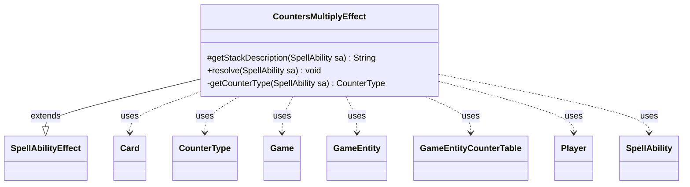

---
aliases:
  - CountersMultiplyEffect
tags:
  - java/class
  - module/forge-game
  - pkg/forge/game/ability/effects
fqn: forge.game.ability.effects.CountersMultiplyEffect
package: forge.game.ability.effects
module: forge-game
kind: Class
---

# CountersMultiplyEffect

**Package:** `forge.game.ability.effects`   **Module:** `forge-game`   **Kind:** Class



## Relationships
**Extends:**
- [[forge.game.ability.SpellAbilityEffect|SpellAbilityEffect]]
**Uses:**
- [[forge.game.Game|Game]]
- [[forge.game.GameEntity|GameEntity]]
- [[forge.game.GameEntityCounterTable|GameEntityCounterTable]]
- [[forge.game.card.Card|Card]]
- [[forge.game.card.CounterType|CounterType]]
- [[forge.game.player.Player|Player]]
- [[forge.game.spellability.SpellAbility|SpellAbility]]

## Design Description

CountersMultiplyEffect implements the resolution logic for counter-doubling abilities (e.g., Doubling Season), extending the abstract SpellAbilityEffect base class that standardizes how spell and ability outcomes are described and applied. It overrides `getStackDescription` to build a human-readable summary and `resolve` to perform the mutation, while a private `getCounterType` helper interprets the optional `CounterType` parameter, returning null to mean "every kind of counter."

Its responsibility is to multiply existing counters on each targeted GameEntity by a configurable `Multiplier` (default 2). It queries the Game to refresh card state—skipping last-known-information cards whose game timestamp no longer matches, so stale targets are ignored—and batches all additions through a GameEntityCounterTable. This table-based design centralizes the counter changes and applies replacement effects atomically, ensuring concurrent triggers resolve correctly rather than card-by-card.

## Source
`forge-game/src/main/java/forge/game/ability/effects/CountersMultiplyEffect.java`

```java
package forge.game.ability.effects;

import java.util.Map;

import forge.game.Game;
import forge.game.GameEntity;
import forge.game.GameEntityCounterTable;
import forge.game.ability.SpellAbilityEffect;
import forge.game.card.Card;
import forge.game.card.CounterType;
import forge.game.player.Player;
import forge.game.spellability.SpellAbility;
import forge.util.Lang;

public class CountersMultiplyEffect extends SpellAbilityEffect {

    @Override
    protected String getStackDescription(SpellAbility sa) {
        final StringBuilder sb = new StringBuilder();
        final CounterType counterType = getCounterType(sa);

        sb.append("Double the number of ");

        if (counterType != null) {
            sb.append(counterType.getName());
            sb.append(" counters");
        } else {
            sb.append("each kind of counter");
        }
        sb.append(" on ");

        sb.append(Lang.joinHomogenous(getTargetEntities(sa)));

        sb.append(".");

        return sb.toString();
    }

    @Override
    public void resolve(SpellAbility sa) {
        final Card host = sa.getHostCard();
        final Game game = host.getGame();
        final Player player = sa.getActivatingPlayer();

        final CounterType counterType = getCounterType(sa);
        final int n = Integer.parseInt(sa.getParamOrDefault("Multiplier", "2")) - 1;

        GameEntityCounterTable table = new GameEntityCounterTable();
        for (GameEntity ge : getTargetEntities(sa)) {
            if (ge instanceof Card) {
                Card gameCard = game.getCardState((Card) ge, null);
                // gameCard is LKI in that case, the card is not in game anymore
                // or the timestamp did change
                // this should check Self too
                if (gameCard == null || !((Card) ge).equalsWithGameTimestamp(gameCard)) {
                    continue;
                }
                ge = gameCard;
            }

            if (counterType != null) {
                ge.addCounter(counterType, ge.getCounters(counterType) * n, player, table);
            } else {
                for (Map.Entry<CounterType, Integer> e : ge.getCounters().entrySet()) {
                    ge.addCounter(e.getKey(), e.getValue() * n, player, table);
                }
            }
        }
        table.replaceCounterEffect(game, sa);
    }

    private CounterType getCounterType(SpellAbility sa) {
        if (sa.hasParam("CounterType")) {
            try {
                return CounterType.getType(sa.getParam("CounterType"));
            } catch (Exception e) {
                System.out.println("Counter type doesn't match, nor does an SVar exist with the type name.");
                return null;
            }
        }
        return null;
    }
}
```

## Python
`forge/game/ability/effects/CountersMultiplyEffect.py`

```python
from forge.game.Game import Game
from forge.game.GameEntity import GameEntity
from forge.game.GameEntityCounterTable import GameEntityCounterTable
from forge.game.ability.SpellAbilityEffect import SpellAbilityEffect
from forge.game.card.Card import Card
from forge.game.card.CounterType import CounterType
from forge.game.player.Player import Player
from forge.game.spellability.SpellAbility import SpellAbility
from forge.util.Lang import Lang


class CountersMultiplyEffect(SpellAbilityEffect):

    def getStackDescription(self, sa: SpellAbility) -> str:
        sb = []
        counterType = self.getCounterType(sa)

        sb.append("Double the number of ")

        if counterType is not None:
            sb.append(counterType.getName())
            sb.append(" counters")
        else:
            sb.append("each kind of counter")
        sb.append(" on ")

        sb.append(Lang.joinHomogenous(self.getTargetEntities(sa)))

        sb.append(".")

        return "".join(sb)

    def resolve(self, sa: SpellAbility) -> None:
        host = sa.getHostCard()
        game = host.getGame()
        player = sa.getActivatingPlayer()

        counterType = self.getCounterType(sa)
        n = int(sa.getParamOrDefault("Multiplier", "2")) - 1

        table = GameEntityCounterTable()
        for ge in self.getTargetEntities(sa):
            if isinstance(ge, Card):
                gameCard = game.getCardState(ge, None)
                # gameCard is LKI in that case, the card is not in game anymore
                # or the timestamp did change
                # this should check Self too
                if gameCard is None or not ge.equalsWithGameTimestamp(gameCard):
                    continue
                ge = gameCard

            if counterType is not None:
                ge.addCounter(counterType, ge.getCounters(counterType) * n, player, table)
            else:
                for e in ge.getCounters().items():
                    ge.addCounter(e[0], e[1] * n, player, table)
        table.replaceCounterEffect(game, sa)

    def getCounterType(self, sa: SpellAbility) -> CounterType:
        if sa.hasParam("CounterType"):
            try:
                return CounterType.getType(sa.getParam("CounterType"))
            except Exception:
                print("Counter type doesn't match, nor does an SVar exist with the type name.")
                return None
        return None
```
