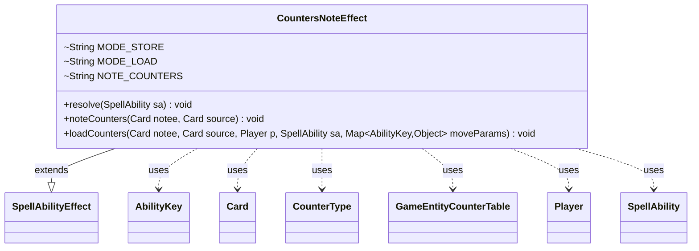

---
aliases:
  - CountersNoteEffect
tags:
  - java/class
  - module/forge-game
  - pkg/forge/game/ability/effects
fqn: forge.game.ability.effects.CountersNoteEffect
package: forge.game.ability.effects
module: forge-game
kind: Class
---

# CountersNoteEffect

**Package:** `forge.game.ability.effects` &nbsp; **Module:** `forge-game` &nbsp; **Kind:** Class



## Relationships
**Extends:**
- [[forge.game.ability.SpellAbilityEffect|SpellAbilityEffect]]
**Uses:**
- [[forge.game.GameEntityCounterTable|GameEntityCounterTable]]
- [[forge.game.ability.AbilityKey|AbilityKey]]
- [[forge.game.card.Card|Card]]
- [[forge.game.card.CounterType|CounterType]]
- [[forge.game.player.Player|Player]]
- [[forge.game.spellability.SpellAbility|SpellAbility]]

## Design Description

CountersNoteEffect is a stateless utility effect in Forge's ability-effects layer responsible for "noting" a card's counters so they can be restored later — the mechanic behind cards like Oubliette and Tawnos' Coffin that exile a permanent and return it with its counters intact. It extends SpellAbilityEffect but leaves `resolve` empty, instead exposing two static helpers invoked by other effects. `noteCounters` serializes each CounterType/amount pair from the card as `NoteCounters`-prefixed SVars on the source card, reusing the existing SVar mechanism rather than adding persistent fields. `loadCounters` parses those SVars back into a GameEntityCounterTable keyed to the activating Player and hands it off via the move-parameter map under AbilityKey.CounterTable. The design intentionally keeps no instance state and defers actual counter application to the caller's table-driven move pipeline, collaborating loosely with Card, CounterType, Player, and SpellAbility.

## Source
`forge-game/src/main/java/forge/game/ability/effects/CountersNoteEffect.java`

```java
package forge.game.ability.effects;

import java.util.Map;
import java.util.Map.Entry;

import forge.game.GameEntityCounterTable;
import forge.game.ability.AbilityKey;
import forge.game.ability.SpellAbilityEffect;
import forge.game.card.Card;
import forge.game.card.CounterType;
import forge.game.player.Player;
import forge.game.spellability.SpellAbility;

public class CountersNoteEffect extends SpellAbilityEffect {
    // Primarily used for "Noting" Counters on a card. i.e. Oubliette or Tawnos' Coffin
    // Counters get "noted" as SVars onto the Source
    // "Mode": "Store" or "Load"
    final static String MODE_STORE = "Store";
    final static String MODE_LOAD = "Load";
    final static String NOTE_COUNTERS = "NoteCounters";

    @Override
    public void resolve(SpellAbility sa) {
    }

    public static void noteCounters(Card notee, Card source) {
        for (Entry<CounterType, Integer> counter : notee.getCounters().entrySet()) {
            StringBuilder sb = new StringBuilder();
            sb.append(NOTE_COUNTERS).append(counter.getKey().getName());
            source.setSVar(sb.toString(), counter.getValue().toString());
        }
    }

    public static void loadCounters(Card notee, Card source, final Player p, final SpellAbility sa, Map<AbilityKey, Object> moveParams) {
        GameEntityCounterTable table = new GameEntityCounterTable();
        for (Entry<String, String> svar : source.getSVars().entrySet()) {
            String key = svar.getKey();
            if (key.startsWith(NOTE_COUNTERS)) {
                CounterType cType = CounterType.getType(key.substring(NOTE_COUNTERS.length()));
                int cAmount = Integer.parseInt(svar.getValue());
                table.put(sa.getActivatingPlayer(), notee, cType, cAmount);
            }
            // TODO Probably should "remove" the svars that were temporarily used
        }
        moveParams.put(AbilityKey.CounterTable, table);
    }
}
```
