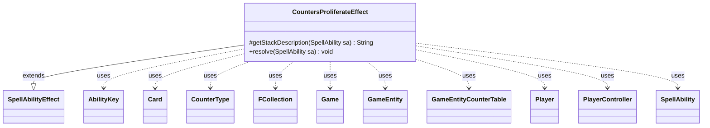

---
aliases:
  - CountersProliferateEffect
tags:
  - java/class
  - module/forge-game
  - pkg/forge/game/ability/effects
fqn: forge.game.ability.effects.CountersProliferateEffect
package: forge.game.ability.effects
module: forge-game
kind: Class
---

# CountersProliferateEffect

**Package:** `forge.game.ability.effects`   **Module:** `forge-game`   **Kind:** Class



## Relationships
**Extends:**
- [[forge.game.ability.SpellAbilityEffect|SpellAbilityEffect]]
**Uses:**
- [[forge.game.Game|Game]]
- [[forge.game.GameEntity|GameEntity]]
- [[forge.game.GameEntityCounterTable|GameEntityCounterTable]]
- [[forge.game.ability.AbilityKey|AbilityKey]]
- [[forge.game.card.Card|Card]]
- [[forge.game.card.CounterType|CounterType]]
- [[forge.game.player.Player|Player]]
- [[forge.game.player.PlayerController|PlayerController]]
- [[forge.game.spellability.SpellAbility|SpellAbility]]
- [[forge.util.collect.FCollection|FCollection]]

## Design Description

CountersProliferateEffect implements Magic's "proliferate" keyword action as a concrete `SpellAbilityEffect`. It overrides `getStackDescription` to render the standard reminder text and `resolve` to perform the effect: it builds an `FCollection<GameEntity>` of every `Player` and battlefield `Card` already bearing a counter, asks the activating player's `PlayerController` to choose any subset, and adds one of each existing `CounterType` to each chosen entity.

As a leaf in Forge's command-style effect hierarchy, the class is invoked through a `SpellAbility` and reads its host, game, and parameters from that ability rather than holding state. Notable design intent: counter additions are funneled through a `GameEntityCounterTable` and applied as one batch so replacement effects resolve cleanly; an `Amount` parameter plus the `Proliferate` `ReplacementType` allow the action to repeat; and a `Proliferate` trigger fires each iteration—keeping the effect composable with the engine's replacement and trigger subsystems.

## Source
`forge-game/src/main/java/forge/game/ability/effects/CountersProliferateEffect.java`

```java
package forge.game.ability.effects;

import java.util.List;
import java.util.Map;

import forge.game.Game;
import forge.game.GameEntity;
import forge.game.GameEntityCounterTable;
import forge.game.ability.AbilityKey;
import forge.game.ability.AbilityUtils;
import forge.game.ability.SpellAbilityEffect;
import forge.game.card.*;
import forge.game.player.Player;
import forge.game.player.PlayerController;
import forge.game.player.PlayerPredicates;
import forge.game.replacement.ReplacementType;
import forge.game.spellability.SpellAbility;
import forge.game.trigger.TriggerType;
import forge.game.zone.ZoneType;
import forge.util.Localizer;
import forge.util.collect.FCollection;

public class CountersProliferateEffect extends SpellAbilityEffect {
    @Override
    protected String getStackDescription(SpellAbility sa) {
        final StringBuilder sb = new StringBuilder();
        sb.append("Proliferate.");
        sb.append(" (Choose any number of permanents and/or players,");
        sb.append(" then give each another counter of each kind already there.)");

        return sb.toString();
    }

    @Override
    public void resolve(SpellAbility sa) {
        final Player p = sa.getActivatingPlayer();
        final Card host = sa.getHostCard();
        final Game game = host.getGame();
        int num = sa.hasParam("Amount") ? AbilityUtils.calculateAmount(host, sa.getParam("Amount"), sa) : 1;

        final Map<AbilityKey, Object> repParams = AbilityKey.mapFromAffected(p);
        repParams.put(AbilityKey.Source, sa);
        repParams.put(AbilityKey.Num, num);

        switch (game.getReplacementHandler().run(ReplacementType.Proliferate, repParams)) {
            case NotReplaced:
                break;
            case Updated:
                num = (int) repParams.get(AbilityKey.Num);
                break;
            default:
                return;
        }

        PlayerController pc = p.getController();

        for (int i = 0; i < num; i++) {
            FCollection<GameEntity> list = new FCollection<>();

            list.addAll(game.getPlayers().filter(PlayerPredicates.hasCounters()));
            list.addAll(CardLists.filter(game.getCardsIn(ZoneType.Battlefield), CardPredicates.hasCounters()));

            List<GameEntity> result = pc.chooseEntitiesForEffect(list, 0, list.size(), null, sa,
                    Localizer.getInstance().getMessage("lblChooseProliferateTarget"), p, null);

            GameEntityCounterTable table = new GameEntityCounterTable();
            for (final GameEntity ge : result) {
                for (final CounterType ct : ge.getCounters().keySet()) {
                    ge.addCounter(ct, 1, p, table);
                }
            }
            table.replaceCounterEffect(game, sa);

            game.getTriggerHandler().runTrigger(TriggerType.Proliferate, AbilityKey.mapFromPlayer(p), false);
        }
    }
}
```

## Python
`forge/game/ability/effects/CountersProliferateEffect.py`

```python
from forge.game.Game import Game
from forge.game.GameEntity import GameEntity
from forge.game.GameEntityCounterTable import GameEntityCounterTable
from forge.game.ability.AbilityKey import AbilityKey
from forge.game.ability.AbilityUtils import AbilityUtils
from forge.game.ability.SpellAbilityEffect import SpellAbilityEffect
from forge.game.card.Card import Card
from forge.game.card.CardLists import CardLists
from forge.game.card.CardPredicates import CardPredicates
from forge.game.card.CounterType import CounterType
from forge.game.player.Player import Player
from forge.game.player.PlayerController import PlayerController
from forge.game.player.PlayerPredicates import PlayerPredicates
from forge.game.replacement.ReplacementType import ReplacementType
from forge.game.spellability.SpellAbility import SpellAbility
from forge.game.trigger.TriggerType import TriggerType
from forge.game.zone.ZoneType import ZoneType
from forge.util.Localizer import Localizer
from forge.util.collect.FCollection import FCollection


class CountersProliferateEffect(SpellAbilityEffect):
    def getStackDescription(self, sa: SpellAbility) -> str:
        sb = []
        sb.append("Proliferate.")
        sb.append(" (Choose any number of permanents and/or players,")
        sb.append(" then give each another counter of each kind already there.)")

        return "".join(sb)

    def resolve(self, sa: SpellAbility) -> None:
        p = sa.getActivatingPlayer()
        host = sa.getHostCard()
        game = host.getGame()
        num = AbilityUtils.calculateAmount(host, sa.getParam("Amount"), sa) if sa.hasParam("Amount") else 1

        repParams = AbilityKey.mapFromAffected(p)
        repParams[AbilityKey.Source] = sa
        repParams[AbilityKey.Num] = num

        result_type = game.getReplacementHandler().run(ReplacementType.Proliferate, repParams)
        if result_type == "NotReplaced":
            pass
        elif result_type == "Updated":
            num = int(repParams.get(AbilityKey.Num))
        else:
            return

        pc = p.getController()

        for i in range(num):
            list = FCollection()

            list.addAll(game.getPlayers().filter(PlayerPredicates.hasCounters()))
            list.addAll(CardLists.filter(game.getCardsIn(ZoneType.Battlefield), CardPredicates.hasCounters()))

            result = pc.chooseEntitiesForEffect(list, 0, list.size(), None, sa,
                    Localizer.getInstance().getMessage("lblChooseProliferateTarget"), p, None)

            table = GameEntityCounterTable()
            for ge in result:
                for ct in ge.getCounters().keySet():
                    ge.addCounter(ct, 1, p, table)
            table.replaceCounterEffect(game, sa)

            game.getTriggerHandler().runTrigger(TriggerType.Proliferate, AbilityKey.mapFromPlayer(p), False)
```
