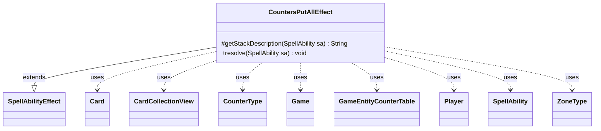

---
aliases:
  - CountersPutAllEffect
tags:
  - java/class
  - module/forge-game
  - pkg/forge/game/ability/effects
fqn: forge.game.ability.effects.CountersPutAllEffect
package: forge.game.ability.effects
module: forge-game
kind: Class
---

# CountersPutAllEffect

**Package:** `forge.game.ability.effects`   **Module:** `forge-game`   **Kind:** Class



## Relationships
**Extends:**
- [[forge.game.ability.SpellAbilityEffect|SpellAbilityEffect]]
**Uses:**
- [[forge.game.Game|Game]]
- [[forge.game.GameEntityCounterTable|GameEntityCounterTable]]
- [[forge.game.card.Card|Card]]
- [[forge.game.card.CardCollectionView|CardCollectionView]]
- [[forge.game.card.CounterType|CounterType]]
- [[forge.game.player.Player|Player]]
- [[forge.game.spellability.SpellAbility|SpellAbility]]
- [[forge.game.zone.ZoneType|ZoneType]]

## Design Description

CountersPutAllEffect resolves "put counters on every valid card" abilities in Forge's MTG engine. As a concrete subclass of `SpellAbilityEffect`, it supplies two overrides: `getStackDescription`, which composes a localized summary of the counter type, amount, and target zone, and `resolve`, which performs the actual mutation. All behavior is data-driven by parameters on the resolving `SpellAbility` (CounterType, CounterNum, ValidCards, ValidZone, Placer), letting one class back many card scripts.

At resolution it pulls cards from the chosen `ZoneType` via `Game`, narrows them with `CardLists` validity filtering and optional player targeting, then adds counters to each `Card`. Placement is flexible — activator, per-card controller/owner, or a defined `Player` — and per-card amounts can be derived from a chosen-card map. Notably, every addition is funneled through a shared `GameEntityCounterTable` so replacement effects apply collectively via `replaceCounterEffect`, and an optional second pass (ValidCards2/CounterType2) handles dual-counter cards.

## Source
`forge-game/src/main/java/forge/game/ability/effects/CountersPutAllEffect.java`

```java
package forge.game.ability.effects;

import forge.game.Game;
import forge.game.GameEntityCounterTable;
import forge.game.ability.AbilityUtils;
import forge.game.ability.SpellAbilityEffect;
import forge.game.card.Card;
import forge.game.card.CardCollectionView;
import forge.game.card.CardLists;
import forge.game.card.CounterType;
import forge.game.player.Player;
import forge.game.spellability.SpellAbility;
import forge.game.zone.ZoneType;
import forge.util.Lang;

public class CountersPutAllEffect extends SpellAbilityEffect  {

    @Override
    protected String getStackDescription(SpellAbility sa) {
        final StringBuilder sb = new StringBuilder();

        final CounterType cType = CounterType.getType(sa.getParam("CounterType"));
        final int amount = AbilityUtils.calculateAmount(sa.getHostCard(), sa.getParamOrDefault("CounterNum", "1"), sa);
        final String zone = sa.getParamOrDefault("ValidZone", "Battlefield");

        sb.append("Put ");
        sb.append(Lang.nounWithNumeralExceptOne(amount, cType.getName().toLowerCase() + " counter"));
        sb.append(" on each ");
        if (sa.hasParam("ValidCardsDesc")) {
            sb.append(sa.getParam("ValidCardsDesc")).append(".");
        } else {
            sb.append("valid ");
            if (zone.matches("Battlefield")) {
                sb.append("permanent.");
            } else {
                sb.append("card in ").append(zone).append(".");
            }
        }

        return sb.toString();
    }

    @Override
    public void resolve(SpellAbility sa) {
        final Card host = sa.getHostCard();
        final Player activator = sa.getActivatingPlayer();
        final CounterType type = CounterType.getType(sa.getParam("CounterType"));
        int counterAmount = AbilityUtils.calculateAmount(host, sa.getParamOrDefault("CounterNum", "1"), sa);
        final String valid = sa.getParam("ValidCards");
        final ZoneType zone = sa.hasParam("ValidZone") ? ZoneType.smartValueOf(sa.getParam("ValidZone")) : ZoneType.Battlefield;
        final Game game = activator.getGame();

        if (counterAmount <= 0) {
            return;
        }

        CardCollectionView cards = game.getCardsIn(zone);
        cards = CardLists.getValidCards(cards, valid, activator, host, sa);

        if (sa.usesTargeting()) {
            final Player pl = sa.getTargets().getFirstTargetedPlayer();
            cards = CardLists.filterControlledBy(cards, pl);
        }

        Player placer = activator;
        String placerPerCard = "";
        if (sa.hasParam("Placer")) {
            final String pstr = sa.getParam("Placer");
            if (pstr.equals("Controller")) {
                placerPerCard = "Controller";
            } else if (pstr.equals("Owner")) {
                placerPerCard = "Owner";
            } else {
                placer = AbilityUtils.getDefinedPlayers(host, pstr, sa).get(0);
            }
        }

        GameEntityCounterTable table = new GameEntityCounterTable();
        for (final Card tgtCard : cards) {
            if (placerPerCard.equals("Controller")) {
                placer = tgtCard.getController();
            } else if (placerPerCard.equals("Owner")) {
                placer = tgtCard.getOwner();
            }
            if (sa.hasParam("AmountByChosenMap")) {
                final String[] parse = sa.getParam("AmountByChosenMap").split(" INDEX ");
                final int index = parse.length > 1 ? Integer.parseInt(parse[1]) : 0;
                if (index >= host.getChosenMap().get(placer).size()) continue;
                final Card chosen = host.getChosenMap().get(placer).get(index);
                counterAmount = AbilityUtils.xCount(chosen, parse[0], sa);
            }
            tgtCard.addCounter(type, counterAmount, placer, table);
        }

        if (sa.hasParam("ValidCards2") || sa.hasParam("CounterType2") || sa.hasParam("CounterNum2")) {
            final CounterType type2 = sa.hasParam("CounterType2") ?
                    CounterType.getType(sa.getParam("CounterType2")) : type;
            final ZoneType zone2 = sa.hasParam("ValidZone2") ?
                    ZoneType.smartValueOf(sa.getParam("ValidZone2")) : zone;
            if (sa.hasParam("ValidCards2")) {
                cards = CardLists.getValidCards(game.getCardsIn(zone2), sa.getParam("ValidCards2"),
                        activator, host, sa);
                if (sa.usesTargeting()) {
                    cards = CardLists.filterControlledBy(cards, sa.getTargets().getFirstTargetedPlayer());
                }
            }
            final int counterAmount2 = sa.hasParam("CounterNum2") ?
                    AbilityUtils.calculateAmount(host, sa.getParam("CounterNum2"), sa) : counterAmount;

            for (final Card tgtCard : cards) {
                if (placerPerCard.equals("Controller")) {
                    placer = tgtCard.getController();
                }
                tgtCard.addCounter(type2, counterAmount2, placer, table);
            }
        }

        table.replaceCounterEffect(game, sa);
    }

}
```

## Python
`forge/game/ability/effects/CountersPutAllEffect.py`

```python
from forge.game.Game import Game
from forge.game.GameEntityCounterTable import GameEntityCounterTable
from forge.game.ability.AbilityUtils import AbilityUtils
from forge.game.ability.SpellAbilityEffect import SpellAbilityEffect
from forge.game.card.Card import Card
from forge.game.card.CardCollectionView import CardCollectionView
from forge.game.card.CardLists import CardLists
from forge.game.card.CounterType import CounterType
from forge.game.player.Player import Player
from forge.game.spellability.SpellAbility import SpellAbility
from forge.game.zone.ZoneType import ZoneType
from forge.util.Lang import Lang


class CountersPutAllEffect(SpellAbilityEffect):

    def getStackDescription(self, sa: SpellAbility) -> str:
        sb = []

        cType = CounterType.getType(sa.getParam("CounterType"))
        amount = AbilityUtils.calculateAmount(sa.getHostCard(), sa.getParamOrDefault("CounterNum", "1"), sa)
        zone = sa.getParamOrDefault("ValidZone", "Battlefield")

        sb.append("Put ")
        sb.append(Lang.nounWithNumeralExceptOne(amount, cType.getName().lower() + " counter"))
        sb.append(" on each ")
        if sa.hasParam("ValidCardsDesc"):
            sb.append(sa.getParam("ValidCardsDesc") + ".")
        else:
            sb.append("valid ")
            if zone == "Battlefield":
                sb.append("permanent.")
            else:
                sb.append("card in ")
                sb.append(zone + ".")

        return "".join(sb)

    def resolve(self, sa: SpellAbility) -> None:
        host = sa.getHostCard()
        activator = sa.getActivatingPlayer()
        type = CounterType.getType(sa.getParam("CounterType"))
        counterAmount = AbilityUtils.calculateAmount(host, sa.getParamOrDefault("CounterNum", "1"), sa)
        valid = sa.getParam("ValidCards")
        zone = ZoneType.smartValueOf(sa.getParam("ValidZone")) if sa.hasParam("ValidZone") else ZoneType.Battlefield
        game = activator.getGame()

        if counterAmount <= 0:
            return

        cards = game.getCardsIn(zone)
        cards = CardLists.getValidCards(cards, valid, activator, host, sa)

        if sa.usesTargeting():
            pl = sa.getTargets().getFirstTargetedPlayer()
            cards = CardLists.filterControlledBy(cards, pl)

        placer = activator
        placerPerCard = ""
        if sa.hasParam("Placer"):
            pstr = sa.getParam("Placer")
            if pstr == "Controller":
                placerPerCard = "Controller"
            elif pstr == "Owner":
                placerPerCard = "Owner"
            else:
                placer = AbilityUtils.getDefinedPlayers(host, pstr, sa).get(0)

        table = GameEntityCounterTable()
        for tgtCard in cards:
            if placerPerCard == "Controller":
                placer = tgtCard.getController()
            elif placerPerCard == "Owner":
                placer = tgtCard.getOwner()
            if sa.hasParam("AmountByChosenMap"):
                parse = sa.getParam("AmountByChosenMap").split(" INDEX ")
                index = int(parse[1]) if len(parse) > 1 else 0
                if index >= len(host.getChosenMap().get(placer)):
                    continue
                chosen = host.getChosenMap().get(placer).get(index)
                counterAmount = AbilityUtils.xCount(chosen, parse[0], sa)
            tgtCard.addCounter(type, counterAmount, placer, table)

        if sa.hasParam("ValidCards2") or sa.hasParam("CounterType2") or sa.hasParam("CounterNum2"):
            type2 = CounterType.getType(sa.getParam("CounterType2")) if sa.hasParam("CounterType2") else type
            zone2 = ZoneType.smartValueOf(sa.getParam("ValidZone2")) if sa.hasParam("ValidZone2") else zone
            if sa.hasParam("ValidCards2"):
                cards = CardLists.getValidCards(game.getCardsIn(zone2), sa.getParam("ValidCards2"),
                                                activator, host, sa)
                if sa.usesTargeting():
                    cards = CardLists.filterControlledBy(cards, sa.getTargets().getFirstTargetedPlayer())
            counterAmount2 = AbilityUtils.calculateAmount(host, sa.getParam("CounterNum2"), sa) if sa.hasParam("CounterNum2") else counterAmount

            for tgtCard in cards:
                if placerPerCard == "Controller":
                    placer = tgtCard.getController()
                tgtCard.addCounter(type2, counterAmount2, placer, table)

        table.replaceCounterEffect(game, sa)
```
