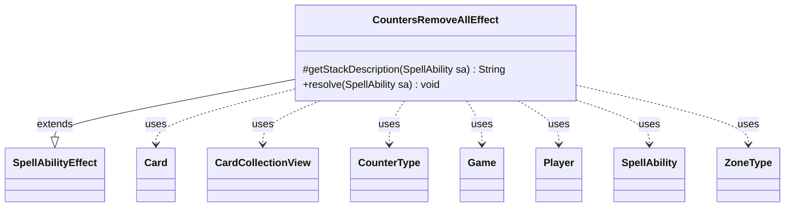

---
aliases:
  - CountersRemoveAllEffect
tags:
  - java/class
  - module/forge-game
  - pkg/forge/game/ability/effects
fqn: forge.game.ability.effects.CountersRemoveAllEffect
package: forge.game.ability.effects
module: forge-game
kind: Class
---

# CountersRemoveAllEffect

**Package:** `forge.game.ability.effects` &nbsp; **Module:** `forge-game` &nbsp; **Kind:** Class



## Relationships
**Extends:**
- [[forge.game.ability.SpellAbilityEffect|SpellAbilityEffect]]
**Uses:**
- [[forge.game.Game|Game]]
- [[forge.game.card.Card|Card]]
- [[forge.game.card.CardCollectionView|CardCollectionView]]
- [[forge.game.card.CounterType|CounterType]]
- [[forge.game.player.Player|Player]]
- [[forge.game.spellability.SpellAbility|SpellAbility]]
- [[forge.game.zone.ZoneType|ZoneType]]

## Design Description

The description is already written and present in the note. Here it is:

`CountersRemoveAllEffect` is a resolution handler in Forge's data-driven ability system, extending `SpellAbilityEffect` to implement the engine behavior for cards that strip counters from many objects at once. Driven entirely by parameters on its `SpellAbility` (`CounterType`, `CounterNum`, `ValidCards`, `ValidZone`, and flags such as `AllCounters`, `AllCounterTypes`, and `RememberAmount`), it gathers a `CardCollectionView` from the chosen `ZoneType`, narrows it via valid-card filtering and optional player targeting, then subtracts counters from each `Card`.

The override of `getStackDescription` supplies human-readable stack text, while `resolve` carries the effect. Notable design intent includes accumulating the actual number removed to optionally feed back as a remembered value, and special-casing "all counters" and "all counter types" so a single generic effect can express many distinct card behaviors without bespoke code.

## Source
`forge-game/src/main/java/forge/game/ability/effects/CountersRemoveAllEffect.java`

```java
package forge.game.ability.effects;

import java.util.Map;

import com.google.common.collect.Lists;

import forge.game.Game;
import forge.game.ability.AbilityUtils;
import forge.game.ability.SpellAbilityEffect;
import forge.game.card.Card;
import forge.game.card.CardCollectionView;
import forge.game.card.CardLists;
import forge.game.card.CounterType;
import forge.game.player.Player;
import forge.game.spellability.SpellAbility;
import forge.game.zone.ZoneType;

public class CountersRemoveAllEffect extends SpellAbilityEffect {
    @Override
    protected String getStackDescription(SpellAbility sa) {
        final StringBuilder sb = new StringBuilder();

        final CounterType cType = CounterType.getType(sa.getParam("CounterType"));
        final int amount = AbilityUtils.calculateAmount(sa.getHostCard(), sa.getParam("CounterNum"), sa);
        final String zone = sa.getParamOrDefault("ValidZone", "Battlefield");
        String amountString = Integer.toString(amount);

        if (sa.hasParam("AllCounters")) {
            amountString = "all";
        }

        sb.append("Remove ").append(amount).append(" ").append(cType.getName()).append(" counter");
        if (!amountString.equals("1")) {
            sb.append("s");
        }
        sb.append(" from each valid ");
        if (zone.matches("Battlefield")) {
            sb.append("permanent.");
        } else {
            sb.append("card in ").append(zone).append(".");
        }

        return sb.toString();
    }

    @Override
    public void resolve(SpellAbility sa) {
        final String type = sa.getParam("CounterType");
        int counterAmount = AbilityUtils.calculateAmount(sa.getHostCard(), sa.getParam("CounterNum"), sa);
        final String valid = sa.getParam("ValidCards");
        final ZoneType zone = sa.hasParam("ValidZone") ? ZoneType.smartValueOf(sa.getParam("ValidZone")) : ZoneType.Battlefield;
        final Game game = sa.getActivatingPlayer().getGame();

        CardCollectionView cards = game.getCardsIn(zone);
        cards = CardLists.getValidCards(cards, valid, sa.getActivatingPlayer(), sa.getHostCard(), sa);

        if (sa.usesTargeting()) {
            final Player pl = sa.getTargets().getFirstTargetedPlayer();
            cards = CardLists.filterControlledBy(cards, pl);
        }

        int numberRemoved = 0;
        for (final Card tgtCard : cards) {
            if (sa.hasParam("AllCounterTypes")) {
                for (Map.Entry<CounterType, Integer> e : Lists.newArrayList(tgtCard.getCounters().entrySet())) {
                    numberRemoved += tgtCard.subtractCounter(e.getKey(), e.getValue(), sa.getActivatingPlayer());
                }
                //tgtCard.getCounters().clear();
                continue;
            }
            if (sa.hasParam("AllCounters")) {
                counterAmount = tgtCard.getCounters(CounterType.getType(type));
            }

            if (counterAmount > 0) {
                numberRemoved += tgtCard.subtractCounter(CounterType.getType(type), counterAmount, sa.getActivatingPlayer());
                game.updateLastStateForCard(tgtCard);
            }
        }
        if (sa.hasParam("RememberAmount")) {
            sa.getHostCard().addRemembered(numberRemoved);
        }
    }
}
```
