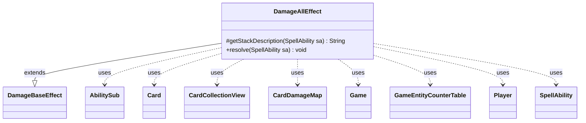

---
aliases:
  - DamageAllEffect
tags:
  - java/class
  - module/forge-game
  - pkg/forge/game/ability/effects
fqn: forge.game.ability.effects.DamageAllEffect
package: forge.game.ability.effects
module: forge-game
kind: Class
---

# DamageAllEffect

**Package:** `forge.game.ability.effects`   **Module:** `forge-game`   **Kind:** Class



## Relationships
**Extends:**
- [[forge.game.ability.effects.DamageBaseEffect|DamageBaseEffect]]
**Uses:**
- [[forge.game.Game|Game]]
- [[forge.game.GameEntityCounterTable|GameEntityCounterTable]]
- [[forge.game.card.Card|Card]]
- [[forge.game.card.CardCollectionView|CardCollectionView]]
- [[forge.game.card.CardDamageMap|CardDamageMap]]
- [[forge.game.player.Player|Player]]
- [[forge.game.spellability.AbilitySub|AbilitySub]]
- [[forge.game.spellability.SpellAbility|SpellAbility]]

## Design Description

DamageAllEffect is a concrete ability effect implementing area-of-effect damage: it deals a computed `NumDmg` amount to every battlefield card matching a `ValidCards` filter and to each `ValidPlayers` entity. Extending `DamageBaseEffect`, it realizes the framework's two extension points—`getStackDescription`, which builds a human-readable summary by resolving the damage source, amount, and target description, and `resolve`, which mutates game state. Resolution relies on `AbilityUtils` to interpret parameters and filter a `CardCollectionView` drawn from the battlefield, optionally narrowed to a targeted player's cards.

A notable design intent is participation in a batched-damage pipeline: it records damage into a `CardDamageMap` keyed by the source's last-known-information snapshot, reusing the `SpellAbility`'s existing damage, prevent, and counter maps when present and only constructing its own and invoking `GameAction.dealDamage` when it originates the batch. This lets simultaneous damage effects resolve as one state-based event before `replaceDying` performs cleanup.

## Source
`forge-game/src/main/java/forge/game/ability/effects/DamageAllEffect.java`

```java
package forge.game.ability.effects;

import java.util.List;

import forge.game.Game;
import forge.game.GameEntityCounterTable;
import forge.game.ability.AbilityUtils;
import forge.game.card.Card;
import forge.game.card.CardCollection;
import forge.game.card.CardCollectionView;
import forge.game.card.CardDamageMap;
import forge.game.card.CardLists;
import forge.game.player.Player;
import forge.game.spellability.AbilitySub;
import forge.game.spellability.SpellAbility;
import forge.game.zone.ZoneType;

public class DamageAllEffect extends DamageBaseEffect {
    /* (non-Javadoc)
     * @see forge.game.ability.SpellAbilityEffect#getStackDescription(forge.game.spellability.SpellAbility)
     */
    @Override
    protected String getStackDescription(SpellAbility sa) {
        final StringBuilder sb = new StringBuilder();

        final String desc = sa.getParamOrDefault("ValidDescription",
                sa.getParamOrDefault("ValidCards", "something"));

        final String damage = sa.getParam("NumDmg");
        final int dmg = AbilityUtils.calculateAmount(sa.getHostCard(), damage, sa);

        final String definedStr = sa.getParam("DamageSource");
        final List<Card> definedSources = AbilityUtils.getDefinedCards(sa.getHostCard(), definedStr, sa);

        if (!definedSources.isEmpty() && (definedSources.get(0) != sa.getHostCard() || sa instanceof AbilitySub)) {
            sb.append(definedSources.get(0).toString()).append(" deals");
        } else if ("ParentTarget".equals(definedStr)) {
            sb.append("Target creature deals");
        } else {
            sb.append("Deals");
        }

        sb.append(" ").append(dmg).append(" damage to ").append(desc).append(desc.endsWith(".") ? "" : ".");

        return sb.toString();
    }

    /* (non-Javadoc)
     * @see forge.game.ability.SpellAbilityEffect#resolve(forge.game.spellability.SpellAbility)
     */
    @Override
    public void resolve(SpellAbility sa) {
        final Card source = sa.getHostCard();
        final List<Card> definedSources = AbilityUtils.getDefinedCards(source, sa.getParam("DamageSource"), sa);
        final Card card = definedSources.get(0);
        final Card sourceLKI = card.getGame().getChangeZoneLKIInfo(card);
        final Game game = sa.getActivatingPlayer().getGame();

        final int dmg = AbilityUtils.calculateAmount(source, sa.getParam("NumDmg"), sa);

        //Remember params from this effect have been moved to dealDamage in GameAction
        Player targetPlayer = sa.getTargets().getFirstTargetedPlayer();

        final String players = sa.getParam("ValidPlayers");

        CardCollectionView list;
        if (sa.hasParam("ValidCards")) {
            list = game.getCardsIn(ZoneType.Battlefield);
        } else {
            list = CardCollection.EMPTY;
        }

        if (targetPlayer != null) {
            list = CardLists.filterControlledBy(list, targetPlayer);
        }

        list = AbilityUtils.filterListByType(list, sa.getParam("ValidCards"), sa);

        boolean usedDamageMap = true;
        CardDamageMap damageMap = sa.getDamageMap();
        CardDamageMap preventMap = sa.getPreventMap();
        GameEntityCounterTable counterTable = sa.getCounterTable();

        if (damageMap == null) {
            // make a new damage map
            damageMap = new CardDamageMap();
            preventMap = new CardDamageMap();
            counterTable = new GameEntityCounterTable();
            usedDamageMap = false;
        }

        for (final Card c : list) {
            damageMap.put(sourceLKI, c, dmg);
        }

        if (players != null) {
            for (final Player p : AbilityUtils.getDefinedPlayers(card, players, sa)) {
                damageMap.put(sourceLKI, p, dmg);
            }
        }

        if (!usedDamageMap) {
            game.getAction().dealDamage(false, damageMap, preventMap, counterTable, sa);
        }

        replaceDying(sa);
    }
}
```

## Python
`forge/game/ability/effects/DamageAllEffect.py`

```python
from forge.game.Game import Game
from forge.game.GameEntityCounterTable import GameEntityCounterTable
from forge.game.ability.AbilityUtils import AbilityUtils
from forge.game.card.Card import Card
from forge.game.card.CardCollection import CardCollection
from forge.game.card.CardCollectionView import CardCollectionView
from forge.game.card.CardDamageMap import CardDamageMap
from forge.game.card.CardLists import CardLists
from forge.game.player.Player import Player
from forge.game.spellability.AbilitySub import AbilitySub
from forge.game.spellability.SpellAbility import SpellAbility
from forge.game.zone.ZoneType import ZoneType
from forge.game.ability.effects.DamageBaseEffect import DamageBaseEffect


class DamageAllEffect(DamageBaseEffect):
    # (non-Javadoc)
    # @see forge.game.ability.SpellAbilityEffect#getStackDescription(forge.game.spellability.SpellAbility)
    def getStackDescription(self, sa: SpellAbility) -> str:
        sb = []

        desc = sa.getParamOrDefault("ValidDescription",
                sa.getParamOrDefault("ValidCards", "something"))

        damage = sa.getParam("NumDmg")
        dmg = AbilityUtils.calculateAmount(sa.getHostCard(), damage, sa)

        definedStr = sa.getParam("DamageSource")
        definedSources = AbilityUtils.getDefinedCards(sa.getHostCard(), definedStr, sa)

        if definedSources and (definedSources[0] is not sa.getHostCard() or isinstance(sa, AbilitySub)):
            sb.append(str(definedSources[0]))
            sb.append(" deals")
        elif definedStr == "ParentTarget":
            sb.append("Target creature deals")
        else:
            sb.append("Deals")

        sb.append(" ")
        sb.append(str(dmg))
        sb.append(" damage to ")
        sb.append(desc)
        sb.append("" if desc.endswith(".") else ".")

        return "".join(sb)

    # (non-Javadoc)
    # @see forge.game.ability.SpellAbilityEffect#resolve(forge.game.spellability.SpellAbility)
    def resolve(self, sa: SpellAbility) -> None:
        source = sa.getHostCard()
        definedSources = AbilityUtils.getDefinedCards(source, sa.getParam("DamageSource"), sa)
        card = definedSources[0]
        sourceLKI = card.getGame().getChangeZoneLKIInfo(card)
        game = sa.getActivatingPlayer().getGame()

        dmg = AbilityUtils.calculateAmount(source, sa.getParam("NumDmg"), sa)

        # Remember params from this effect have been moved to dealDamage in GameAction
        targetPlayer = sa.getTargets().getFirstTargetedPlayer()

        players = sa.getParam("ValidPlayers")

        if sa.hasParam("ValidCards"):
            list = game.getCardsIn(ZoneType.Battlefield)
        else:
            list = CardCollection.EMPTY

        if targetPlayer is not None:
            list = CardLists.filterControlledBy(list, targetPlayer)

        list = AbilityUtils.filterListByType(list, sa.getParam("ValidCards"), sa)

        usedDamageMap = True
        damageMap = sa.getDamageMap()
        preventMap = sa.getPreventMap()
        counterTable = sa.getCounterTable()

        if damageMap is None:
            # make a new damage map
            damageMap = CardDamageMap()
            preventMap = CardDamageMap()
            counterTable = GameEntityCounterTable()
            usedDamageMap = False

        for c in list:
            damageMap.put(sourceLKI, c, dmg)

        if players is not None:
            for p in AbilityUtils.getDefinedPlayers(card, players, sa):
                damageMap.put(sourceLKI, p, dmg)

        if not usedDamageMap:
            game.getAction().dealDamage(False, damageMap, preventMap, counterTable, sa)

        self.replaceDying(sa)
```
