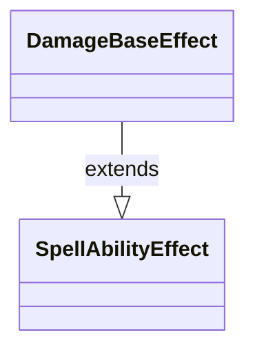

---
aliases:
  - DamageBaseEffect
tags:
  - java/class
  - module/forge-game
  - pkg/forge/game/ability/effects
fqn: forge.game.ability.effects.DamageBaseEffect
package: forge.game.ability.effects
module: forge-game
kind: Class
---

# DamageBaseEffect

**Package:** `forge.game.ability.effects`   **Module:** `forge-game`   **Kind:** Class



## Relationships
**Extends:**
- [[forge.game.ability.SpellAbilityEffect|SpellAbilityEffect]]

## Design Description

`DamageBaseEffect` is an abstract effect class in Forge's ability system, extending `SpellAbilityEffect` to serve as the common base for the engine's family of damage-related effects (direct damage, damage-to-all, damage prevention, and similar variants). It inherits the full effect contract — resolution and stack-description behavior — from `SpellAbilityEffect` without redefining it.

The class is intentionally empty, declaring neither fields nor methods. Its sole responsibility is structural: it groups concrete damage effects under a shared supertype, giving them a single, more specific classification within the effect hierarchy and a ready insertion point for any damage-handling logic later common to those subclasses, all while leaving the general `SpellAbilityEffect` abstraction unburdened by damage-specific concerns.

## Source
`forge-game/src/main/java/forge/game/ability/effects/DamageBaseEffect.java`

```java
package forge.game.ability.effects;

import forge.game.ability.SpellAbilityEffect;

abstract public class DamageBaseEffect extends SpellAbilityEffect {

}
```

## Python
`forge/game/ability/effects/DamageBaseEffect.py`

```python
from forge.game.ability.SpellAbilityEffect import SpellAbilityEffect


class DamageBaseEffect(SpellAbilityEffect):
    pass
```
