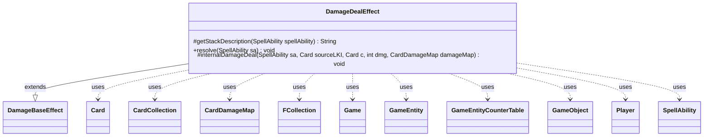

---
aliases:
  - DamageDealEffect
tags:
  - java/class
  - module/forge-game
  - pkg/forge/game/ability/effects
fqn: forge.game.ability.effects.DamageDealEffect
package: forge.game.ability.effects
module: forge-game
kind: Class
---

# DamageDealEffect

**Package:** `forge.game.ability.effects`   **Module:** `forge-game`   **Kind:** Class



## Relationships
**Extends:**
- [[forge.game.ability.effects.DamageBaseEffect|DamageBaseEffect]]
**Uses:**
- [[forge.game.Game|Game]]
- [[forge.game.GameEntity|GameEntity]]
- [[forge.game.GameEntityCounterTable|GameEntityCounterTable]]
- [[forge.game.GameObject|GameObject]]
- [[forge.game.card.Card|Card]]
- [[forge.game.card.CardCollection|CardCollection]]
- [[forge.game.card.CardDamageMap|CardDamageMap]]
- [[forge.game.player.Player|Player]]
- [[forge.game.spellability.SpellAbility|SpellAbility]]
- [[forge.util.collect.FCollection|FCollection]]

## Design Description

DamageDealEffect implements the "deal N damage" ability used pervasively by Forge cards. Extending DamageBaseEffect, it overrides `getStackDescription` to compose a readable summary of the damage event (covering targeted, divided-evenly, divided-as-you-choose, radiance, and replace-dying variants) and `resolve` to perform the dealing. Resolution resolves damage sources, computes the amount, and gathers recipients—defined, targeted, randomly chosen, or player-selected from CardChoices/PlayerChoices—validating each Card's game state before recording hits.

Rather than applying damage immediately, it accumulates every source-to-recipient pair into a shared CardDamageMap (with matching prevent map and GameEntityCounterTable), so all damage from one effect is committed together via GameAction.dealDamage, preserving simultaneous-damage and replacement rules. The helper `internalDamageDeal` encapsulates excess-damage redirection, deathtouch lethal calculation, and damage removal. Collaborating with Card, Player, GameEntity, Game, and SpellAbility, it drives diverse card behaviors from one data-configurable effect.

## Source
`forge-game/src/main/java/forge/game/ability/effects/DamageDealEffect.java`

```java
package forge.game.ability.effects;

import java.util.List;
import java.util.Map;
import java.util.Map.Entry;

import com.google.common.collect.Iterables;
import com.google.common.collect.Lists;

import forge.game.Game;
import forge.game.GameEntity;
import forge.game.GameEntityCounterTable;
import forge.game.GameObject;
import forge.game.ability.AbilityKey;
import forge.game.ability.AbilityUtils;
import forge.game.card.Card;
import forge.game.card.CardCollection;
import forge.game.card.CardDamageMap;
import forge.game.card.CardLists;
import forge.game.card.CardUtil;
import forge.game.keyword.Keyword;
import forge.game.player.Player;
import forge.game.replacement.ReplacementType;
import forge.game.spellability.SpellAbility;
import forge.game.zone.ZoneType;
import forge.util.*;
import forge.util.collect.FCollection;

public class DamageDealEffect extends DamageBaseEffect {

    /* (non-Javadoc)
     * @see forge.game.ability.SpellAbilityEffect#getStackDescription(forge.game.spellability.SpellAbility)
     */
    @Override
    protected String getStackDescription(SpellAbility spellAbility) {
        // when damageStackDescription is called, just build exactly what is happening
        final StringBuilder stringBuilder = new StringBuilder();
        final String damage = spellAbility.getParam("NumDmg");
        int dmg = AbilityUtils.calculateAmount(spellAbility.getHostCard(), damage, spellAbility);

        List<GameObject> targets = getTargets(spellAbility);
        final List<Card> definedSources = AbilityUtils.getDefinedCards(spellAbility.getHostCard(), spellAbility.getParam("DamageSource"), spellAbility);

        if (targets.isEmpty() || definedSources.isEmpty()) {
            return "";
        }

        stringBuilder.append(definedSources.get(0).toString()).append(" deals").append(" ").append(dmg).append(" damage ");

        // if use targeting we show all targets and corresponding damage
        if (spellAbility.usesTargeting()) {
            if (spellAbility.hasParam("DivideEvenly")) {
                stringBuilder.append("divided evenly (rounded down) to \n");
            } else if (spellAbility.isDividedAsYouChoose()) {
                stringBuilder.append("divided to \n");
            } else
                stringBuilder.append("to ");

            final List<Card> targetCards = getTargetCards(spellAbility);
            final List<Player> players = getTargetPlayers(spellAbility);

            int targetCount = targetCards.size() + players.size();

            // target cards
            for (int i = 0; i < targetCards.size(); i++) {
                Card targetCard = targetCards.get(i);
                stringBuilder.append(targetCard);
                Integer v = spellAbility.getDividedValue(targetCard);
                if (v != null) //fix null damage stack description
                    stringBuilder.append(" (").append(v).append(" damage)");

                if (i == targetCount - 2) {
                    stringBuilder.append(" and ");
                } else if (i + 1 < targetCount) {
                    stringBuilder.append(", ");
                }
            }

            // target players
            for (int i = 0; i < players.size(); i++) {
                Player targetPlayer = players.get(i);
                stringBuilder.append(targetPlayer);
                Integer v = spellAbility.getDividedValue(targetPlayer);
                if (v != null) //fix null damage stack description
                    stringBuilder.append(" (").append(v).append(" damage)");

                if (i == players.size() - 2) {
                    stringBuilder.append(" and ");
                } else if (i + 1 < players.size()) {
                    stringBuilder.append(", ");
                }
            }
        } else {
            if (spellAbility.hasParam("DivideEvenly")) {
                stringBuilder.append("divided evenly (rounded down) ");
            } else if (spellAbility.isDividedAsYouChoose()) {
                stringBuilder.append("divided as you choose ");
            }
            stringBuilder.append("to ").append(Lang.joinHomogenous(targets));
        }

        if (spellAbility.hasParam("Radiance")) {
            stringBuilder.append(" and each other ").append(spellAbility.getParam("ValidTgts"))
                    .append(" that shares a color with ");
            if (targets.size() > 1) {
                stringBuilder.append("them");
            } else {
                stringBuilder.append("it");
            }
        }

        stringBuilder.append(".");
        if (spellAbility.hasParam("ReplaceDyingDefined")) {
            String statement = "If that creature would die this turn, exile it instead.";
            String[] sentences = spellAbility.getParamOrDefault("SpellDescription", "").split("\\.");
            for (String s : sentences) {
                if (s.contains("would die")) {
                    statement = s;
                    break;
                }
            }
            stringBuilder.append(" ").append(statement);
        }
        return stringBuilder.toString();
    }

    /* (non-Javadoc)
     * @see forge.game.ability.SpellAbilityEffect#resolve(forge.game.spellability.SpellAbility)
     */
    @Override
    public void resolve(SpellAbility sa) {
        final Card hostCard = sa.getHostCard();
        final Game game = hostCard.getGame();

        final List<Card> definedSources = AbilityUtils.getDefinedCards(hostCard, sa.getParam("DamageSource"), sa);
        if (definedSources == null || definedSources.isEmpty()) {
            return;
        }

        for (Card source : definedSources) {
            // Run replacement effects
            game.getReplacementHandler().run(ReplacementType.AssignDealDamage, AbilityKey.mapFromAffected(source));
        }

        int dmg = AbilityUtils.calculateAmount(hostCard, sa.getParam("NumDmg"), sa);

        final boolean removeDamage = sa.hasParam("Remove");
        final boolean divideOnResolution = sa.hasParam("DividerOnResolution");

        List<GameEntity> tgts = Lists.newArrayList();
        if (sa.hasParam("CardChoices") || sa.hasParam("PlayerChoices")) { // choosing outside Defined/Targeted
            final Player activator = sa.getActivatingPlayer();
            FCollection<GameEntity> choices = new FCollection<>();
            if (sa.hasParam("CardChoices")) {
                choices.addAll(CardLists.getValidCards(game.getCardsIn(ZoneType.Battlefield),
                        sa.getParam("CardChoices"), activator, hostCard, sa));
            }
            if (sa.hasParam("PlayerChoices")) {
                choices.addAll(AbilityUtils.getDefinedPlayers(hostCard, sa.getParam("PlayerChoices"), sa));
            }

            int n = sa.hasParam("ChoiceAmount") ?
                    AbilityUtils.calculateAmount(hostCard, sa.getParam("ChoiceAmount"), sa) : 1;
            if (sa.hasParam("Random")) { // only for Whimsy and Faerie Dragon
                for (int i = 0; i < n; i++) {
                    GameEntity random = Aggregates.random(choices);
                    tgts.add(random);
                    choices.remove(random);
                    hostCard.addRemembered(random); // remember random choices for log
                }
            } else { // only for Comet, Stellar Pup
                final String prompt = sa.hasParam("ChoicePrompt") ? sa.getParam("ChoicePrompt") :
                        Localizer.getInstance().getMessage("lblChooseEntityDmg");
                tgts.addAll(activator.getController().chooseEntitiesForEffect(choices, n, n, null, sa,
                        prompt, null, null));
            }
        } else {
            tgts = getTargetEntities(sa);
        }

        if (sa.hasParam("OptionalDecider")) {
            Player decider = Iterables.getFirst(AbilityUtils.getDefinedPlayers(hostCard, sa.getParam("OptionalDecider"), sa), null);
            if (decider != null && !decider.getController().confirmAction(sa, null, Localizer.getInstance().getMessage("lblDoyouWantDealTargetDamageToTarget", dmg, tgts), null)) {
                return;
            }
        }

        // Right now for Fireball, maybe later for other stuff
        if (sa.hasParam("DivideEvenly")) {
            String evenly = sa.getParam("DivideEvenly");
            if (evenly.equals("RoundedDown")) {
                dmg = tgts.isEmpty() ? 0 : dmg / tgts.size();
            }
        }

        final CardCollection untargetedCards = CardUtil.getRadiance(sa);

        //Remember params from this effect have been moved to dealDamage in GameAction
        boolean usedDamageMap = true;
        CardDamageMap damageMap = sa.getDamageMap();
        CardDamageMap preventMap = sa.getPreventMap();
        GameEntityCounterTable counterTable = sa.getCounterTable();

        if (damageMap == null) {
            // make a new damage map
            damageMap = new CardDamageMap();
            preventMap = new CardDamageMap();
            counterTable = new GameEntityCounterTable();
            usedDamageMap = false;
        }
        if (sa.hasParam("DamageMap")) {
            sa.setDamageMap(damageMap);
            sa.setPreventMap(preventMap);
            sa.setCounterTable(counterTable);
            usedDamageMap = true;
        }

        for (Card source : definedSources) {
            final Card sourceLKI = hostCard.getGame().getChangeZoneLKIInfo(source);

            if (divideOnResolution) {
                // Dividing Damage up to multiple targets using combat damage box
                // Currently only used for Master of the Wild Hunt
                List<Player> players = AbilityUtils.getDefinedPlayers(hostCard, sa.getParam("DividerOnResolution"), sa);
                if (players.isEmpty()) {
                    return;
                }

                CardCollection assigneeCards = new CardCollection(IterableUtil.filter(tgts, Card.class));

                Player assigningPlayer = players.get(0);
                Map<Card, Integer> map = assigningPlayer.getController().assignCombatDamage(sourceLKI, assigneeCards, null, dmg, null, true);
                for (Entry<Card, Integer> dt : map.entrySet()) {
                    damageMap.put(sourceLKI, dt.getKey(), dt.getValue());
                }

                if (!usedDamageMap) {
                    game.getAction().dealDamage(false, damageMap, preventMap, counterTable, sa);
                }
                replaceDying(sa);
                return;
            }

            if (sa.hasParam("RelativeTarget")) {
                tgts = AbilityUtils.getDefinedEntities(source, sa.getParam("Defined"), sa);
            }

            for (final GameEntity o : tgts) {
                if (!removeDamage) {
                    dmg = (sa.usesTargeting() && sa.isDividedAsYouChoose()) ? sa.getDividedValue(o) : dmg;
                    if (dmg <= 0) {
                        continue;
                    }
                }
                if (o instanceof Card c) {
                    final Card gc = game.getCardState(c, null);
                    if (gc == null || !c.equalsWithGameTimestamp(gc) || !gc.isInPlay() || gc.isPhasedOut()) {
                        // timestamp different or not in play
                        continue;
                    }
                    internalDamageDeal(sa, sourceLKI, gc, dmg, damageMap);
                } else if (o instanceof Player p) {
                    damageMap.put(sourceLKI, p, dmg);
                }
            }
            for (final Card unTgtC : untargetedCards) {
                if (unTgtC.isInPlay()) {
                    internalDamageDeal(sa, sourceLKI, unTgtC, dmg, damageMap);
                }
            }
        }
        if (!usedDamageMap) {
            game.getAction().dealDamage(false, damageMap, preventMap, counterTable, sa);
        }
        replaceDying(sa);
    }

    protected void internalDamageDeal(SpellAbility sa, Card sourceLKI, Card c, int dmg, CardDamageMap damageMap) {
        final Card hostCard = sa.getHostCard();
        final Player activationPlayer = sa.getActivatingPlayer();
        int excess = 0;
        int dmgToTarget = 0;
        if (sa.hasParam("ExcessDamage")) {
            int lethal = c.getExcessDamageValue(sourceLKI.hasKeyword(Keyword.DEATHTOUCH));
            dmgToTarget = Math.min(lethal, dmg);
            excess = dmg - dmgToTarget;
        }

        if (sa.hasParam("Remove")) {
            c.setDamage(0);
            c.setHasBeenDealtDeathtouchDamage(false);
            c.clearAssignedDamage();
        } else if (sa.hasParam("ExcessDamage") && (!sa.hasParam("ExcessDamageCondition") ||
                sourceLKI.isValid(sa.getParam("ExcessDamageCondition").split(","), activationPlayer, hostCard, sa))) {
            damageMap.put(sourceLKI, c, dmgToTarget);

            List<GameEntity> list = AbilityUtils.getDefinedEntities(hostCard, sa.getParam("ExcessDamage"), sa);

            if (!list.isEmpty()) {
                damageMap.put(sourceLKI, list.get(0), excess);
            }

            if (sa.hasParam("RememberRedirectedExcess")) {
                hostCard.addRemembered(excess);
            }
        } else {
            damageMap.put(sourceLKI, c, dmg);
        }
    }
}
```

## Python
`forge/game/ability/effects/DamageDealEffect.py`

```python
from forge.game.Game import Game
from forge.game.GameEntity import GameEntity
from forge.game.GameEntityCounterTable import GameEntityCounterTable
from forge.game.GameObject import GameObject
from forge.game.ability.AbilityKey import AbilityKey
from forge.game.ability.AbilityUtils import AbilityUtils
from forge.game.ability.effects.DamageBaseEffect import DamageBaseEffect
from forge.game.card.Card import Card
from forge.game.card.CardCollection import CardCollection
from forge.game.card.CardDamageMap import CardDamageMap
from forge.game.card.CardLists import CardLists
from forge.game.card.CardUtil import CardUtil
from forge.game.keyword.Keyword import Keyword
from forge.game.player.Player import Player
from forge.game.replacement.ReplacementType import ReplacementType
from forge.game.spellability.SpellAbility import SpellAbility
from forge.game.zone.ZoneType import ZoneType
from forge.util.Lang import Lang
from forge.util.Aggregates import Aggregates
from forge.util.Localizer import Localizer
from forge.util.IterableUtil import IterableUtil
from forge.util.collect.FCollection import FCollection


class DamageDealEffect(DamageBaseEffect):

    # (non-Javadoc)
    # @see forge.game.ability.SpellAbilityEffect#getStackDescription(forge.game.spellability.SpellAbility)
    def getStackDescription(self, spellAbility: SpellAbility) -> str:
        # when damageStackDescription is called, just build exactly what is happening
        stringBuilder = []
        damage = spellAbility.getParam("NumDmg")
        dmg = AbilityUtils.calculateAmount(spellAbility.getHostCard(), damage, spellAbility)

        targets = self.getTargets(spellAbility)
        definedSources = AbilityUtils.getDefinedCards(spellAbility.getHostCard(), spellAbility.getParam("DamageSource"), spellAbility)

        if not targets or not definedSources:
            return ""

        stringBuilder.append(str(definedSources[0]))
        stringBuilder.append(" deals")
        stringBuilder.append(" ")
        stringBuilder.append(str(dmg))
        stringBuilder.append(" damage ")

        # if use targeting we show all targets and corresponding damage
        if spellAbility.usesTargeting():
            if spellAbility.hasParam("DivideEvenly"):
                stringBuilder.append("divided evenly (rounded down) to \n")
            elif spellAbility.isDividedAsYouChoose():
                stringBuilder.append("divided to \n")
            else:
                stringBuilder.append("to ")

            targetCards = self.getTargetCards(spellAbility)
            players = self.getTargetPlayers(spellAbility)

            targetCount = len(targetCards) + len(players)

            # target cards
            for i in range(len(targetCards)):
                targetCard = targetCards[i]
                stringBuilder.append(str(targetCard))
                v = spellAbility.getDividedValue(targetCard)
                if v is not None:  # fix null damage stack description
                    stringBuilder.append(" (")
                    stringBuilder.append(str(v))
                    stringBuilder.append(" damage)")

                if i == targetCount - 2:
                    stringBuilder.append(" and ")
                elif i + 1 < targetCount:
                    stringBuilder.append(", ")

            # target players
            for i in range(len(players)):
                targetPlayer = players[i]
                stringBuilder.append(str(targetPlayer))
                v = spellAbility.getDividedValue(targetPlayer)
                if v is not None:  # fix null damage stack description
                    stringBuilder.append(" (")
                    stringBuilder.append(str(v))
                    stringBuilder.append(" damage)")

                if i == len(players) - 2:
                    stringBuilder.append(" and ")
                elif i + 1 < len(players):
                    stringBuilder.append(", ")
        else:
            if spellAbility.hasParam("DivideEvenly"):
                stringBuilder.append("divided evenly (rounded down) ")
            elif spellAbility.isDividedAsYouChoose():
                stringBuilder.append("divided as you choose ")
            stringBuilder.append("to ")
            stringBuilder.append(Lang.joinHomogenous(targets))

        if spellAbility.hasParam("Radiance"):
            stringBuilder.append(" and each other ")
            stringBuilder.append(spellAbility.getParam("ValidTgts"))
            stringBuilder.append(" that shares a color with ")
            if len(targets) > 1:
                stringBuilder.append("them")
            else:
                stringBuilder.append("it")

        stringBuilder.append(".")
        if spellAbility.hasParam("ReplaceDyingDefined"):
            statement = "If that creature would die this turn, exile it instead."
            sentences = spellAbility.getParamOrDefault("SpellDescription", "").split(".")
            for s in sentences:
                if "would die" in s:
                    statement = s
                    break
            stringBuilder.append(" ")
            stringBuilder.append(statement)
        return "".join(stringBuilder)

    # (non-Javadoc)
    # @see forge.game.ability.SpellAbilityEffect#resolve(forge.game.spellability.SpellAbility)
    def resolve(self, sa: SpellAbility) -> None:
        hostCard = sa.getHostCard()
        game = hostCard.getGame()

        definedSources = AbilityUtils.getDefinedCards(hostCard, sa.getParam("DamageSource"), sa)
        if definedSources is None or not definedSources:
            return

        for source in definedSources:
            # Run replacement effects
            game.getReplacementHandler().run(ReplacementType.AssignDealDamage, AbilityKey.mapFromAffected(source))

        dmg = AbilityUtils.calculateAmount(hostCard, sa.getParam("NumDmg"), sa)

        removeDamage = sa.hasParam("Remove")
        divideOnResolution = sa.hasParam("DividerOnResolution")

        tgts: list[GameEntity] = []
        if sa.hasParam("CardChoices") or sa.hasParam("PlayerChoices"):  # choosing outside Defined/Targeted
            activator = sa.getActivatingPlayer()
            choices: FCollection[GameEntity] = FCollection()
            if sa.hasParam("CardChoices"):
                choices.addAll(CardLists.getValidCards(game.getCardsIn(ZoneType.Battlefield),
                        sa.getParam("CardChoices"), activator, hostCard, sa))
            if sa.hasParam("PlayerChoices"):
                choices.addAll(AbilityUtils.getDefinedPlayers(hostCard, sa.getParam("PlayerChoices"), sa))

            n = AbilityUtils.calculateAmount(hostCard, sa.getParam("ChoiceAmount"), sa) if sa.hasParam("ChoiceAmount") else 1
            if sa.hasParam("Random"):  # only for Whimsy and Faerie Dragon
                for i in range(n):
                    random = Aggregates.random(choices)
                    tgts.append(random)
                    choices.remove(random)
                    hostCard.addRemembered(random)  # remember random choices for log
            else:  # only for Comet, Stellar Pup
                prompt = sa.getParam("ChoicePrompt") if sa.hasParam("ChoicePrompt") else \
                        Localizer.getInstance().getMessage("lblChooseEntityDmg")
                tgts.extend(activator.getController().chooseEntitiesForEffect(choices, n, n, None, sa,
                        prompt, None, None))
        else:
            tgts = self.getTargetEntities(sa)

        if sa.hasParam("OptionalDecider"):
            decider = next(iter(AbilityUtils.getDefinedPlayers(hostCard, sa.getParam("OptionalDecider"), sa)), None)
            if decider is not None and not decider.getController().confirmAction(sa, None, Localizer.getInstance().getMessage("lblDoyouWantDealTargetDamageToTarget", dmg, tgts), None):
                return

        # Right now for Fireball, maybe later for other stuff
        if sa.hasParam("DivideEvenly"):
            evenly = sa.getParam("DivideEvenly")
            if evenly == "RoundedDown":
                dmg = 0 if not tgts else dmg // len(tgts)

        untargetedCards = CardUtil.getRadiance(sa)

        # Remember params from this effect have been moved to dealDamage in GameAction
        usedDamageMap = True
        damageMap = sa.getDamageMap()
        preventMap = sa.getPreventMap()
        counterTable = sa.getCounterTable()

        if damageMap is None:
            # make a new damage map
            damageMap = CardDamageMap()
            preventMap = CardDamageMap()
            counterTable = GameEntityCounterTable()
            usedDamageMap = False
        if sa.hasParam("DamageMap"):
            sa.setDamageMap(damageMap)
            sa.setPreventMap(preventMap)
            sa.setCounterTable(counterTable)
            usedDamageMap = True

        for source in definedSources:
            sourceLKI = hostCard.getGame().getChangeZoneLKIInfo(source)

            if divideOnResolution:
                # Dividing Damage up to multiple targets using combat damage box
                # Currently only used for Master of the Wild Hunt
                players = AbilityUtils.getDefinedPlayers(hostCard, sa.getParam("DividerOnResolution"), sa)
                if not players:
                    return

                assigneeCards = CardCollection(IterableUtil.filter(tgts, Card))

                assigningPlayer = players[0]
                map = assigningPlayer.getController().assignCombatDamage(sourceLKI, assigneeCards, None, dmg, None, True)
                for dt in map.entrySet():
                    damageMap.put(sourceLKI, dt.getKey(), dt.getValue())

                if not usedDamageMap:
                    game.getAction().dealDamage(False, damageMap, preventMap, counterTable, sa)
                self.replaceDying(sa)
                return

            if sa.hasParam("RelativeTarget"):
                tgts = AbilityUtils.getDefinedEntities(source, sa.getParam("Defined"), sa)

            for o in tgts:
                if not removeDamage:
                    dmg = sa.getDividedValue(o) if (sa.usesTargeting() and sa.isDividedAsYouChoose()) else dmg
                    if dmg <= 0:
                        continue
                if isinstance(o, Card):
                    c = o
                    gc = game.getCardState(c, None)
                    if gc is None or not c.equalsWithGameTimestamp(gc) or not gc.isInPlay() or gc.isPhasedOut():
                        # timestamp different or not in play
                        continue
                    self.internalDamageDeal(sa, sourceLKI, gc, dmg, damageMap)
                elif isinstance(o, Player):
                    p = o
                    damageMap.put(sourceLKI, p, dmg)
            for unTgtC in untargetedCards:
                if unTgtC.isInPlay():
                    self.internalDamageDeal(sa, sourceLKI, unTgtC, dmg, damageMap)
        if not usedDamageMap:
            game.getAction().dealDamage(False, damageMap, preventMap, counterTable, sa)
        self.replaceDying(sa)

    def internalDamageDeal(self, sa: SpellAbility, sourceLKI: Card, c: Card, dmg: int, damageMap: CardDamageMap) -> None:
        hostCard = sa.getHostCard()
        activationPlayer = sa.getActivatingPlayer()
        excess = 0
        dmgToTarget = 0
        if sa.hasParam("ExcessDamage"):
            lethal = c.getExcessDamageValue(sourceLKI.hasKeyword(Keyword.DEATHTOUCH))
            dmgToTarget = min(lethal, dmg)
            excess = dmg - dmgToTarget

        if sa.hasParam("Remove"):
            c.setDamage(0)
            c.setHasBeenDealtDeathtouchDamage(False)
            c.clearAssignedDamage()
        elif sa.hasParam("ExcessDamage") and (not sa.hasParam("ExcessDamageCondition") or
                sourceLKI.isValid(sa.getParam("ExcessDamageCondition").split(","), activationPlayer, hostCard, sa)):
            damageMap.put(sourceLKI, c, dmgToTarget)

            list = AbilityUtils.getDefinedEntities(hostCard, sa.getParam("ExcessDamage"), sa)

            if list:
                damageMap.put(sourceLKI, list[0], excess)

            if sa.hasParam("RememberRedirectedExcess"):
                hostCard.addRemembered(excess)
        else:
            damageMap.put(sourceLKI, c, dmg)
```
