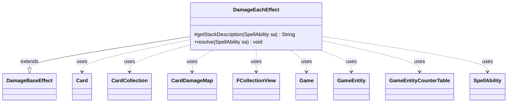

---
aliases:
  - DamageEachEffect
tags:
  - java/class
  - module/forge-game
  - pkg/forge/game/ability/effects
fqn: forge.game.ability.effects.DamageEachEffect
package: forge.game.ability.effects
module: forge-game
kind: Class
---

# DamageEachEffect

**Package:** `forge.game.ability.effects` &nbsp; **Module:** `forge-game` &nbsp; **Kind:** Class



## Relationships
**Extends:**
- [[forge.game.ability.effects.DamageBaseEffect|DamageBaseEffect]]
**Uses:**
- [[forge.game.Game|Game]]
- [[forge.game.GameEntity|GameEntity]]
- [[forge.game.GameEntityCounterTable|GameEntityCounterTable]]
- [[forge.game.card.Card|Card]]
- [[forge.game.card.CardCollection|CardCollection]]
- [[forge.game.card.CardDamageMap|CardDamageMap]]
- [[forge.game.spellability.SpellAbility|SpellAbility]]
- [[forge.util.collect.FCollectionView|FCollectionView]]

## Design Description

DamageEachEffect is a concrete ability-effect class in Forge's resolution framework, extending DamageBaseEffect to implement the "each source deals damage" pattern. It overrides `getStackDescription` to build a readable summary ("Each X deals N damage to …") and `resolve` to perform the work. Resolution first assembles the damaging sources—either explicitly DefinedDamagers or valid cards filtered from the battlefield—then routes amounts through three modes: `EachToItself`, `ToEachOther`, or the default of damaging each target GameEntity.

Notably, it accumulates per-source amounts into a shared CardDamageMap rather than applying damage immediately, guarding against sources that have left play or changed timestamp via LKI checks. It only finalizes the transaction—calling `game.getAction().dealDamage`—when it created the map itself, letting outer effects supply and commit the damage map collaboratively for simultaneous, batched application.

## Source
`forge-game/src/main/java/forge/game/ability/effects/DamageEachEffect.java`

```java
package forge.game.ability.effects;

import forge.game.Game;
import forge.game.GameEntity;
import forge.game.GameEntityCounterTable;
import forge.game.ability.AbilityUtils;
import forge.game.card.Card;
import forge.game.card.CardCollection;
import forge.game.card.CardDamageMap;
import forge.game.card.CardLists;
import forge.game.spellability.SpellAbility;
import forge.game.zone.ZoneType;
import forge.util.Lang;
import forge.util.collect.FCollectionView;

public class DamageEachEffect extends DamageBaseEffect {

    /* (non-Javadoc)
     * @see forge.card.abilityfactory.SpellEffect#getStackDescription(java.util.Map, forge.card.spellability.SpellAbility)
     */
    @Override
    protected String getStackDescription(SpellAbility sa) {
        final StringBuilder sb = new StringBuilder();
        final int iDmg = AbilityUtils.calculateAmount(sa.getHostCard(), sa.getParam("NumDmg"), sa);

        String desc = sa.getParamOrDefault("ValidCards", "");
        if (sa.hasParam("ValidDescription")) {
            desc = sa.getParam("ValidDescription");
        }

        String dmg = "";
        if (sa.hasParam("DamageDesc")) {
            dmg = sa.getParam("DamageDesc");
        } else {
            dmg += iDmg + " damage";
        }

        sb.append("Each ").append(desc).append(" deals ").append(dmg).append(" to ");
        sb.append(Lang.joinHomogenous(getTargetEntities(sa))).append(".");

        return sb.toString();
    }

    /* (non-Javadoc)
     * @see forge.card.abilityfactory.SpellEffect#resolve(java.util.Map, forge.card.spellability.SpellAbility)
     */
    @Override
    public void resolve(SpellAbility sa) {
        final Card card = sa.getHostCard();
        final Game game = card.getGame();
        final String num = sa.getParamOrDefault("NumDmg", "X");

        FCollectionView<Card> sources;
        if (sa.hasParam("DefinedDamagers")) {
            sources = AbilityUtils.getDefinedCards(card, sa.getParam("DefinedDamagers"), sa);
        } else {
            sources = game.getCardsIn(ZoneType.Battlefield);
            if (sa.hasParam("ValidCards")) {
                sources = CardLists.getValidCards(sources, sa.getParam("ValidCards"), sa.getActivatingPlayer(), card, sa);
            }
        }

        boolean usedDamageMap = true;
        CardDamageMap damageMap = sa.getDamageMap();
        CardDamageMap preventMap = sa.getPreventMap();
        GameEntityCounterTable counterTable = sa.getCounterTable();

        if (damageMap == null) {
            // make a new damage map
            damageMap = new CardDamageMap();
            preventMap = new CardDamageMap();
            counterTable = new GameEntityCounterTable();
            usedDamageMap = false;
        }

        if (sa.hasParam("EachToItself")) {
            for (final Card source : sources) {
                final Card sourceLKI = game.getChangeZoneLKIInfo(source);

                final int dmg = AbilityUtils.calculateAmount(source, num, sa);
                damageMap.put(sourceLKI, source, dmg);
            }
        } else if (sa.hasParam("ToEachOther")) {
            final CardCollection targets = AbilityUtils.getDefinedCards(card, sa.getParam("ToEachOther"), sa);
            for (final Card damager : targets) {
                for (final Card c : targets) {
                    if (!c.equals(damager)) {
                        final Card sourceLKI = game.getChangeZoneLKIInfo(damager);

                        final int dmg = AbilityUtils.calculateAmount(damager, num, sa);
                        damageMap.put(sourceLKI, c, dmg);
                    }
                }
            }
        } else for (GameEntity ge : getTargetEntities(sa)) {
            // check before checking sources
            if (ge instanceof Card c) {
                if (!c.isInPlay() || c.isPhasedOut()) {
                    continue;
                }
                // check if the object is still in game or if it was moved
                Card gameCard = game.getCardState(c, null);
                // gameCard is LKI in that case, the card is not in game anymore
                // or the timestamp did change
                // this should check Self too
                if (gameCard == null || !c.equalsWithGameTimestamp(gameCard)) {
                    continue;
                }
                ge = gameCard;
            }

            for (final Card source : sources) {
                final Card sourceLKI = game.getChangeZoneLKIInfo(source);
                final int dmg = AbilityUtils.calculateAmount(source, num, sa);

                damageMap.put(sourceLKI, ge, dmg);
            }
        }

        if (!usedDamageMap) {
            game.getAction().dealDamage(false, damageMap, preventMap, counterTable, sa);
        }

        replaceDying(sa);
    }
}
```
