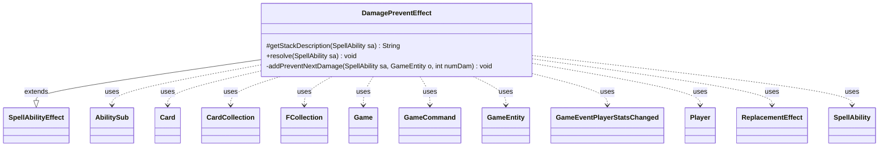

---
aliases:
  - DamagePreventEffect
tags:
  - java/class
  - module/forge-game
  - pkg/forge/game/ability/effects
fqn: forge.game.ability.effects.DamagePreventEffect
package: forge.game.ability.effects
module: forge-game
kind: Class
---

# DamagePreventEffect

**Package:** `forge.game.ability.effects` &nbsp; **Module:** `forge-game` &nbsp; **Kind:** Class



## Relationships
**Extends:**
- [[forge.game.ability.SpellAbilityEffect|SpellAbilityEffect]]
**Uses:**
- [[forge.GameCommand|GameCommand]]
- [[forge.game.Game|Game]]
- [[forge.game.GameEntity|GameEntity]]
- [[forge.game.card.Card|Card]]
- [[forge.game.card.CardCollection|CardCollection]]
- [[forge.game.event.GameEventPlayerStatsChanged|GameEventPlayerStatsChanged]]
- [[forge.game.player.Player|Player]]
- [[forge.game.replacement.ReplacementEffect|ReplacementEffect]]
- [[forge.game.spellability.AbilitySub|AbilitySub]]
- [[forge.game.spellability.SpellAbility|SpellAbility]]
- [[forge.util.collect.FCollection|FCollection]]

## Design Description

`DamagePreventEffect` implements the resolution logic for spell abilities that prevent the next *N* damage to chosen game entities. As a concrete subclass of `SpellAbilityEffect`, it overrides `getStackDescription` to render human-readable text and `resolve` to apply the effect. It resolves its targets either from the standard defined/targeted set or, for special cases like Whimsy, from random `CardChoices`/`PlayerChoices`, and it folds in any `Radiance` cards that share a color.

For each affected `Card` or `Player`, the private `addPreventNextDamage` builds a shield by constructing a command-zone effect `Card` carrying a `DamageDone` `ReplacementEffect` (a `ReplaceDamage` ability tracking a `ShieldAmount` SVar), optionally chaining a `PreventionSubAbility`. The design leans on Forge's script/SVar and replacement-effect machinery rather than hard-coded logic, registering a `GameCommand` to exile the shield at end of turn and firing `GameEventPlayerStatsChanged` so views update.

## Source
`forge-game/src/main/java/forge/game/ability/effects/DamagePreventEffect.java`

```java
package forge.game.ability.effects;

import java.util.List;

import com.google.common.collect.Lists;

import forge.GameCommand;
import forge.game.Game;
import forge.game.GameEntity;
import forge.game.ability.AbilityFactory;
import forge.game.ability.AbilityUtils;
import forge.game.ability.SpellAbilityEffect;
import forge.game.card.Card;
import forge.game.card.CardCollection;
import forge.game.card.CardLists;
import forge.game.card.CardUtil;
import forge.game.event.GameEventPlayerStatsChanged;
import forge.game.player.Player;
import forge.game.replacement.ReplacementEffect;
import forge.game.replacement.ReplacementHandler;
import forge.game.spellability.AbilitySub;
import forge.game.spellability.SpellAbility;
import forge.game.zone.ZoneType;
import forge.util.Aggregates;
import forge.util.TextUtil;
import forge.util.collect.FCollection;

public class DamagePreventEffect extends SpellAbilityEffect {

    @Override
    protected String getStackDescription(SpellAbility sa) {
        final StringBuilder sb = new StringBuilder();

        final List<GameEntity> tgts = getTargetEntities(sa);

        sb.append("Prevent the next ");
        sb.append(sa.getParam("Amount"));
        sb.append(" damage that would be dealt ");
        if (sa.isDividedAsYouChoose()) {
            sb.append("between ");
        } else {
            sb.append("to ");
        }
        for (int i = 0; i < tgts.size(); i++) {
            if (i != 0) {
                sb.append(" ");
            }

            final Object o = tgts.get(i);
            if (o instanceof Card tgtC) {
                if (tgtC.isFaceDown()) {
                    sb.append("Morph");
                } else {
                    sb.append(tgtC);
                }
            } else if (o instanceof Player) {
                sb.append(o.toString());
            }
        }

        if (sa.hasParam("Radiance") && (sa.usesTargeting())) {
            sb.append(" and each other ").append(sa.getParam("ValidTgts"))
                    .append(" that shares a color with ");
            if (tgts.size() > 1) {
                sb.append("them");
            } else {
                sb.append("it");
            }
        }
        sb.append(" this turn.");
        return sb.toString();
    }

    /* (non-Javadoc)
     * @see forge.card.abilityfactory.SpellEffect#resolve(java.util.Map, forge.card.spellability.SpellAbility)
     */
    @Override
    public void resolve(SpellAbility sa) {
        Card host = sa.getHostCard();
        int numDam = AbilityUtils.calculateAmount(host, sa.getParam("Amount"), sa);

        List<GameEntity> tgts = Lists.newArrayList();
        if (sa.hasParam("CardChoices") || sa.hasParam("PlayerChoices")) { // choosing outside Defined/Targeted
            // only for Whimsy, for more robust version see DamageDealEffect
            FCollection<GameEntity> choices = new FCollection<>();
            if (sa.hasParam("CardChoices")) {
                choices.addAll(CardLists.getValidCards(host.getGame().getCardsIn(ZoneType.Battlefield),
                        sa.getParam("CardChoices"), sa.getActivatingPlayer(), host, sa));
            }
            if (sa.hasParam("PlayerChoices")) {
                choices.addAll(AbilityUtils.getDefinedPlayers(host, sa.getParam("PlayerChoices"), sa));
            }
            if (sa.hasParam("Random")) { // currently everything using Choices is random
                GameEntity random = Aggregates.random(choices);
                tgts.add(random);
                host.addRemembered(random); // remember random choices for log
            }
        } else {
            tgts = getTargetEntities(sa);
        }

        final CardCollection untargetedCards = CardUtil.getRadiance(sa);

        for (final GameEntity o : tgts) {
            numDam = sa.usesTargeting() && sa.isDividedAsYouChoose() ? sa.getDividedValue(o) : numDam;
            if (o instanceof Card c) {
                if (c.isInPlay()) {
                    addPreventNextDamage(sa, o, numDam);
                }
            } else if (o instanceof Player) {
                addPreventNextDamage(sa, o, numDam);
            }
        }

        for (final Card c : untargetedCards) {
            if (c.isInPlay()) {
                addPreventNextDamage(sa, c, numDam);
            }
        }
    }

    private static void addPreventNextDamage(SpellAbility sa, GameEntity o, int numDam) {
        final Card hostCard = sa.getHostCard();
        final Game game = hostCard.getGame();
        final Player player = hostCard.getController();
        final String name = hostCard + "'s Effect";
        final String image = hostCard.getImageKey();
        StringBuilder sb = new StringBuilder("Event$ DamageDone | ActiveZones$ Command | ValidTarget$ ");
        sb.append((o instanceof Card ? "Card.IsRemembered" : "Player.IsRemembered"));
        sb.append(" | PreventionEffect$ NextN | Description$ Prevent the next ").append(numDam).append(" damage.");
        String effect = "DB$ ReplaceDamage | Amount$ ShieldAmount";

        final Card eff = createEffect(sa, player, name, image);
        eff.setSVar("ShieldAmount", "Number$" + numDam);
        eff.setSVar("PreventedDamage", "Number$0");
        eff.addRemembered(o);

        SpellAbility replaceDamage = AbilityFactory.getAbility(effect, eff);
        if (sa.hasParam("PreventionSubAbility")) {
            String subAbString = sa.getSVar(sa.getParam("PreventionSubAbility"));
            if (sa.hasParam("ShieldEffectTarget")) {
                List<GameEntity> effTgts = AbilityUtils.getDefinedEntities(hostCard, sa.getParam("ShieldEffectTarget"), sa);
                String effTgtString = "";
                for (final GameEntity effTgt : effTgts) {
                    if (effTgt instanceof Card) {
                        effTgtString = "CardUID_" + String.valueOf(((Card) effTgt).getId());
                    } else if (effTgt instanceof Player) {
                        effTgtString = "PlayerNamed_" + ((Player) effTgt).getName();
                    }
                }
                subAbString = TextUtil.fastReplace(subAbString, "ShieldEffectTarget", effTgtString);
            }
            AbilitySub subSA = (AbilitySub) AbilityFactory.getAbility(subAbString, eff);
            replaceDamage.setSubAbility(subSA);
            // Add SpellDescription of PreventionSubAbility to effect description
            sb.append(" ").append(subSA.getParam("SpellDescription"));
        }

        String repeffstr = sb.toString();
        ReplacementEffect re = ReplacementHandler.parseReplacement(repeffstr, eff, true);
        re.setOverridingAbility(replaceDamage);
        eff.addReplacementEffect(re);
        if (o instanceof Card) {
            addForgetOnMovedTrigger(eff, "Battlefield");
        }

        game.getAction().moveToCommand(eff, sa);

        o.getView().updatePreventNextDamage(o);
        if (o instanceof Player) {
            game.fireEvent(new GameEventPlayerStatsChanged((Player) o, false));
        }

        game.getEndOfTurn().addUntil(new GameCommand() {
            private static final long serialVersionUID = 1L;

            @Override
            public void run() {
                game.getAction().exileEffect(eff);
                o.getView().updatePreventNextDamage(o);
                if (o instanceof Player) {
                    game.fireEvent(new GameEventPlayerStatsChanged((Player) o, false));
                }
            }
        });
    }
}
```
